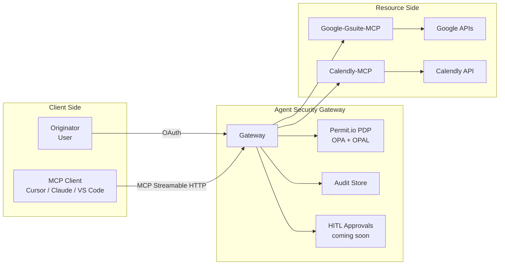
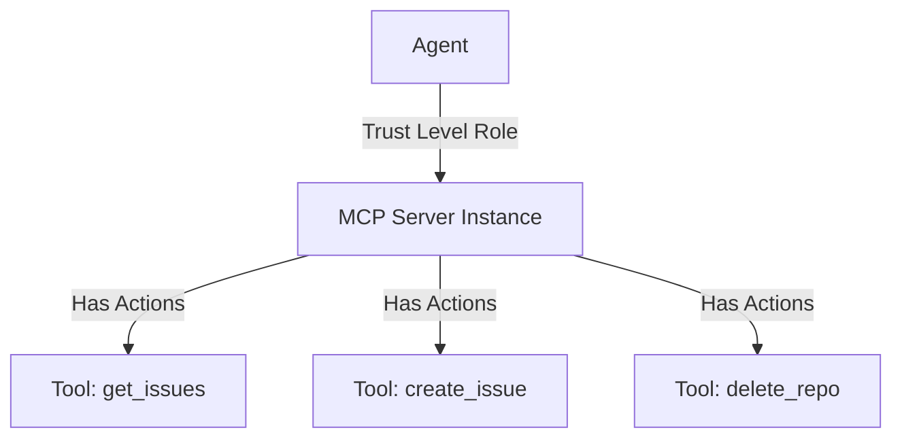
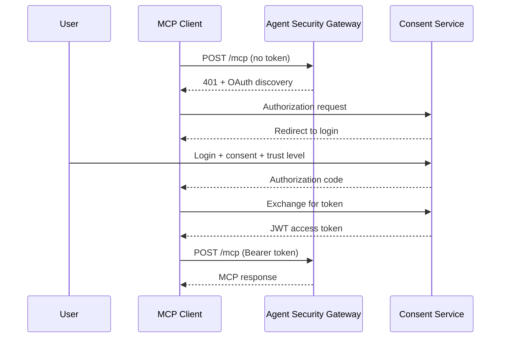
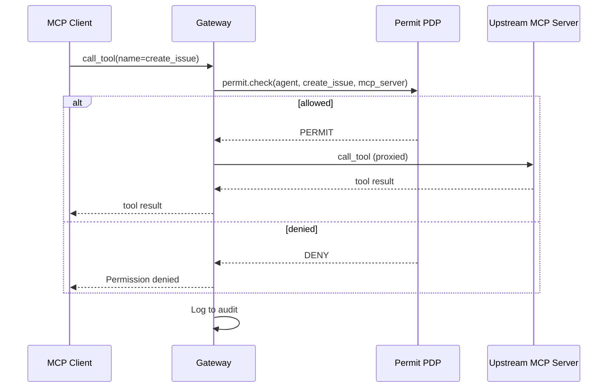

# Agent Security Architecture

## What is Agent Security?

Agent Security delivers **permissions-as-a-service** for any Model Context Protocol (MCP) server. It acts as a proxy/gateway between AI agents and the resources they invoke, providing:

* **Fine-grained ReBAC** (relationship-based access control) powered by Permit.io, OPA, and OPAL
* **Authentication & authorization** that binds user, agent, MCP server, and downstream service identities
* **Comprehensive auditing** covering every call, scope, and actor
* **Flexible delivery models** that share identical policy semantics

A single URL switch yields consistent enforcement, instant visibility, and human-in-the-loop (HITL) approvals — **no code changes** to agents or servers.

## Core Components

Key components:
- **Gateway**: Managed proxy at `*.agent.security`
- **Permit.io PDP**: Policy decision point for real-time authorization
- **Audit Store**: Records every authorization decision
- **HITL service** *(coming soon)*: Issues approval links and manages step-up auth

## Integration Patterns

Agent Security currently offers a hosted gateway deployment. Additional patterns are planned:

| Pattern                   | When to Use                      | How It Works                                                      | Status |
| ------------------------- | -------------------------------- | ----------------------------------------------------------------- | ------ |
| **Hosted Gateway**        | Fastest rollout; SaaS workloads  | Point agents/servers to `https://<host>.agent.security`           | Available |
| **Side-car / Middleware** | Low-latency, on-prem AI          | Drop a lightweight proxy library in front of the MCP server       | *Coming soon* |
| **Hosting Platform**      | Building a multi-tenant MCP SaaS | Agent Security baked into ingress; tenants consume via hosted endpoints | *Coming soon* |

All patterns will share one control plane, policy model, and log format.

## Policy Model

### Trust-Level Access Control

Agent Security provides trust-level-based policy control where each tool is classified by risk:

1. **Low trust** — read-only operations (`get_*`, `list_*`, `read_*`)
2. **Medium trust** — write operations (`create_*`, `update_*`, `send_*`)
3. **High trust** — destructive operations (`delete_*`, `remove_*`, `destroy_*`)

Trust levels are hierarchical: higher levels inherit all permissions from lower levels.

### Planned Policy Enhancements *(coming soon)*

- **Organization Policy** — control agent-type ↔ server-type pairings
- **Operation Approval** — per-call HITL step-up
- **Org-Wide Constraints** — DLP masks, region pinning, rate limits

### Policy Architecture

Agent Security automatically generates Google-Zanzibar-inspired ReBAC (Relationship based Access Control) policies based on:
- Defined roles for users and agents
- MCP server resource instances
- Role derivation from user consent to agent permissions

## Authentication & Authorization

### How it Works

When a user connects an MCP client through the gateway for the first time:

1. The MCP client discovers the gateway's OAuth endpoints
2. The user authenticates and completes the consent flow
3. The user selects a trust level for the MCP server
4. The gateway issues a JWT access token to the MCP client

On subsequent tool calls:

1. The gateway verifies the JWT and identifies the agent
2. The gateway checks Permit: *"Can this agent call this tool on this MCP server?"*
3. Allowed calls are proxied; denied calls return an error

### Sequence: First-Time Connection

### Sequence: Authorized Tool Call

## Deployment

Agent Security is currently available as a **hosted gateway** at `*.agent.security`. Each host (tenant) gets a unique subdomain with isolated policies, users, and sessions.

### Planned Deployment Options *(coming soon)*

| Deployment        | Latency (P95) | Isolation   | Updates               |
| ----------------- | ------------- | ----------- | --------------------- |
| **Embedded WASM** | < 10 ms        | Per-gateway | Rego/Data via OPAL |
| **Remote PDP**    | 10-30 ms RTT  | Centralized | Horizontal scale      |

## Key Advantages

* **Single control point** for authZ, audit, and anomaly detection
* **Drop-in** — no code changes, SDK optional
* **Fine-grained ReBAC** — captures true user-agent-resource relationships
* **Policy-as-code** — Rego, GitOps, unit tests
* **Short-lived creds** — minimize blast radius
* **HITL safety net** *(coming soon)* — step-up approvals for risky ops
* **DLP hooks** *(coming soon)* — mask/redact before LLM exposure

## Roadmap

| Area                   | Next Step                                          |
| ---------------------- | -------------------------------------------------- |
| **HITL Approvals**     | Configurable step-up approvals for sensitive operations |
| **Enterprise SSO**     | OIDC, SAML, LDAP integration                      |
| **DLP**                | Client-side classifiers, inline redaction          |
| **Secrets-on-Demand**  | Vault-backed token minting                         |
| **Policy Analytics**   | Graph-diff to flag over-permissioned agents        |
| **Chain-of-Trust Map** | Real-time visualization of user → agent → resource |

## Agent Configuration Examples

Below is an example of how different agents can be configured with various roles and permissions:

| Agent | Agent Roles | On behalf of (user ids) | Agent Type | MCP Servers |
|-------|-------------|------------------------|------------|-------------|
| Personal Assistant | user_assistant, task_manager | user_123 | chat | gmail_mcp, figma_mcp |
| Team Bot | team_assistant, meeting_scheduler | team_456_users | proactive | team_mcp_1, team_mcp_2 |
| Security Monitor | security_analyst, alert_manager | security_team_789 | ambient | security_mcp_1, security_mcp_2 |
| Code Review Bot | code_reviewer, pr_assistant | dev_team_101 | proactive | dev_mcp_1 |
| Data Analyst | data_processor, report_generator | analytics_team_202 | chat | analytics_mcp_1, analytics_mcp_2 |

## Glossary

| Term           | Meaning                                              |
| -------------- | ---------------------------------------------------- |
| **MCP**        | Model Context Protocol (tool/agent interoperability) |
| **Originator** | Human delegating authority                           |
| **Agent**      | Autonomous MCP client acting on behalf of the user   |
| **HITL**       | Human-in-the-loop                                    |
| **ReBAC**      | Relationship-based access control                    |
| **OPAL**       | Open Policy Administration Layer                     |
| **OPA**        | Open Policy Agent                                    |
