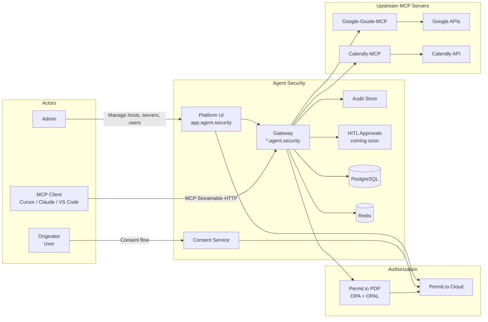
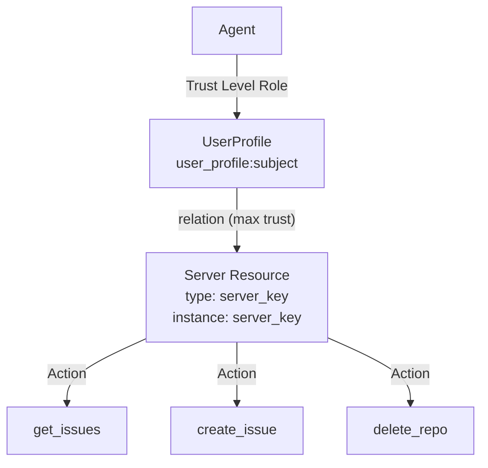
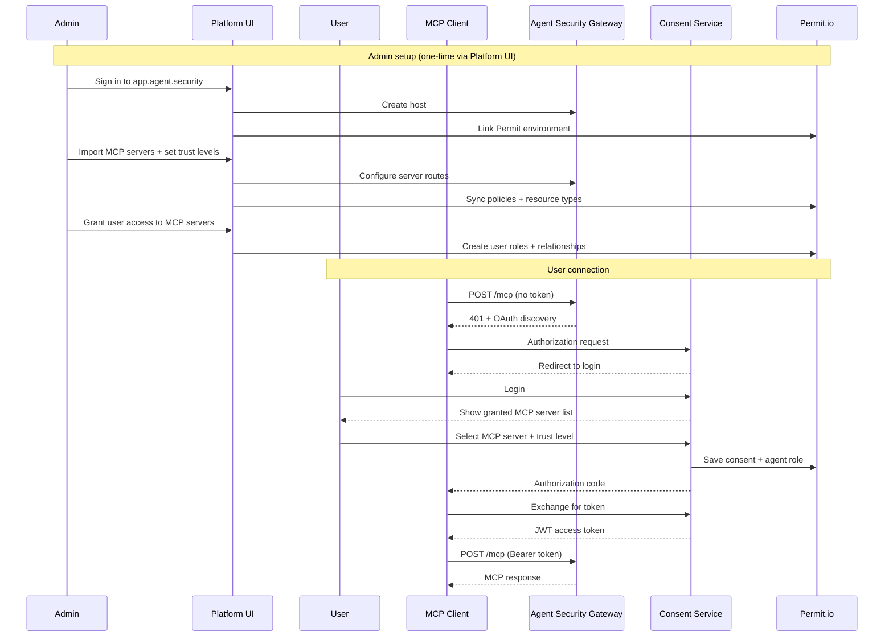
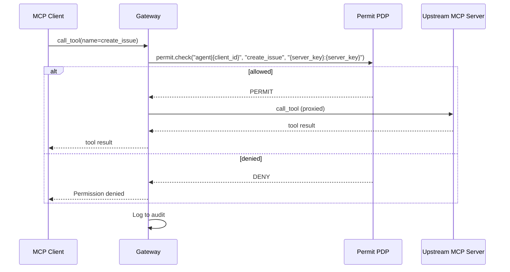

# Agent Security Architecture

## What is Agent Security?

Agent Security delivers **permissions-as-a-service** for any Model Context Protocol (MCP) server. It acts as a proxy/gateway between AI agents and the MCP server resources they interact with, providing:

* **Fine-grained ReBAC** (relationship-based access control) powered by Permit.io, OPA, and OPAL
* **Authentication & authorization** that binds user, agent, MCP server, and downstream service identities
* **Comprehensive auditing** covering every tool call, user, and agent
* **Flexible deployment options** *(hosted gateway available; additional patterns coming soon)*, all using the same policy rules

A single URL switch yields consistent enforcement, instant visibility, and human-in-the-loop (HITL) approvals *(coming soon)* — **no code changes** to agents or servers.

## System Architecture

The following diagram shows all major components and how they interact:

```mermaid
graph LR
    subgraph Actors
        Admin[Admin]
        UA[Originator<br/>User]
        AGT[MCP Client<br/>Cursor / Claude / VS Code]
    end

    subgraph "Agent Security"
        Platform["Platform UI<br/>app.agent.security"]
        GW[Gateway<br/>*.agent.security]
        CS[Consent Service]
        LOGS[Audit Store]
        HIL[HITL Approvals<br/>coming soon]
        PG[(PostgreSQL)]
        RD[(Redis)]
    end

    subgraph Authorization
        PDP[Permit.io PDP<br/>OPA + OPAL]
        PERMIT[Permit.io Cloud]
    end

    subgraph "Upstream MCP Servers"
        MCP1[Google-Gsuite-MCP]
        MCP2[Calendly-MCP]
        SVC1[Google APIs]
        SVC2[Calendly API]
    end

    Admin -->|Manage hosts, servers, users| Platform
    Platform --> GW
    Platform --> PERMIT
    UA -->|Consent flow| CS
    AGT -->|MCP Streamable HTTP| GW
    GW --> PDP
    GW --> LOGS
    GW --> HIL
    GW --> MCP1
    GW --> MCP2
    MCP1 --> SVC1
    MCP2 --> SVC2
    CS --> PERMIT
    GW --> PG
    GW --> RD
    PDP --> PERMIT
```

Key components:
- **Platform UI**: Admin dashboard at [app.agent.security](https://app.agent.security) for managing hosts, MCP servers, users, and monitoring activity
- **Gateway**: Managed proxy/gateway at `*.agent.security` that enforces authorization on every tool call
- **Consent Service**: Handles user authentication, MCP server selection, and trust-level consent
- **Permit.io PDP**: Policy decision point for real-time authorization
- **Permit.io Cloud**: Central policy store and management API
- **Audit Store**: Records every authorization decision
- **HITL service** *(coming soon)*: Issues approval links and manages step-up auth

## Integration Patterns

Agent Security currently offers a hosted gateway deployment. Additional patterns are planned:

| Pattern                   | When to Use                      | How It Works                                                      | Status |
| ------------------------- | -------------------------------- | ----------------------------------------------------------------- | ------ |
| **Hosted Gateway**        | Fastest rollout; SaaS workloads  | Point agents/MCP clients to `https://<host>.agent.security/mcp`       | Available |
| **Side-car / Middleware** | Low-latency, on-prem AI          | Drop a lightweight proxy library in front of the MCP server       | *Coming soon* |
| **Hosting Platform**      | Building a multi-tenant MCP SaaS | Agent Security baked into ingress; tenants consume via hosted endpoints | *Coming soon* |

All patterns will share one control plane, policy model, and log format.

## Policy Model

### Trust-Level Access Control

Agent Security classifies each tool into a trust level based on its risk:

1. **Low trust** — everything else (read-only by convention); this is the default for tools not matching medium or high patterns
2. **Medium trust** — write operations (tools containing: `create`, `write`, `update`, `set`, `modify`, `edit`, `put`, `post`, `insert`, `add`, `send`, `execute`, `run`, `invoke`, `submit`, `push`, `publish`, `deploy`, `apply`, `patch`)
3. **High trust** — destructive operations (tools containing: `delete`, `remove`, `destroy`, `drop`, `purge`, `erase`, `truncate`, `terminate`, `kill`, `revoke`)

Trust levels are hierarchical: higher levels inherit all permissions from lower levels.

### Planned Policy Enhancements *(coming soon)*

- **Organization Policy** — control agent-type ↔ server-type pairings
- **Operation Approval** — per-call HITL step-up
- **Org-Wide Constraints** — DLP masks, region pinning, rate limits

### Policy Architecture

Agent Security automatically generates [Google-Zanzibar](/modeling/google-drive)-inspired ReBAC (Relationship-based Access Control) policies based on:
- Defined roles for users and agents
- MCP server resource instances
- Agent roles derived from the user's consent choices
- A `user_profile` resource that links each user to the agents acting on their behalf, enabling relationship-based permission derivation through a 3-way chain: **Agent** --role on--> **UserProfile** --relation to--> **MCP Server**. The effective permission on a server is derived as `min(agent_role_on_profile, profile_relation_to_server)` — meaning a human's profile relation acts as a ceiling on the trust level any agent can actually exercise, regardless of what trust level was granted during consent.

Each MCP server maps to a **Permit resource type** whose key is the server key (e.g., `linear`). The server's tools become **actions** on that resource, using slugified tool names (e.g., `create_issue`). There are no separate resource instances per tool — the server itself is both the resource type and instance.

:::note Simplified diagram
The diagram below shows the logical relationship between agents and server resources. The actual Permit model uses a 3-way derived chain through a `user_profile` intermediary: **Agent** --role on--> **UserProfile** --relation to--> **MCP Server**, with effective permission = `min(agent_role, profile_relation)`. See the [Permit.io Integration](/ai-security/mcp-permissions/permit-integration#the-userprofile-indirection-rebac) page for the full model.
:::

```mermaid
graph TD
    A[Agent] --Trust Level Role--> UP[UserProfile<br/>user_profile:subject]
    UP --"relation (max trust)"--> S[Server Resource<br/>type: server_key<br/>instance: server_key]
    S --Action--> F1[get_issues]
    S --Action--> F2[create_issue]
    S --Action--> F3[delete_repo]
```

## Authentication & Authorization

### How it Works

**Admin setup (one-time via Platform UI):**

1. Admin signs in to the Platform UI at [app.agent.security](https://app.agent.security) and creates a host linked to a Permit environment
2. Admin imports upstream MCP servers through the Platform, which configures the Gateway and syncs policies to Permit
3. Admin grants specific users permission to connect to specific MCP servers via the Platform's Humans page

**User connection (first time):**

1. The MCP client discovers the gateway's OAuth endpoints
2. The user authenticates and signs in
3. The user selects an MCP server from the list of servers the admin has granted them access to
4. The user chooses the trust level they want to grant their agent, up to the maximum the admin configured
5. The consent service issues a JWT access token to the MCP client

**On subsequent tool calls:**

1. The gateway verifies the JWT and identifies the agent
2. The gateway checks Permit: *"Can this agent call this tool on this MCP server?"*
3. Allowed calls are proxied; denied calls return a permission denied error

**Identity format:** The gateway constructs a user key for the Permit check based on the caller type:
- **Human users**: `human|{subject}` — where `subject` is the authenticated user's identity. This format is used by the consent service and platform for policy management (e.g., granting a user access to MCP servers).
- **Agents**: `agent|{client_id}` — where `client_id` identifies the agent acting on behalf of the user. This format is used at runtime by the gateway for tool-call authorization checks.

### Sequence: First-Time Connection

```mermaid
sequenceDiagram
    participant A as Admin
    participant PL as Platform UI
    participant U as User
    participant C as MCP Client
    participant G as Agent Security Gateway
    participant CS as Consent Service
    participant PM as Permit.io

    Note over A,PM: Admin setup (one-time via Platform UI)
    A->>PL: Sign in to app.agent.security
    PL->>G: Create host
    PL->>PM: Link Permit environment
    A->>PL: Import MCP servers + set trust levels
    PL->>G: Configure server routes
    PL->>PM: Sync policies + resource types
    A->>PL: Grant user access to MCP servers
    PL->>PM: Create user roles + relationships

    Note over U,PM: User connection
    C->>G: POST /mcp (no token)
    G-->>C: 401 + OAuth discovery
    C->>CS: Authorization request
    CS-->>C: Redirect to login
    U->>CS: Login
    CS-->>U: Show granted MCP server list
    U->>CS: Select MCP server + trust level
    CS->>PM: Save consent + agent role
    CS-->>C: Authorization code
    C->>CS: Exchange for token
    CS-->>C: JWT access token
    C->>G: POST /mcp (Bearer token)
    G-->>C: MCP response
```

### Sequence: Authorized Tool Call

```mermaid
sequenceDiagram
    participant C as MCP Client
    participant G as Gateway
    participant P as Permit PDP
    participant M as Upstream MCP Server

    C->>G: call_tool(name=create_issue)
    G->>P: permit.check("agent|{client_id}", "create_issue", "{server_key}:{server_key}")
    alt allowed
        P-->>G: PERMIT
        G->>M: call_tool (proxied)
        M-->>G: tool result
        G-->>C: tool result
    else denied
        P-->>G: DENY
        G-->>C: Permission denied
    end
    G->>G: Log to audit
```

## Deployment

Agent Security is currently available as a **hosted gateway** at `*.agent.security`. Each host (tenant) gets a unique subdomain with isolated policies, users, and sessions.

## Key Advantages

* **Single control point** for authorization, audit, and anomaly detection (planned)
* **Drop-in** — no code changes, SDK optional
* **Fine-grained ReBAC** — captures true user-agent-resource relationships
* **Policy-as-code** — Rego, GitOps, unit tests
* **Short-lived creds** — minimize blast radius
* **HITL safety net** *(coming soon)* — step-up approvals for risky ops
* **DLP hooks** *(coming soon)* — mask/redact before LLM exposure

## Roadmap

| Area                   | Next Step                                          |
| ---------------------- | -------------------------------------------------- |
| **HITL Approvals**     | Configurable step-up approvals for sensitive operations |
| **Enterprise SSO**     | SAML 2.0 and OIDC SSO available; LDAP integration planned |
| **DLP**                | Client-side classifiers, inline redaction          |
| **Secrets-on-Demand**  | Vault-backed token minting                         |
| **Policy Analytics**   | Graph-diff to flag over-permissioned agents        |
| **Chain-of-Trust Map** | Real-time visualization of user → agent → resource |

## Agent Configuration Examples

:::note
Agent roles are automatically derived from the trust level selected during the user consent flow. The table below shows how different agents might be configured in practice.
:::

Below is an example of how different agents end up with permissions based on the consent flow:

| Agent (MCP Client) | User | MCP Server | Trust Level Granted | Example Allowed Tools | Example Denied Tools |
|---------------------|------|------------|--------------------|-----------------------|----------------------|
| Cursor | alice | `linear_mcp` | Medium | `get_issues`, `create_issue` | `delete_project` |
| Claude Desktop | alice | `github_mcp` | Low | `list_repos`, `get_file` | `create_issue`, `delete_repo` |
| VS Code Copilot | bob | `github_mcp` | High | `get_file`, `create_issue`, `delete_repo` | *(none — high includes all)* |
| Claude Code | carol | `slack_mcp` | Medium | `search_messages`, `send_message` | `remove_member` |

## Glossary

| Term           | Meaning                                              |
| -------------- | ---------------------------------------------------- |
| **MCP**            | Model Context Protocol (tool/agent interoperability) |
| **Originator**     | Human delegating authority                           |
| **Agent**          | Autonomous MCP client acting on behalf of the user   |
| **Host**           | A named gateway instance with its own subdomain, policies, and sessions |
| **Trust Level**    | Risk classification (low/medium/high) that determines which tools an agent can call |
| **PDP**            | Policy Decision Point — evaluates authorization requests in real time |
| **HITL**           | Human-in-the-loop                                    |
| **ReBAC**          | Relationship-based access control                    |
| **OPAL**           | Open Policy Administration Layer                     |
| **OPA**            | Open Policy Agent                                    |
