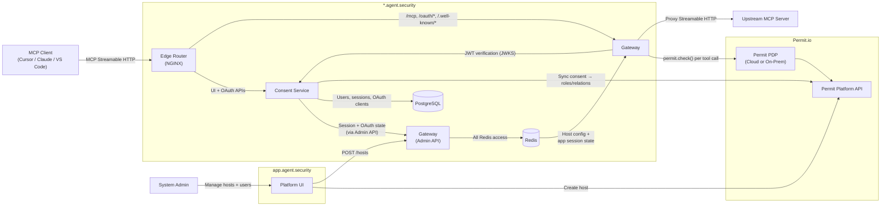
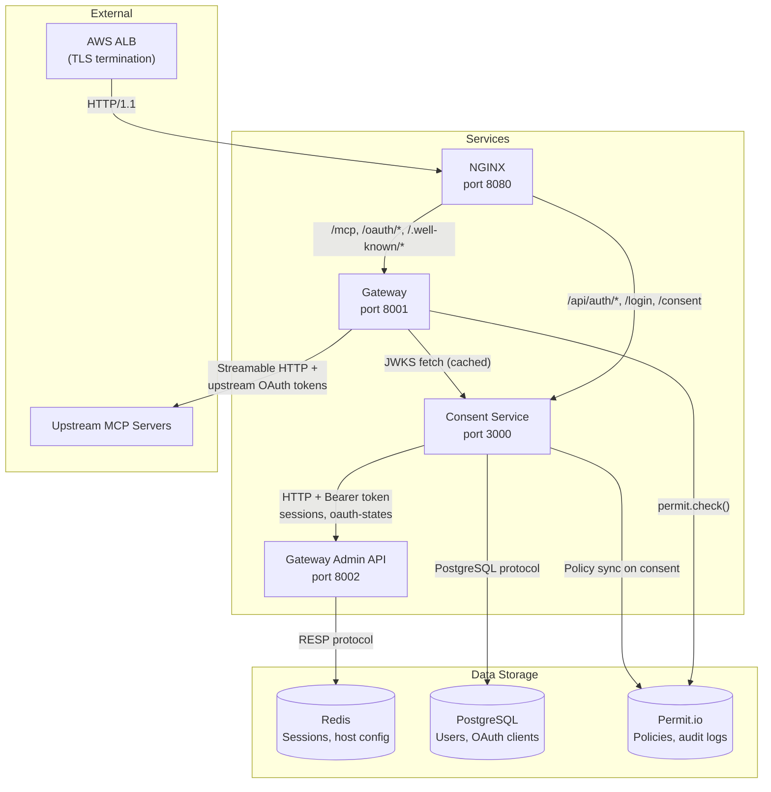
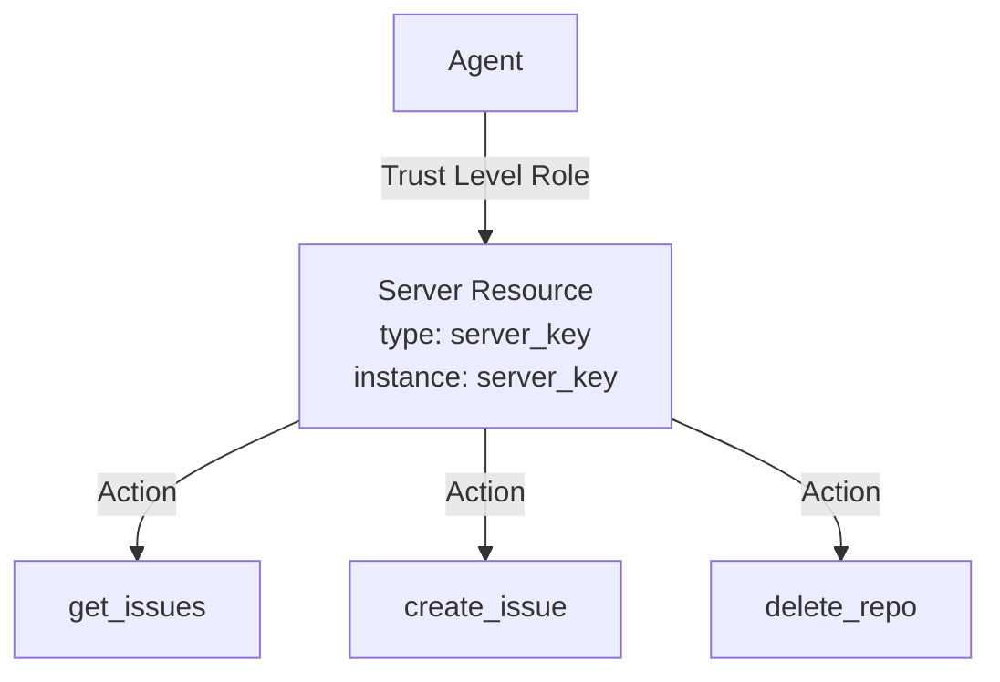
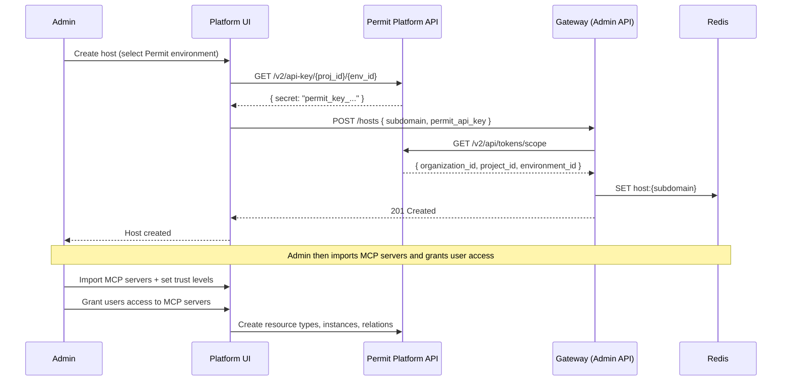
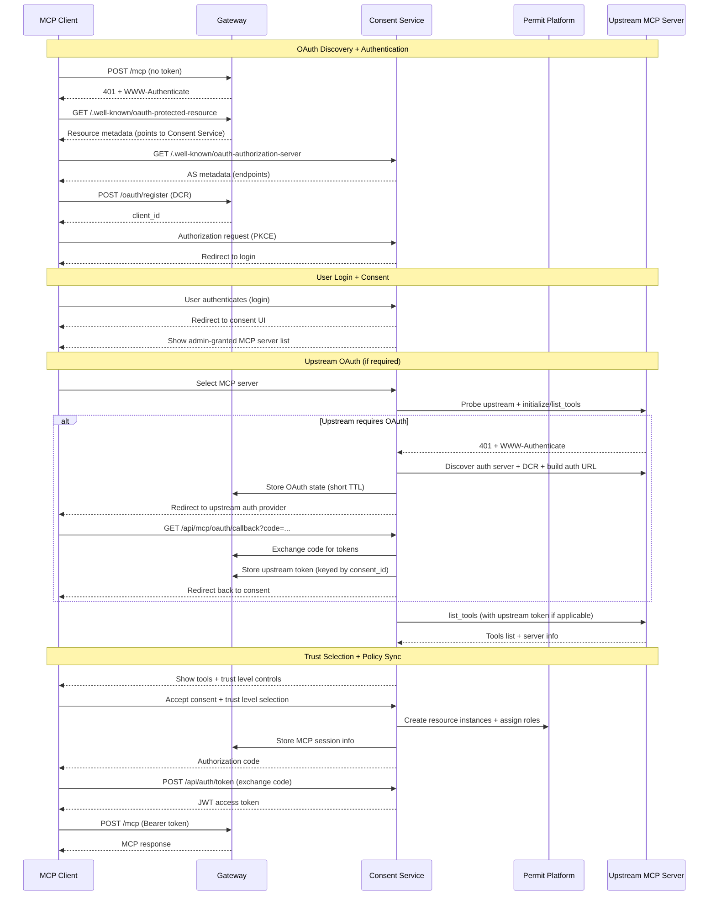
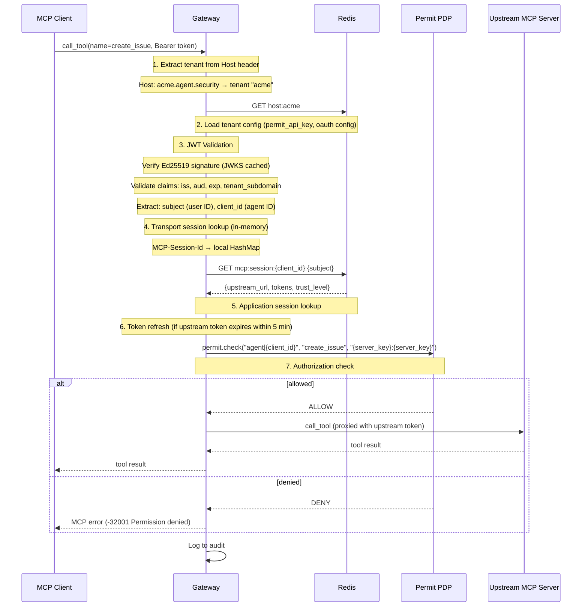
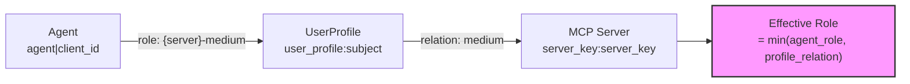

# Agent Security Architecture

## What is Agent Security?

Agent Security delivers **permissions-as-a-service** for any Model Context Protocol (MCP) server. It acts as a proxy/gateway between AI agents and the MCP server resources they interact with, providing:

* **Fine-grained ReBAC** (relationship-based access control) powered by Permit.io, OPA, and OPAL
* **Authentication & authorization** that binds user, agent, MCP server, and downstream service identities
* **Comprehensive auditing** covering every tool call, user, and agent
* **Flexible deployment options** *(hosted gateway available; additional patterns coming soon)*, all using the same policy rules

A single URL switch yields consistent enforcement, instant visibility, and human-in-the-loop (HITL) approvals *(coming soon)* — **no code changes** to agents or servers.

## System Architecture Overview

```mermaid
flowchart LR
  Client["MCP Client<br/>(Cursor / Claude / VS Code)"]
  Admin["System Admin"]

  subgraph Tenant["*.agent.security"]
    Edge["Edge Router<br/>(NGINX)"]
    GW["Gateway"]
    GWAdmin["Gateway<br/>(Admin API)"]
    CS["Consent Service"]
    PG[(PostgreSQL)]
    REDIS[(Redis)]
  end

  subgraph Permit["Permit.io"]
    PermitPDP["Permit PDP<br/>(Cloud or On-Prem)"]
    PermitAPI["Permit Platform API"]
    PermitPDP --> PermitAPI
  end

  subgraph Platform["app.agent.security"]
    PlatformUI["Platform UI"]
  end

  Admin -->|"Manage hosts + users"| PlatformUI
  PlatformUI -->|"Create host"| PermitAPI
  PlatformUI -->|"POST /hosts"| GWAdmin

  Client -- "MCP Streamable HTTP" --> Edge
  Edge -- "UI + OAuth APIs" --> CS
  Edge -- "/mcp, /oauth/*, /.well-known/*" --> GW

  GWAdmin -->|"All Redis access"| REDIS
  CS -->|"Session + OAuth state<br/>(via Admin API)"| GWAdmin
  REDIS -->|"Host config +<br/>app session state"| GW

  CS -- "Users, sessions, OAuth clients" --> PG
  GW -- "JWT verification (JWKS)" --> CS
  GW -- "permit.check() per tool call" --> PermitPDP
  CS -->|"Sync consent → roles/relations"| PermitAPI

  GW -- "Proxy Streamable HTTP" --> Upstream

  Upstream["Upstream MCP Server"]
```

**Key components:**
- **Platform** (`app.agent.security`): Admin interface for managing hosts, MCP servers, and user access
- **Edge Router** (NGINX): Routes requests by path to Gateway or Consent Service
- **Gateway** (`*.agent.security/mcp`): MCP proxy that enforces authorization on every tool call
- **Consent Service** (`*.agent.security`): Handles OAuth login, user consent, and upstream MCP OAuth
- **Permit.io PDP**: Policy decision point for real-time authorization checks
- **Redis**: Session and host configuration store (accessed only by Gateway)
- **PostgreSQL**: User accounts, OAuth clients, and auth sessions

:::info Architecture constraint
The Consent Service does **not** access Redis directly. All state persistence goes through the Gateway Admin API, centralizing Redis schema and logic in the Gateway.
:::

## Data Flow

The diagram below shows where data lives and how it flows between components:

```mermaid
flowchart TD
  subgraph Storage["Data Storage"]
    REDIS[("Redis<br/>Sessions, host config")]
    PG[("PostgreSQL<br/>Users, OAuth clients")]
    PERMIT[("Permit.io<br/>Policies, audit logs")]
  end

  subgraph Services["Services"]
    GW["Gateway<br/>port 8001"]
    GWAdmin["Gateway Admin API<br/>port 8002"]
    CS["Consent Service<br/>port 3000"]
    NGINX["NGINX<br/>port 8080"]
  end

  subgraph External["External"]
    ALB["AWS ALB<br/>(TLS termination)"]
    MCP["Upstream MCP Servers"]
  end

  ALB -->|"HTTP/1.1"| NGINX
  NGINX -->|"/mcp, /oauth/*, /.well-known/*"| GW
  NGINX -->|"/api/auth/*, /login, /consent"| CS
  CS -->|"HTTP + Bearer token<br/>sessions, oauth-states"| GWAdmin
  GWAdmin -->|"RESP protocol"| REDIS
  CS -->|"PostgreSQL protocol"| PG
  GW -->|"JWKS fetch (cached)"| CS
  GW -->|"permit.check()"| PERMIT
  CS -->|"Policy sync on consent"| PERMIT
  GW -->|"Streamable HTTP +<br/>upstream OAuth tokens"| MCP
```

| From | To | Protocol | Notes |
| --- | --- | --- | --- |
| ALB | NGINX | HTTP/1.1 | TLS terminated at ALB |
| NGINX | Gateway | HTTP/1.1 (port 8001) | Routes: `/mcp`, `/oauth/*`, `/.well-known/*` |
| NGINX | Consent Service | HTTP/1.1 (port 3000) | Routes: `/api/auth/*`, `/login`, `/consent` |
| Consent Service | Gateway Admin API | HTTP/1.1 + Bearer (port 8002) | Sessions, OAuth states, pending tokens |
| Gateway | Redis | RESP (port 6379) | **Only** Gateway has direct Redis access |
| Consent Service | PostgreSQL | PostgreSQL (port 5432) | Users, sessions, OAuth clients |
| Gateway | Consent Service (JWKS) | HTTP (port 3000) | JWT signature verification |
| Gateway | Permit.io | HTTPS | Authorization checks (Cloud PDP or On-Prem) |
| Consent Service | Permit.io | HTTPS | Policy sync during consent |
| Gateway | Upstream MCP | HTTPS | Streamable HTTP with upstream OAuth tokens |

## Integration Patterns

Agent Security currently offers a hosted gateway deployment. Additional patterns are planned:

| Pattern                   | When to Use                      | How It Works                                                      | Status |
| ------------------------- | -------------------------------- | ----------------------------------------------------------------- | ------ |
| **Hosted Gateway**        | Fastest rollout; SaaS workloads  | Point agents/MCP clients to `https://<host>.agent.security/mcp`       | Available |
| **Side-car / Middleware** | Low-latency, on-prem AI          | Drop a lightweight proxy library in front of the MCP server       | *Coming soon* |
| **Hosting Platform**      | Building a multi-tenant MCP SaaS | Agent Security baked into ingress; tenants consume via hosted endpoints | *Coming soon* |

All patterns will share one control plane, policy model, and log format.

## Policy Model

### Trust-Level Access Control

Agent Security classifies each tool into a trust level based on its risk:

1. **Low trust** — everything else (read-only by convention); this is the default for tools not matching medium or high patterns
2. **Medium trust** — write operations (tools containing: `create`, `write`, `update`, `set`, `modify`, `edit`, `put`, `post`, `insert`, `add`, `send`, `execute`, `run`, `invoke`, `submit`, `push`, `publish`, `deploy`, `apply`, `patch`)
3. **High trust** — destructive operations (tools containing: `delete`, `remove`, `destroy`, `drop`, `purge`, `erase`, `truncate`, `terminate`, `kill`, `revoke`)

Trust levels are hierarchical: higher levels inherit all permissions from lower levels.

### Planned Policy Enhancements *(coming soon)*

- **Organization Policy** — control agent-type ↔ server-type pairings
- **Operation Approval** — per-call HITL step-up
- **Org-Wide Constraints** — DLP masks, region pinning, rate limits

### Policy Architecture

Agent Security automatically generates [Google-Zanzibar](/modeling/google-drive)-inspired ReBAC (Relationship-based Access Control) policies based on:
- Defined roles for users and agents
- MCP server resource instances
- Agent roles derived from the user's consent choices
- A `user_profile` resource that links each user to the agents acting on their behalf, enabling relationship-based permission derivation through a 3-way chain: **Agent** --role on--> **UserProfile** --relation to--> **MCP Server**. The effective permission on a server is derived as `min(agent_role_on_profile, profile_relation_to_server)` — meaning a human's profile relation acts as a ceiling on the trust level any agent can actually exercise, regardless of what trust level was granted during consent.

Each MCP server maps to a **Permit resource type** whose key is the server key (e.g., `linear`). The server's tools become **actions** on that resource, using slugified tool names (e.g., `create_issue`). There are no separate resource instances per tool — the server itself is both the resource type and instance.

```mermaid
graph TD
    A[Agent] --Trust Level Role--> S[Server Resource<br/>type: server_key<br/>instance: server_key]
    S --Action--> F1[get_issues]
    S --Action--> F2[create_issue]
    S --Action--> F3[delete_repo]
```

## Authentication & Authorization

### How it Works

**Admin setup (one-time):**

1. Admin creates a host at [app.agent.security](https://app.agent.security), linked to a Permit environment
2. Admin imports upstream MCP servers, classifies tools by trust level, and sets max trust levels per user
3. Admin grants specific users permission to connect to specific MCP servers

**User connection (first time):**

1. The MCP client discovers the gateway's OAuth endpoints
2. The user authenticates and signs in
3. The user selects an MCP server from the list of servers the admin has granted them access to
4. If the upstream MCP server requires OAuth, the user authorizes with the upstream provider
5. The user chooses the trust level they want to grant their agent, up to the maximum the admin configured
6. The gateway issues a JWT access token to the MCP client

**On subsequent tool calls:**

1. The gateway verifies the JWT and identifies the agent
2. The gateway checks Permit: *"Can this agent call this tool on this MCP server?"*
3. Allowed calls are proxied; denied calls return a permission denied error

**Identity format:** The gateway constructs a user key for the Permit check based on the caller type:
- **Human users**: `human|{subject}` — where `subject` is the authenticated user's identity. This format is used by the consent service and platform for policy management (e.g., granting a user access to MCP servers).
- **Agents**: `agent|{client_id}` — where `client_id` identifies the agent acting on behalf of the user. This format is used at runtime by the gateway for tool-call authorization checks.

### Sequence: Admin Setup Flow

The admin creates a host through the Platform UI, which resolves the Permit API key, provisions the host configuration in the Gateway, and stores it in Redis.

```mermaid
sequenceDiagram
    participant A as Admin
    participant Platform as Platform UI
    participant PermitAPI as Permit Platform API
    participant GW as Gateway (Admin API)
    participant R as Redis

    A->>Platform: Create host (select Permit environment)
    Platform->>PermitAPI: GET /v2/api-key/{proj_id}/{env_id}
    PermitAPI-->>Platform: { secret: "permit_key_..." }
    Platform->>GW: POST /hosts { subdomain, permit_api_key }
    GW->>PermitAPI: GET /v2/api/tokens/scope
    PermitAPI-->>GW: { organization_id, project_id, environment_id }
    GW->>R: SET host:{subdomain}
    GW-->>Platform: 201 Created
    Platform-->>A: Host created

    Note over A,R: Admin then imports MCP servers and grants user access
    A->>Platform: Import MCP servers + set trust levels
    A->>Platform: Grant users access to MCP servers
    Platform->>PermitAPI: Create resource types, instances, relations
```

### Sequence: User Consent Flow

When a user connects for the first time, the MCP client discovers OAuth endpoints, the user authenticates and consents, and if the upstream MCP server requires OAuth, that flow is handled transparently.

```mermaid
sequenceDiagram
    participant C as MCP Client
    participant GW as Gateway
    participant CS as Consent Service
    participant PermitAPI as Permit Platform
    participant Up as Upstream MCP Server

    Note over C,Up: OAuth Discovery + Authentication
    C->>GW: POST /mcp (no token)
    GW-->>C: 401 + WWW-Authenticate
    C->>GW: GET /.well-known/oauth-protected-resource
    GW-->>C: Resource metadata (points to Consent Service)
    C->>CS: GET /.well-known/oauth-authorization-server
    CS-->>C: AS metadata (endpoints)
    C->>GW: POST /oauth/register (DCR)
    GW-->>C: client_id
    C->>CS: Authorization request (PKCE)
    CS-->>C: Redirect to login

    Note over C,Up: User Login + Consent
    C->>CS: User authenticates (login)
    CS-->>C: Redirect to consent UI
    CS-->>C: Show admin-granted MCP server list

    Note over C,Up: Upstream OAuth (if required)
    C->>CS: Select MCP server
    CS->>Up: Probe upstream + initialize/list_tools
    alt Upstream requires OAuth
        Up-->>CS: 401 + WWW-Authenticate
        CS->>Up: Discover auth server + DCR + build auth URL
        CS->>GW: Store OAuth state (short TTL)
        CS-->>C: Redirect to upstream auth provider
        C->>CS: GET /api/mcp/oauth/callback?code=...
        CS->>GW: Exchange code for tokens
        CS->>GW: Store upstream token (keyed by consent_id)
        CS-->>C: Redirect back to consent
    end
    CS->>Up: list_tools (with upstream token if applicable)
    Up-->>CS: Tools list + server info

    Note over C,Up: Trust Selection + Policy Sync
    CS-->>C: Show tools + trust level controls
    C->>CS: Accept consent + trust level selection
    CS->>PermitAPI: Create resource instances + assign roles
    CS->>GW: Store MCP session info
    CS-->>C: Authorization code
    C->>CS: POST /api/auth/token (exchange code)
    CS-->>C: JWT access token
    C->>GW: POST /mcp (Bearer token)
    GW-->>C: MCP response
```

:::info Server allow-list
Users can only connect to MCP servers that the admin has pre-configured and granted them access to. Ad-hoc upstream URLs are not accepted — the consent service validates that every upstream URL matches a server the user is authorized to use.
:::

### Sequence: Authorization Decision Flow

When a tool call arrives at the Gateway, it passes through a multi-step middleware chain before reaching the upstream MCP server.

```mermaid
sequenceDiagram
    participant C as MCP Client
    participant GW as Gateway
    participant R as Redis
    participant PDP as Permit PDP
    participant Up as Upstream MCP Server

    C->>GW: call_tool(name=create_issue, Bearer token)

    Note over GW: 1. Extract tenant from Host header
    Note over GW: Host: acme.agent.security → tenant "acme"

    GW->>R: GET host:acme
    Note over GW,R: 2. Load tenant config (permit_api_key, oauth config)

    Note over GW: 3. JWT Validation
    Note over GW: Verify Ed25519 signature (JWKS cached)
    Note over GW: Validate claims: iss, aud, exp, tenant_subdomain
    Note over GW: Extract: subject (user ID), client_id (agent ID)

    Note over GW: 4. Transport session lookup (in-memory)
    Note over GW: MCP-Session-Id → local HashMap

    GW->>R: GET mcp:session:{client_id}:{subject}
    R-->>GW: {upstream_url, tokens, trust_level}
    Note over GW,R: 5. Application session lookup

    Note over GW: 6. Token refresh (if upstream token expires within 5 min)

    GW->>PDP: permit.check("agent|{client_id}", "create_issue", "{server_key}:{server_key}")
    Note over GW,PDP: 7. Authorization check

    alt allowed
        PDP-->>GW: ALLOW
        GW->>Up: call_tool (proxied with upstream token)
        Up-->>GW: tool result
        GW-->>C: tool result
    else denied
        PDP-->>GW: DENY
        GW-->>C: MCP error (-32001 Permission denied)
    end
    GW->>GW: Log to audit
```

### Authorization: Trust Ceiling (min logic)

The effective permission on an MCP server is determined by the **minimum** of the agent's trust level and the human's profile relation to the server. This ensures a human's profile relation acts as a ceiling on what any agent can exercise.

```mermaid
flowchart LR
    Agent["Agent<br/>agent|client_id"]
    Profile["UserProfile<br/>user_profile:subject"]
    Server["MCP Server<br/>server_key:server_key"]
    Result["Effective Role<br/>= min(agent_role, profile_relation)"]

    Agent -->|"role: {server}-medium"| Profile
    Profile -->|"relation: medium"| Server
    Server --> Result

    style Result fill:#f9f,stroke:#333,stroke-width:2px
```

**How it works:**

The system uses 9 derived role rules per MCP server to implement the `min()` logic through Permit's ReBAC:

| Agent role on profile | Profile relation to server | Effective server role |
| --- | --- | --- |
| `{server}-high` | `high` | **high** |
| `{server}-high` | `medium` | **medium** (capped) |
| `{server}-high` | `low` | **low** (capped) |
| `{server}-medium` | `high` | **medium** |
| `{server}-medium` | `medium` | **medium** |
| `{server}-medium` | `low` | **low** (capped) |
| `{server}-low` | `high` | **low** |
| `{server}-low` | `medium` | **low** |
| `{server}-low` | `low` | **low** |

The derived role then determines which tools are allowed:
- **Low** trust tools: available to `low`, `medium`, and `high` roles
- **Medium** trust tools: available to `medium` and `high` roles
- **High** trust tools: available to `high` role only

## Deployment

Agent Security is currently available as a **hosted gateway** at `*.agent.security`. Each host (tenant) gets a unique subdomain with isolated policies, users, and sessions.

### Planned Deployment Options *(coming soon)*

| Deployment        | Isolation   | Updates               |
| ----------------- | ----------- | --------------------- |
| **Embedded WASM** | Per-gateway | Rego/Data via OPAL    |
| **Remote PDP**    | Centralized | Horizontal scale      |

## Key Advantages

* **Single control point** for authorization, audit, and anomaly detection (planned)
* **Drop-in** — no code changes, SDK optional
* **Fine-grained ReBAC** — captures true user-agent-resource relationships
* **Policy-as-code** — Rego, GitOps, unit tests
* **Short-lived creds** — minimize blast radius
* **HITL safety net** *(coming soon)* — step-up approvals for risky ops
* **DLP hooks** *(coming soon)* — mask/redact before LLM exposure

## Roadmap

| Area                   | Next Step                                          |
| ---------------------- | -------------------------------------------------- |
| **HITL Approvals**     | Configurable step-up approvals for sensitive operations |
| **Enterprise SSO**     | SAML 2.0 and OIDC SSO available; LDAP integration planned |
| **DLP**                | Client-side classifiers, inline redaction          |
| **Secrets-on-Demand**  | Vault-backed token minting                         |
| **Policy Analytics**   | Graph-diff to flag over-permissioned agents        |
| **Chain-of-Trust Map** | Real-time visualization of user → agent → resource |

## Agent Configuration Examples

:::note
Agent roles are automatically derived from the trust level selected during the user consent flow. The table below shows how different agents might be configured in practice.
:::

Below is an example of how different agents end up with permissions based on the consent flow:

| Agent (MCP Client) | User | MCP Server | Trust Level Granted | Example Allowed Tools | Example Denied Tools |
|---------------------|------|------------|--------------------|-----------------------|----------------------|
| Cursor | alice | `linear_mcp` | Medium | `get_issues`, `create_issue` | `delete_project` |
| Claude Desktop | alice | `github_mcp` | Low | `list_repos`, `get_file` | `create_issue`, `delete_repo` |
| VS Code Copilot | bob | `github_mcp` | High | `get_file`, `create_issue`, `delete_repo` | *(none — high includes all)* |
| Claude Code | carol | `slack_mcp` | Medium | `search_messages`, `send_message` | `remove_member` |

## Glossary

| Term           | Meaning                                              |
| -------------- | ---------------------------------------------------- |
| **MCP**            | Model Context Protocol (tool/agent interoperability) |
| **Originator**     | Human delegating authority                           |
| **Agent**          | Autonomous MCP client acting on behalf of the user   |
| **Host**           | A named gateway instance with its own subdomain, policies, and sessions |
| **Trust Level**    | Risk classification (low/medium/high) that determines which tools an agent can call |
| **PDP**            | Policy Decision Point — evaluates authorization requests in real time |
| **HITL**           | Human-in-the-loop                                    |
| **ReBAC**          | Relationship-based access control                    |
| **OPAL**           | Open Policy Administration Layer                     |
| **OPA**            | Open Policy Agent                                    |
