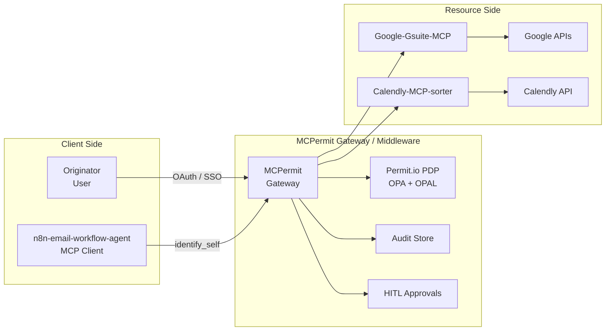
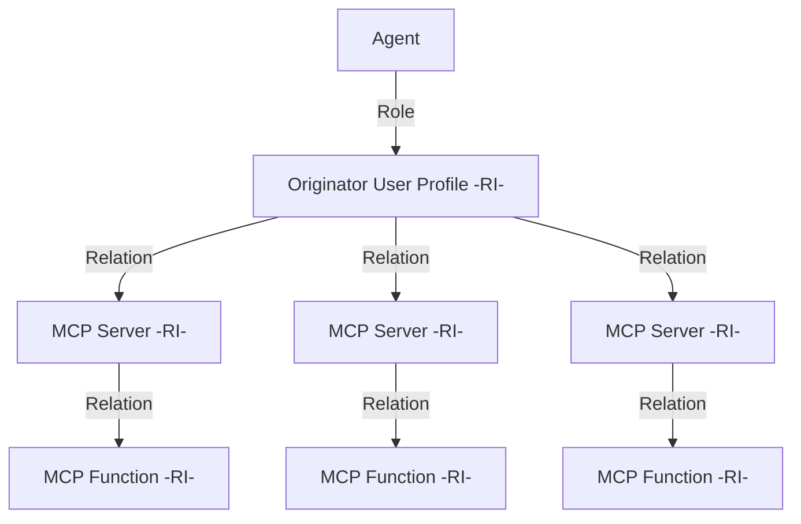
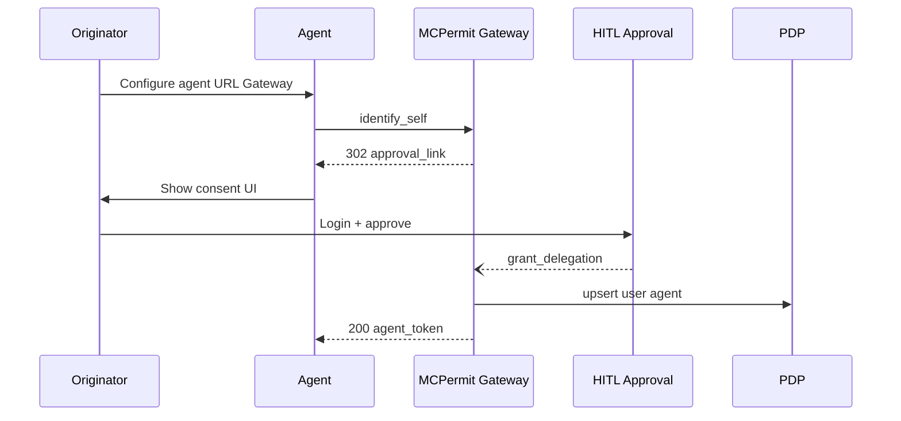
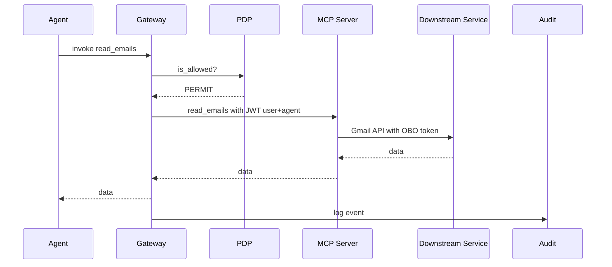

# MCP Permissions Architecture

:::info
This pages describes an upcoming product; details are subject to change.
To get early access to MCPermit, contact us via [email](mailto:support@permit.io) or via [Slack](https://io.permit.io/slack).
:::

## What is MCPermit?

MCPermit delivers **permissions-as-a-service** for any Model Context Protocol (MCP) server-hosted or self-managed. It acts as a proxy/gateway between AI agents and the resources they invoke, providing:

* **Fine-grained ReBAC** (relationship-based access control) powered by Permit.io, OPA, and OPAL
* **Five-stage authentication & authorization** that binds user, agent, MCP server, and downstream service identities
* **Comprehensive auditing and anomaly detection** covering every call, scope, and actor
* **Flexible delivery models** that share identical policy semantics

A single URL switch yields consistent enforcement, instant visibility, and human-in-the-loop (HITL) approvals-**no code changes** to agents or servers.

## Core Components

Key components:
- **Gateway**: Can be SaaS, self-hosted proxy, or in-process middleware
- **Permit.io PDP**: Runs embedded (WASM) for µ-latency or remotely via OPAL
- **Audit Store**: Feeds live anomaly detection
- **HITL service**: Issues approval links and manages step-up auth

## Integration Patterns

MCPermit offers three deployment patterns:

| Pattern                   | When to Use                      | How It Works                                                      |
| ------------------------- | -------------------------------- | ----------------------------------------------------------------- |
| **Hosted Gateway**        | Fastest rollout; SaaS workloads  | Point agents/servers to `https://<org>.mcpermit.io`               |
| **Side-car / Middleware** | Low-latency, on-prem AI          | Drop a lightweight proxy library in front of the MCP server       |
| **Hosting Platform**      | Building a multi-tenant MCP SaaS | MCPermit baked into ingress; tenants consume via hosted endpoints |

All patterns share one control plane, policy model, and log format.

## Policy Model

### Five-Stages of Access Control

MCPermit provides five levels of policy control:

1. **Organization Policy** – controls *agent-type ↔ server-type* pairings
2. **User Policy** – user delegates a concrete agent
3. **Agent Permission** – coarse scopes (`read_emails`, `create_event`)
4. **Operation Approval** – per-call HITL step-up
5. **Org-Wide Constraints** – DLP masks, region pinning, rate limits

### Policy Architecture

MCPermit automatically generates Google-Zanzibar-inspired ReBAC (Relationship based Access Control) policies based on:
- Defined roles for users and agents
- MCP Server types (e.g. Personal, Corporate, sensitive, pro-active)
- Role derivation from user profiles to agents

## Authentication & Authorization

### Token Taxonomy

| Stage | Actor                    | Carrier                          | Purpose                 |
| ----: | ------------------------ | -------------------------------- | ----------------------- |
| **1** | User (Originator)        | OIDC JWT (`sub`)                 | Enterprise identity     |
| **2** | Agent                    | Client creds / mTLS (`agent_id`) | Agent identity          |
| **3** | Agent → Gateway          | MCPOAuth (`azp`, `scp`)          | Requested scopes        |
| **4** | Gateway → MCP            | **On-demand** service token      | Least-privilege         |
| **5** | Agent OBO User → Service | [RFC 8693](https://datatracker.ietf.org/doc/html/rfc8693) token exchange          | User context downstream |

### Sequence Flows

#### First-Run Delegation

#### Authorized Call

## Deployment Options

### Gateway PDP Options

| Deployment        | Latency (P95) | Isolation   | Updates               |
| ----------------- | ------------- | ----------- | --------------------- |
| **Embedded WASM** | < 10 ms        | Per-gateway | Rego/Data via OPAL |
| **Remote PDP**    | 10-30 ms RTT  | Centralized | Horizontal scale      |

Choose *Embedded* for air-gapped or ultra-low-latency; *Remote* for central governance.

:::info
With MCPermit hybrid mode, you can start with embedded PDP for low-latency enforcement and then connect it to remote control plane for centralized policy management.
:::

## Key Advantages

* **Single control point** for authZ, audit, anomaly detection
* **Drop-in**-no code changes, SDK optional
* **Fine-grained ReBAC**-captures true user-agent-resource relationships
* **Policy-as-code**-Rego, GitOps, unit tests
* **Short-lived creds**-minimize blast radius
* **HITL safety net**-step-up approvals for risky ops
* **DLP hooks**-mask/redact before LLM exposure

## Future Roadmap

| Area                   | Next Step                                          |
| ---------------------- | -------------------------------------------------- |
| **DLP**                | Client-side classifiers, inline redaction          |
| **Secrets-on-Demand**  | Vault-backed token minting                         |
| **Policy Analytics**   | Graph-diff to flag over-permissioned agents        |
| **Chain-of-Trust Map** | Real-time visualization of user → agent → resource |

## Agent Configuration Examples

Below is an example of how different agents can be configured with various roles and permissions:

| Agent | Agent Roles | On behalf of (user ids) | Agent Type | MCP Servers |
|-------|-------------|------------------------|------------|-------------|
| Personal Assistant | user_assistant, task_manager | user_123 | chat | gmail_mcp, figma_mcp |
| Team Bot | team_assistant, meeting_scheduler | team_456_users | proactive | team_mcp_1, team_mcp_2 |
| Security Monitor | security_analyst, alert_manager | security_team_789 | ambient | security_mcp_1, security_mcp_2 |
| Code Review Bot | code_reviewer, pr_assistant | dev_team_101 | proactive | dev_mcp_1 |
| Data Analyst | data_processor, report_generator | analytics_team_202 | chat | analytics_mcp_1, analytics_mcp_2 |
| System Monitor | system_admin, health_checker | ops_team_303 | ambient | ops_mcp_1, ops_mcp_2, ops_mcp_3 |

## Glossary

| Term           | Meaning                                              |
| -------------- | ---------------------------------------------------- |
| **MCP**        | Model Context Protocol (tool/agent interoperability) |
| **Originator** | Human delegating authority                           |
| **Agent**      | Autonomous MCP client acting OBO the user            |
| **HITL**       | Human-in-the-loop                                    |
| **ReBAC**      | Relationship-based access control                    |
| **OPAL**       | Open Policy Administration Layer                     |
| **OPA**        | Open Policy Agent                                    |
