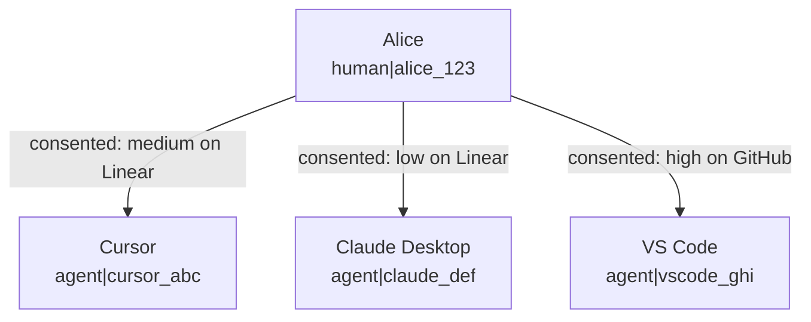
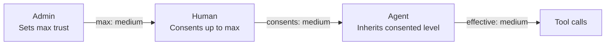
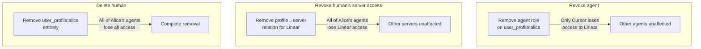

# Managing Humans and Agents

Agent Security introduces a distinct separation between **humans** (the people who authenticate) and **agents** (the MCP clients that act on their behalf). This guide explains the relationship model, how trust flows between them, and how to manage both in the [Platform](https://app.agent.security).

## Core Concepts

### What Is a Human?

A **human** is a person who authenticates through the consent flow. They are identified in Permit as `human|{subject}`, where `{subject}` is their user ID from the authentication system.

Humans don't call tools directly — they **delegate** authority to agents by completing the consent flow. A human's role is to:

- Authenticate and prove their identity
- Choose which MCP server to connect to (from their admin-granted list)
- Select the trust level they want to grant their agent

Humans can be **pre-authorized** by an admin before they've ever signed in. When an admin adds a user by email and grants them MCP server access, that user is ready to consent the moment they first connect.

### What Is an Agent?

An **agent** is an MCP client — Cursor, Claude Desktop, Claude Code, VS Code Copilot, or any other tool that speaks the Model Context Protocol. Agents are identified in Permit as `agent|{client_id}`, where `{client_id}` is the OAuth client ID assigned during the consent flow.

Agents are **created automatically** when a human completes consent. There is no manual agent creation step — agents appear in the Platform the moment a user consents.

### One Human, Many Agents

The same person using multiple MCP clients creates **separate agent identities**, each with its own permissions:



Each agent inherits permissions **independently** through the human's user profile. This means:

- Alice can grant Cursor medium trust on Linear, but only low trust to Claude Desktop on the same server
- Revoking Cursor's access does not affect Claude Desktop
- Each agent's tool calls are logged separately for audit

## How Trust Flows

Trust flows through a three-step chain: **Admin** sets the ceiling, **Human** selects within that ceiling, and the **Agent** inherits the result.



### The Trust Calculation

The agent's effective trust level for a given MCP server is:

```
effective_trust = min(admin_max_trust, human_consented_trust)
```

| Admin sets max | Human consents | Agent gets |
| --- | --- | --- |
| High | High | **High** |
| High | Medium | **Medium** (human chose less) |
| Medium | High | **Medium** (admin cap applies) |
| Medium | Medium | **Medium** |
| Low | Medium | **Low** (admin cap applies) |
| Low | Low | **Low** |

This is enforced at three layers — the Permit policy (derived roles), the consent UI (disabled slider levels), and the consent API (server-side 403 rejection). See [Permit.io Integration: Three Layers of Enforcement](/ai-security/mcp-permissions/permit-integration#max-trust-level-three-layers-of-enforcement) for the full details.

### What Each Trust Level Allows

| Trust level | Tool types | Examples |
| --- | --- | --- |
| **Low** | Read-only operations | `get_issues`, `list_repos`, `search_files` |
| **Medium** | Low + write operations | `create_issue`, `update_record`, `send_message` |
| **High** | Low + medium + destructive operations | `delete_repo`, `remove_member`, `destroy_environment` |

## Managing Humans

### Viewing the Humans Page

The [**Humans**](https://app.agent.security/humans) page lists all users who have been granted access or have signed in to the gateway. Each entry shows the user's name, email, granted MCP servers, and connected agents.

### Granting Access to an MCP Server

Before a user can complete the consent flow, an admin must grant them access:

1. Go to the **Humans** page
2. Select a user (or add a new user by email to pre-authorize them)
3. Click **Grant Access**
4. Choose the MCP server and set a **max trust level**


The max trust level acts as a ceiling — the user cannot grant their agent more than this during consent. If you set it to "medium," the consent UI will prevent the user from selecting "high."

### Updating Max Trust Level

To change a user's max trust level for an MCP server, update it from the human's detail page. The change takes effect **immediately**:

- **Lowering** the max trust level caps all existing agents on the next tool call. No re-consent is needed — the `min()` logic in Permit automatically applies the new ceiling.
- **Raising** the max trust level does not automatically upgrade existing agents. The user must re-consent to select the higher trust level.

### Revoking a Human's Access

Revoking a human's access to an MCP server removes the profile-to-server relation in Permit. This has a **cascading effect**:

- **All agents** acting on behalf of that human lose access to that server immediately
- The agents' roles on the user profile still exist, but without the profile-to-server relation, the derived role computation yields no result — every `permit.check()` returns DENY
- The human's access to **other** MCP servers is unaffected

To restore access, the admin must re-grant it and the user must go through the consent flow again.

### Viewing Connected Agents

The human detail page shows all agents that have connected on behalf of that user. For each agent you can see:

- Agent name and type (e.g., Cursor, Claude Desktop)
- Which MCP servers the agent has access to
- The trust level granted per server
- Recent activity and tool call history

This bidirectional view lets you quickly understand the full scope of a human's delegated access.

## Managing Agents

### Viewing the Agents Page

The [**Agents**](https://app.agent.security/agents) page lists all MCP clients that have connected through the gateway. Agents appear automatically after a user completes the consent flow.


### Understanding Agent Metadata

Each agent entry shows:

- **Agent identifier** — the MCP client name (e.g., Cursor, Claude Desktop) derived from the OAuth client registration
- **Associated human** — which user authorized this agent
- **MCP server access** — which servers the agent can reach and at what trust level
- **Activity log** — recent tool calls with allowed/denied status

:::info Agents can serve multiple humans
An agent (MCP client) can appear on multiple humans' profiles. For example, if both Alice and Bob use Cursor and consent to the same MCP server, the same Cursor agent identity may have roles on both `user_profile:alice` and `user_profile:bob`. The agent detail page groups permissions by human so you can see exactly which user authorized which access.
:::

### Modifying Agent Trust Levels

To change an agent's trust level for a specific MCP server:

1. Go to the **Agents** page and select the agent
2. Find the MCP server in the agent's access list
3. Adjust the trust level

The change takes effect immediately — the agent's next tool call is evaluated against the new trust level. The new trust level is still capped by the human's max trust (the `min()` logic still applies).

### Revoking an Individual Agent

To revoke a specific agent's access:

1. Go to the **Agents** page and select the agent
2. Find the MCP server and click **Revoke Access**

Only that agent loses access. Other agents on the same human's profile, and the human's own access grant, are unaffected. The user can restore this agent's access by going through the consent flow again.

## Revocation: Three Levels

Understanding the difference between revocation levels is critical for managing access:

| Action | What it does | Scope | How to restore |
| --- | --- | --- | --- |
| **Revoke an agent's server access** | Removes the agent's role on the user profile for that server | Only that agent loses access to that server | User re-consents for that agent |
| **Revoke a human's server access** | Removes the profile-to-server relation | **All** agents acting on behalf of that human lose access to that server | Admin re-grants access, then user re-consents |
| **Delete a human entirely** | Removes the user and their profile from Permit | **All** agents lose access to **all** servers for that human | Admin re-creates the user and re-grants all access |



## Common Scenarios

### "I want to give my team read-only access initially"

Set the max trust level to **low** for all users when granting MCP server access. Users can only consent at low trust, which limits their agents to read-only tools. When you're confident in the setup, raise individual users to medium or high as needed.

### "An employee left — how do I revoke all their agents?"

**Delete the human** from the Humans page. This removes their user profile from Permit, which immediately breaks the derived permission chain for all of their agents across all MCP servers. No agent can act on their behalf after deletion.

### "I want to allow Cursor but not Claude Desktop for a specific server"

After both agents have connected through consent, go to the **Agents** page and revoke Claude Desktop's access to that server. Cursor retains its access. Since agents are managed independently, you have full control over which MCP clients can access which servers.

Alternatively, if the user hasn't consented yet with Claude Desktop, they simply won't go through the consent flow for that client — agents only exist after consent.

### "A user needs higher trust than I originally set"

1. Go to the **Humans** page and raise the user's max trust level for the server
2. Tell the user to disconnect and reconnect their MCP client — the consent flow will run again, now allowing them to select the higher trust level

The max trust level change is immediate in Permit, but the agent keeps its existing trust level until the user re-consents at the higher level.

### "I want to see everything an agent has done"

Go to the **Agents** page, select the agent, and review its activity log. Each entry shows the tool called, the MCP server targeted, whether the call was allowed or denied, and when it happened. For deeper investigation, check the [Permit audit logs](/ai-security/mcp-permissions/permit-integration#reading-audit-logs) which show the raw `permit.check()` parameters.
