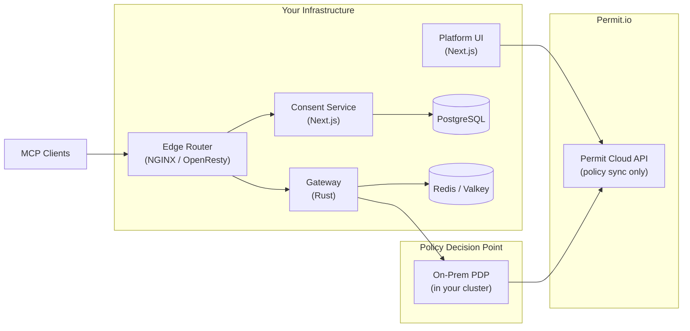

# Self-Hosted / On-Prem Deployment

Agent Security can be deployed in your own infrastructure for organizations with strict data residency, compliance, or network isolation requirements. Self-hosted deployment gives you full control over where your data lives while maintaining the same authorization model, audit capabilities, and management experience as the hosted gateway.

## Deployment Options

| Option | Best for | Description |
| --- | --- | --- |
| **Hosted Gateway** (SaaS) | Fastest rollout, most teams | Fully managed at `*.agent.security` — no infrastructure to operate |
| **Self-Hosted** (On-Prem) | Data residency, compliance, air-gapped environments | Deploy in your own Kubernetes cluster with full control over data and network |

Both options use the same policy model, consent flow, and audit logging. The only difference is where the components run.

## Architecture Overview

A self-hosted Agent Security deployment consists of four services, deployed via a Helm chart into your Kubernetes cluster:

With the **on-prem PDP**, authorization decisions are evaluated **locally** inside your cluster. Only policy definitions sync from Permit.io — no tool-call data or user data leaves your infrastructure.

## Infrastructure Requirements

| Component | Requirement |
| --- | --- |
| **Kubernetes** | 1.27+ (EKS, GKE, AKS, or self-managed) |
| **PostgreSQL** | 15+ (for user accounts, OAuth sessions, auth configuration) |
| **Redis / Valkey** | 7.x (for session state and host configuration) |
| **TLS certificates** | Wildcard certificate for `*.yourdomain.com` (each host gets a subdomain) |
| **DNS** | Wildcard DNS record pointing to your load balancer |
| **Permit.io license** | Enterprise plan with self-hosted PDP support |

## What's Included

The self-hosted deployment package includes:

- **Helm chart** for Kubernetes deployment with production-ready defaults
- **Container images** for all four services (Gateway, Consent Service, Platform, Edge Router) — Alpine-based with minimal footprint
- **On-prem PDP configuration** — deploy Permit's Policy Decision Point locally so authorization checks never leave your network
- **Autoscaling and high availability** — horizontal pod autoscaling, pod disruption budgets, and rolling update strategies
- **External secrets integration** — connect to your existing secrets management (AWS Secrets Manager, HashiCorp Vault, etc.)

## Data Residency

With self-hosted deployment:

| Data type | Where it lives |
| --- | --- |
| **Tool-call data** | Your infrastructure only — never leaves your network |
| **User sessions and tokens** | Your PostgreSQL and Redis instances |
| **Audit logs** | Your infrastructure (and optionally Permit.io) |
| **Policy definitions** | Synced from Permit.io (policy rules only, no user data) |
| **MCP server traffic** | Proxied within your network — the gateway connects directly to your upstream MCP servers |

## Get Started

Self-hosted deployment requires an enterprise license and includes hands-on deployment support from our team.

**To get started:**

- **Email us:** [support@permit.io](mailto:support@permit.io)
- **Schedule a demo:** [Book a call](https://calendly.com/permit-io/demo)
- **Join our community:** [Permit.io Slack](https://io.permit.io/slack)

Our team will help with infrastructure sizing, Helm chart configuration, TLS and DNS setup, and integration with your existing identity providers.
