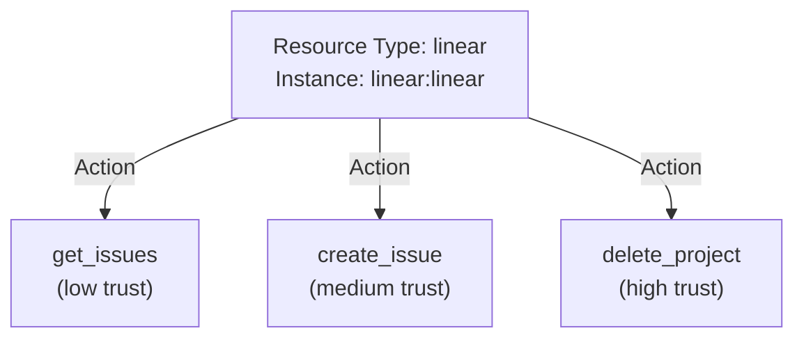
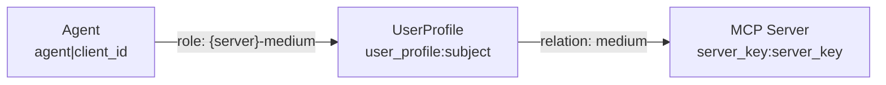
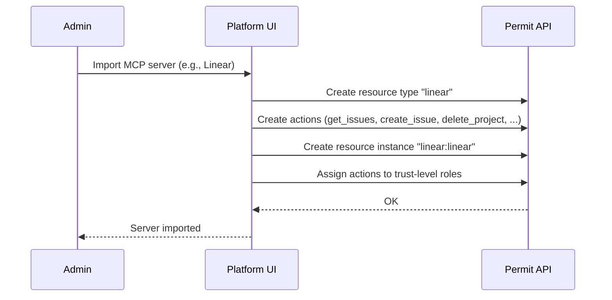
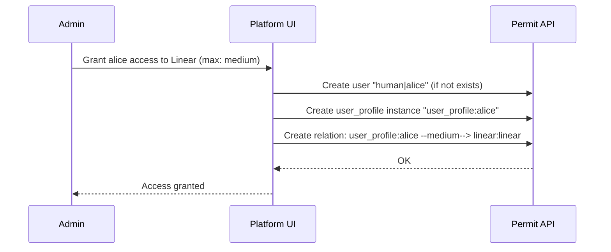
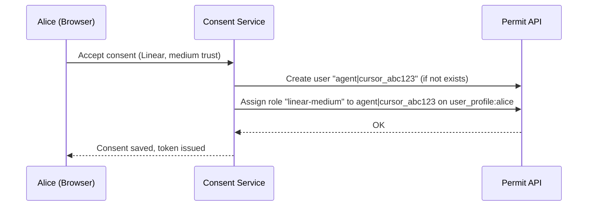
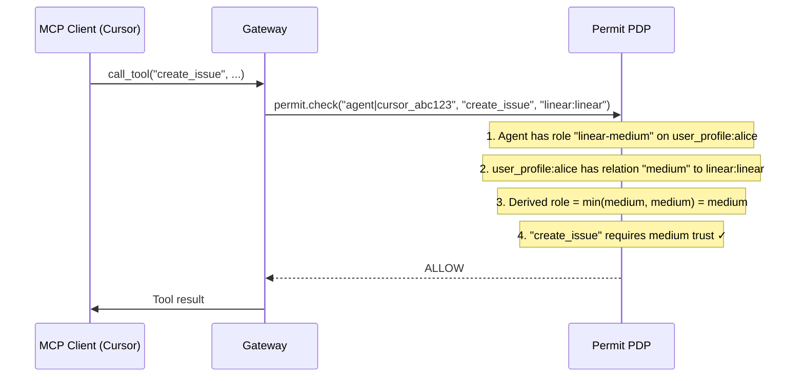

# How Agent Security Works with Permit.io

Agent Security uses [Permit.io](https://www.permit.io) as its **policy engine** — every authorization decision for every tool call is evaluated by Permit. This isn't a loose integration; Permit is the core of how permissions are modeled, enforced, and audited.

This page explains **why** Permit is central, **how** the policy model maps to Permit primitives, **what** happens during each sync step, and **where** to find everything in the Permit dashboard.

## Why Permit.io?

Agent Security needs a policy engine that can:

- **Evaluate fine-grained, relationship-based access control (ReBAC)** — decisions depend on who the user is, which agent is acting, and which MCP server and tool are involved
- **Apply changes instantly** — when an admin adjusts a trust level or revokes access, the change takes effect on the next tool call with no restart or redeployment
- **Provide a full audit trail** — every `permit.check()` call is logged, giving complete visibility into what was allowed or denied and why

Permit.io provides all three. Agent Security builds its authorization model using Permit's resource types, actions, roles, relations, and derived roles — and the Permit PDP (Policy Decision Point) evaluates every tool call in real time.

## The Policy Model

Agent Security maps its concepts directly to Permit primitives. Understanding this mapping is the key to understanding how authorization works.

### Resources and Actions

Each imported MCP server becomes a **resource type** in Permit. The server's tools become **actions** on that resource type.

| Agent Security concept | Permit primitive | Example |
| --- | --- | --- |
| MCP server | Resource type | `linear` |
| MCP server instance | Resource instance | `linear:linear` (type and instance share the same key) |
| Tool | Action | `create_issue`, `get_issues`, `delete_project` |



### Users

Permit tracks two types of users, distinguished by key prefix:

| Caller type | Permit user key | Used by |
| --- | --- | --- |
| Human | `human\|{subject}` | Consent Service and Platform — for policy management (granting access, setting trust levels) |
| Agent | `agent\|{client_id}` | Gateway — for runtime tool-call authorization |

### Roles and Trust Levels

Trust levels map to **roles** in Permit. Each MCP server gets its own set of scoped roles:

| Trust level | Permit role | Permissions |
| --- | --- | --- |
| Low | `{server}-low` | Read-only tools |
| Medium | `{server}-medium` | Read + write tools |
| High | `{server}-high` | Read + write + destructive tools |

Roles are hierarchical — `high` inherits `medium`, which inherits `low`.

### The UserProfile Indirection (ReBAC)

This is the most important part of the model. Agents do **not** get direct access to MCP servers. Instead, authorization flows through a **`user_profile`** resource that represents the human:



**Why this indirection?** It implements a trust ceiling. The human's profile relation to the server (set by the admin) caps what any agent can do, regardless of what the user granted during consent.

The effective permission is: **min(agent's role on profile, profile's relation to server)**

| Agent role on profile | Profile relation to server | Effective permission |
| --- | --- | --- |
| `{server}-high` | `high` | **high** |
| `{server}-high` | `medium` | **medium** (capped by admin) |
| `{server}-high` | `low` | **low** (capped by admin) |
| `{server}-medium` | `high` | **medium** |
| `{server}-medium` | `medium` | **medium** |
| `{server}-medium` | `low` | **low** (capped by admin) |
| `{server}-low` | `high` | **low** |
| `{server}-low` | `medium` | **low** |
| `{server}-low` | `low` | **low** |

This is implemented using **9 derived role rules per MCP server** in Permit's ReBAC engine.

### Max Trust Level: Three Layers of Enforcement

The admin-configured max trust level is enforced at three layers to prevent bypass:

1. **Permit policy** — the profile-to-server relation in Permit acts as the ceiling in the `min()` calculation
2. **Consent UI** — the frontend disables trust levels above the admin's maximum, so users cannot select them
3. **Consent API** — the backend rejects consent requests that exceed the max, even if the frontend is bypassed

## The Sync Flow

Each step in the admin and user workflow creates specific artifacts in Permit. Here's exactly what happens:

### Step 1: Admin Imports an MCP Server

The Platform creates in Permit:
- A **resource type** with the server's key (e.g., `linear`)
- **Actions** on that resource type for each discovered tool (e.g., `create_issue`, `get_issues`)
- **Role assignments** linking each action to the appropriate trust level



### Step 2: Admin Grants Human Access

The Platform creates a **relation** from the human's user profile to the MCP server, with the max trust level as the relation type:



This relation becomes the ceiling in the `min()` logic — alice's agents can never exceed medium trust on Linear, regardless of what she selects during consent.

### Step 3: Human Consents

When the user accepts consent and selects a trust level, the Consent Service assigns the **agent's role on the user profile**:



Note: The Consent Service does **not** create MCP server resources or profile-to-server relations — those are managed by the Platform in steps 1 and 2. The human must already have a profile-to-server relation before consent is allowed.

### Step 4: Agent Calls a Tool

The Gateway calls `permit.check()` with the agent's key, the tool name as the action, and the server as the resource:



If alice's admin had set max trust to `low`, the check would fail:

```
min(medium, low) = low → "create_issue" requires medium → DENY
```

## Separation of Responsibilities

Each component owns specific Permit operations:

| Component | What it does in Permit |
| --- | --- |
| **Platform** | Creates resource types, actions, and instances for MCP servers. Creates user profiles and profile-to-server relations (max trust). |
| **Consent Service** | Creates agent users. Assigns agent roles on user profiles (consented trust level). Validates that the human already has access before allowing consent. |
| **Gateway** | Calls `permit.check()` at runtime. Does not modify Permit policy — read-only. |

## Using the Permit Dashboard

Since Agent Security builds on standard Permit primitives, you can inspect and debug everything from the [Permit dashboard](https://app.permit.io).

### Finding Your Environment

Each Agent Security [host](/ai-security/mcp-permissions/guide#2-create-a-host) is linked to a specific Permit project and environment. To find it:

1. Log in to [app.permit.io](https://app.permit.io)
2. Select the project and environment that matches your host's configuration
3. The environment name typically matches the host name you set in Agent Security

### Viewing the Schema

In the Permit dashboard under your environment:

- **Resources** — each MCP server appears as a resource type (e.g., `linear`, `github`). Click a resource to see its actions (tools) and roles
- **Resource Instances** — each server has a corresponding instance (e.g., `linear:linear`)
- **Users** — you'll see both `human|{subject}` and `agent|{client_id}` entries
- **Role Assignments** — shows which agents have which roles on which user profiles

### Reading Audit Logs

Every `permit.check()` call is logged by Permit. Use the **Audit Log** in the Permit dashboard to:

- **Debug authorization failures** — search for a specific agent or user to see exactly which checks passed or failed, and which policy rules were evaluated
- **Verify the sync flow** — confirm that importing a server created the expected resource type and actions, or that consent created the expected role assignment
- **Monitor tool-call patterns** — identify which tools are most used, which agents are most active, and whether any unexpected denials are occurring

:::tip
The Permit audit log shows the raw `permit.check()` parameters — user key, action, and resource — making it easy to correlate with the [Agent Security audit logs](/ai-security/mcp-permissions/guide#9-audit-logs) visible in [app.agent.security](https://app.agent.security).
:::

## Key Takeaways

- **Permit is the policy engine** — all authorization decisions flow through `permit.check()`
- **Changes are instant** — update a trust level or revoke access in Permit, and the next tool call reflects it
- **The `user_profile` indirection** is the core pattern — it enables the `min()` ceiling logic that separates admin control from user consent
- **Three components, clear boundaries** — Platform writes policy, Consent Service writes agent roles, Gateway reads policy
- **Full auditability** — every decision is logged in both Agent Security and Permit
