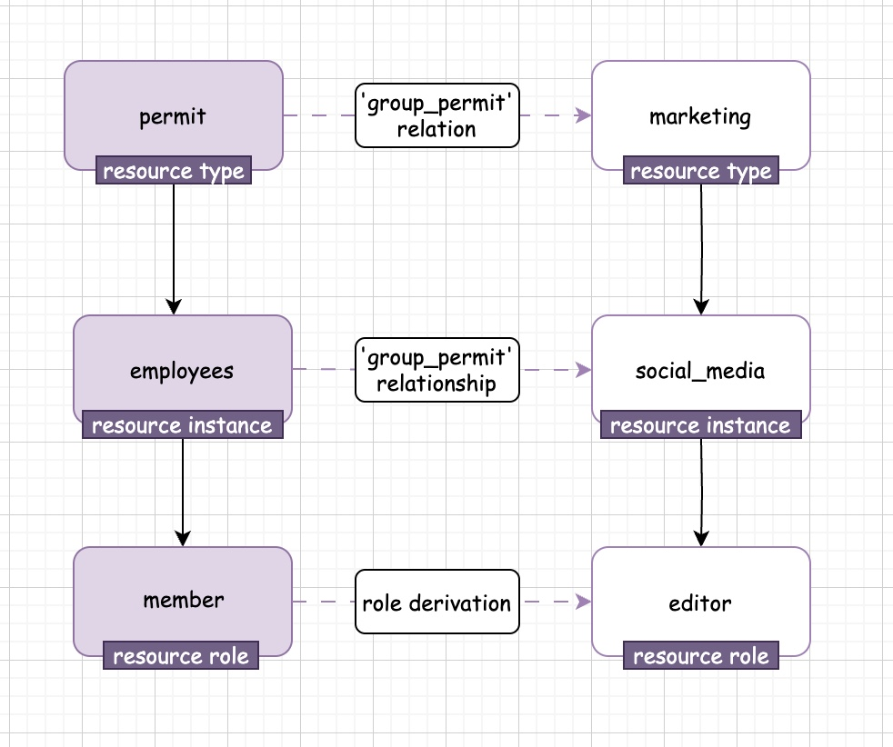

import Tabs from "@theme/Tabs";
import TabItem from "@theme/TabItem";

Groups API lets you manage your objects in a group. You can create, update, delete, and list groups.
Each group will have roles associated with it, and every user in the group will inherit the roles of the group.
The group will get these roles from the resource that it is associated with.

Check the [Groups Redoc ](/) for more information.

## Example Usage

We have a group called 'permit', that will be represented with resource 'permit', resource instance 'employees', and role 'member'.
Adittionly, we will have another resource 'marketing' with resource instance 'social_media' and role 'editor'.
Once we set the role 'editor' for the 'permit group', this is the process that will happen in the API:
- create role derivation from 'permit#member' to 'marketing#editor'
- create a relation between 'permit' and 'marketing' with a relation between 'group_permit'
- create relationship between 'permit#employees' and 'marketing#social_media'.

Then we will have group 'permit' and every user who is a 'member' in this group will have the role 'editor' in the resource 'marketing#social_media'.