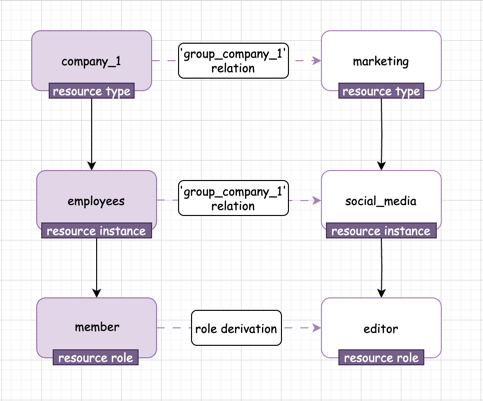

import Tabs from "@theme/Tabs";
import TabItem from "@theme/TabItem";

The Groups API allows you to manage your resources and users within groups. You can create, update, delete, and list groups.
Groups enable you to easily group together resources, resource-instances, and users. In addition groups simplify ReBAC permissions for users, by allowing roles to be assigned to the groups themselves.
You can assign roles to a group and then add users to the group through the Groups API.
The users within the group will derive roles form the roles assigned to the group .

Check the [Groups Redoc ](/) for more information.


## Example Usage for User Groups

### Assign roles to a group:

Let's say we want to represent a company and its employees as a group, and then assign all the employees access to a shared marketing resource (social-media) via the group.  We'll have a group named 'company' (Which is represented as a resource named 'company'), and an instance of a specific company 'Acme'.  Users are assigned to `Acme` via a role called `member`
Additionally, we will have a resource-instance of type 'marketing' - 'social_media' which supports the role 'editor'.
Once we assign the role 'editor' to  the `company` group, the following will by automated by API:
- create role derivation from 'company#member' to 'marketing#editor'
- create a relation between 'company' and 'marketing' with a relation between 'company_group'
- create relationship between 'company#Acme' and 'marketing#social_media'.



Then we will have group 'company' and every user who is a 'member' in this group will have the role 'editor' in the resource 'marketing#social_media'.

### Assign users to a group:

When you assign "user-1" to 'company' group, the following will by automated by API:
- assign 'user-1' to 'company#member' role

and the user will also get the role 'marketing#editor' in the resource 'marketing#social_media'.


## Create a Group via API

To create a new group, make a POST request to the following with the required data:

```bash
curl 'https://api.permit.io/v2/facts/{project_id}/{env_id}/groups' \
  -H 'authorization: Bearer API_SECRET_KEY'
  --data-raw '{"group_instance_key": "Acme"}' \
```

To add a new role to group, make a POST request to the following with the required data:

```bash
curl 'https://api.permit.io/v2/facts/{project_id}/{env_id}/group/{group_resource_type_key}/roles' \
  -H 'authorization: Bearer API_SECRET_KEY'
  --data-raw '{"resource": "marketing", "resource_instance": "social_media", "role": "editor", tenant:"business"}' \
```

To add users to a group, make a PUT request to the following with the required data:

```bash
curl -X PUT \
'https://api.permit.io/v2/facts/{project_id}/{env_id}/groups/{group_resource_type_key}/users/{user_id}' \
    -H 'authorization
      --data-raw '{"tenant":"business"}'
```

## Example Usage for Resource Groups

Let’s dive deeper into a simple use-case example for Resource Groups:

Say we have a Group and inside the group, we have the Support team and Organization 1. Our goal is to allow all members of the Support Team to be members in Organization 1 and in all of his related instances.

For this purpose, we will first create a group named `Group`. The group, `group` is a resource, while each specific group inside (Such as `support-team`) is a resource instance.

Users are assigned to the `support-team` via the `member` role.

As mentioned above, we also have an `Org1` resource instance.
This resource instance supports the role of `member`.

Let’s set this up:

### API Calls: Create Group, Add Role to Group, Add Group to Group:

To **create a new group**, make a POST request with the following data:

```bash
curl 'https://api.permit.io/v2/facts/{project_id}/{env_id}/groups' \

**-H 'authorization: Bearer API_SECRET_KEY'

--data-raw '{"group_instance_key": "support"}' \

```

Create another Group instance `Org1`:

```bash
curl 'https://api.permit.io/v2/facts/{project_id}/{env_id}/groups' \

**-H 'authorization: Bearer API_SECRET_KEY'

--data-raw '{"group_instance_key": "org1"}' \
```

Now, we want to create a connection between those two group instances.

```bash
curl -X PUT \\

'https://api.permit.io/v2/facts/{project_id}/{env_id}/groups/{group_instance_key}' \

-H 'authorization: Bearer API_SECRET_KEY'

--data-raw '{"group_instance_key": "org1"}' \
```

Once we assign the `Org1` group instance  to the `Support` group instance, the following will be automated by the API:

- A role derivation will be created from group#member' to 'group#member'
- A relation will be created between the 'group' resource and the 'group' resource. The name of this relation will be 'group'.
- A relationship will be created between 'group#support-team' and 'group#org1'.