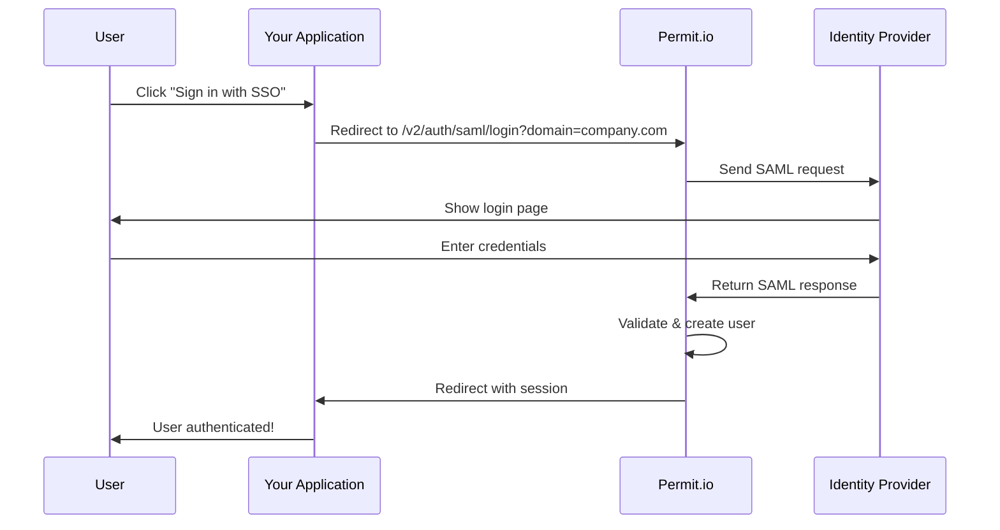

# SAML Single Sign-On (SSO)

Enable enterprise Single Sign-On authentication with SAML 2.0. Let your users sign in with their existing corporate identity provider while Permit.io handles authorization and access control.

:::info Protocol Support
Permit.io currently supports **SAML 2.0** for native SSO authentication. OIDC (OpenID Connect) is not supported in the native implementation. When configuring your identity provider, please select **SAML 2.0** as the authentication method.
:::

## Overview

SAML SSO allows your users to authenticate with their organization's identity provider (like Okta, Azure AD, or Keycloak) without creating separate passwords for your application.

**Benefits:**
- **Single sign-on** - Users log in once with their corporate credentials
- **Automatic user provisioning** - Users are created on first login
- **Enhanced security** - MFA and password policies enforced by your IdP
- **Centralized access control** - Manage users from one place
- **Works with any SAML 2.0 provider** - Okta, Azure AD, Google Workspace, Keycloak, and more

## How It Works



## Quick Start

### What You'll Need

1. **Admin access** to your identity provider (Okta, Azure AD, Keycloak, etc.)
2. **Admin access** to Permit.io
3. **Your Permit.io Organization ID** - retrieve it via the [List Organizations API](https://api.permit.io/v2/redoc#tag/Organizations/operation/list_organizations) or from Permit.io dashboard → Settings → Organization
4. **Your organization's email domain** (e.g., `yourcompany.com`)

### Setup Steps

1. **Configure your identity provider** - Choose your IdP below:
   - [Okta Configuration](/authentication/saml-sso-okta)
   - [Azure AD Configuration](/authentication/saml-sso-azure)
   - [Keycloak Configuration](/authentication/saml-sso-keycloak)
   - [Google Workspace Configuration](/authentication/saml-sso-google)

2. **Configure Permit.io** - Add SSO connection in Permit.io dashboard

3. **Integrate your app** - Add SSO login to your application

4. **Test** - Verify end-to-end authentication flow

## Configure Permit.io

After configuring your identity provider, add the SSO connection in Permit.io:

1. Log in to [Permit.io](https://app.permit.io)
2. Navigate to **Settings** → **SSO Configuration**
3. Click **Add SSO Connection**
4. Fill in the form:

### SSO Connection Settings

**Domain** - Your organization's email domain:
```
yourcompany.com
```
Users with `@yourcompany.com` email addresses will use this SSO connection.

**Connection Name** - A friendly name:
```
Okta Production
```

**IdP Entity ID** - From your IdP metadata (examples):
- Okta: `http://www.okta.com/exkx5vtyzaE5axbm9697`
- Azure: `https://sts.windows.net/a1b2c3d4-...`
- Keycloak: `https://keycloak.yourcompany.com/auth/realms/master`

**IdP SSO URL** - From your IdP metadata (examples):
- Okta: `https://yourcompany.okta.com/app/.../sso/saml`
- Azure: `https://login.microsoftonline.com/.../saml2`
- Keycloak: `https://keycloak.yourcompany.com/auth/realms/master/protocol/saml`

**IdP X.509 Certificate** - Paste from your IdP metadata:

:::tip Certificate Format
You can paste the certificate **with or without headers**:

✅ With headers (recommended):
```
-----BEGIN CERTIFICATE-----
MIIDqjCCApKgAwIBAgIGAZpXHJcrMA0GCSqGSIb...
-----END CERTIFICATE-----
```

✅ Without headers (also works):
```
MIIDqjCCApKgAwIBAgIGAZpXHJcrMA0GCSqGSIb...
```
:::

**IdP Single Logout URL** - Leave empty unless your IdP requires it

Click **Create** to save the SSO connection.

## Integrate Your Application

### Add SSO Login Button

Add a "Sign in with SSO" button to your login page:

```jsx title="LoginPage.jsx"
function LoginPage() {
  const handleSSOLogin = () => {
    // Replace with your domain and organization's SSO domain
    const domain = 'yourcompany.com';
    window.location.href =
      `https://app.yourcompany.com/v2/auth/saml/login?domain=${domain}`;
  };

  return (
    <div>
      <h1>Sign In</h1>
      <button onClick={handleSSOLogin}>
        Sign in with Company SSO
      </button>
    </div>
  );
}
```

### Handle SSO Callback

Create a callback route at `/sso/callback`:

```jsx title="SSOCallback.jsx"
import { useEffect } from 'react';
import { useNavigate, useSearchParams } from 'react-router-dom';

function SSOCallback() {
  const navigate = useNavigate();
  const [searchParams] = useSearchParams();

  useEffect(() => {
    const domain = searchParams.get('domain');
    const email = searchParams.get('email');
    const error = searchParams.get('error');

    if (error) {
      navigate(`/login?error=${error}`);
      return;
    }

    if (domain && email) {
      // Success! Session cookie already set by Permit.io
      // Redirect to your app
      navigate('/dashboard');
    }
  }, [navigate, searchParams]);

  return <div>Completing sign in...</div>;
}
```

Add the route to your router:

```jsx title="App.jsx"
import { BrowserRouter, Routes, Route } from 'react-router-dom';

function App() {
  return (
    <BrowserRouter>
      <Routes>
        <Route path="/login" element={<LoginPage />} />
        <Route path="/sso/callback" element={<SSOCallback />} />
        <Route path="/dashboard" element={<Dashboard />} />
      </Routes>
    </BrowserRouter>
  );
}
```

## Test Your Setup

### Get Your SSO Login URL

```
https://app.yourcompany.com/v2/auth/saml/login?domain=yourcompany.com
```

Replace:
- `app.yourcompany.com` - Your application's domain
- `yourcompany.com` - The domain you configured in Permit.io

### Test the Flow

1. Open the URL in an **incognito/private window**
2. You should be redirected to your IdP login page
3. Log in with your corporate credentials
4. Complete MFA if required
5. You'll be redirected to `/sso/callback` with a session cookie
6. Your app redirects to the dashboard - user is authenticated!

:::note First Login Behavior
On first login, the user is **automatically created** in Permit.io with their email, first name, and last name. However, **no roles are assigned** by default - you must assign roles separately via the Permit.io dashboard or API.
:::

## Assign Roles to SSO Users

After successful SSO login, assign roles to users:

### Option 1: Via Permit.io Dashboard
1. Go to **Users** in Permit.io
2. Search for the user by email
3. Click the user → **Assign Role**
4. Select role and tenant → **Save**

### Option 2: Via API (Automated)
```javascript
import { Permit } from "permitio";

const permit = new Permit({
  token: process.env.PERMIT_API_KEY,
});

// Assign role after first login
await permit.api.assignRole({
  user: "user@yourcompany.com",
  role: "member",
  tenant: "default"
});
```

### Option 3: Automatic Assignment
```javascript
// In your /sso/callback handler
app.get('/sso/callback', async (req, res) => {
  const { email } = req.query;

  const isNewUser = await checkIfNewUser(email);

  if (isNewUser) {
    await permit.api.assignRole({
      user: email,
      role: "member",
      tenant: "default"
    });
  }

  res.redirect('/dashboard');
});
```

## Troubleshooting

### "Invalid Request" Error

**Cause:** Entity ID mismatch between IdP and Permit.io

**Solution:** Verify the Entity ID in your IdP matches:
```
https://app.yourcompany.com/v2/auth/saml/metadata/<YOUR_ORG_ID>
```

### User Created But No Access

**Cause:** No roles assigned after first login

**Solution:** This is expected. Assign roles via Permit.io dashboard or API (see above).

### Certificate Error

**Cause:** Invalid or expired certificate

**Solution:**
1. Download fresh metadata from your IdP
2. Update certificate in Permit.io SSO configuration
3. Verify certificate hasn't expired

### Missing User Attributes

**Cause:** IdP not sending required SAML attributes

**Solution:** Verify your IdP sends these attributes:
- `email` → user email
- `firstName` → user first name
- `lastName` → user last name

## Supported Identity Providers

Permit.io works with **any SAML 2.0 compliant identity provider**:

| Provider | Status | Guide |
|----------|--------|-------|
| Okta | ✅ Fully Tested | [Setup Guide](/authentication/saml-sso-okta) |
| Keycloak | ✅ Fully Tested | [Setup Guide](/authentication/saml-sso-keycloak) |
| Azure AD (Microsoft Entra) | ⚠️ SAML 2.0 Compatible | [Setup Guide](/authentication/saml-sso-azure) |
| Google Workspace | ⚠️ SAML 2.0 Compatible | [Setup Guide](/authentication/saml-sso-google) |
| Auth0 | ⚠️ SAML 2.0 Compatible | Use generic SAML 2.0 setup |
| OneLogin | ⚠️ SAML 2.0 Compatible | Use generic SAML 2.0 setup |
| Other SAML 2.0 providers | ⚠️ SAML 2.0 Compatible | Use generic SAML 2.0 setup |

## FAQ

**Do users need separate passwords?**
No. Users authenticate with their corporate identity provider using existing credentials.

**What happens on first login?**
The user is automatically created in Permit.io with their email and name. You must assign roles separately.

**Can I use multiple IdPs?**
Yes! Configure different SSO connections for different domains (e.g., `company.com` → Okta, `partner.com` → Azure).

**Does SSO work with MFA?**
Yes! MFA is handled by your identity provider. No special configuration needed.

**How do I handle logout?**
Clear your app's session and optionally redirect to your IdP's logout URL for single logout.

**Can I test without affecting production?**
Yes! Create a separate SSO connection with a test domain (e.g., `test.yourcompany.com`).

## API Reference

### SAML Login Endpoint

```
GET /v2/auth/saml/login?domain=<domain>
```

Initiates SAML authentication flow.

**Parameters:**
- `domain` (required) - SSO domain configured in Permit.io

**Response:** 302 redirect to IdP login page

### SAML Callback Endpoint

```
POST /v2/auth/saml/callback
```

Receives SAML response from IdP (called automatically).

**Response:** 303 redirect to `/sso/callback` with session cookie and query parameters:
- `domain` - SSO domain
- `email` - User email
- `active_org_id` - Permit.io organization ID

### SAML Metadata Endpoint

```
GET /v2/auth/saml/metadata/<org_id>
```

Returns Service Provider metadata for IdP configuration.

**Example:**
```bash
curl "https://app.yourcompany.com/v2/auth/saml/metadata/b60624aa2079499b897b46d29a82e190"
```

## Next Steps

- **[Okta Setup Guide](/authentication/saml-sso-okta)** - Step-by-step Okta configuration
- **[Azure AD Setup Guide](/authentication/saml-sso-azure)** - Step-by-step Azure configuration
- **[Keycloak Setup Guide](/authentication/saml-sso-keycloak)** - Step-by-step Keycloak configuration
- **[Google Workspace Setup Guide](/authentication/saml-sso-google)** - Step-by-step Google configuration

## Need Help?

- 📧 Email: [support@permit.io](mailto:support@permit.io)
- 💬 Slack: [Join our community](https://io.permit.io/docs-to-slack)
- 📚 Docs: [docs.permit.io](https://docs.permit.io)
