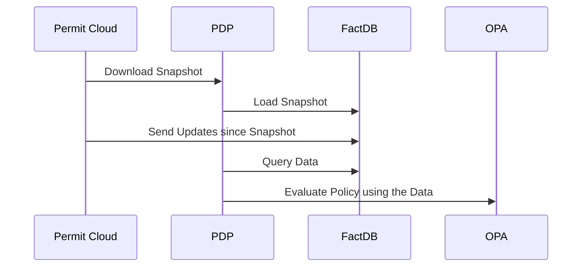

# PDP Local Datastore (FactDB)

FactDB is an embedded datastore to manage larges data volumes inside the PDP.

It allows the PDP to store and query large volumes of data locally,
reducing the latency and improving the performance of the PDP.

:::info EAP
This feature is available under Early Access Program.
Please contact with us on [Slack](https://io.permit.io/slack) for more information.
:::

:::warning
This version is available on **PDP v0.7.0** and above.
Please make sure to upgrade **all PDPs in the environment** to the latest version to use FactDB.
:::

## Enabling FactDB

The FactDB can be enabled per Permit Environment, allowing PDPs in that environment to use the FactDB.
Optionally, you can have both legacy PDPs and FactDB enabled PDPs in the same environment.

To enable FactDB on a Permit Environment, you'll need an [API Key](/manage-your-account/workspace-settings#api-keys),
then follow the steps below:

#### 1. Allow FactDB on Permit.io Environment Settings

Update your environment settings to enable FactDB.
```bash
curl -X PATCH 'https://api.permit.io/v2/projects/{proj_id}/envs/{env_id}' \
  -H 'Content-Type: application/json' -H 'Accept: application/json' \
  -H 'Authorization : Bearer {api_key}' \
  --data-raw '{
      "settings": {
            "factdb_enabled":true
      }
    }'
```
:::info
If you have existing settings in your environment, you may want to include them in the PATCH request.
Check it using the following request:
```bash
curl -X GET 'https://api.permit.io/v2/projects/{proj_id}/envs/{env_id}' \
  -H 'Accept: application/json' -H 'Authorization : Bearer {api_key}'
```
:::


#### 2. Enable FactDB on your PDPs

Set the `PDP_FACTDB_ENABLED=true` environment variable to enable FactDB on your all PDPs connected to the environment.

```bash
docker run -it -p 7766:7000 \
  --name pdp-online \
  --env PDP_API_KEY=<YOUR_API_KEY> \
  --env PDP_FACTDB_ENABLED=true \
  permitio/pdp-v2:latest
```

:::info
FactDB is currently an opt-in feature, requiring you to explicitly enable it on all PDPs in the environment.
This is to allow environments to run both with FactDB and without it.
:::

### Running both FactDB and Legacy PDPs in the same environment

For simplifying migration plan, it is possible to run both FactDB enabled PDPs and Legacy PDPs in the same environment.
To do this, you need to enable the following setting on the environment.

```bash
curl -X PATCH 'https://api.permit.io/v2/projects/{proj_id}/envs/{env_id}' \
  -H 'Content-Type: application/json' -H 'Accept: application/json' \
  -H 'Authorization : Bearer {api_key}' \
  --data-raw '{
      "settings": {
            "factdb_enabled":true,
            "allow_legacy_data_store":true
      }
    }'
```

With this setting enabled, you can run both FactDB PDPs with `PDP_FACTDB_ENABLED=true` and Legacy PDPs in the same environment.

:::info
We recommend you to migrate all your PDPs in the environment to FactDB.
Please contact us on [Slack](https://io.permit.io/slack) for more information.
:::


### PDP Offline Mode with FactDB

FactDB can be used in conjunction with the [PDP Offline Mode](/how-to/deploy/deploy-to-production/#pdp-offline-mode) feature.
When the PDP is in Offline Mode, the FactDB will boot from the locally stored disk volume, preserved from previous runs.

Here is an example of how to start the PDP in Offline Mode with FactDB enabled.

1. Create a volume for the PDP backup
```bash
docker volume create pdp-offline-backup
```

2. Start a new PDP container with the volume attached at `/app/backup`
```bash
docker run -it -p 7766:7000 \
  --name pdp-online \
  --env PDP_API_KEY=<YOUR_API_KEY> \
  --env PDP_FACTDB_ENABLED=true \
  --env PDP_ENABLE_OFFLINE_MODE=true \
  -v pdp-offline-backup:/app/backup:rw \
  permitio/pdp-v2:latest
```

With the backup volume attached, even when the PDP is unable to connect to the Permit API,
it can still boot up with the FactDB, policies and configurations from the previous run.

```bash
docker run -it -p 7766:7000 \
  --name pdp-offline \
  --network none \
  --env PDP_API_KEY=<YOUR_API_KEY> \
  --env PDP_FACTDB_ENABLED=true \
  --env PDP_ENABLE_OFFLINE_MODE=true \
  -v pdp-offline-backup:/app/backup:rw \
  permitio/pdp-v2:latest
```

## FactDB Architecture

When the PDP boots, FactDB downloads the latest snapshot, and keep it up-to-date from the Permit Cloud and other PDPs in the environment.

Using the stored data, when the PDP receive a query, it queries the FactDB for the relevant data, then passes it to the OPA engine for policy evaluation.




## Troubleshooting & Debugging

### Refreshing Data
Every time the PDP boots, it downloads the latest snapshot from the Permit Cloud and stores it in the `/app/backup/` directory.

By restarting the PDP, you can refresh the FactDB data with the most up-to-date data from the Permit Cloud.

### Extracting Data
PDP with FactDB stores data in the `/app/backup/` directory. You can inspect the data by mounting the volume to your local machine.

```bash
docker run -it -p 7766:7000 \
  --env PDP_API_KEY=<YOUR_API_KEY> \
  --env PDP_FACTDB_ENABLED=true \
  --env PDP_ENABLE_OFFLINE_MODE=true \
  -v ./pdp-backup:/app/backup:rw \
  permitio/pdp-v2:latest
```

Inside you can observe the data stored in the FactDB. Each database snapshot is stored in a dedicated SQLite `fact.[id].db` file.
```text
./pdp-backup
|-- policy_store_backup.json  // When Offline Mode enabled
|-- pdp_cloud_config_backup.json  // When Offline Mode enabled
|-- factdb
|   |-- fact.[id].db
|   |-- fact.[id].db-shm
|   |-- fact.[id].db-wal
```

:::info
This file structure is internal and may be changed in the future.
:::

### Inspecting Data

Using SQLite3 CLI, you can inspect the data stored in the FactDB.

```bash
sqlite3 ./pdp-backup/factdb/fact.[id].db
```

:::warning
We recommend you to not modify the data stored in the FactDB directly.
:::

The available tables schema inside
```bash
> .tables
# instances relationship_tuples user_tenant_assoc offsets role_assignments users
```

Inspecting the data inside. For example, query the `role_assignment` table:
```bash
> .mode column
> .headers on
> SELECT id, actor, role, tenant, resource FROM role_assignments LIMIT 10;
```

The output will be similar to:
```text
id                                           actor         role    tenant   resource
-------------------------------------------  ------------  ------  -------  ---------------------
user:alice-admin-Blog:how-to-code            user:alice    admin   default  Blog:how-to-code
user:bob-editor-Blog:react-tutorial          user:bob      editor  default  Blog:react-tutorial
user:charlie-viewer-Comment:great-post       user:charlie  viewer  default  Comment:great-post
user:dan-admin-Blog:javascript-tips          user:dan      admin   default  Blog:javascript-tips
user:eve-editor-Blog:css-tricks              user:eve      editor  default  Blog:css-tricks
user:frank-viewer-Comment:very-helpful       user:frank    viewer  default  Comment:very-helpful
user:grace-admin-Blog:nodejs-guide           user:grace    admin   default  Blog:nodejs-guide
user:heidi-editor-Blog:html-basics           user:heidi    editor  default  Blog:html-basics
user:ivan-viewer-Comment:thanks-for-sharing  user:ivan     viewer  default  Comment:thanks-for-sharing
user:judy-admin-Blog:testing-in-js           user:judy     admin   default  Blog:testing-in-js
```

:::info
This table schema is internal and may be changed in the future.
:::
