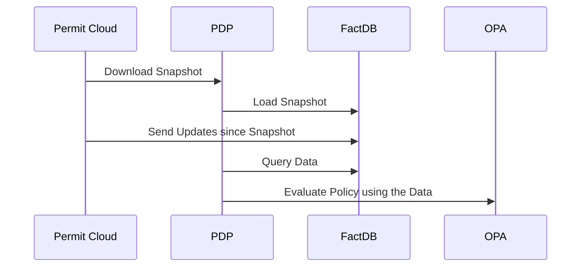

import TimelineStep from "../../../src/components/timeline/TimelineStep";
import TimelineWrapper from "../../../src/components/timeline/TimelineWrapper";
import CodeBlock from "../../../src/components/code-block/CodeBlock";

:::warning Private Beta
**FactDB is currently in Private Beta** and requires enablement per customer workspace.
If you would like to participate in the Private Beta program, please contact us via [Slack](https://io.permit.io/slack).
:::

**FactDB is an embedded datastore** built to **handle massive data volumes** within the [PDP](/concepts/pdp/overview), making it
the default choice for all new Permit customers. Designed specifically for scalability, FactDB overcomes the limitations of
traditional solutions like OPA, whose native data handling struggles with large datasets required by organizations with **tens
of millions of users**.

To achieve this, FactDB uses an embedded SQLite database stored directly in the PDP. During a permission check, it identifies
the user and resource involved, queries the SQLite database to extract a targeted slice of relevant data, and sends this
refined data to **OPA** for evaluation. This process ensures fast, efficient permission evaluations while maintaining the
scalability needed to support enterprise-level use cases.

## Enabling FactDB

By default, the Permit Environment has FactDB disabled. To use FactDB with your PDPs, you can enable it within the Permit
Environment settings.

:::warning Notice
This version is available on **PDP v0.7.0** and above.
Please make sure to upgrade **all PDPs in the environment** to the latest version to use FactDB.
:::

To enable FactDB in a Permit Environment, you'll need an [API Key](/manage-your-account/workspace-settings#api-keys).
Once you have it, follow these steps:

<TimelineWrapper>
<TimelineStep>

### Allow FactDB on Permit.io Environment Settings

Update your environment settings to enable FactDB.

<CodeBlock folderPath="/factDB/allow-factdb-env" />

:::info
If you have existing settings in your environment, you must include them in the PATCH request.
Check it using the following request:

<CodeBlock folderPath="/factDB/existing-settings" />

:::

</TimelineStep>
<TimelineStep>

### Enable FactDB on your PDPs

Set the `PDP_FACTDB_ENABLED=true` environment variable to enable FactDB on every PDP connected to the environment.

<CodeBlock folderPath="/factDB/enable-factdb-pdp" />

:::info
FactDB is currently an opt-in feature, requiring you to explicitly enable it on all PDPs in the environment.
This is to allow environments to run [both with FactDB and without it](/concepts/pdp/factdb#running-both-factdb-and-legacy-pdps-in-the-same-environment).
:::

</TimelineStep>
<TimelineStep>

## Running both FactDB and Legacy PDPs in the same environment

To simplify the migration process, you can run both FactDB-enabled PDPs and Legacy PDPs within the same environment.
To achieve this, simply enable the following setting in the environment.

<CodeBlock folderPath="/factDB/factdb-legacy" />

With this setting enabled, you can run both FactDB PDPs with `PDP_FACTDB_ENABLED=true` and Legacy PDPs in the same environment.

:::info
We recommend you to migrate all your PDPs in the environment to FactDB.
Please contact us on [Slack](https://io.permit.io/slack) for more information.
:::

</TimelineStep>
</TimelineWrapper>

## FactDB Architecture

When a PDP starts, FactDB downloads the latest snapshot and keeps it up-to-date by syncing with the Permit Cloud and other
PDPs in the environment.

When the PDP receives a query, it retrieves the relevant data from FactDB and passes it to the OPA engine for policy evaluation.



## PDP Offline Mode with FactDB

FactDB can be used in conjunction with the [PDP Offline Mode](/how-to/deploy/deploy-to-production/#pdp-offline-mode) feature.
When the PDP is in `Offline Mode`, the FactDB will boot from the locally stored disk volume, preserved from previous runs.

Here is an example of how to start the PDP in `Offline Mode` with FactDB **enabled**.

<TimelineWrapper>
<TimelineStep>

### Create a volume for the PDP backup

<CodeBlock folderPath="/factDB/volume-for-pdp-backup" />

</TimelineStep>
<TimelineStep>

### Start a new PDP container with the volume attached at `/app/backup`

<CodeBlock folderPath="/factDB/start-new-pdp-with-volume" />

Let's try to run the container with no network and see how's the offline mode loads the FactsDB,
the policies and configurations from the previous run.

<CodeBlock folderPath="/factDB/start-new-pdp-network-none" />

</TimelineStep>
</TimelineWrapper>

## Troubleshooting & Debugging

### Refreshing Data

Each time the PDP starts, it downloads the latest snapshot from the Permit Cloud and saves it in the `/app/backup/` directory.
Restarting the PDP ensures FactDB retrieves the most up-to-date data from the Permit Cloud.

### Extracting Data

To extract the FactsDB store from the PDP, just mount the `/app/backup` directory to your local machine and use the data locally.

<CodeBlock folderPath="/factDB/extracting-data" />

Inside you can observe the data stored in the FactDB. Each database snapshot is stored in a dedicated SQLite `fact.[id].db` file.

```text
./pdp-backup
|-- policy_store_backup.json  // When Offline Mode enabled
|-- pdp_cloud_config_backup.json  // When Offline Mode enabled
|-- factdb
|   |-- fact.[id].db
|   |-- fact.[id].db-shm
|   |-- fact.[id].db-wal
```

:::info
This file structure is internal and may be changed in the future.
:::

### Inspecting Data

You can use the SQLite3 CLI to inspect the data stored in FactDB.

<CodeBlock folderPath="/factDB/inspecting-data" />

:::warning
We recommend you to not modify the data stored in the FactDB directly.
:::

Here are the available table schemas:

<CodeBlock folderPath="/factDB/available-table-schema" />

To explore the data, you can query specific tables. For example, to view the contents of the `role_assignments` table, run
the following commands:

<CodeBlock folderPath="/factDB/inspecting-data-inside" />

The output will look something like this:

```text
id                                           actor         role    tenant   resource
-------------------------------------------  ------------  ------  -------  ---------------------
user:alice-admin-Blog:how-to-code            user:alice    admin   default  Blog:how-to-code
user:bob-editor-Blog:react-tutorial          user:bob      editor  default  Blog:react-tutorial
user:charlie-viewer-Comment:great-post       user:charlie  viewer  default  Comment:great-post
user:dan-admin-Blog:javascript-tips          user:dan      admin   default  Blog:javascript-tips
user:eve-editor-Blog:css-tricks              user:eve      editor  default  Blog:css-tricks
user:frank-viewer-Comment:very-helpful       user:frank    viewer  default  Comment:very-helpful
user:grace-admin-Blog:nodejs-guide           user:grace    admin   default  Blog:nodejs-guide
user:heidi-editor-Blog:html-basics           user:heidi    editor  default  Blog:html-basics
user:ivan-viewer-Comment:thanks-for-sharing  user:ivan     viewer  default  Comment:thanks-for-sharing
user:judy-admin-Blog:testing-in-js           user:judy     admin   default  Blog:testing-in-js
```

:::info
This table schema is internal and may be changed in the future.
:::
