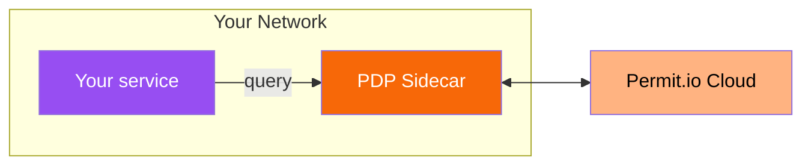
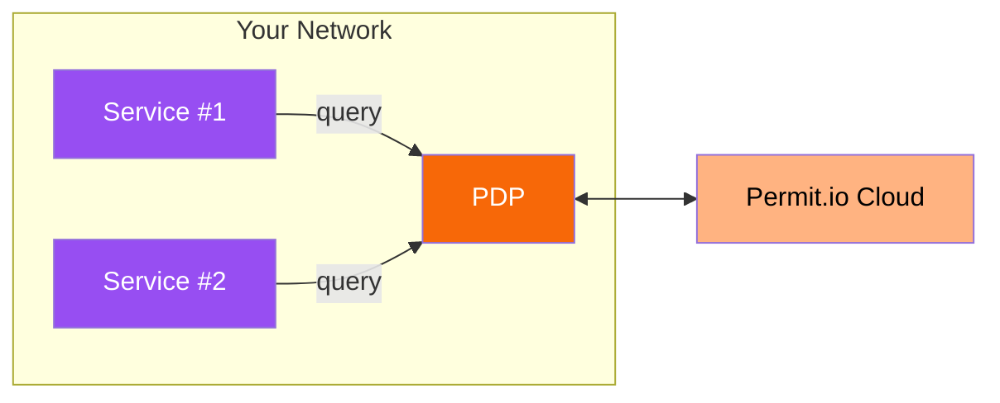
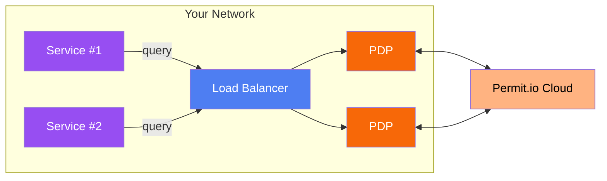
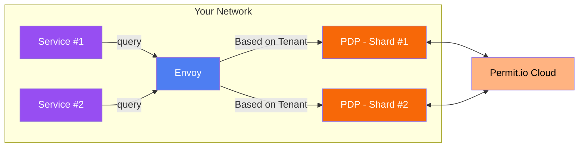

# Permit's PDP (Policy Decision Point)

A PDP is a network node responsible for answering authorization queries using policies and contextual data.
Hence, PDPs should be highly available, performant and physically close to the querying services to minimize latency and ensure high availability.

Permit's PDP essentially becomes your microservice for authorization, bundling together OPA, OPAL and an API Server.

The PDP is easy to install via Docker image, and will ensure **zero-latency, great performance, high availability, and improved security**.
Like all of Permit's customer deployed components, the [Permit PDP is open-source](https://github.com/permitio/PDP) and is available publicly from [Docker hub](https://hub.docker.com/r/permitio/pdp-v2).

## Use the PDP
There are several ways you can use the PDP for testing and enforcement:


### Managed Cloud PDP

Permit.io provides a managed Cloud PDP at `https://cloudpdp.api.permit.io` which is available globally.

When first trying out Permit, you can connect quickly with the cloud PDP.

import Tabs from "@theme/Tabs";
import TabItem from "@theme/TabItem";

<Tabs groupId="language">
<TabItem value="python" label="Python">

```python
from permit import Permit

permit = Permit(
    token="[your-api-key]",
    pdp="https://cloudpdp.api.permit.io",
)
```

</TabItem>
<TabItem value="nodejs" label="Node.js">

```typescript
import { Permit } from "permit";

const permit = new Permit({
  token: "[your-api-key]",
  pdp: "https://cloudpdp.api.permit.io",
});
```
</TabItem>
<TabItem value="go" label="Go">

```go
package main

import "github.com/permitio/permit-golang/pkg/permit"
import "github.com/permitio/permit-golang/pkg/config"

func main() {
    PermitConfig := config.NewConfigBuilder("[your-api-key]")
        .WithPdpUrl("https://cloudpdp.api.permit.io")
        .Build()
    Permit := permit.New(PermitConfig)
}
```

</TabItem>
<TabItem value="java" label="Java">

```java
import io.permit.sdk.Permit;
import io.permit.sdk.PermitConfig;

Permit permit = new Permit(
    new PermitConfig.Builder("[your-api-key]")
        .withPdpAddress("https://cloudpdp.api.permit.io")
        .build()
);
```

</TabItem>
<TabItem value="dotnet" label="DotNet">

```csharp
using Permit;

Permit permit = new Permit(
  "[your-api-key]",
  "https://cloudpdp.api.permit.io"
);
```

</TabItem>
<TabItem value="ruby" label="Ruby">

```ruby
require 'permit'

permit = Permit.new(
  "[your-api-key]",
  "https://cloudpdp.api.permit.io"
)
```

</TabItem>
</Tabs>

:::note
Cloud PDP is limited to RBAC policies only and has a 1MB data restriction. You need to deploy a local PDP for ABAC/ReBAC policies.

We recommend deploying a PDP inside your network for production deployments to minimize network latency and ensure high availability.
:::

### Run a Local PDP With Docker
You can run a PDP on your local machine as a container on [Docker Desktop](https://docs.docker.com/get-docker/). You will need this to use ABAC / ReBAC policies.

To run the PDP use the following command:

```bash
docker run -it \
  -p 7766:7000 \
  --env PDP_API_KEY=<your-permit-api-key> \
  --env PDP_DEBUG=True \
  permitio/pdp-v2:latest
```

In your application code, use the following PDP address in the `Permit` client to perform authorization queries.

<Tabs groupId="language">
<TabItem value="python" label="Python">

```python
from permit import Permit

permit = Permit(
    token="[your-api-key]",
    pdp="http://localhost:7766",
)
```

</TabItem>
<TabItem value="nodejs" label="Node.js">

```typescript
import { Permit } from "permit";

const permit = new Permit({
  token: "[your-api-key]",
  pdp: "http://localhost:7766",
});
```
</TabItem>
<TabItem value="go" label="Go">

```go
package main

import "github.com/permitio/permit-golang/pkg/permit"
import "github.com/permitio/permit-golang/pkg/config"

func main() {
    PermitConfig := config.NewConfigBuilder("[your-api-key]")
        .WithPdpUrl("http://localhost:7766")
        .Build()
    Permit := permit.New(PermitConfig)
}
```

</TabItem>
<TabItem value="java" label="Java">

```java
import io.permit.sdk.Permit;
import io.permit.sdk.PermitConfig;

Permit permit = new Permit(
    new PermitConfig.Builder("[your-api-key]")
        .withPdpAddress("http://localhost:7766")
        .build()
);
```

</TabItem>
<TabItem value="dotnet" label="DotNet">

```csharp
using Permit;

Permit permit = new Permit(
  "[your-api-key]",
  "http://localhost:7766"
);
```

</TabItem>
<TabItem value="ruby" label="Ruby">

```ruby
require 'permit'

permit = Permit.new(
  "[your-api-key]",
  "http://localhost:7766"
)
```

</TabItem>
</Tabs>


## Production Deployment Models

Permit.io supports all PDP layouts and provides the missing layers on-top of open-source PDP solutions (such as OpenPolicyAgent). These layers include policy delivery and updating, supporting data collection, application level SDKs, application level instrumentation and more.

:::info
Custom cloud PDP deployments are available to enterprise tier customers.
Those can include different regions, cloud providers, custom SSL/TLS configurations or other specifications.

Please reach out to us at [support@permit.io](mailto:support@permit.io), or schedule a call via this link: [https://calendly.com/permitio/](https://calendly.com/permitio/)
:::


### Hosted as a Sidecar

The simplest way to integrate PDPs into a microservices architecture is as sidecars;
meaning each microservice has a sidecar container next to it which it can query for policy.

For more information, see the [sidecar deployment guide](/how-to/deploy/overview#sidecar).



### Centralized PDP

You can deploy a centralized PDP to handle authorization queries from multiple services.

This way is simple to set up and manage, but as the number of services grows, the PDP can become a bottleneck.



### Cluster of PDPs

For high availability and scalability, you can deploy a cluster of PDPs behind a load balancer.

You can use our PDP Helm chart to create a Kubernetes deployment with multiple PDPs.
For more information, see the [Deploying using Helm guide](/how-to/deploy/cloud-hosts/helm).



### Sharded PDPs

For truly massive data sets needed in the PDP, you can apply sharding to split the data between multiple PDPs within the same cluster.

This is done by using an [Envoy Server](https://www.envoyproxy.io/docs/envoy/latest/) as proxy to route requests to the relevant PDP based on the tenant.
For more information, see the [Sharded PDPs guide](/how-to/manage-data/pdp-sharding).



## PDP Caching Mechanism

The PDP server includes a configurable caching mechanism that significantly improves performance by reducing redundant policy evaluations. 
When enabled, the cache stores results of policy decisions with a configurable time-to-live (TTL), providing performance benefits for frequently evaluated permissions.

You can configure the cache to use either an in-memory store for single instance deployments or Redis for distributed caching across multiple PDP instances. 
Note that while caching significantly improves performance, it may lead to temporarily inaccurate results if permissions change during the cache TTL period.

:::info Available from PDP v0.9.0
PDP caching is currently in Early Access Preview (EAP).
:::

**Supported APIs:**
- ✅ `/user-permissions`
- 🔜 `/allowed` (coming soon)
- 🔜 `/authorized_users` (coming soon)

For detailed configuration options, see the [Cache Configuration](/concepts/pdp/configuration#pdp_cache_store) section.

## Powered by OPA+OPAL

Permit.io's PDP orchestration is powered by [OPAL](https://opal.ac) - an open source project - developed by the team at Permit.io and supported by a large community of developers and users.
Check out this talk with the primary authors of OPAL to learn more about the unique realtime architecture:

<iframe
	width="560"
	height="315"
	src="https://www.youtube.com/embed/A5adHlkmdC0"
	title="YouTube video player"
	frameborder="0"
	allow="accelerometer; autoplay; clipboard-write; encrypted-media; gyroscope; picture-in-picture"
	allowfullscreen
></iframe>

OPAL's built-in [separation of the data plane from the control plane](/concepts/control-plane-and-data-plane), enables Permit.io users to enjoy the benefits of a fully distributed PDP solution, without having to be dependant on the availability of the Permit.io cloud, or sharing any data with it.
