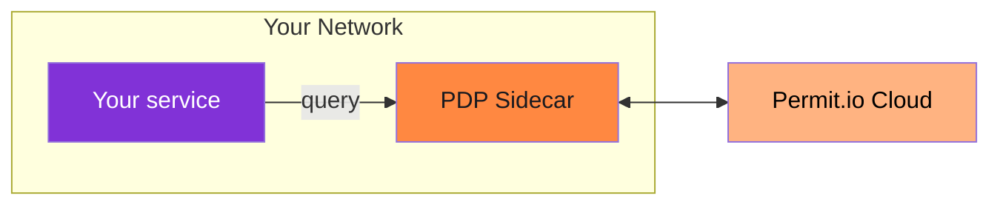
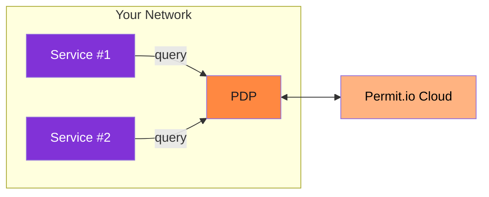
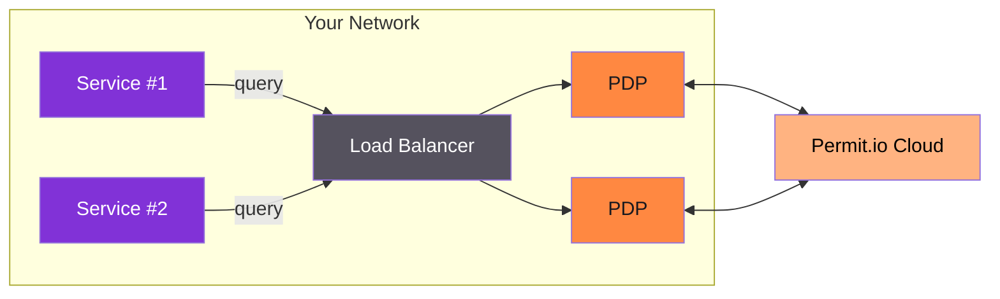

import Tabs from "@theme/Tabs";
import TabItem from "@theme/TabItem";

A policy decision point (PDP) is the Permit.io service that answers authorization queries from your application, using your policies and data. This page is for developers who choose a PDP type, connect an SDK to it, and look up PDP caching and AuthZen API behavior.

Every permission check your application makes goes to a PDP, so a PDP needs to be available and close to the services that query it. When a self-hosted PDP runs as a sidecar on the same host as your service, checks travel over the loopback interface, so they carry no network latency and stay in the sub-millisecond range. The self-hosted [Edge PDP is open source](https://github.com/permitio/PDP) and available on [Docker Hub](https://hub.docker.com/r/permitio/pdp-v2).

## PDP deployment types: Cloud, Edge, and Nexus \{#pdp-deployment-types-cloud-vs-edge}

Permit offers three PDP types. All three answer the same permission checks for the policies you define in Permit.

| PDP type | Where it runs | Choose it when you need |
| --- | --- | --- |
| **Managed Cloud PDP** | Hosted by Permit at `https://cloudpdp.api.permit.io` | Fast onboarding and production role-based access control (RBAC) or relationship-based access control (ReBAC) without running infrastructure |
| **Edge PDP** (container PDP, `permitio/pdp-v2`) | Your VPC, Kubernetes cluster, or VMs, as a sidecar, a centralized service, or a cluster | Attribute-based access control (ABAC), custom data sources, read-your-own-writes, PDP-level callbacks and health checks, or low latency inside your own network |
| **Permit Nexus PDP** (`permitio/pdp-v3`) | Your network, one container per Permit environment | Large data sets, relationship-heavy ReBAC, and decisions that never depend on reaching Permit |

Most teams start with the managed Cloud PDP, then add Edge PDPs for latency-sensitive workloads or for capabilities the Cloud PDP does not support.

The Edge PDP bundles three components in one container: Open Policy Agent (OPA), the Open Policy Administration Layer (OPAL) client, and an API server.

## Nexus PDP

[Permit Nexus PDP](/concepts/pdp/nexus-pdp) is a self-hosted PDP with an embedded on-disk database. It is an additional deployment option, not a replacement for the Edge PDP. You run one Nexus PDP container per Permit environment in your own network. Nexus PDP keeps a local copy of that environment's policy and data on disk and answers checks with no network call in the decision path. See the [Nexus PDP product overview](https://www.permit.io/nexus-pdp).

Nexus PDP differs from the Edge PDP in four ways:

- **Data on disk, not in memory.** The Edge PDP holds your data in OPA's in-memory JSON document, so a large environment needs a large PDP. Nexus PDP stores the data in an embedded database on disk and keeps a cache of configurable size in memory.
- **A store built for relationship queries.** Nexus PDP keeps relationship data in a database built for graph traversal, which OPA queries over loopback while it evaluates policy.
- **Sync that resumes after disconnection.** Each update contains the changed data, and the control plane keeps each Nexus PDP's unacknowledged changes until that PDP applies them. A reconnecting Nexus PDP does not fetch its data again.
- **Decisions during control-plane outages.** If the control plane is unreachable, Nexus PDP keeps answering from its local copy and reports how stale the copy is.

Nexus PDP supports RBAC, ReBAC with role derivation, and multi-tenancy through the same check, bulk check, user permissions, authorized users, and AuthZen endpoints as the Edge PDP. Its capabilities match the managed Cloud PDP, running in your network. ABAC, policy as code, local facts, URL-based enforcement, and custom data sources require the Edge PDP. Both PDP types connect to the same Permit environment, so you can run them side by side. For the full comparison, see [Nexus PDP feature parity](/concepts/pdp/nexus-pdp-feature-parity).

:::info Nexus PDP availability
As of September 2026, Nexus PDP is in early access and Permit enables it per account. To request access, [book a call with Permit](https://www.permit.io/demo).
:::

Read more about Nexus PDP: [architecture](/concepts/pdp/nexus-pdp-architecture), [how Nexus PDP syncs data](/concepts/pdp/nexus-pdp-how-it-works), [deployment](/concepts/pdp/nexus-pdp-deployment), and [configuration](/concepts/pdp/nexus-pdp-configuration).

## Managed Cloud PDP

Permit runs a managed Cloud PDP at `https://cloudpdp.api.permit.io`. You can use the Cloud PDP to try Permit, and you can keep using it in production for RBAC and ReBAC workloads.

To connect an SDK to the Cloud PDP, set the PDP URL to `https://cloudpdp.api.permit.io` and replace `[your-api-key]` with your environment API key ([Get your API key](/overview/get-api-key)):

<Tabs groupId="language">
<TabItem value="python" label="Python">

```python
from permit import Permit

permit = Permit(
    token="[your-api-key]",
    pdp="https://cloudpdp.api.permit.io",
)
```

</TabItem>
<TabItem value="nodejs" label="Node.js">

```typescript
import { Permit } from "permit";

const permit = new Permit({
  token: "[your-api-key]",
  pdp: "https://cloudpdp.api.permit.io",
});
```
</TabItem>
<TabItem value="go" label="Go">

```go
package main

import "github.com/permitio/permit-golang/pkg/permit"
import "github.com/permitio/permit-golang/pkg/config"

func main() {
    PermitConfig := config.NewConfigBuilder("[your-api-key]")
        .WithPdpUrl("https://cloudpdp.api.permit.io")
        .Build()
    Permit := permit.New(PermitConfig)
}
```

</TabItem>
<TabItem value="java" label="Java">

```java
import io.permit.sdk.Permit;
import io.permit.sdk.PermitConfig;

Permit permit = new Permit(
    new PermitConfig.Builder("[your-api-key]")
        .withPdpAddress("https://cloudpdp.api.permit.io")
        .build()
);
```

</TabItem>
<TabItem value="dotnet" label="DotNet">

```csharp
using Permit;

Permit permit = new Permit(
  "[your-api-key]",
  "https://cloudpdp.api.permit.io"
);
```

</TabItem>
<TabItem value="ruby" label="Ruby">

```ruby
require 'permit'

permit = Permit.new(
  "[your-api-key]",
  "https://cloudpdp.api.permit.io"
)
```

</TabItem>
</Tabs>

:::note Cloud PDP supports RBAC and ReBAC, not ABAC
The Cloud PDP evaluates RBAC and ReBAC policies. The Cloud PDP does not evaluate ABAC policies. For capabilities and limits, see [Cloud PDP capabilities](/concepts/pdp/cloud-pdp-capabilities).

For ABAC policies, read-your-own-writes, or latency-sensitive production deployments, deploy an Edge PDP inside your network.
:::

## Run an Edge PDP with Docker \{#run-an-edge-pdp-with-docker}

Run an Edge PDP as a container on your machine when you need ABAC policies, custom data sources, or read-your-own-writes with [Send Consistent Updates](/how-to/manage-data/local-facts-uploader).

Prerequisites:

- [Docker Desktop](https://docs.docker.com/get-docker/) or another Docker runtime
- Your environment API key ([Get your API key](/overview/get-api-key))

1. Start the Edge PDP. Replace `<your-permit-api-key>` with your environment API key. The command maps the PDP's port `7000` to port `7766` on your machine:

   ```bash
   docker run -it \
     -p 7766:7000 \
     --env PDP_API_KEY=<your-permit-api-key> \
     --env PDP_DEBUG=True \
     permitio/pdp-v2:latest
   ```

2. Confirm the Edge PDP is running: open `http://localhost:7766/healthy`. A healthy PDP returns HTTP `200`.

3. In your application code, set the PDP URL of the `Permit` client to `http://localhost:7766`, and replace `[your-api-key]` with your environment API key:

<Tabs groupId="language">
<TabItem value="python" label="Python">

```python
from permit import Permit

permit = Permit(
    token="[your-api-key]",
    pdp="http://localhost:7766",
)
```

</TabItem>
<TabItem value="nodejs" label="Node.js">

```typescript
import { Permit } from "permit";

const permit = new Permit({
  token: "[your-api-key]",
  pdp: "http://localhost:7766",
});
```
</TabItem>
<TabItem value="go" label="Go">

```go
package main

import "github.com/permitio/permit-golang/pkg/permit"
import "github.com/permitio/permit-golang/pkg/config"

func main() {
    PermitConfig := config.NewConfigBuilder("[your-api-key]")
        .WithPdpUrl("http://localhost:7766")
        .Build()
    Permit := permit.New(PermitConfig)
}
```

</TabItem>
<TabItem value="java" label="Java">

```java
import io.permit.sdk.Permit;
import io.permit.sdk.PermitConfig;

Permit permit = new Permit(
    new PermitConfig.Builder("[your-api-key]")
        .withPdpAddress("http://localhost:7766")
        .build()
);
```

</TabItem>
<TabItem value="dotnet" label="DotNet">

```csharp
using Permit;

Permit permit = new Permit(
  "[your-api-key]",
  "http://localhost:7766"
);
```

</TabItem>
<TabItem value="ruby" label="Ruby">

```ruby
require 'permit'

permit = Permit.new(
  "[your-api-key]",
  "http://localhost:7766"
)
```

</TabItem>
</Tabs>

For health checks, ports, and decision-log settings of a local Edge PDP, see [Run a local authorization microservice](/overview/local-authorization-microservice).

## Production deployment models for Edge PDPs \{#production-deployment-models}

Edge PDPs run inside your own infrastructure. Permit adds the layers that open-source PDPs such as Open Policy Agent lack: policy delivery and updates, data collection, application SDKs, and application instrumentation. To compare layouts and pick one for production, see [Choose a PDP deployment model](/how-to/deploy/overview).

:::info New to PDPs?
Follow this path:

1. [Run your first policy check with the managed Cloud PDP](/overview/perform-policy-check-with-cloud-pdp).
2. [Run a local authorization microservice](/overview/local-authorization-microservice) to deploy an Edge PDP in your own environment.
:::

:::warning When to use an Edge PDP instead of the Cloud PDP
The managed Cloud PDP serves many RBAC and ReBAC production workloads. Use an Edge PDP instead when you need any of these:

- ABAC policies or custom external data sources
- Read-your-own-writes guarantees using [Send Consistent Updates](/how-to/manage-data/local-facts-uploader)
- PDP-level callbacks or health-based consistency hooks into your infrastructure
- Latency targets that you must meet inside your own VPC or on-premises network

For these cases, deploy an Edge PDP as a sidecar, a centralized service, or a cluster close to your applications.
:::

:::info Custom Cloud PDP deployments
To discuss a Cloud PDP deployment in a different region or cloud provider, or with a custom TLS configuration, [book a call with Permit](https://www.permit.io/demo) or write to [support@permit.io](mailto:support@permit.io).
:::

### Hosted as an Edge PDP sidecar \{#hosted-as-an-edge-pdp-sidecar}

In a sidecar layout, each microservice has its own PDP container next to it and sends policy queries to that PDP. For setup, see the [sidecar deployment guide](/how-to/deploy/overview#sidecar-edge-pdp).


```mermaid
flowchart LR
    subgraph Your Network
        pdp[PDP Sidecar]
        app[Your service] -- query --> pdp
    end

    cloud[Permit.io Cloud]
    pdp <--> cloud

    style cloud fill:#ffb381,color:#000;
    style app fill:#8132d7,color:#fff;
    style pdp fill:#ff8841,color:#1a1a1f;
```

### Centralized Edge PDP \{#centralized-edge-pdp}

A centralized Edge PDP answers authorization queries from multiple services. A centralized PDP is quick to set up and manage. As the number of services grows, the single PDP can become a bottleneck.


```mermaid
flowchart LR
    subgraph Your Network
        pdp[PDP]
        app1[Service #1] -- query --> pdp
        app2[Service #2] -- query --> pdp
    end

    cloud[Permit.io Cloud]
    pdp <--> cloud

    style cloud fill:#ffb381,color:#000;
    style app1 fill:#8132d7,color:#fff;
    style app2 fill:#8132d7,color:#fff;
    style pdp fill:#ff8841,color:#1a1a1f;
```

### Cluster of Edge PDPs \{#cluster-of-edge-pdps}

For high availability and scale, run several Edge PDPs behind a load balancer. The PDP Helm chart creates a Kubernetes deployment with multiple PDPs. See [Deploy the PDP with Helm](/how-to/deploy/cloud-hosts/helm).


```mermaid
flowchart LR
    subgraph Your Network
        lb[Load Balancer]
        pdp1[PDP]
        pdp2[PDP]
        app1[Service #1] -- query --> lb
        app2[Service #2] -- query --> lb
        lb --> pdp1
        lb --> pdp2
    end

    cloud[Permit.io Cloud]
    pdp1 <--> cloud
    pdp2 <--> cloud

    style cloud fill:#ffb381,color:#000;
    style app1 fill:#8132d7,color:#fff;
    style app2 fill:#8132d7,color:#fff;
    style pdp1 fill:#ff8841,color:#1a1a1f;
    style pdp2 fill:#ff8841,color:#1a1a1f;
    style lb fill:#55525e,color:#fff;
```

### Sharded Edge PDPs \{#sharded-edge-pdps}

When one Edge PDP cannot hold all the data it needs, split the data between multiple PDPs in the same cluster with sharding. See [Split data across PDPs with sharding or chaining](/how-to/deploy/overview#deploy-as-a-cluster-with-sharding--chaining).

## PDP caching mechanism \{#pdp-caching-mechanism}

The Edge PDP can cache policy decisions for a configurable time to live (TTL), so repeated checks skip policy evaluation. Caching is off by default.

| Cache store | Use it for |
| --- | --- |
| In-memory | A single PDP instance |
| Redis | Sharing cached decisions across multiple PDP instances |

The cache applies to these endpoints:

| Endpoint | Cache behavior |
| --- | --- |
| `/allowed` | Caches each check |
| `/allowed/bulk` | Caches each check in the bulk request, and shares cache entries with `/allowed` |
| `/user-permissions` | Caches each query |
| `/authorized_users` | Caches each query |

:::warning Cached decisions can be stale
If a permission changes while a decision for it is cached, the PDP returns the old decision until the cache entry's TTL expires.
:::

To turn on caching and set the TTL, see [Cache configuration](/concepts/pdp/configuration#pdp_cache_store).

## AuthZen compatibility \{#authzen-compatibility}

The PDP implements the [OpenID AuthZen Authorization API 1.0](https://openid.github.io/authzen/), a standard API between policy enforcement points (PEPs) and PDPs. Any AuthZen client can send authorization requests to a Permit PDP.

Every AuthZen endpoint requires the header `Authorization: Bearer <API key>`. In the examples below, replace `YOUR_API_KEY` with your environment API key, and `http://localhost:7766` with your PDP URL.

| AuthZen operation | Method and path | Required body fields |
| --- | --- | --- |
| Access evaluation | `POST /access/v1/evaluation` | `subject`, `action`, `resource` |
| Access evaluations | `POST /access/v1/evaluations` | `evaluations`, with `subject`, `action`, and `resource` set at the top level or in each item |
| Subject search | `POST /access/v1/search/subject` | `subject` (with `type`), `action`, `resource` |
| Resource search | `POST /access/v1/search/resource` | `subject`, `action`, `resource` (with `type`) |
| Action search | `POST /access/v1/search/action` | `subject`, `resource` |
| Discovery | `GET /.well-known/authzen-configuration` | None |

### AuthZen access evaluation \{#access-evaluation}

Check whether a subject can perform an action on a resource:

```bash
curl -X POST http://localhost:7766/v1/access/evaluation \
  -H "Content-Type: application/json" \
  -H "Authorization: Bearer YOUR_API_KEY" \
  -d '{
    "subject": { "type": "user", "id": "alice@example.com" },
    "action": { "name": "read" },
    "resource": {
      "type": "document",
      "id": "doc123",
      "properties": { "tenant": "default", "is_public": true }
    },
  }'
```

Response: `{"decision": true}`

:::info Tenant and attributes in AuthZen requests
The PDP reads the `tenant` key from `resource.properties` as the tenant of the check. The PDP passes the other keys in `properties` to the policy as resource attributes for ABAC.
:::

### AuthZen bulk access evaluations \{#bulk-access-evaluations}

Evaluate several access requests in one call. Fields set at the top level, such as `subject`, apply to every item in `evaluations`:

```bash
curl -X POST http://localhost:7766/v1/access/evaluations \
  -H "Content-Type: application/json" \
  -H "Authorization: Bearer YOUR_API_KEY" \
  -d '{
    "subject": {
      "type": "user",
      "id": "alice@example.com",
      "properties": { "department": "engineering" }
    },
    "evaluations": [
      {
        "action": {"name": "read"},
        "resource": {"type": "document", "id": "doc123", "properties": {"tenant": "default"}}
      },
      {
        "action": {"name": "write"},
        "resource": {"type": "document", "id": "doc456", "properties": {"tenant": "default"}}
      }
    ]
  }'
```

Response: `{"evaluations": [{"decision": true}, {"decision": false}]}`

### AuthZen subject search \{#subject-search}

Find the subjects that can perform an action on a resource:

```bash
curl -X POST http://localhost:7766/v1/subjects \
  -H "Content-Type: application/json" \
  -H "Authorization: Bearer YOUR_API_KEY" \
  -d '{
    "action": {"name": "read"},
    "resource": {
      "type": "document",
      "id": "doc123",
      "properties": {"tenant": "default"}
    },
  }'
```

The PDP returns the matching subjects in a `results` array, for example `{"results": [{"type": "user", "id": "alice@example.com"}], "page": {}}`.

### AuthZen resource search \{#resource-search}

Find the resources a subject can access with a given action:

```bash
curl -X POST http://localhost:7766/v1/resources \
  -H "Content-Type: application/json" \
  -H "Authorization: Bearer YOUR_API_KEY" \
  -d '{
    "subject": { "type": "user", "id": "alice@example.com" },
    "action": {"name": "read"},
  }'
```

The PDP returns the matching resources in a `results` array, for example `{"results": [{"type": "document", "id": "doc123"}], "page": {}}`.

### AuthZen action search \{#action-search}

Find the actions a subject can perform on a resource:

```bash
curl -X POST http://localhost:7766/v1/actions \
  -H "Content-Type: application/json" \
  -H "Authorization: Bearer YOUR_API_KEY" \
  -d '{
    "subject": {"type": "user", "id": "alice@example.com"},
    "resource": {
      "type": "document",
      "id": "doc123",
      "properties": {"tenant": "default"}
    },
  }'
```

The PDP returns the permitted actions in a `results` array, for example `{"results": [{"name": "read"}, {"name": "write"}], "page": {}}`.

AuthZen endpoints evaluate the same policies as the other PDP endpoints. A policy change you make in the Permit dashboard or API applies to AuthZen requests after the change reaches the PDP.

## OPA and OPAL in the Edge PDP \{#powered-by-opaopal}

The Edge PDP receives policy and data updates through [OPAL](https://opal.ac), an open-source project that Permit develops with its community. In the talk below, the primary authors of OPAL explain its real-time update architecture.

<iframe
	width="560"
	height="315"
	src="https://www.youtube.com/embed/A5adHlkmdC0"
	title="OPAL architecture talk by the primary authors of OPAL"
	frameborder="0"
	allow="accelerometer; autoplay; clipboard-write; encrypted-media; gyroscope; picture-in-picture"
	allowfullscreen
></iframe>

OPAL separates the [control plane from the data plane](/concepts/control-plane-and-data-plane). The control plane runs in Permit's cloud, and your PDPs run in your network. Your PDPs answer authorization queries from their local policy and data, so decisions don't depend on reaching Permit's cloud at request time.

## Next steps

- [Run your first policy check with the managed Cloud PDP](/overview/perform-policy-check-with-cloud-pdp)
- [Choose a PDP deployment model](/how-to/deploy/overview)
- [Container PDP configuration reference](/concepts/pdp/configuration)
- [Cloud PDP capabilities](/concepts/pdp/cloud-pdp-capabilities)
- [Permit Nexus PDP](/concepts/pdp/nexus-pdp)
