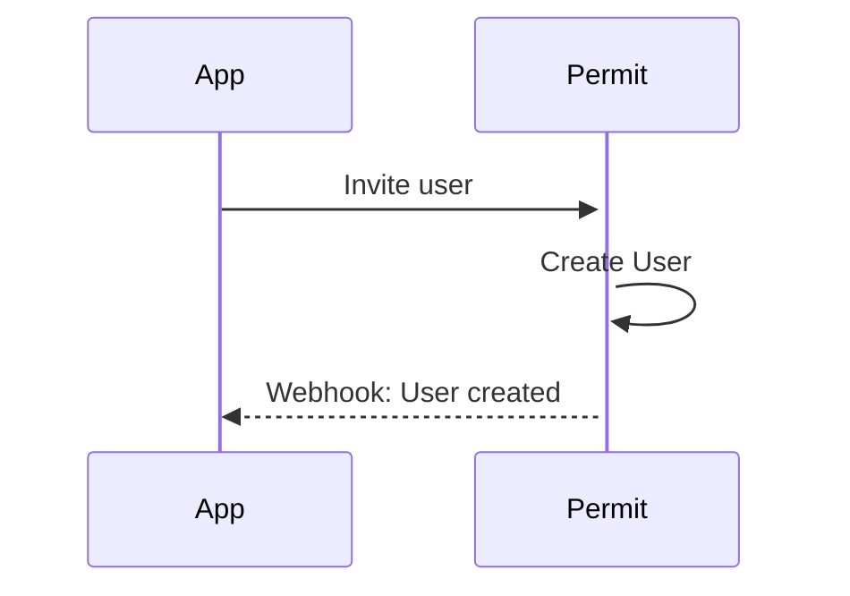
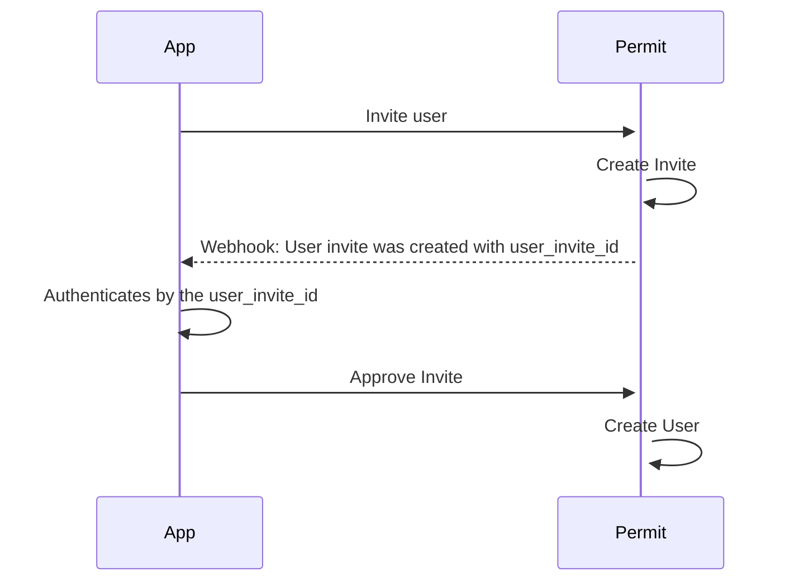

import HelpSupportTile from "@site/src/components/elements/HelpSupportTile.js";
import ActionContainer from "@site/src/components/elements/ActionContainer.js";
import ActionTile from "@site/src/components/elements/ActionTile.js";
import CodeDropdown from "@site/src/components/elements/CodeDropdown.js";
import FlexWrapper from "@site/src/components/elements/FlexWrapper.js";
import code from "@site/src/components/elements/codeBlock.json";

import userManagementElementInstances from "/static/ui-videos/embeddable-uis/user-management-element.mp4";

This guide will help you configure webhooks for your Permit Elements. A webhook is an HTTP request, triggered by a meaningful event that needed to be notified.
The Webhook carry data in 'payloads', which are sent to a webhook URL, essentially an endpoint where your API can accept data.

#### Current flow
In the existing setup, whenever an invite is issued, the system automatically creates a user account. This means that as soon as the webhook is triggered, the user is provisioned without requiring any further action. <br /><br />


#### With the new approve invite flow applied
In the updated design, the behavior of the webhook changes. Instead of creating the user account right away, the system sends out an invite that includes `user_invite_id`. <br /> That invite must then be approved using the provided ```user_invite_id``` before the account is created. This extra approval step introduces a security advantage, since it ensures that only verified and authorized users can complete the process. <br /><br />

### Configure your webhook

With most of the Permit Elements types, you will get the option to configure a webhook to stay informed of the actions that are performed
by the end users, such as creating a new user, approving or denying an Approval/Access request, etc.

__

:::info EXAMPLE
The User Management Element's webhook provides an array of functionalities. For example, you can leverage it to receive
notifications each time a new user is created in your system, or to initiate the sending of a welcome message to recently
invited users.
:::

#### Setting Up the URL Endpoint

Before setting up a URL endpoint, it's important to note that the URL endpoint is the URL to which the webhook delivers data
each time an event occurs. This endpoint should be set up on your server or a third-party service, depending on your preference.


#### Create the Endpoint

Create a new endpoint on your webhook server or within your chosen third-party service. This is often a case of creating a new
URL route. For example, `/new-user-created` or `/request-approval`.

#### Implement Webhook Handling

Your endpoint needs to be able to receive POST requests, as webhooks will typically send data via this method. This
means your endpoint needs to be set up to read the payload from incoming POST requests and then process it as required.
This usually involves parsing JSON, although the exact format may vary.

The expected payload of the webhook will include different fields, depending on the type of event that triggered the webhook.


#### Secure Your Endpoint

Webhooks contain data, and you should ensure it's secure from potential malicious use. Within the Permit configuration screen,
we provide a input box so you can enter your secret, and use it to validate incoming data. This will ensure that the data is coming
from a trusted source. Also, ensure your endpoint uses HTTPS, encrypting data in transit.

__

#### Respond to the Webhook
After receiving a POST request, it's good practice to send a 200 HTTP status code to acknowledge receipt of
the data. If your endpoint fails to do this, the webhook may consider the delivery a failure and retry,
causing unnecessary traffic.

#### Webhook Schemas

##### User Management - Create User
```python
{
    email: str,
    tenant_key: str,
    role: str,
    permission_level: str,
    type: ElementsWebhookType = "create_user"
}
```

##### User Management - Invite User 
###### RBAC
```python
{
    email: str,
    role: str,
    tenant_id: str,
    user_invite_id: str,
    type: ElementsWebhookType = "invite_user"
}
```
###### ReBAC
```python
{
    email: str,
    role: str,
    tenant_id: str,
    user_invite_id: str,
    resource_instance_key: str,
    type: ElementsWebhookType = "invite_user"
}
```
##### User Management - Assign Role to User
```python
{
    user_id: str,
    tenant_id: str,
    role: str,
    permission_level: str,
    type: ElementsWebhookType = "role_assignment"
}
```

##### Access Request Webhook
```python
{
    requesting_user_id: str,
    access_request_details: {
        tenant: str
        resource: str
        resource_instance: str
        action: str
    },
    reason: str | None,
    status: RequestStatus,
    reviewer_user_id: str | None,
    reviewer_comment: str | None
}
```

##### Operation Approval Webhook
```python
{
    requesting_user_id: str,
    operation_approval_details: {
        tenant: str
        resource: str
        resource_instance: str
    },
    reason: str | None,
    status: RequestStatus,
    reviewer_user_id: str | None,
    reviewer_comment: str | None
}
```
