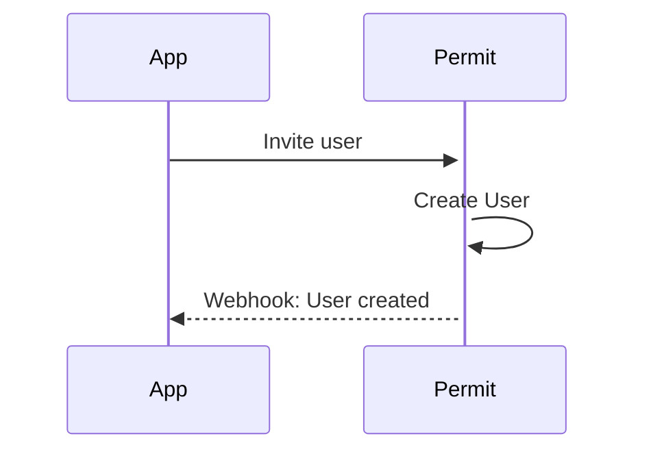
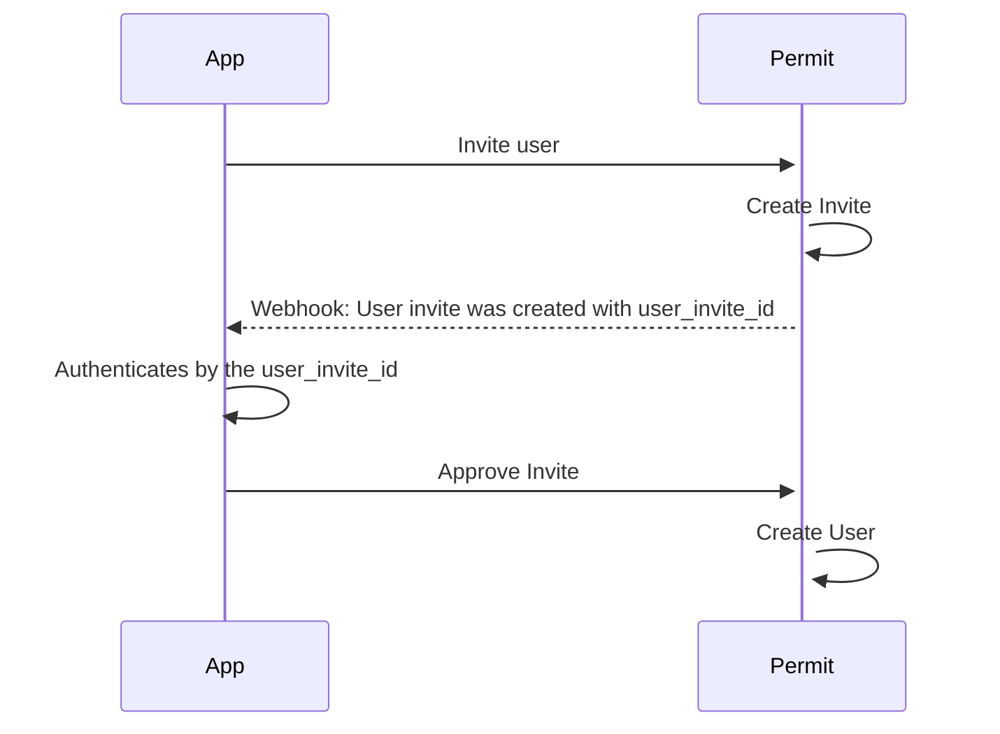

import HelpSupportTile from "@site/src/components/elements/HelpSupportTile.js";

Get an HTTP request in your application each time an end user acts in an element, such as inviting a user or approving an access request. This page is for developers who connect Permit Elements, the embeddable UI components, to their backend. It covers the webhook settings, the endpoint you build, and the payload of each event.

## How element webhooks work

When you turn on webhook notifications for an element, Permit sends a `POST` request with a JSON payload to your webhook URL after each supported event. The payload fields depend on the event type. See [Webhook payload schemas](#webhook-schemas).

For example, you can use the User Management element's webhook to run your own onboarding when a user is created, or to send a welcome message to invited users.

## Prerequisites

- An element created in the Permit dashboard. See [Embed Permit Elements](/embeddable-uis/embedding-elements).
- A server that can receive HTTPS requests from the internet, or a third-party service that receives webhooks.

## Configure your webhook \{#configure-your-webhook}

Most element types have webhook settings in the element form.

1. Open the element in the [Elements](https://app.permit.io/elements) screen.
2. Turn on **Webhook Notification**.
3. In **Webhook URL**, enter the URL of your endpoint, for example `https://example.com/create_user_webhook`.
4. In **Secret**, enter a secret value. Permit uses the secret as a bearer token to authenticate its requests to your endpoint.
5. Click **Save**.


## Build the webhook endpoint \{#setting-up-the-url-endpoint}

### Create the endpoint \{#create-the-endpoint}

Add a route to your server, or create an endpoint in your third-party service, for example `/new-user-created` or `/request-approval`. Serve the endpoint over HTTPS, so the payload and the secret are encrypted in transit.

### Handle the request \{#implement-webhook-handling}

The endpoint accepts `POST` requests. Parse the JSON body, and read the event fields for the element type. The `type` field of User Management payloads names the event.

### Check the secret \{#secure-your-endpoint}

Anyone who knows your webhook URL can send requests to it. Before you process a request, compare the bearer token in its `Authorization` header with the secret you entered in the element settings. Reject requests with a missing or different token.

### Respond to the request \{#respond-to-the-webhook}

Return a `200` status code after you receive the payload. Do slow work, such as sending emails, after you respond.

## User invite flows

A User Management invite follows one of two flows. The webhook type you receive tells you which flow applied: `create_user` or `invite_user`.

### Invite creates the user \{#current-flow}

Permit creates the user as soon as the invite is sent, and the webhook reports the created user.


```mermaid
sequenceDiagram
    App->>+Permit: Invite user
    Permit->>+Permit: Create User 
    Permit-->>App: Webhook: User created
```

### Invite requires approval \{#with-the-new-approve-invite-flow-applied}

Permit creates a pending invite and sends an `invite_user` webhook with a `user_invite_id`. The user doesn't exist until your application approves the invite with that ID. Your application can verify the invited person first, so only users you approve get an account. To approve an invite, see [Approve the invite with the SDK](/embeddable-uis/email-configuration-and-templates#2-approving-the-invited-user-using-an-sdk).


```mermaid
sequenceDiagram
    App->>+Permit: Invite user
    Permit->>+Permit: Create Invite 
    Permit-->>App: Webhook: User invite was created with user_invite_id
    App->>App: Authenticates by the user_invite_id 
    App->>Permit: Approve Invite
    Permit->>Permit: Create User
```

## Webhook payload schemas \{#webhook-schemas}

The schemas list each payload field with its type in Python type notation. `str | None` marks a field that can be `null`.

### User Management: create user \{#user-management---create-user}

```python
{
    email: str,
    tenant_key: str,
    role: str,
    permission_level: str,
    type: ElementsWebhookType = "create_user"
}
```

### User Management: invite user \{#user-management---invite-user-}

The payload includes `resource_instance_key` when the element uses ReBAC (relationship-based access control).

#### RBAC invite \{#rbac}

```python
{
    email: str,
    role: str,
    tenant_id: str,
    user_invite_id: str,
    type: ElementsWebhookType = "invite_user"
}
```

#### ReBAC invite \{#rebac}

```python
{
    email: str,
    role: str,
    tenant_id: str,
    user_invite_id: str,
    resource_instance_key: str,
    type: ElementsWebhookType = "invite_user"
}
```

### User Management: assign role to user \{#user-management---assign-role-to-user}

```python
{
    user_id: str,
    tenant_id: str,
    role: str,
    permission_level: str,
    type: ElementsWebhookType = "role_assignment"
}
```

### Access Request \{#access-request-webhook}

Permit sends this payload for access requests from the [Access Request element](/embeddable-uis/element/access-request). `status` is one of `pending`, `approved`, `denied`, or `canceled`.

```python
{
    requesting_user_id: str,
    access_request_details: {
        tenant: str
        resource: str
        resource_instance: str
        action: str
    },
    reason: str | None,
    status: RequestStatus,
    reviewer_user_id: str | None,
    reviewer_comment: str | None
}
```

### Operation Approval \{#operation-approval-webhook}

Permit sends this payload for requests from the [Operation Approval element](/embeddable-uis/element/operation-approval). `status` takes the same values as in the Access Request payload.

```python
{
    requesting_user_id: str,
    operation_approval_details: {
        tenant: str
        resource: str
        resource_instance: str
    },
    reason: str | None,
    status: RequestStatus,
    reviewer_user_id: str | None,
    reviewer_comment: str | None
}
```

## Related pages

- [Email Configuration and Templates](/embeddable-uis/email-configuration-and-templates): send invites by email and approve them with the SDK.
- [Access Request API](/api/elements/access-requests): read and act on access requests from your backend.
- [Operation Approval API](/api/elements/operation_approval): read and act on operation approvals from your backend.

<HelpSupportTile />
