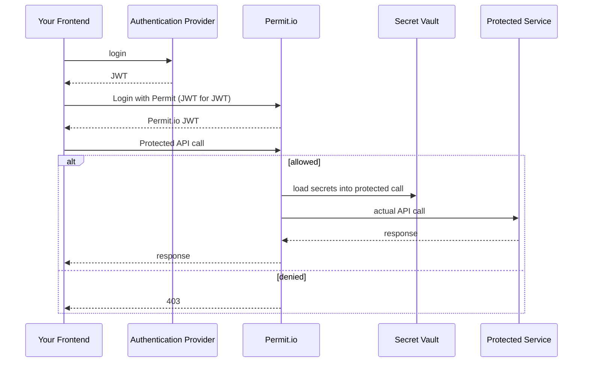

<div style={{ display: "flex", justifyContent: "center" }}>
	
</div>

Frontend-only-Authorization (FoAz) is a method allowing frontend applications to enforce protected access to APIs without requiring a dedicated backend.
FoAz allows frontend developers to securely use sensitive resources directly from the frontend, while gating for permissions and without exposing any secrets or sensitive data.

<div className="video-container">
	<iframe
		src="https://www.youtube.com/embed/ft8HX-S8Duk"
		title="YouTube video player"
		frameBorder="0"
		allow="accelerometer; autoplay; clipboard-write; encrypted-media; gyroscope; picture-in-picture"
		allowFullScreen
	></iframe>
</div>

## Isn't Frontend Authorization an Oxymoron ?

It sure sounds like it, but no - it works, it's easy, and it's super safe.

The "trick" is that it's frontend-only in the same sense that Serverless has no servers.
There is a backend component which actually enforces the access, you just don't have to build it - Permit.io provides it for you - so you can focus on building your awesome app.

## What is FoAz Good for ?

Foremost FoAz is about rapid secure app development; specifically there are two core use cases.

- ### Access 3rd Party Services

  ```mermaid
  flowchart LR
      Frontend --protected API call--> proxy.Permit.io
      proxy.Permit.io --"permit.check() + inject secrets"--> p["Protected Service (e.g. Twilio)"]
      p --response-->proxy.Permit.io
      proxy.Permit.io --response-->Frontend
  ```

  Web applications often consume external services to implement their features; for example an app might use Twilio to send an invite via SMS, Stripe to bill the user, AWS S3 to fetch the user profile, or Mailchimp to notify them of user activities.
  All of these would require a secret or API token; coupled with the App developers account, and would often cost money to use.

  Without FoAz a developer would have to deploy a backend service to accept the frontend requests, verify the session identity, check for permissions, and invoke the external API along with it's associated secret.
  With FoAz a developer can simply call the external service directly from the frontend, knowing that Permit will verify the identity, check for permissions, and add the needed secrets for them.

- ### Adding Authorization on top of Your API

  ```mermaid
  flowchart LR
      Frontend --protected API call--> proxy.Permit.io
      proxy.Permit.io --"permit.check()"--> p["Your app [secret route]"]
      p --response-->proxy.Permit.io
      proxy.Permit.io --response-->Frontend
  ```

  Be it legacy code, new code, or an app still being developed, your homebrew authorization probably doesn't meet the standard you need from it.
  While we'd always encourage you to deploy Permit as part of your backend to make your application's authorization truly future-proof, we understand the importance of RND velocity.

  FoAz can be used to wrap and protect your API, adding more complex policies (e.g. RBAC, ABAC, ReBAC) and access-control interfaces (e.g. audit-logs, user-management), without having to change a single line of backend code.

  :::info
  To use this securely you still need to add a secret between Permit and your API,
  but this can even be just a separate route (e.g. `your-api.com/permit-secret-guid/resource`), or gated by a API-gateway or reverse-proxy.
  :::

## How does FoAz Work?

FoAz uses Permit.io as the backend component to check and enforce access to the protected API or resource.
Permit.io acts as a proxy between your frontend, and the end resource - adding JWT verification, permission checks, and injecting the end target secrets.

Arguably FoAz is actually more secure than a proprietary backend you'd build from scratch; as it ensures policies are always in place; and audit logs are automatically generated.

### Communication Sequence Diagram



## When can I start using FoAz ?

The feature is currently only available in early access to a select few.

[Subscribe here to get early access](https://hello.permit.io/foaz-ea).

Join the conversation in our [ Slack community](https://io.permit.io/join_community) at the [#frontend-only-authz](https://permit-io.slack.com/archives/C04U83ZABRD) channel.

[](https://io.permit.io/join_community)
