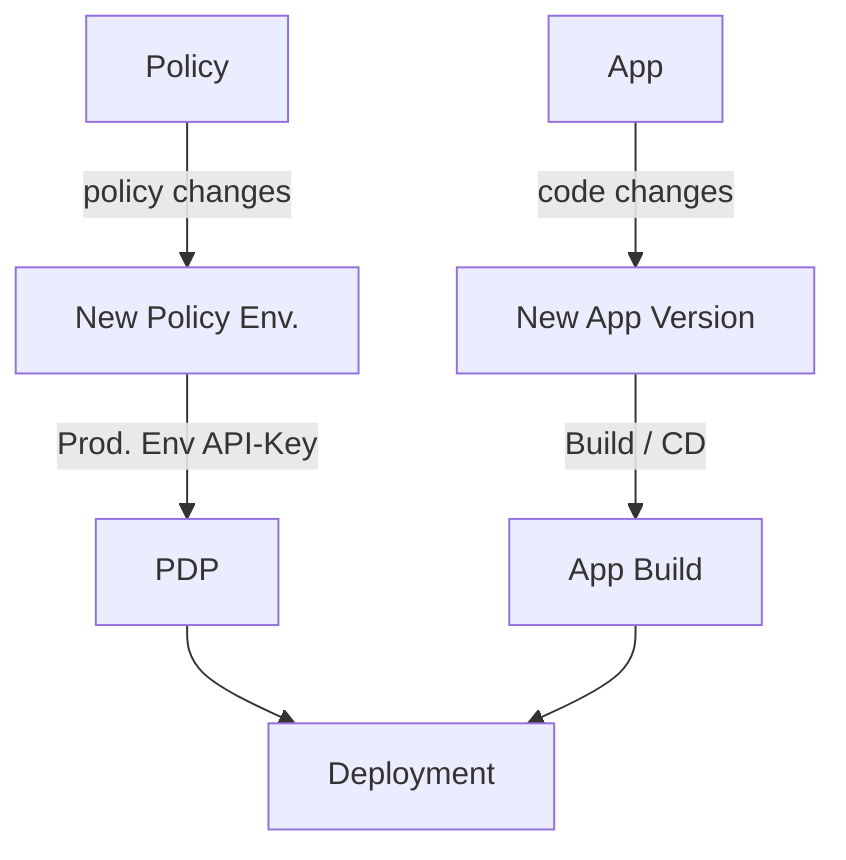
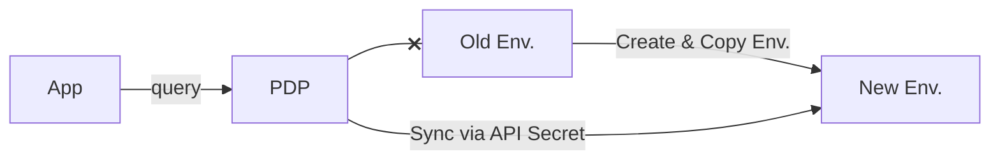
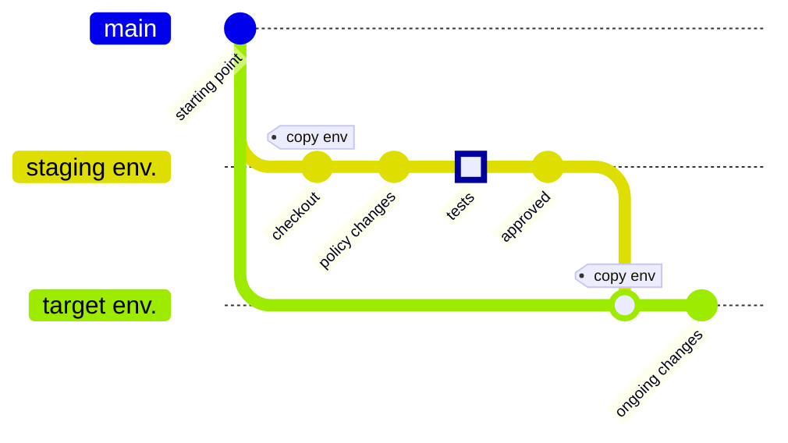

Promote authorization policy changes from development to production the way a continuous integration and continuous deployment (CI/CD) pipeline promotes code. This page is for platform engineers and developers who design the pipeline. It explains how Permit environments map to pipeline stages, and which API calls and Permit CLI commands run each stage.

## How CI/CD works in Permit \{#cicd-in-permit}

Permit models the policy life cycle with [projects and environments](/manage-your-account/projects-and-env):

- **Continuous integration (CI):** each pipeline stage works in its own environment. You create and copy environments with the [Environments API](https://api.permit.io/v2/redoc#tag/Environments) or the [`permit env` commands](/how-to/permit-cli/permit-cli-envs).
- **Continuous deployment (CD):** each policy decision point (PDP) uses the API key of one environment. The PDP syncs the policy and data of that environment through the Open Policy Administration Layer ([OPAL](https://github.com/permitio/opal)). When the environment changes, the PDPs that use its API key receive the change without a redeploy. To find the API key of an environment, see [Copy and rotate the environment API key](/manage-your-account/projects-and-env#fetching-and-rotating-the-api-key).

## Pipeline stages and the calls that run them

| Stage | Permit API | Permit CLI |
|---|---|---|
| Create a preview or staging environment | `POST /v2/projects/{proj_id}/envs` ([Create Environment](https://api.permit.io/v2/redoc#tag/Environments/operation/create_environment)) | [`permit env create`](/how-to/permit-cli/permit-cli-envs#permit-env-create) |
| Copy the source environment into the preview environment | `POST /v2/projects/{proj_id}/envs/{env_id}/copy` with `target_env.existing` set to the preview environment, or `target_env.new` to create and copy in one call ([Copy Environment](https://api.permit.io/v2/redoc#tag/Environments/operation/copy_environment)) | [`permit env copy`](/how-to/permit-cli/permit-cli-envs#permit-env-copy) |
| Test the policy in the preview environment | Run permission checks against a PDP that uses the preview environment API key | [`permit test run audit`](/how-to/permit-cli/permit-cli-test#permit-test-run-audit) |
| Merge the preview environment into the target environment | `POST /v2/projects/{proj_id}/envs/{env_id}/copy` with `target_env.existing` and `conflict_strategy` | [`permit env copy`](/how-to/permit-cli/permit-cli-envs#permit-env-copy) with `--conflict-strategy` |
| Remove the preview environment | `DELETE /v2/projects/{proj_id}/envs/{env_id}` | [`permit env delete`](/how-to/permit-cli/permit-cli-envs#permit-env-delete) |

For request bodies, the objects a copy includes, and conflict strategies, see [Copy and merge environments](/manage-your-account/creating-environments#coping--merging-environments). For how to test a policy before a merge, see [Test authorization policies](/how-to/SDLC/authz-testing).

## Version control with GitOps \{#version-control-and-consistency-with-gitops}

When you [connect a Permit project to a Git repository](/integrations/gitops/github), each environment maps to a branch of the repository. You edit, review, and merge policy as code in Git, and you keep a Git history of every change to development, staging, and production policy.

You maintain two lines of branches:

- Your application branches, with your application code.
- Your policy branches, which are Permit environments.

The PDP and the policy enforcement points (PEPs) in your application, such as SDKs and API gateways, connect the two lines. The PDP uses the API key of one environment, so the PDP enforces the policy branch of that environment.

:::info Application and policy branches

```mermaid
flowchart TD
    App -->|code changes| NewApp[New App Version]
    Policy --> |policy changes| NewPolicy[New Policy Env.]
    NewPolicy --> |Prod. Env API-Key| PDP
    NewApp --> |Build / CD| Build[App Build]
    PDP --> Deployment
    Build --> Deployment
```

:::

### Move an application to a new policy

To move an application to a new policy, copy the current environment into a new environment, and configure the PDP of the application with the API key of the new environment. The PDP then syncs the new environment instead of the old one.

:::note Move a PDP to a new environment

```mermaid
flowchart LR
    ENV --> |Create & Copy Env.| NewEnv
    PDP --x ENV[Old Env.]
    PDP -- Sync via API Secret --> NewEnv[New Env.]
    App -- query --> PDP
```

:::

## CI flows \{#ci-flows}

Every CI flow starts from a source environment. The flow copies the source environment to a staging or preview environment, where you change, test, review, and approve the policy. The flow then merges the staging or preview environment into the target environment, such as production.

```mermaid
    gitGraph LR:
        commit id:"starting point"
        branch "staging env."
        branch "target env."
        checkout "staging env."
        commit id:"checkout" tag:"copy env"
        commit id:"policy changes"
        commit id:"tests" type: HIGHLIGHT
        commit id:"approved"
        checkout "target env."
        merge "staging env." tag:"copy env"
        commit id:"ongoing changes"
```

Choose one of two CI flows:

| Flow | How it works | Calls |
|---|---|---|
| Staging flow | One long-lived staging environment. You apply and test policy changes in staging, then merge staging into the target environment. | Copy environment |
| Preview environment flow (recommended) | Your pipeline creates a preview environment for each policy pull request, copies the source environment into it, tests it, and merges it into the target environment. | Create environment, then copy environment twice: once from the source environment and once into the target environment |

Use environment access control to limit who can change the policy at each stage. For example, give only the developer who started the CI flow access to the preview environment. See [Manage access to an environment](/manage-your-account/projects-and-env#managing-access-to-an-environment).

## Next steps

- [Copy and merge environments](/manage-your-account/creating-environments#coping--merging-environments)
- [Test authorization policies](/how-to/SDLC/authz-testing)
- [Environment commands in the Permit CLI](/how-to/permit-cli/permit-cli-envs)
- [Set up GitOps with GitHub](/integrations/gitops/github)
