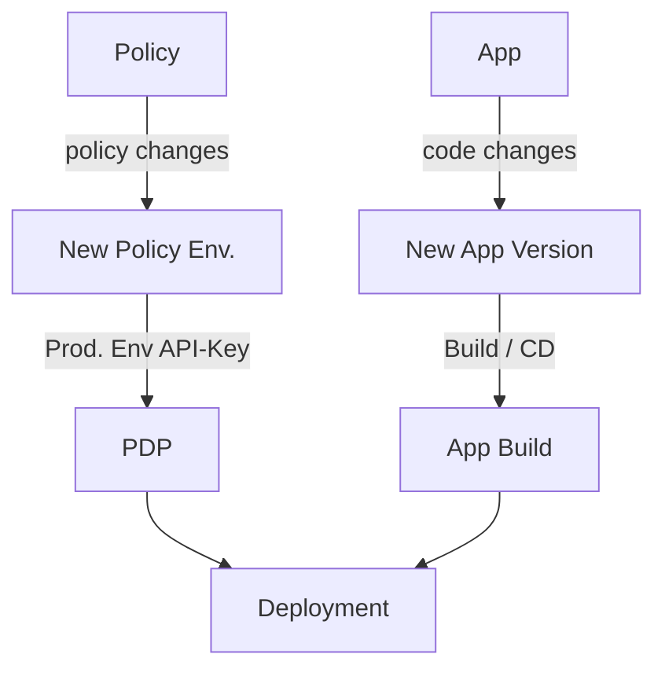
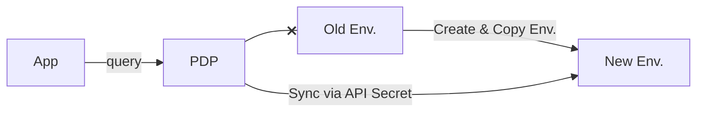
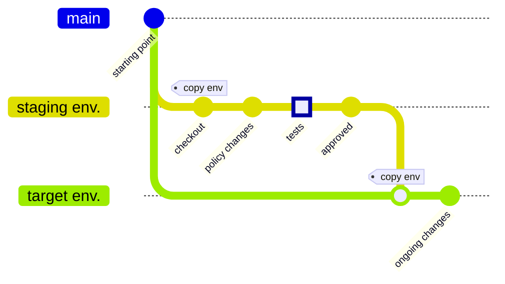

Continuous integration and deployment ensure that your authorization system can adapt quickly to software changes and user requirements.
This practice helps automate the update and deployment processes, which minimizes the risk of errors and maximizes operational efficiency.

Enhancing policy management with Continuous Integration and Continuous Deployment (CI/CD) processes allows us
to maintain a consistent and secure authorization layer. Managing and merging policies into various environments while ensuring
consistency and compliance, syncing them to Git and deployments, and utilizing the power of policy as code allows us to
handle authorization swiftly and effectively.

### CI/CD in Permit

Automating updates and deployments through CI/CD ensures that changes are applied consistently and without human error across all environments.
This automation speeds up the deployment process and enhances security by reducing the risk of misconfigurations.
We primarily manage the policy life cycle as part of a CI process by
using [projects and environments](/manage-your-account/projects-and-env)
together with the [Environment API.](https://api.permit.io/v2/redoc#tag/Environments)
By working with Permit environments for CI, CD is automatically achieved using [OPAL](https://github.com/permitio/opal),
as every environment is automatically deployed to PDPs mapped to them
(via their [API secret key](/manage-your-account/projects-and-env#fetching-and-rotating-the-api-key)).

### Version Control and Consistency with GitOps

Maintaining version control and ensuring consistency across environments is essential when managing complex systems.
Using a Git-like model for environments, where each environment corresponds to a branch, helps teams manage development,
staging, and production configurations separately yet consistently. This approach allows for editing, reviewing,
and merging policies as code within a Git repository, ensuring transparency and collaboration.

We achieve this by allowing you to automatically map branches when you [connect your Permit Project to a repository](/integrations/gitops/github),
facilitating efficient lifecycle management and leveraging Git's robust version control system.

:::info
Note that usually you maintain **two lines of branches** -

- your application branches
- your policy branches (Permit Environments).

These are connected together by the PDP and PEPs (e.g. SDKs, gateways) deployed into your application,
which **use the environment API-secret-keys to sync to a specific env**.

:::

:::note
You can migrate an application to a new policy by simply pointing its PDP to a new environment.

:::

### CI Flows

Every CI flow should start with the source environment, which would be copied to a staging or preview environment,
tested, reviewed, approved, then merged into the target environment (e.g. production).

There are two types of CI flows to consider:

- **Staging flow** - where you have one environment in which you apply policy changes/test before merging into the target environment (e.g. Production).
  This is simply achieved by using the `copy-env` API.
- **Preview Branches flow [Recommended]** - where you dynamically create an environment for each policy "pull-request".
  This is achieved by using both the `create-env` API (to create the Permit Preview Environment) and the `copy-env`
  API (Once to copy from the source environment to the newly created preview environment and once after testing to merge into the target environment (e.g., Production)).

When using these staging or preview environments, you can use each environment's access control to gate who can affect the policy at each stage.
For example, you can give only the developer who triggered the creation of the CI flow access to the preview environment.