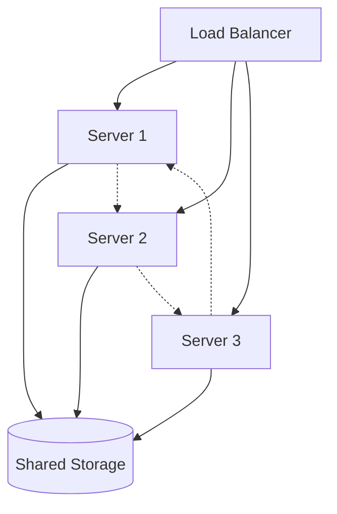

:::info Enterprise Only
This section is only relevant to Enterprise customers who acquired an on-prem license.
:::

# Installation Guide

Detailed installation options for deploying Permit Platform in your environment.

<div className="bg-blue-50 border-l-4 border-blue-400 p-4 my-4">
  <div className="flex">
    <div className="ml-3">
      <p className="text-sm text-blue-700">
        <strong>Prerequisites required:</strong> Make sure you've completed the <a href="/how-to/deploy/on-prem/prerequisites" className="underline">prerequisites setup</a> before starting.
      </p>
    </div>
  </div>
</div>

## Installation Methods

### Interactive Installation (Recommended)

The simplest method - the installer will guide you through all options:

```bash
sudo ./install.sh
```

The installer will prompt for:
- **Deployment size** (Small/Medium/Large)
- **Git repository URL** for policies
- **SSH key path** for Git access
- **Domain configuration** (custom domain or IP access)
- **Multi-server setup** (if applicable)

### Automated Installation

For scripted deployments or when you know your configuration:

```bash
# Single server with custom domain
sudo ./install.sh \
  --size medium \
  --domain "permit.yourcompany.com" \
  --git-repo "git@github.com:yourorg/permit-policies.git" \
  --git-key "./permit-policy-key"

# Single server with IP access (simpler)
sudo ./install.sh \
  --size medium \
  --ip-access \
  --git-repo "git@github.com:yourorg/permit-policies.git" \
  --git-key "./permit-policy-key"
```

### Configuration File Method

For complex configurations or repeatable deployments:

```bash
# Create configuration file
cat > permit-config.yaml << EOF
deployment:
  mode: single
  size: medium
  
git:
  repository: "git@github.com:yourorg/permit-policies.git"
  private_key_path: "./permit-policy-key"
  
networking:
  domain: "permit.yourcompany.com"
  ssl_enabled: true
  
resources:
  backend_replicas: 3
  celery_replicas: 2
EOF

# Install with configuration
sudo ./install.sh --config permit-config.yaml
```

## Multi-Server High Availability

For production environments requiring high availability:

### Architecture Overview



### Step 1: Initialize Cluster

Run on the first server:

```bash
sudo ./install.sh \
  --mode cluster \
  --size large \
  --domain "permit.yourcompany.com" \
  --git-repo "git@github.com:yourorg/permit-policies.git" \
  --git-key "./permit-policy-key"
```

<div className="bg-green-50 border-l-4 border-green-400 p-4 my-4">
  <div className="flex">
    <div className="ml-3">
      <p className="text-sm text-green-700">
        <strong>Important:</strong> Note the join token and server IP displayed at the end of installation.
      </p>
    </div>
  </div>
</div>

### Step 2: Join Additional Servers

Run on each additional server:

```bash
# Use token and IP from step 1
sudo ./install.sh \
  --mode join \
  --server <server-1-ip> \
  --token <join-token-from-step-1>
```

### Recommended HA Configuration

- **3 servers**: Minimum for production failover
- **5 servers**: Enterprise-grade maximum availability  
- **Odd numbers**: Always use odd number of servers for proper clustering

## Installation Process

### What Happens During Installation

1. **System validation** (2-3 minutes)
   - Check server requirements
   - Validate Git access
   - Verify permissions

2. **Infrastructure setup** (3-5 minutes)
   - Install and configure k3s
   - Set up container registry
   - Configure networking

3. **Platform deployment** (2-4 minutes)
   - Deploy all Permit services
   - Configure Git integration
   - Generate security certificates

4. **Final configuration** (1-2 minutes)
   - Set up ingress and load balancing
   - Initialize monitoring
   - Validate deployment

<div className="bg-yellow-50 border-l-4 border-yellow-400 p-4 my-4">
  <div className="flex">
    <div className="ml-3">
      <p className="text-sm text-yellow-700">
        <strong>Total time:</strong> 5-10 minutes for single server, 15-20 minutes for multi-server setup
      </p>
    </div>
  </div>
</div>

## Access Configuration

### Custom Domain Setup

If using a custom domain, ensure your DNS is configured:

```bash
# Your DNS should point to the server(s)
permit.yourcompany.com → <server-ip>

# For multi-server, point to load balancer or all server IPs
```

### IP-Based Access

For simpler deployments, access directly via server IP:

```bash
# Single server
https://<server-ip>

# Multi-server (access any server)
https://<server-1-ip>
https://<server-2-ip>
https://<server-3-ip>
```

## Post-Installation Verification

### Check Platform Status

```bash
# Overall platform health
./scripts/status.sh

# Detailed service status
./scripts/status.sh --detailed

# Resource usage
./scripts/status.sh --resources
```

### Verify Git Integration

```bash
# Test Git connectivity
./scripts/test-git.sh

# Check policy sync status
./scripts/policy-status.sh
```

### Test Web Access

1. Open your browser to the configured URL
2. You should see the Permit Platform setup wizard
3. Complete the initial organization setup

## Configuration Options

### Resource Sizing

Adjust resource allocation based on your needs:

```yaml
# In configuration file
resources:
  backend:
    replicas: 5
    cpu: "1000m"
    memory: "2Gi"
  
  celery:
    replicas: 3
    cpu: "500m" 
    memory: "1Gi"
    
  database:
    cpu: "2000m"
    memory: "4Gi"
    storage: "200Gi"
```

### Security Configuration

```yaml
# Enhanced security options
security:
  ssl_only: true
  strong_passwords: true
  audit_logging: true
  network_policies: true
  
certificates:
  auto_renew: true
  provider: "letsencrypt"  # or "custom"
```

## Recovery and Rollback

### If Installation Fails

```bash
# Clean up partial installation
sudo ./scripts/cleanup.sh

# Retry installation
sudo ./install.sh
```

### Installation Logs

```bash
# View installation logs
tail -f /var/log/permit-install.log

# Check specific component logs
./scripts/logs.sh k3s
./scripts/logs.sh platform
```

---

**Installation complete?** Continue to [Management Guide](/how-to/deploy/on-prem/management) to learn about day-to-day operations.