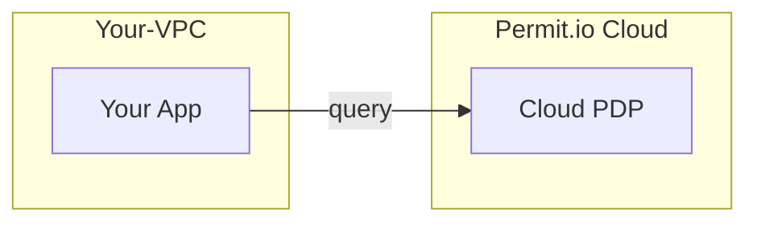
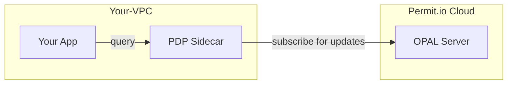
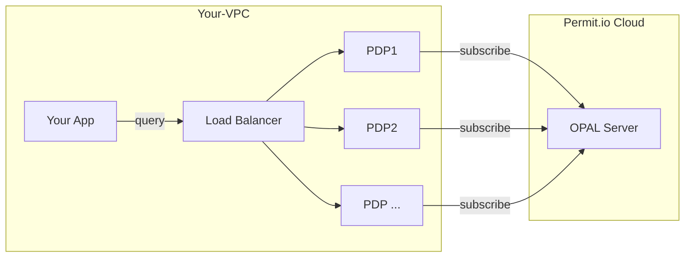
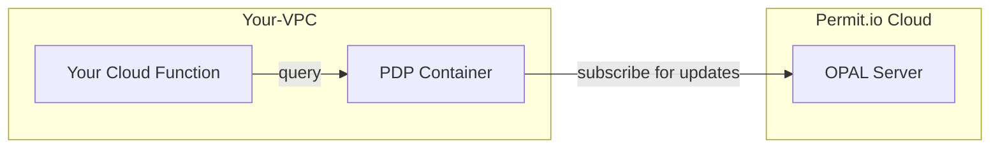
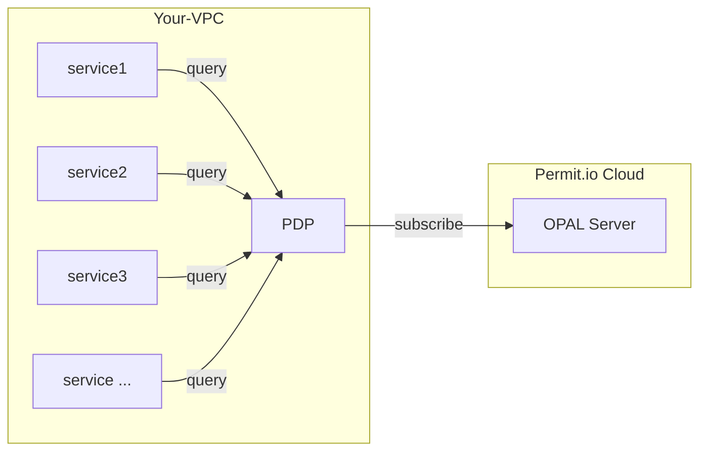

Pick where to run the Permit.io policy decision point (PDP) in production: the Cloud PDP, a sidecar next to each service, a load-balanced cluster, a container beside serverless functions, or one shared PDP. This page is for operators and architects who have [connected an application to Permit](/quickstart) and now plan a production deployment.

## Choose a layout

| Layout | Where the PDP runs | Choose it when |
|---|---|---|
| [Cloud PDP](#cloud-pdp) | In Permit's cloud | You want no PDP to operate, for onboarding or low-operations workloads. |
| [Sidecar](#sidecar-edge-pdp) | One PDP container next to each service | You want the default production setup. This layout scales with your services. |
| [Cluster](#cluster) | Several PDPs behind a load balancer | Your load is very high or changes quickly, or you prefer a shared authorization service. |
| [Serverless](#serverless) | A PDP container in the same VPC as your cloud functions | Your application runs on a serverless platform. |
| [Single PDP](#single-star-pdp) | One PDP for all services | Your data volume is small and one large machine can serve all checks. |

Permit calls customer-hosted PDPs (sidecar, cluster, or a central PDP in your VPC) **Edge PDPs**. Permit recommends an Edge PDP for production.

To run your first Edge PDP container, see [Deploy the PDP to production](/how-to/deploy/deploy-to-production).

## Deployment components \{#deployable-components}

Every deployment has your application and a policy enforcement point (PEP). The other components are optional.

| Component | Required | Notes |
|---|---|---|
| Your application | Yes | The service whose requests need permission checks. |
| [Policy enforcement point (PEP)](/overview/glossary#pep) | Yes | The code that asks for a decision and enforces it: [SDK calls in your frontend or backend](/how-to/enforce-permissions/check), or a [reverse proxy or API gateway](/integrations/gateways/overview). |
| [Policy decision point (PDP)](/overview/glossary#pdp) | Yes, hosted by you or by Permit | Permit hosts the Cloud PDP. For production, run an Edge PDP in your network. |
| Policy Git repository | No | Permit hosts the policy repository by default. Host your own repository to use [GitOps](/integrations/gitops/overview) or to add policy as code by hand. |


## How an Edge PDP stays up to date \{#pdp-deployments}

An Edge PDP opens an outgoing HTTPS WebSocket connection to Permit and subscribes to policy and data updates over it. Updates arrive in the background. They are not part of the path of a permission check, so a check doesn't wait for Permit. The [Permit PDP is open source](https://github.com/permitio/PDP).

### Cloud PDP



When you start with Permit, your SDK sends checks to the Cloud PDP that Permit hosts at `https://cloudpdp.api.permit.io`. Each check travels over the internet to Permit. For supported policy models, rate limits, and features the Cloud PDP doesn't provide, see [Cloud PDP capabilities](/concepts/pdp/cloud-pdp-capabilities).

:::note Custom-hosted PDP deployments
For a hosted PDP in a different cloud region, network setup, or TLS configuration, email [support@permit.io](mailto:support@permit.io) or [book a demo](https://www.permit.io/demo).
:::

### Sidecar (Edge PDP)



In the sidecar layout, you run one PDP container next to each of your microservices, as a sidecar container or a Kubernetes DaemonSet. The number of PDPs grows with the number of service instances.

The sidecar PDP answers checks over loopback, so checks have no network latency. The service keeps getting decisions when the connection to Permit's cloud is down. These are the main reasons to choose an Edge PDP over the Cloud PDP.

#### Run a sidecar PDP in Kubernetes \{#running-the-sidecar-in-kubernetes}

1. Open the PDP API port `7000` on the container. Local Docker examples map this port to `7766` on the host.
2. Optional: open port `8181` to call Open Policy Agent (OPA) inside the PDP directly.
3. Configure health probes on port `7000`. The PDP serves the same health check on `/health`, `/healthy`, and `/ready`. See [Verify the PDP is healthy](/how-to/deploy/deploy-to-production#pdp-health-check-endpoints).

:::info Health check for the PDP container
The PDP container image works with a `wget` health check against `/healthy` on port `7000`:

```bash
wget --no-verbose --tries=1 --spider http://127.0.0.1:7000/healthy || exit 1
```

For Docker Compose, add:

```yaml
healthcheck:
  test: "wget --no-verbose --tries=1 --spider http://127.0.0.1:7000/healthy || exit 1"
```
In Kubernetes, configure probes as shown in [PDP liveness, readiness, and startup probes](/how-to/deploy/cloud-hosts/kubernetes-raw#readiness-probe).
:::

For policy-level health checks and update callbacks, see [OPAL health check policy and update callbacks](https://docs.opal.ac/tutorials/healthcheck_policy_and_update_callbacks/). These checks and callbacks apply to Edge PDPs only. The Cloud PDP doesn't expose its OPAL services.

### Cluster



In the cluster layout, you run several instances of the same PDP, all with the same [environment API key](/manage-your-account/projects-and-env#environments), behind a load balancer. Your services send checks to the load balancer. You scale the number of PDP instances with demand, as with any other microservice.

For most applications, a cluster has little advantage over sidecars. A cluster helps when load is extreme or changes quickly. To reduce latency, place the PDPs on the same nodes as the services that query them, or as close to them as possible.

#### Split data across PDPs with sharding or chaining \{#deploy-as-a-cluster-with-sharding--chaining}

When one PDP can't hold all of the data in memory, split the data:

- **Sharding.** Split data between PDPs in the same cluster by Permit environment or by Open Policy Administration Layer (OPAL) topic. Route each request to the PDP that holds its data, for example with a service mesh.
- **Chaining.** In one PDP's policy, call OPA's `http.send` to fetch missing data from another PDP.

### Serverless



When your application runs on a serverless platform, such as AWS Lambda or GCP Cloud Run functions, run the PDP on your platform's container service in the same VPC. For example, run the PDP on [AWS ECS Fargate](/how-to/deploy/cloud-hosts/aws-ecs-fargate) or [GCP Cloud Run](/how-to/deploy/cloud-hosts/gcp-cloud-run). Checks stay inside the VPC and don't travel to Permit's cloud.

To run the PDP inside the cloud function itself, ask in the [Permit Slack community](https://io.permit.io/slack).

### Single PDP \{#single-star-pdp}

In the single PDP layout, one PDP serves every service in a star topology. The layout fits deployments with little policy data and one machine with enough CPU and memory for all checks. It is less common than sidecars or a cluster. To reduce latency, place the services on the same node as the PDP, or as close to it as possible.



## Next steps

- [Deploy the PDP to production](/how-to/deploy/deploy-to-production)
- [Deploy the PDP on Kubernetes with Helm](/how-to/deploy/cloud-hosts/helm)
- [Keep the PDP running when Permit is unreachable](/how-to/deploy/offline-mode)
- [PDP concepts and architecture](/concepts/pdp/overview)
