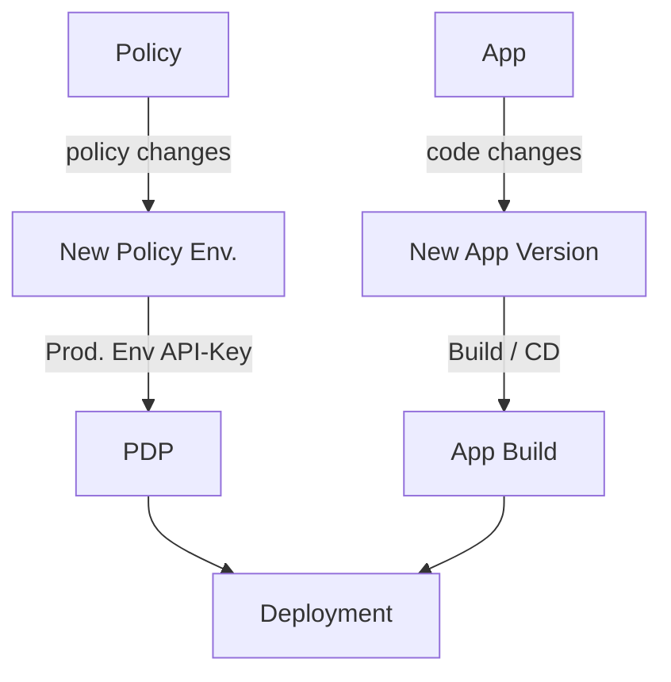
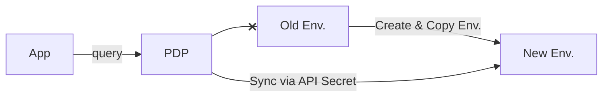
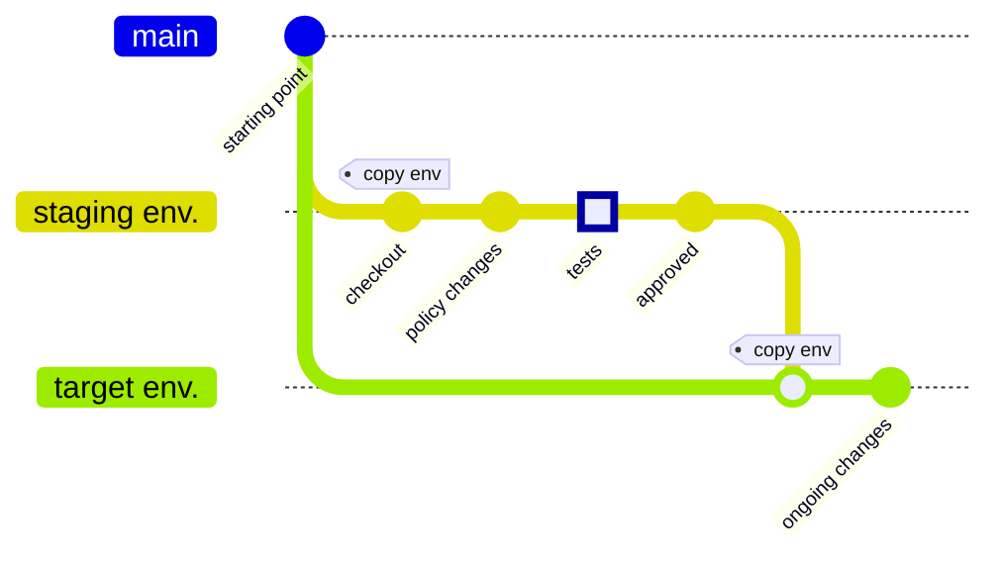

Managing policy at scale can be a daunting task. This is where policy life cycle management comes into play, augmenting your SDLC. 
Manage and merge policies into various environments while ensuring consistency and compliance, sync them to Git and deployments, and test them, using the power of policy as code and continuous integration (CI) / continuous deployment (CD).

## Permit CI / CD
The primary way in Permit to manage policy life cycle as part of a  CI
process is using [projects & environments](/manage-your-account/projects-and-env), 
together with the [Environment API.](https://api.permit.io/v2/redoc#tag/Environments) 
By working with Permit environments for CI, CD is automatically achieved using OPAL, as every environment is automatically deployed to PDPs mapped to them (via their [API secret key](https://docs.permit.io/manage-your-account/projects-and-env#fetching-and-rotating-the-api-key))

### Mapping to Git and Deployments

Think of Permit Environments as Git branches (they are automatically mapped to branches when [connecting your Permit Project to a repository](integrations/gitops/github)). You can have multiple branches representing different deployments (e,g. Staging , UAT, Production) and different stages of development (i.e. dev/staging/preview branches).
:::info
Note that usually you maintain **two lines of branches** -  
- your application branches 
- your policy branches (Permit Environments). 

These are connected together by the PDP and PEPs (e.g. SDKs, gateways) deployed into your application, which **use the environment API-secret-keys to sync to a specific env**.

:::

:::note
You can migrate an application to a new policy by simply pointing its PDP to a new environment.

:::

### CI Flows

Every CI flow would start with the source environment which would be copied to a staging or preview env. , tested, reviewed and approved, and then merged into the target environment (e.g. production)

There are two types of CI flows to consider:

-   A **staging flow** - where you have one environment in which you apply policy changes to / test them before merging into the target environment (e.g. Production).
    This is simply achieved by using the copy-env API

-   A **Preview Branches flow [recommended] **- where you dynamically create an environment for each policy "pull-request". This is achieved by using both the create-env API (to create the Permit Preview Environment), and the copy-env API (once to copy from the source environment to the newly created preview environment, and once after testing to merge into the target environment (e.g. Production).

When using these staging or preview environments you can use each env's access-control to gate who can affect the policy at each stage. For example giving only the developer who triggered the creation of the CI flow access to the preview env.

## Running CI Tests
There are two key types of tests - unit tests and app / integration tests.

### Unit tests
Unit tests can be run using policy as code directly loading and running the policy code directly on your policy engine (e.g. via the `OPA test` [command line](https://www.openpolicyagent.org/docs/latest/policy-testing/))
### App / Integration tests
These are run as part of actual deployments with a PDP, while the PDP is synced to the dev Permit environment. The application tests would run queries against the PDP and test for their expected results.

## Automation

Most of the flows described above can be automated as part of your CI/CD system.
The CI system can be given a Permit Project-level key so it can create environments for devs.
Consider the following triggers and hooks which you can mix and match according to your needs:

-   Create environments:
    -   Developers use CI triggers to create preview branches manually
    -   Upon creating an application pull-request, CI also creates a Permit Environment to match the application branch
    -   CI applies baseline policy changes to every new env created

-   Tests and blocking
    -   CI deploys PDPs for testing policy changes
    -   Developers use CI triggers to run tests
    -   Tests are automatically run before merging environments
    -   CI won't use the copy-env API if tests fail
    -   CI uses the Create / Copy-env API to create a new env and deployment purly to run tests

-   Merge environments
    -   Developers use CI triggers to merge their envs into production once ready; successful tests and approval are sought before merge can succeed
    -   Upon merging a pull-request to production its matching Permit Environment is merged into the Permit Production Environment

---------

## Alternative Policy Life Cycle options

While the Env API is the primary way to manage policy life cycle, you may consider two alternatives instead or even mix/match them.

### 1. Permit Terraform Provider 

Using the [Terraform Provider](/integrations/infra-as-code/terraform-provider) we can:

- Implement changes as Terraform configurations, providing a code-based approach to managing the policy life cycle.
- Merge changes seamlessly across environments to maintain consistency.

:::note
The Terraform provider can be easily mixed in with API/UI by using the terraform provider as the baseline policy configuration for an environment\
:::

### 2. Gitops

[Gitops](/integrations/gitops/overview) enables us to:

- Edit and merge policies directly as code in a Git repository.
- Leverage version control and collaboration features for managing the policy life cycle efficiently.

## Future Enhancements

In the near future, we plan to enhance the user experience by offering these permission management flows directly through our UI.
Our policy editor will empower you to define and implement meta-policies effortlessly,
streamlining the process of ensuring consistent rules and controls across your enterprise.

By adopting these methods and looking forward to upcoming UI enhancements, you can effectively manage the policy life cycle, maintain security and compliance,
and optimize your organization's overall workflow.
