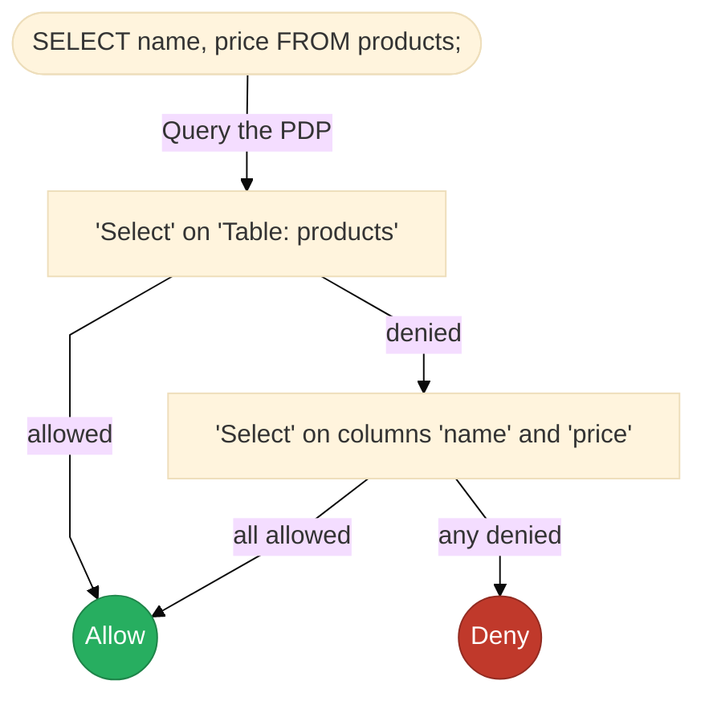
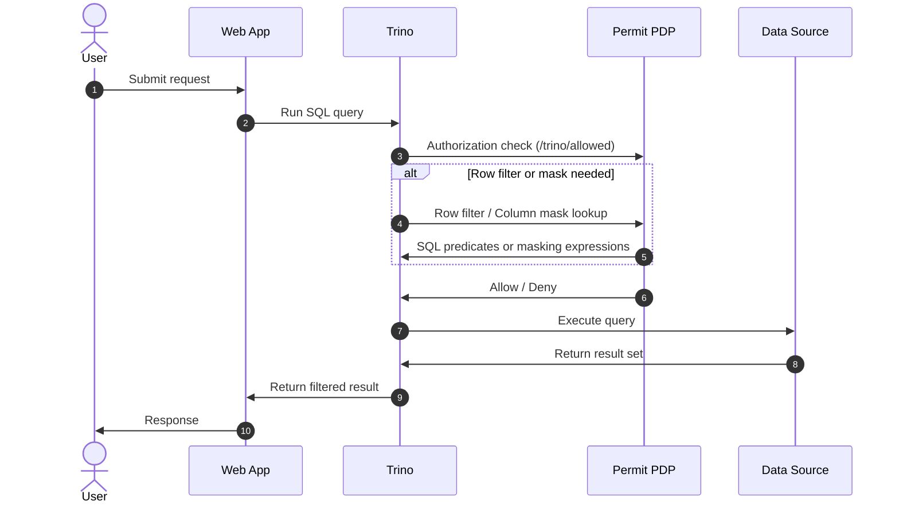

## Overview

Trino is an open-source distributed SQL engine that sits in front of the data you store in your databases.
Because all queries route through a single coordinator, Trino becomes an ideal point for enforcing database-level access control.
You can learn more about Trino in their [official documentation](https://trino.io/docs/current/).

Pairing Trino with Permit's PDP enables you to:

- Centralize database-level permission logic with Permit’s Policy Builder.
- Control access to databases and tables, and even individual columns.
- Filter or mask data before it leaves your databases, based on user permissions.
- Enforce the decision before data leaves your database.
- Audit access to your data using Permit's audit logs.

The integration is most effective for organizations that want to enforce database-level access control across all their databases.
It can apply both to internal users, like analysts accessing data using BI tools, and external users accessing data through APIs
or other applications.

## Quick Start

1. **Prepare Permit**
   - Create a new [Permit environment](/manage-your-account/projects-and-env#creating-a-new-environment) dedicated to the Trino cluster.
   - Copy the PDP API key from the dashboard.
2. **Sync the schema**
   - Install the latest [Permit CLI](/how-to/permit-cli).
   - Run `permit env apply trino --url http://<trino-host>:8080 --user <trino-user>` and point it at a user that can read cluster metadata.
   - The CLI introspects catalogs, schemas, tables, functions, and (optionally) columns, then creates matching resources and actions in Permit.
3. **Deploy the PDP**
   - Run a Permit PDP that targets the same environment. Ensure Trino can reach it (default port `7766`).
   - Enable `PDP_ALLOW_UNAUTHENTICATED_TRINO=True` to allow unauthenticated Trino queries to be checked by the PDP.
4. **Configure Trino to use the PDP for access control**
   - Configure the Trino's `/etc/trino/access-control.properties` to call the PDP:
   ```yaml
   access-control.name=opa
   opa.policy.uri=http://<pdp-host>:7766/trino/allowed
   opa.policy.row-filters-uri=http://<pdp-host>:7766/trino/row-filter
   opa.policy.batch-column-masking-uri=http://<pdp-host>:7766/trino/batch-column-masking
   opa.log-requests=true
   opa.log-responses=true
   ```
   - Restart the Trino coordinator.
5. **Assign policies**
   - Use the [Permit Policy Editor](https://app.permit.io/policy-editor) to grant roles actions such as `trino_sys#ExecuteQuery` and table-level `SelectFromColumns`.
   - Test queries as different users and confirm audit entries appear both in Permit and Trino.
   - Use the [Permit Audit Logs](https://app.permit.io/audit-log) to review the access control decisions.

Want a sandbox that shows the full stack running? Try the public demo: https://github.com/permitio/trino-authz-example

:::warning Warning:
Trino does not currently support passing an API key or credentials when calling external authorization endpoints. 
As a result, you must expose the PDP's Trino authorization routes (such as `/trino/allowed`, `/trino/row-filter`, `/trino/batch-column-masking`) without authentication, by setting `PDP_ALLOW_UNAUTHENTICATED_TRINO=True`.

Because these endpoints are unauthenticated, **do not expose your PDP** to the public internet or any untrusted networks. 
Always deploy the PDP behind a firewall or within a secure, trusted network accessible only by the Trino cluster. 

For more information, follow the [Trino issue](https://github.com/trinodb/trino/issues/27022) on this topic.
:::


## Advanced Access Control

### Column-level Access Control

When Trino asks the PDP whether a query can read a table, the PDP first checks the table resource.
If that fails, it next bulk-checks all columns referenced in the query.

Access is granted only when the user is permitted for **all** required columns.
This allows scenarios where a user lacks table-level permissions but can still read a safe subset of columns.



You can generate Permit column resources automatically with the CLI flag `--create-column-resources`.

### Column-masking

Permit can instruct Trino to mask sensitive column values instead of blocking the query outright. Masks are defined in a YAML file that the PDP reads on startup:

```24:38:trino-authz-example/trino-authz.yaml
columnMasking:
  # This is the table resource name in Permit
  trino_table_postgresql_public_projects:
    columns:
      - column_name: description
        view_expression: "CONCAT(SUBSTRING(description, 1, 10), '...')"
      - column_name: secret_key
        view_expression: "********"

  trino_table_postgresql_public_tasks:
    action: AddColumnMask  # You can customize the action name if you want to
    columns:
      - column_name: description
        view_expression: "CONCAT(SUBSTRING(description, 1, 10), '...')"
```

Masks return only when the user (or role) has the corresponding Permit action. 
You can review the [Audit Logs](https://app.permit.io/audit-log) to see the Permit action checked on the table resource, causing the mask to be applied.

For more information, see the [Trino documentation](https://trino.io/docs/current/security/opa-access-control.html#column-masking).

### Row-level Filtering

Row filters let you attach SQL predicates that Trino appends as `WHERE` clauses based on a user’s permissions:

```4:16:trino-authz-example/trino-authz.yaml
rowFilters:
  # This is the table resource name in Permit
  trino_table_postgresql_public_projects:
    - action: filter_only_active
      expression: "status = 'active'"

  trino_table_postgresql_public_tasks:
    - action: filter_out_todo
      expression: "status != 'todo'"
    - action: filter_only_high
      expression: "priority = 'high'"
```

Each action configured in the YAML is checked against the user's permissions. Any action that is enabled for the user, will be applied to the query.
If multiple filters apply, Trino chains them with `AND`.

You can review the [Audit Logs](https://app.permit.io/audit-log) to see the Permit action checked on the table resource, causing the filter to be applied.

For more information, see the [Trino documentation](https://trino.io/docs/current/security/opa-access-control.html#row-filtering).

## Reference

### Architecture



Every query to Trino triggers a call to the PDP. Permit returns `allow` or `deny`, plus optional filter and masking instructions. If Trino cannot reach the PDP or the PDP errors, Trino denies the query.

### Permit / Trino Resource Mapping

When the Permit PDP receives an authorization request from Trino, it maps the request into a `permit.check()` call. 
The resource name and actions are converted to the corresponding Trino resource and action the user is trying to perform.

All queries are checked with the current Trino user's identity, with permissions on the "default" tenant. 
You can use Trino's several Authentication mechanisms to identify the user, like [JWT](https://trino.io/docs/current/security/jwt.html) or [OAuth2](https://trino.io/docs/current/security/oauth2.html).

By default, if the query does not match any resource or action in Permit, the request is denied. You are not required to create a resource for every table in your database.

#### System Scope

**Resource Name:** `trino_sys`  
**Actions:** `ExecuteQuery`, `ImpersonateUser`, `SetSystemSessionProperty`  

This resource represents the entire Trino system. Actions here apply at the highest level, governing general permissions such as running queries or impersonating users across the cluster.

#### Catalog

**Resource Name:** `trino_catalog_<catalog>`  
**Actions:** `AccessCatalog`, `FilterCatalogs`, `DropCatalog`  

A catalog in Trino represents a data source connection—such as a database or data warehouse. This resource governs access and management permissions for that catalog.

#### Schema

**Resource Name:** `trino_schema_<catalog>_<schema>`  
**Actions:** `ShowSchemas`, `CreateSchema`, `SetSchemaAuthorization`  

A schema organizes database objects within a catalog, grouping related tables. This resource allows control over schema-level actions like listing, creating, or administering schemas.

#### Table / View / Materialized View

**Resource Name:** `trino_table_<catalog>_<schema>_<name>`  
**Actions:** `SelectFromColumns`, `InsertIntoTable`, `FilterColumns`, `SetTableProperties`, custom row-filter and column-mask actions 

This resource covers tables, views, and materialized views within a schema, representing structured sets of data. 
Actions here usually correspond to reading, writing, filtering, or updating attributes of each table-like object.

#### Column (optional)

**Resource Name:** `trino_column_<catalog>_<schema>_<table>_<column>`  
**Actions:** `SelectFromColumns`, custom column-mask actions  

This resource represents a specific column within a table or view, and enables fine-grained access or masking rules at the column level.

#### Function

**Resource Name:** `trino_function_<catalog>_<schema>_<function>`  
**Actions:** `ExecuteFunction`, `CreateFunction`  

A function in Trino is a reusable computation or operation available within a schema. This resource is used to control who can execute or create that function.

#### Procedure

**Resource Name:** `trino_procedure_<catalog>_<schema>_<procedure>`  
**Actions:** `ExecuteProcedure`  

Procedures are database routines in Trino that perform complex operations. This resource represents permission to execute those procedures.


Stick to lowercase keys with underscores. Mismatches cause Permit to view the request as an unknown resource and default to `deny`.

### Permit CLI - Trino schema generation

The Permit CLI can generate the Permit resources for your Trino schema automatically.

```bash
permit env apply trino --url http://<trino-host>:8080 --user <trino-user>

# Usage: permit env apply trino [options]
# 
# Apply permissions policy from a Trino schema, creating resources from catalogs, schemas, tables, columns.
# 
# Options:
#   --api-key [api-key]        API key for Permit authentication
#   -u, --url <url>            Trino cluster URL (e.g., http://localhost:8080)
#   --user <user>              Trino username
#   --password [password]      Trino password or authentication token
#   --catalog [catalog]        Restrict to a specific catalog
#   --schema [schema]          Restrict to a specific schema
#   --create-column-resources  Create individual column resources (default: false) (default: false)
#   -h, --help                 Show help
```

The command will need permissions to read the Trino schema. You can use the `--user` flag to specify a user that has the necessary permissions.

The command only adds resources. Removing a table or column in Trino does not delete the Permit resource automatically; you can remove the resource manually in the Permit UI. 

Modifying the Trino schema, like adding a new table or column, will not automatically update the Permit resources. 
You will need to run the command again to add the new resources. Trino resources that are not mapped to Permit resources will be denied.

### PDP Trino config file

Configuring Trino column-masking and row-filtering is done by mounting the PDP with a config file at `/app/config/trino-authz.yaml`.
You can use a custom path by setting the `PDP_TRINO_AUTHZ_CONFIG_PATH` environment variable.

Example:

```yaml
columnMasking:
  trino_table_postgresql_public_projects:
    columns:
      - column_name: description
        view_expression: "CONCAT(SUBSTRING(description, 1, 10), '...')"
      - column_name: secret_key
        view_expression: "********"
        identity: "john_doe" # Optional, force the mask to be evaluated as the user "john_doe"

  trino_table_postgresql_public_tasks:
    action: AddColumnMask
    columns:
      - column_name: description
        view_expression: "CONCAT(SUBSTRING(description, 1, 10), '...')"

rowFilters:
  trino_table_postgresql_public_projects:
    - action: filter_only_active
      expression: "status = 'active'"
    - action: filter_only_john_doe
      expression: "owner = 'john_doe'"

  trino_table_postgresql_public_tasks:
    - action: filter_out_todo
```

After updating the file, restart the PDP so the changes take effect.

### Trino coordinator configuration

Point Trino’s OPA plugin at the PDP endpoints by updating the `/etc/trino/access-control.properties` file.

```
access-control.name=opa
opa.policy.uri=http://<pdp-host>:7766/trino/allowed
opa.policy.row-filters-uri=http://<pdp-host>:7766/trino/row-filter
opa.policy.batch-column-masking-uri=http://<pdp-host>:7766/trino/batch-column-masking
opa.log-requests=true
opa.log-responses=true
```

After updating the file, restart the coordinator so the plugin reloads its configuration.

## Operational considerations

### Multiple access control systems

Trino supports [multiple access control systems](https://trino.io/docs/current/security/built-in-system-access-control.html#multiple-access-control-systems). 
Using that, you can combine Permit authorization for application users, and Trino's built-in file-based access control for administrative users.

### Trino authentication

You can use Trino's several Authentication mechanisms to identify the user, like [JWT](https://trino.io/docs/current/security/jwt.html) or [OAuth2](https://trino.io/docs/current/security/oauth2.html).

Using it, you can pass-through the user's identity to Trino, so the PDP can check against the application user's identity and permissions.

For more information, see the [Trino authentication documentation](https://trino.io/docs/current/security/authentication-types.html).

### Policy isolation

We recommend using a dedicated Permit project and environments for the Trino cluster authorization. 
This will help you isolate the authorization decisions from the rest of your data.

Your database schema can include many resources and actions. 
Using a dedicated Permit project and environments will help you manage the complexity, follow audit trails, and isolate the authorization decisions from the rest of your data.

Read more about [Permit projects and environments](/manage-your-account/projects-and-env).

### Performance considerations

Database access control is a performance-intensive operation, often requiring high throughput and low latency for policy evaluations.

We recommend the following performance optimizations:
- Use a local PDP to minimize network latency.
- Deploy a dedicated PDP(s) for the Trino cluster.
- Scale the PDP cluster horizontally to handle the load.

For more information, see the [Permit PDP Deployment Models](/concepts/pdp/overview#production-deployment-models) documentation.
