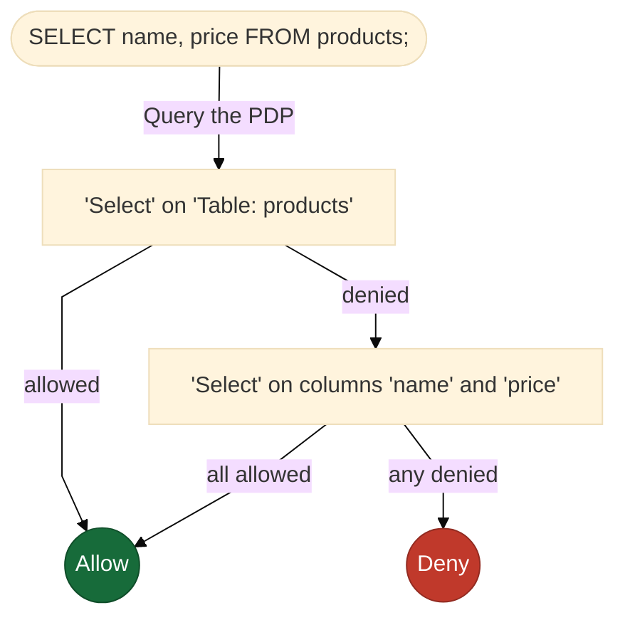
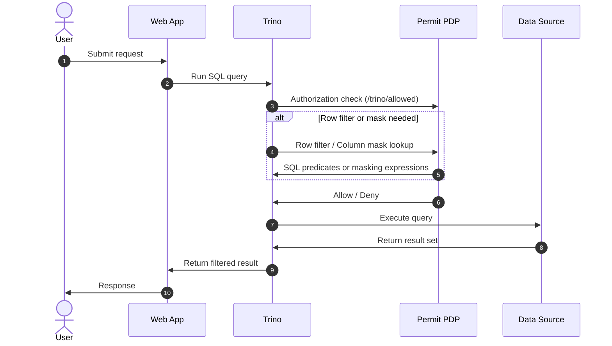

Connect Trino to a Permit.io policy decision point (PDP) so that Permit policies decide which catalogs, schemas, tables, and columns each Trino user can query, which rows they see, and which column values are masked. This guide is for data platform engineers who run a Trino cluster and manage its access control.

[Trino](https://trino.io/docs/current/) is an open-source distributed SQL engine. Every query goes through the Trino coordinator, and Trino's Open Policy Agent (OPA) access control plugin sends an authorization request to a policy endpoint for each query. The Permit PDP serves those endpoints and answers them from the policy in your Permit environment.

With the integration, you can:

- Allow or deny access to catalogs, schemas, tables, columns, and functions with Permit roles and permissions.
- Filter rows with SQL predicates that Permit selects based on the user's permissions.
- Mask column values with SQL expressions that Permit selects based on the user's permissions.
- Review every decision in the Permit audit log.

The same setup covers internal users, such as analysts who use BI tools, and application users whose queries reach Trino through your APIs.

## Prerequisites

- A Trino cluster where you can edit the coordinator configuration and restart the coordinator.
- A Permit.io account. See [Create a Permit.io account](/quickstart).
- The [Permit CLI](/how-to/permit-cli), to create Permit resources from your Trino schema.
- Docker or another way to run the Permit PDP container on a network that Trino can reach. See [Run the PDP container](/how-to/deploy/deploy-to-production#installing-the-pdp).

## Set up Trino access control with Permit \{#quick-start}

### 1. Create a Permit environment for Trino

1. Create a [Permit environment](/manage-your-account/projects-and-env#creating-a-new-environment) dedicated to the Trino cluster. See [Policy isolation](#policy-isolation) for why a dedicated project and environment helps.
2. Copy the environment API key. See [Copy and rotate the environment API key](/manage-your-account/projects-and-env#fetching-and-rotating-the-api-key).

### 2. Create Permit resources from your Trino schema

Run `permit env apply trino`, and point it at a Trino user that can read the cluster metadata:

```bash
permit env apply trino --url http://<trino-host>:8080 --user <trino-user>

# Usage: permit env apply trino [options]
#
# Apply permissions policy from a Trino schema, creating resources from catalogs, schemas, tables, columns.
#
# Options:
#   --api-key [api-key]        API key for Permit authentication
#   -u, --url <url>            Trino cluster URL (e.g., http://localhost:8080)
#   --user <user>              Trino username
#   --password [password]      Trino password or authentication token
#   --catalog [catalog]        Restrict to a specific catalog
#   --schema [schema]          Restrict to a specific schema
#   --create-column-resources  Create individual column resources (default: false) (default: false)
#   -h, --help                 Show help
```

Replace `<trino-host>` with your Trino coordinator host and `<trino-user>` with the Trino user. The CLI reads the catalogs, schemas, tables, and functions in the cluster, and creates a matching resource with actions in your Permit environment. Add `--create-column-resources` to also create a resource for each column. See [Permit CLI Trino options](#permit-cli---trino-schema-generation) for the rest of the flags.

In the Permit dashboard, open **Policy** > **Resources**. Resources with keys such as `trino_sys` and `trino_table_<catalog>_<schema>_<table>` are listed.

### 3. Run the PDP with Trino routes enabled

Run a Permit PDP connected to the same environment, with the environment API key from step 1. Set `PDP_ALLOW_UNAUTHENTICATED_TRINO=True` on the PDP container. The PDP listens on port `7766` by default.

:::warning Trino routes have no authentication
Trino's OPA plugin doesn't send an API key or other credentials to the policy endpoints. With `PDP_ALLOW_UNAUTHENTICATED_TRINO=True`, the PDP serves `/trino/allowed`, `/trino/row-filter`, and `/trino/batch-column-masking` without authentication, so anyone who can reach the PDP can query your authorization decisions.

Run the PDP behind a firewall or in a private network that only the Trino cluster can reach. Never expose this PDP to the public internet. Follow the [Trino issue on credentials for the OPA plugin](https://github.com/trinodb/trino/issues/27022) for API key support.
:::

To filter rows or mask columns, also mount a Trino authorization config file into the PDP. See [PDP Trino config file](#pdp-trino-config-file) and [`PDP_TRINO_AUTHZ_CONFIG_PATH`](/concepts/pdp/configuration#pdp_trino_authz_config_path).

### 4. Point Trino at the PDP

1. Add these lines to `/etc/trino/access-control.properties` on the Trino coordinator. Replace `<pdp-host>` with the host name of the PDP.

   ```properties
   access-control.name=opa
   opa.policy.uri=http://<pdp-host>:7766/trino/allowed
   opa.policy.row-filters-uri=http://<pdp-host>:7766/trino/row-filter
   opa.policy.batch-column-masking-uri=http://<pdp-host>:7766/trino/batch-column-masking
   opa.log-requests=true
   opa.log-responses=true
   ```

2. Restart the Trino coordinator so the OPA plugin loads the configuration.

See [Trino coordinator configuration](#trino-coordinator-configuration) for what each property does.

### 5. Grant permissions in Permit

In the [Policy Editor](https://app.permit.io/policy-editor), or with the Permit API or an SDK, give roles the actions they need. A user needs at least:

- `ExecuteQuery` on the `trino_sys` resource, to run any query.
- `SelectFromColumns` on the table resource, for example `trino_table_postgresql_public_projects`, to read that table.

Then assign the roles to your users. The Permit user key must match the Trino user name.

### 6. Verify the setup

1. Run a query in Trino as a user who has `SelectFromColumns` on the table. The query returns rows.
2. Run the same query as a user who doesn't have the permission. Trino rejects the query with an access denied error.
3. Open the [Permit audit log](https://app.permit.io/audit-log). Each check appears with the Trino user, the action (the Trino operation), and the resource key.

With `opa.log-requests=true` and `opa.log-responses=true`, the Trino server log also shows each request to the PDP and its response.

To see the full stack running locally, clone the [trino-authz-example repository](https://github.com/permitio/trino-authz-example).

## Advanced access control \{#advanced-access-control}

### Column-level access control \{#column-level-access-control}

When Trino asks whether a user can read a table, the PDP first checks the table resource. If the table check denies, the PDP checks the column resource of every column in the query, in one bulk check. The PDP allows the query only when the user has the action on **all** of those columns.

A user without table-level permission can still read a table through the columns they have permission for.


```mermaid
%%{
  init: {
    "theme": "base",
    "themeVariables": { "wrap": "false" },
    "flowchart": {
      "curve": "linear",
      "markdownAutoWrap":"false",
      "wrappingWidth": "600"
    }
  }
}%%
flowchart TD
    Query([SELECT name, price FROM products;])
    TableCheck["'Select' on 'Table: products'"]
    ColumnsCheck["'Select' on columns 'name' and 'price'"]
    Allow((Allow))
    Deny((Deny))

    Query -- Query the PDP --> TableCheck
    TableCheck -- allowed --> Allow
    TableCheck -- denied --> ColumnsCheck
    ColumnsCheck -- all allowed --> Allow
    ColumnsCheck -- any denied --> Deny

    style Allow fill:#176b3a,color:#fff,stroke:#0f4d29
    style Deny fill:#c0392b,color:#fff,stroke:#922b21
```

Column resources exist only if you ran the CLI with `--create-column-resources`, or created them yourself with keys in the form `trino_column_<catalog>_<schema>_<table>_<column>`.

### Column masking \{#column-masking}

Column masking replaces a column's values with the result of a SQL expression instead of denying the query. You define masks in the `columnMasking` section of the [PDP Trino config file](#pdp-trino-config-file), which the PDP reads on startup:

```yaml title="trino-authz.yaml"
columnMasking:
  # This is the table resource name in Permit
  trino_table_postgresql_public_projects:
    columns:
      - column_name: description
        view_expression: "CONCAT(SUBSTRING(description, 1, 10), '...')"
      - column_name: secret_key
        view_expression: "'********'"

  trino_table_postgresql_public_tasks:
    action: AddColumnMask  # You can customize the action name if you want to
    columns:
      - column_name: description
        view_expression: "CONCAT(SUBSTRING(description, 1, 10), '...')"
```

The PDP applies a column's mask when the user has the mask action on the table resource or on the column resource. The mask action is `AddColumnMask` unless you set `action` for the table or for a single column. Grant the mask action to the roles whose values must be masked.

To see which mask action the PDP checked for a query, open the [Permit audit log](https://app.permit.io/audit-log). For how Trino applies masks, see [column masking in the Trino documentation](https://trino.io/docs/current/security/opa-access-control.html#column-masking).

### Row-level filtering \{#row-level-filtering}

A row filter is a SQL predicate that Trino applies to a table like a `WHERE` clause. You define row filters in the `rowFilters` section of the [PDP Trino config file](#pdp-trino-config-file):

```yaml title="trino-authz.yaml"
rowFilters:
  # This is the table resource name in Permit
  trino_table_postgresql_public_projects:
    - action: filter_only_active
      expression: "status = 'active'"

  trino_table_postgresql_public_tasks:
    - action: filter_out_todo
      expression: "status != 'todo'"
    - action: filter_only_high
      expression: "priority = 'high'"
```

For each filter on the table, the PDP checks whether the user has the filter's `action` on the table resource. The PDP returns the expression of every filter the user has permission for. When more than one filter applies, Trino combines them with `AND`.

To see which filter actions the PDP checked for a query, open the [Permit audit log](https://app.permit.io/audit-log). For how Trino applies row filters, see [row filtering in the Trino documentation](https://trino.io/docs/current/security/opa-access-control.html#row-filtering).

#### Filter rows per user with `current_user` \{#user-specific-filtering-with-current_user}

A filter expression can call Trino's [`current_user`](https://trino.io/docs/current/functions/session.html) function to return different rows to different users:

- **Permit** decides **which filter** applies, based on the user's permissions.
- **The SQL expression** decides **which rows** the filter keeps, based on `current_user`.

```yaml
rowFilters:
  # Ensure users have only ONE of `view_all` or `view_own`, not both.
  # If a user has both actions, Trino combines them with AND, resulting in `1=1 AND
  # owner_id = current_user` - which only returns owned records, not all records.
  trino_table_postgresql_public_orders:
    - action: view_all
      expression: "1=1"                        # Admins see everything
    - action: view_own
      expression: "owner_id = current_user"   # Users see only their records
```

Grant `view_all` to admin roles and `view_own` to regular user roles in Permit. When a user queries `orders`, the PDP returns the filter that matches the user's permission.

:::tip
`current_user` returns the user that Trino authenticated. To pass your application user's identity to Trino, configure [Trino authentication](#trino-authentication), for example with a JSON Web Token (JWT).
:::

#### Use subqueries in filter expressions \{#subqueries-in-filter-expressions}

A filter expression can include a subquery:

```yaml
rowFilters:
  trino_table_postgresql_public_documents:
    - action: view_team_data
      expression: "team_id IN (SELECT team_id FROM team_members WHERE user_id = current_user)"
```

Trino runs the subquery at query time, so the user sees the rows of every team the `team_members` table lists for them.

:::warning Multiple filter actions narrow the result
If a user has more than one filter action on a table, Trino combines the filters with `AND`, so the user sees only rows that match every filter. Give each user one filter action per table.
:::

## Reference \{#reference}

### Architecture \{#architecture}


```mermaid
sequenceDiagram
  autonumber
  actor User as User
  participant WebApp as Web App
  participant Trino as Trino
  participant PDP as Permit PDP
  participant Storage as Data Source

  User ->> WebApp: Submit request
  WebApp ->> Trino: Run SQL query
  Trino ->> PDP: Authorization check (/trino/allowed)
  alt Row filter or mask needed
    Trino ->> PDP: Row filter / Column mask lookup
    PDP ->> Trino: SQL predicates or masking expressions
  end
  PDP ->> Trino: Allow / Deny
  Trino ->> Storage: Execute query
  Storage ->> Trino: Return result set
  Trino ->> WebApp: Return filtered result
  WebApp ->> User: Response
```

For every query, Trino calls the PDP. The PDP returns allow or deny, and returns row filter and column mask expressions when Trino asks for them. If the PDP can't evaluate the policy, it returns deny.

| PDP route | Trino property | Returns |
|---|---|---|
| `POST /trino/allowed` | `opa.policy.uri` | Allow or deny for one operation. |
| `POST /trino/row-filter` | `opa.policy.row-filters-uri` | The row filter expressions the user has permission for. |
| `POST /trino/batch-column-masking` | `opa.policy.batch-column-masking-uri` | The column masks the user has permission for. |

### Permit and Trino resource mapping \{#permit--trino-resource-mapping}

The PDP turns each Trino authorization request into a `permit.check()` call:

- **User:** the Trino user name, used as the Permit user key.
- **Action:** the Trino operation name, such as `SelectFromColumns`.
- **Resource:** a resource type key built from the Trino object names, as listed in the table below.
- **Tenant:** always `default`.

If no resource or permission in Permit matches the request, the PDP denies it. Use lowercase keys with underscores, as the PDP builds them. A key that doesn't match counts as an unknown resource, and the PDP denies the request.

| Trino object | Permit resource key | Example actions (Trino operations) |
|---|---|---|
| System, users, and session properties | `trino_sys` | `ExecuteQuery`, `ImpersonateUser`, `SetSystemSessionProperty` |
| Catalog (a data source connection) | `trino_catalog_<catalog>` | `AccessCatalog`, `FilterCatalogs`, `DropCatalog` |
| Schema | `trino_schema_<catalog>_<schema>` | `ShowSchemas`, `CreateSchema`, `SetSchemaAuthorization` |
| Table, view, or materialized view | `trino_table_<catalog>_<schema>_<name>` | `SelectFromColumns`, `InsertIntoTable`, `FilterColumns`, `SetTableProperties`, and your row filter and column mask actions |
| Column (optional, see [column-level access control](#column-level-access-control)) | `trino_column_<catalog>_<schema>_<table>_<column>` | `SelectFromColumns`, and your column mask actions |
| Function or procedure | `trino_function_<catalog>_<schema>_<name>` | `ExecuteFunction`, `CreateFunction`, `ExecuteProcedure` |

To identify users, configure Trino authentication, such as [JWT](https://trino.io/docs/current/security/jwt.html) or [OAuth 2.0](https://trino.io/docs/current/security/oauth2.html). See [Trino authentication](#trino-authentication).

### Permit CLI Trino options \{#permit-cli---trino-schema-generation}

`permit env apply trino` creates Permit resources from a Trino schema. The command output in [step 2](#2-create-permit-resources-from-your-trino-schema) lists every flag.

| Flag | Required | Description |
|---|---|---|
| `--url`, `-u` | Yes | Trino cluster URL, for example `http://localhost:8080`. |
| `--user` | Yes | Trino user. The user needs permission to read the Trino schema. |
| `--password` | No | Trino password or authentication token. |
| `--api-key` | No | Permit environment API key. Without it, the CLI uses your signed-in session. |
| `--catalog` | No | Read only this catalog. |
| `--schema` | No | Read only this schema. |
| `--create-column-resources` | No | Create a resource for each column. Default: `false`. |

The command only creates resources:

- **Tables or columns you add** in Trino don't appear in Permit until you run the command again. Until then, the PDP denies requests on them.
- **Dropped tables or columns** in Trino keep their Permit resources. Delete those resources in the Permit dashboard.

### PDP Trino config file \{#pdp-trino-config-file}

The PDP reads row filters and column masks from a YAML file at `/app/config/trino-authz.yaml`. To use another path, set [`PDP_TRINO_AUTHZ_CONFIG_PATH`](/concepts/pdp/configuration#pdp_trino_authz_config_path). If the file is missing or fails to parse, the PDP starts without row filters and column masks.

Example:

```yaml
columnMasking:
  trino_table_postgresql_public_projects:
    columns:
      - column_name: description
        view_expression: "CONCAT(SUBSTRING(description, 1, 10), '...')"
      - column_name: secret_key
        view_expression: "'********'"
        identity: "john_doe" # Optional, force the mask to be evaluated as the user "john_doe"

  trino_table_postgresql_public_tasks:
    action: AddColumnMask
    columns:
      - column_name: description
        view_expression: "CONCAT(SUBSTRING(description, 1, 10), '...')"

rowFilters:
  trino_table_postgresql_public_projects:
    - action: filter_only_active
      expression: "status = 'active'"
    - action: filter_only_john_doe
      expression: "owner = 'john_doe'"

  trino_table_postgresql_public_tasks:
    - action: filter_out_todo
      expression: "status != 'todo'"
```

`rowFilters` maps a table resource key to a list of filters:

| Field | Required | Description |
|---|---|---|
| `action` | Yes | The Permit action on the table resource that turns on the filter. |
| `expression` | Yes | The SQL predicate Trino applies to the table. |

`columnMasking` maps a table resource key to a mask configuration:

| Field | Required | Description |
|---|---|---|
| `action` | No | The Permit action that turns on the masks for the table. Default: `AddColumnMask`. |
| `columns[].column_name` | Yes | The column to mask. If a column is listed twice, the PDP keeps the first entry. |
| `columns[].view_expression` | Yes | The SQL expression that replaces the column value. |
| `columns[].identity` | No | The Trino user to evaluate the expression as. |
| `columns[].action` | No | An action for this column that overrides the table-level `action`. |

The PDP reads the file only on startup. Restart the PDP after you change the file.

### Trino coordinator configuration \{#trino-coordinator-configuration}

Point Trino's OPA plugin at the PDP routes in `/etc/trino/access-control.properties`:

```properties title="/etc/trino/access-control.properties"
access-control.name=opa
opa.policy.uri=http://<pdp-host>:7766/trino/allowed
opa.policy.row-filters-uri=http://<pdp-host>:7766/trino/row-filter
opa.policy.batch-column-masking-uri=http://<pdp-host>:7766/trino/batch-column-masking
opa.log-requests=true
opa.log-responses=true
```

| Property | Value |
|---|---|
| `access-control.name` | `opa`, to use Trino's OPA access control plugin. |
| `opa.policy.uri` | The PDP's `/trino/allowed` route. |
| `opa.policy.row-filters-uri` | The PDP's `/trino/row-filter` route. Leave it out if you don't use row filters. |
| `opa.policy.batch-column-masking-uri` | The PDP's `/trino/batch-column-masking` route. Leave it out if you don't use column masks. |
| `opa.log-requests`, `opa.log-responses` | `true` to log the requests to the PDP and its responses in the Trino server log. |

Restart the coordinator after you change the file, so the plugin reloads the configuration. For all plugin properties, see [OPA access control in the Trino documentation](https://trino.io/docs/current/security/opa-access-control.html).

## Operational considerations \{#operational-considerations}

### Multiple access control systems \{#multiple-access-control-systems}

Trino can run [more than one access control system](https://trino.io/docs/current/security/built-in-system-access-control.html#multiple-access-control-systems). For example, use Permit for application users, and Trino's built-in file-based access control for administrators.

### Trino authentication \{#trino-authentication}

The PDP checks permissions for the user that Trino authenticated. To check your application user's permissions, pass that user's identity to Trino with a Trino authentication method, such as [JWT](https://trino.io/docs/current/security/jwt.html) or [OAuth 2.0](https://trino.io/docs/current/security/oauth2.html). Row filters that use `current_user` depend on that identity.

#### JWT authentication setup \{#jwt-authentication-setup}

With JWT authentication, your application sends a token to Trino, and Trino uses one claim of the token as the user name. That user name is the value of `current_user` and the Permit user key.

1. Configure JWT authentication in `/etc/trino/config.properties`:

   ```properties
   http-server.authentication.type=JWT
   http-server.authentication.jwt.key-file=https://cluster.example.net/.well-known/jwks.json
   http-server.authentication.jwt.principal-field=sub
   ```

   `principal-field` sets the JWT claim that becomes the Trino user. Common values:

   | Claim | Use when |
   |---|---|
   | `sub` | The standard JWT subject claim holds the user ID. |
   | `user_id` | Your tokens carry the user ID in a custom claim. |
   | `email` | You identify users by email address. |

2. When your application queries Trino, send the JWT in the `Authorization` header:

   ```http
   Authorization: Bearer <jwt-token>
   ```

3. In row filter expressions, `current_user` returns the claim value from the JWT.

:::tip
The claim value must match the values in the column your filter compares with `current_user`. For example, if the `employee_id` column holds UUIDs, set `principal-field` to the claim that holds the user's UUID.
:::

For all authentication methods, see [authentication types in the Trino documentation](https://trino.io/docs/current/security/authentication-types.html).

### Policy isolation \{#policy-isolation}

Use a dedicated Permit project and environments for the Trino cluster. A database schema can produce many resources and actions. A dedicated project keeps them, and their audit logs, apart from your application's policy.

See [Projects and environments](/manage-your-account/projects-and-env).

### Performance considerations \{#performance-considerations}

Trino calls the PDP for every query, and for row filters and column masks, so the PDP adds to query latency.

- Run the PDP close to the Trino coordinator, to cut network latency.
- Run PDPs dedicated to the Trino cluster.
- Scale the PDPs horizontally to handle the query load.

See [PDP deployment models](/concepts/pdp/overview#production-deployment-models).

## FAQ \{#faq}

### Can I combine RBAC or ABAC with row-level filtering? \{#can-i-combine-rbacabac-with-row-level-filtering}

Yes. Role-based access control (RBAC) or attribute-based access control (ABAC) policies in Permit decide **which filter action** a user has. The filter's SQL expression decides **which rows** the user sees. For example, a `manager` role can grant a `view_team_data` action that applies a team-scoped filter.

### Are row filters dynamic? \{#are-row-filters-dynamic}

The filter expressions are static SQL in the YAML file. An expression can call Trino's `current_user` function, which Trino resolves at query time. For example, `owner_id = current_user` returns different rows for each user.

### How does `current_user` get its value? \{#how-does-current_user-get-populated}

From Trino authentication. With JWT authentication, `http-server.authentication.jwt.principal-field` sets which claim becomes `current_user`. See [JWT authentication setup](#jwt-authentication-setup).

### Can filters use user attributes from Permit? \{#can-filters-access-user-attributes-from-permit}

No. Filter expressions run in Trino and can't read Permit user attributes. Store the data a filter needs, such as user-to-team mappings, in a table, and use a subquery:

```yaml
rowFilters:
  your_table_resource:
    - action: your_action
      expression: "team_id IN (SELECT team_id FROM team_members WHERE user_id = current_user)"
```

## Next steps

- [PDP configuration variables for Trino](/concepts/pdp/configuration#trino-authorization)
- [Deploy the PDP to production](/how-to/deploy/deploy-to-production)
- [Permit CLI commands](/how-to/permit-cli)
- [Review decisions in the audit log](/how-to/use-audit-logs/types-and-filtering)
