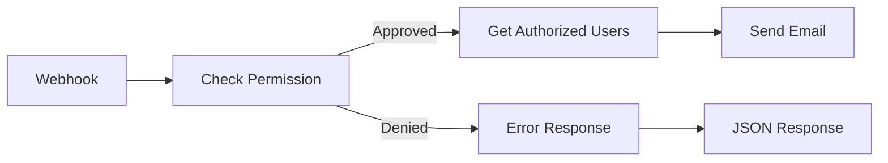

import permitn8ninstallation from "/static/ui-videos/n8n/permit-n8n-installation.mp4";
import credentialsconfiguration from "/static/ui-videos/n8n/credentials-workflow.mp4";
import abacexpenseexample from "/static/ui-videos/n8n/abac-expense-approval-system.mp4";

# n8n Integration

## Overview

n8n is an open-source workflow automation platform that lets you connect different services and build complex, multi-step automations and AI agents. Integrating Permit with n8n allows you to embed fine-grained authorization checks directly into your workflows, so access control is enforced automatically at any step you choose.

The n8n Permit integration transforms how you handle authorization in n8n workflows by:

- Automating permission checks that can control workflow routing and decision-making
- Enabling real-time authorization validation that redirects workflow execution based on access control results
- Automatically identifying which team members have the authority to approve, review, or process specific requests
- Seamlessly extracting context from incoming data to make intelligent access control decisions
- Creating authorization-driven workflow logic that scales with your organization's permission structure

## Quick Start

### Prerequisites

Before you begin, ensure you have:

- [n8n](https://docs.n8n.io/) (cloud or self-hosted)
- A [Permit.io account](https://app.permit.io) with an API key
- Basic understanding of [n8n workflow concepts](https://docs.n8n.io/workflows/)
- Local PDP container for ABAC/ReBAC policies (optional but recommended)

### Installation

Install the `@permitio/n8n-nodes-permitio` community node via the n8n UI or follow the [installation guide](https://docs.n8n.io/integrations/community-nodes/installation/).

<video controls>
  <source src={permitn8ninstallation} />
</video>

### Configuration

Configure Permit API credentials in n8n with your environment API key and PDP URL:

- **API Key:** Your Permit.io environment API key from Settings → API Keys
- **PDP URL:**
  - **Cloud PDP:** `https://cloudpdp.api.permit.io` (default)
  - **Self-hosted PDP:** Your PDP's network-accessible URL:
    - Same machine: `http://localhost:7766`
    - Different server: `http://your-pdp-server:7766`
    - Docker network: `http://pdp-container:7766`
    - Kubernetes: `http://pdp-service.namespace:7766`

<video controls>
  <source src={credentialsconfiguration} />
</video>

:::tip
For ABAC and ReBAC policies, use a local PDP container for better performance and advanced policy support.
:::

### Core Operations

The Permit node provides three core operations:

- **Check Permissions**: Verify if a user can perform an action on a resource
- **Get User Permissions**: Retrieve all permissions for a specific user
- **Get Authorized Users**: Find users who can perform actions on resources

Each operation integrates with n8n's expression system for dynamic authorization workflows.

## Authorization Models

The n8n Permit integration supports all three authorization models, allowing you to choose the right approach for your use case.

### Role-Based Access Control (RBAC)

Grant permissions based on user roles. Simple and effective for basic authorization needs.

```json
{
  "user": "alice@company.com",
  "action": "read",
  "resource": "document"
}
```

### Attribute-Based Access Control (ABAC)

Make authorization decisions based on user, resource, and environmental attributes. The node automatically extracts attributes from webhook payloads when **Enable ABAC** is checked.

```json
{
  "user": "john.employee",
  "action": "submit",
  "resource": "expense",
  "attributes": {
    "expense_amount": 1500,
    "category": "Travel",
    "department": "Engineering"
  }
}
```

### Relationship-Based Access Control (ReBAC)

Control access based on relationships between users and specific resource instances.

```json
{
  "user": "manager@company.com",
  "action": "approve",
  "resource": "expense",
  "resource_key": "exp-123"
}
```

:::tip
Use a local PDP container (`http://localhost:7766`) for ABAC and ReBAC policies. Cloud PDP supports RBAC workflows.
:::

## Practical Example: Expense Approval Workflow

This example demonstrates building an automated expense approval system using ABAC policies with the Permit n8n node.


### Workflow Architecture



### Node Configuration

**1. Webhook Node**
Receives expense submissions with employee data and expense details.

**2. Permit Check Node**

- **Operation:** Check
- **User:** `{{$node['Webhook'].json.body.employee_email}}`
- **Action:** `submit`
- **Resource:** `expense`
- **Enable ABAC:** (automatically extracts `expense_amount`, `category`, etc.)

**3. IF Node**
Routes based on permission result: approved requests go to user lookup, denied requests return error.

**4. Get Authorized Users Node**

- **Operation:** Get Authorized Users
- **Action:** `approve`
- **Resource Type:** `expense`
- **Resource Attributes:** `{"expense_amount": 1500, "category": "Travel"}`

**5. Send Email Node**
Notifies authorized approvers about pending expense requests.

### Example Payloads

**Approved Request:**

```json
{
  "employee_email": "john.employee",
  "expense_amount": 1500,
  "category": "Travel",
  "description": "Client meeting"
}
```

**Response:** Email sent to authorized approvers.

**Denied Request:**

```json
{
  "employee_email": "john.employee",
  "expense_amount": 2500,
  "category": "Travel"
}
```

**Response:** `{"error": "Access denied", "reason": "Exceeds spending limit"}`

<video controls>
  <source src={abacexpenseexample} />
</video>

## Operations Reference

### Check Permissions

Verify if a user has permission to perform a specific action on a resource.

**Configuration:**

- **User:** User identifier (supports expressions)
- **Action:** Action to check (e.g., `read`, `write`, `submit`)
- **Resource:** Resource type (e.g., `document`, `expense`)
- **Tenant:** Tenant identifier (defaults to `default`)
- **Enable ABAC:** Auto-extract attributes from webhook payload
- **Resource Key:** Specific resource instance (for ReBAC)

**Response:**

```json
{
  "allow": true,
  "decision": "2024-01-15T10:30:00Z",
  "debug": {
    "reason": "User has required permissions"
  }
}
```

### Get User Permissions

Retrieve all permissions for a specific user across resources.

**Configuration:**

- **User:** User identifier
- **Resource Types:** Comma-separated list (e.g., `expense,document`)
- **Enable ABAC:** Include attribute-based permissions

**Response:**

```json
{
  "permissions": [
    {
      "resource": "expense",
      "action": "submit",
      "allowed": true
    },
    {
      "resource": "document",
      "action": "read",
      "allowed": false
    }
  ]
}
```

### Get Authorized Users

Find all users who can perform a specific action on a resource.

**Configuration:**

- **Action:** Action to check (e.g., `approve`)
- **Resource Type:** Resource type (e.g., `expense`)
- **Tenant:** Tenant identifier
- **Resource Attributes:** JSON object with resource attributes
- **Enable ABAC:** Include attribute-based user discovery

**Response:**

```json
[
  {
    "resource": "expense:*",
    "tenant": "default",
    "users": {
      "finance.admin@company.com": [
        {
          "user": "finance.admin@company.com",
          "role": "finance_approver"
        }
      ]
    }
  }
]
```

### Getting Help

- [Permit.io Documentation](https://docs.permit.io)
- [n8n Community Forum](https://community.n8n.io)
- [GitHub Issues](https://github.com/permitio/n8n-nodes-permitio/issues)
- [Slack Community](https://io.permit.io/slack)

## Next Steps

Now that you have the basics, explore:

- [Attribute-Based Access Control (ABAC)](/how-to/build-policies/abac/overview)
- [Relationship-Based Access Control (ReBAC)](/how-to/build-policies/rebac/overview)
- [Policy as Code with Terraform](/integrations/infra-as-code/terraform-provider)
- [Self-Deployed PDP Setup](/concepts/pdp/overview)
- [Permit CLI for Automation](/how-to/permit-cli/)

---

:::info
**Need Help?** Join our [Slack community](https://io.permit.io/slack) or check out our [GitHub repository](https://github.com/permitio/n8n-nodes-permitio) for support and examples.
:::
