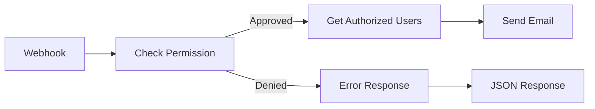

import permitn8ninstallation from "/static/ui-videos/n8n/permit-n8n-installation.mp4";
import credentialsconfiguration from "/static/ui-videos/n8n/credentials-workflow.mp4";
import abacexpenseexample from "/static/ui-videos/n8n/abac-expense-approval-system.mp4";

Add Permit.io permission checks to n8n workflows with the Permit community node, so a workflow can branch on whether a user is allowed to act, or find the users who are allowed to approve a request. This guide is for developers who build n8n workflows and already have a Permit policy.

[n8n](https://docs.n8n.io/) is a workflow automation platform. The Permit node sends requests to a Permit policy decision point (PDP) and returns the PDP's response as the node's output, which later nodes in the workflow can read.

## Prerequisites \{#quick-start}

- An n8n instance, on n8n Cloud or self-hosted, where you can install community nodes. See [n8n workflows](https://docs.n8n.io/workflows/).
- A Permit.io policy with the resources, actions, and roles your workflow checks.
- Your environment API key. See [Get your API key](/overview/get-api-key).
- For attribute-based access control (ABAC) policies, an Edge PDP that your n8n instance can reach over the network. See [Run the PDP](/overview/run-pdp).

## 1. Install the Permit node \{#installation}

1. In the n8n workflow editor, click **+** to add a node.
2. Search for **Permit** and select the Permit node.
3. Click **Install node** and wait for the installation to finish.

The package name is `@permitio/n8n-nodes-permitio`. For other installation methods, see [Install community nodes](https://docs.n8n.io/integrations/community-nodes/installation/) in the n8n documentation.

<video controls aria-label="Installing the Permit community node from the n8n node panel">
  <source src={permitn8ninstallation} />
</video>

## 2. Add Permit API credentials \{#configuration}

1. In n8n, open **Credentials** and create a credential.
2. Search for and select **Permit API**.
3. Fill in the fields:

| Field | Value |
|---|---|
| **API Key** | Your Permit environment API key. The node sends the key as a bearer token to the PDP. |
| **PDP URL** | The PDP that the node sends requests to. The default is the Cloud PDP, `https://cloudpdp.api.permit.io`. |

When you save the credential, n8n tests the credential with a permission check request to the PDP URL.

<video controls aria-label="Creating a Permit API credential in n8n with an API key and PDP URL">
  <source src={credentialsconfiguration} />
</video>

### Choose a PDP URL \{#choose-a-pdp-url}

The Cloud PDP supports role-based access control (RBAC) and relationship-based access control (ReBAC). For ABAC policies, use an Edge PDP. See [Cloud PDP capabilities](/concepts/pdp/cloud-pdp-capabilities).

For an Edge PDP, set **PDP URL** to an address that your n8n instance can reach:

| Where the PDP runs | Example PDP URL |
|---|---|
| Same machine as a self-hosted n8n | `http://localhost:7766` |
| Another server | `http://your-pdp-server:7766` |
| Same Docker network as n8n | `http://pdp-container:7766` |
| Kubernetes | `http://pdp-service.namespace:7766` |

n8n Cloud can't reach `localhost` or a private network. To use an Edge PDP with n8n Cloud, expose the PDP at a public HTTPS address, and restrict who can reach that address.

## 3. Add a permission check to a workflow \{#core-operations}

Add the Permit node to a workflow, select the **Permit API** credential, and choose an operation:

| Operation | What the node returns | PDP endpoint |
|---|---|---|
| **Check** | Whether a user can perform an action on a resource. | `/allowed` |
| **Get User Permissions** | The permissions of a user, per tenant and resource instance. | `/user-permissions` |
| **Get Authorized Users** | The users who can perform an action on a resource type, with the role that grants the action. | `/authorized_users` |

Node fields accept n8n expressions, so you can take the user, action, or resource from earlier nodes. For each operation's fields, see [Permit node reference](#operations-reference).

### Verify the check \{#verify-the-check}

1. Set **Operation** to **Check**, and set **User**, **Action**, and **Resource** to a user, action, and resource key from your policy.
2. Run the node.
3. The output has an `allow` field. For a user whose role allows the action, `allow` is `true`. For a user without such a role, `allow` is `false`.

If `allow` is `false` for a user who should be allowed, check that the user is synced to the environment of your API key, and look up the decision in the [audit log](/how-to/use-audit-logs/types-and-filtering).

## Check RBAC, ABAC, and ReBAC policies \{#authorization-models}

The Permit node sends the same operations for every policy model. The values you set in the node decide which policy the PDP evaluates. The JSON objects below show the values for each model.

### Role-based access control (RBAC) \{#role-based-access-control-rbac}

Set **User**, **Action**, and **Resource**. The PDP allows the action when one of the user's roles has the permission:

```json
{
  "user": "alice@company.com",
  "action": "read",
  "resource": "document"
}
```

### Attribute-based access control (ABAC) \{#attribute-based-access-control-abac}

Set **User**, **Action**, and **Resource**, and turn on **Enable ABAC**. In the **Check** operation, **Enable ABAC** sends the `body` field of the incoming item, such as a webhook payload, as the resource attributes. Every field in the body becomes a resource attribute. The ABAC policy then evaluates conditions on attributes such as `expense_amount`:

```json
{
  "user": "john.employee",
  "action": "submit",
  "resource": "expense",
  "attributes": {
    "expense_amount": 1500,
    "category": "Travel",
    "department": "Engineering"
  }
}
```

ABAC checks need an Edge PDP. See [Choose a PDP URL](#choose-a-pdp-url).

### Relationship-based access control (ReBAC) \{#relationship-based-access-control-rebac}

Set **User**, **Action**, and **Resource**, and set **Resource Key** to the key of the resource instance. The PDP evaluates the roles the user has on that instance, including roles derived from relationships:

```json
{
  "user": "manager@company.com",
  "action": "approve",
  "resource": "expense",
  "resource_key": "exp-123"
}
```

## Example: expense approval workflow \{#practical-example-expense-approval-workflow}

This workflow receives expense submissions, checks with an ABAC policy whether the employee can submit the expense, and emails the users who can approve it.


### Workflow structure \{#workflow-architecture}


```mermaid
graph LR
    A[Webhook] --> B[Check Permission]
    B -->|Approved| C[Get Authorized Users]
    B -->|Denied| D[Error Response]
    C --> E[Send Email]
    D --> F[JSON Response]
```

### Node settings \{#node-configuration}

1. **Webhook node:** receives the expense submission as JSON, with the employee and expense details.
2. **Permit node, Check operation:**
   - **User:** `{{$node['Webhook'].json.body.employee_email}}`
   - **Action:** `submit`
   - **Resource:** `expense`
   - **Enable ABAC:** on. The node sends the webhook body, including `expense_amount` and `category`, as resource attributes.
3. **IF node:** routes on the `allow` field of the Permit node output. When `allow` is `true`, the item goes to the Get Authorized Users node. When `allow` is `false`, the item goes to a Respond to Webhook node that returns an error response.
4. **Permit node, Get Authorized Users operation:**
   - **Action:** `approve`
   - **Resource Type:** `expense`
   - **Resource Attributes (JSON):** `{"expense_amount": 1500, "category": "Travel"}`
5. **Send Email node:** emails the users in the Get Authorized Users output about the pending expense.

The workflow depends on an ABAC policy in Permit that allows `submit` on `expense` only below an amount limit, and a role that allows `approve` on `expense`. See [Build ABAC policies](/how-to/build-policies/abac/overview).

### Test the workflow with example payloads \{#example-payloads}

Send this payload to the webhook. When your policy allows the amount, the Check returns `allow: true`, and the workflow emails the authorized approvers:

```json
{
  "employee_email": "john.employee",
  "expense_amount": 1500,
  "category": "Travel",
  "description": "Client meeting"
}
```

Send this payload with an amount above your policy's limit. The Check returns `allow: false`, and the workflow returns the error response you configured on the denied branch:

```json
{
  "employee_email": "john.employee",
  "expense_amount": 2500,
  "category": "Travel"
}
```

<video controls aria-label="Running the expense approval workflow in n8n with an allowed and a denied expense">
  <source src={abacexpenseexample} />
</video>

## Permit node reference \{#operations-reference}

Each operation sends a `POST` request to the PDP URL of the credential and returns the PDP response as the node output.

### Check \{#check-permissions}

Checks whether a user can perform an action on a resource.

| Field | Description |
|---|---|
| **User** | The user key. Supports expressions. |
| **Action** | The action key, such as `read` or `submit`. |
| **Tenant** | The tenant key. The default is `default`. |
| **Resource** | The resource type key, such as `document` or `expense`. |
| **Enable ABAC** | Sends the `body` field of the incoming item as resource attributes. Off by default. |
| **Resource Key** | The resource instance key, for ReBAC checks. Optional. |

The output has an `allow` field with the decision, `true` or `false`. The PDP can also return `query` and `debug` fields with details of the evaluation.

```json
{
  "allow": true
}
```

### Get User Permissions \{#get-user-permissions}

Returns the permissions of a user. See [Get user permissions](/how-to/enforce-permissions/user-permissions).

| Field | Description |
|---|---|
| **User** | The user key. |
| **Resource Types** | A comma-separated list of resource types to include, such as `expense,document`. Optional. |
| **Enable ABAC** | Includes permissions granted by ABAC policies. Off by default. |

The PDP returns an object with one entry per tenant or resource instance. Each entry lists the `permissions` of the user there, as `resource:action` strings, and can include the `roles` that grant them:

```json
{
  "__tenant:default": {
    "tenant": { "key": "default", "attributes": {} },
    "permissions": ["expense:submit"],
    "roles": ["employee"]
  }
}
```

### Get Authorized Users \{#get-authorized-users}

Returns the users who can perform an action on a resource type, and the role assignment that grants each user the action. See [Get authorized users](/how-to/enforce-permissions/authorized-users).

| Field | Description |
|---|---|
| **Action** | The action key, such as `approve`. |
| **Resource Type** | The resource type key, such as `expense`. |
| **Tenant** | The tenant key. The default is `default`. |
| **Resource Attributes (JSON)** | A JSON object of resource attributes. The default is `{}`. |
| **Enable ABAC** | Includes users authorized by ABAC policies. Off by default. |

Example output:

```json
{
  "resource": "expense:*",
  "tenant": "default",
  "users": {
    "finance.admin@company.com": [
      {
        "user": "finance.admin@company.com",
        "tenant": "default",
        "resource": "__tenant:default",
        "role": "finance_approver"
      }
    ]
  }
}
```

In the output, `users` maps each user key to the role assignments that allow the action.

## Get help \{#getting-help}

- For bugs in the Permit node, open an issue in the [n8n-nodes-permitio repository](https://github.com/permitio/n8n-nodes-permitio/issues).
- For n8n questions, use the [n8n community forum](https://community.n8n.io).
- For Permit questions, ask in the [Permit Slack community](https://io.permit.io/slack).

## Next steps \{#next-steps}

- [Build ABAC policies](/how-to/build-policies/abac/overview)
- [Build ReBAC policies](/how-to/build-policies/rebac/overview)
- [Run an Edge PDP](/concepts/pdp/overview)
- [Cloud PDP capabilities](/concepts/pdp/cloud-pdp-capabilities)
- [Manage policy as code with Terraform](/integrations/infra-as-code/terraform-provider)
