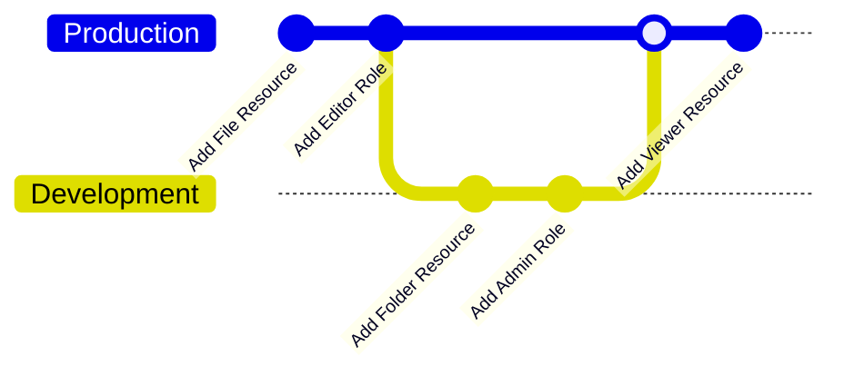
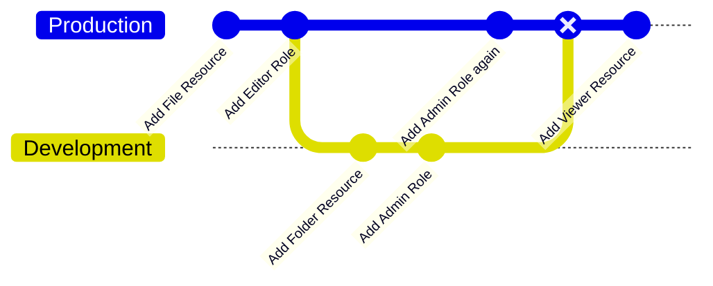

import createEnvironment from "/ui-videos/workspace-settings/creating-new-environment.mp4";


# Create a new Environment

Creating a new environment is as simple as clicking the **New Environment** button and filling in the details.

<video controls>
  <source src={createEnvironment} />
</video>

## Creating Environment via API

You can also create a new environment via the API.

```bash
curl 'https://api.permit.io/v2/projects/<project-id>/envs' \
  -H 'authorization: Bearer <api-key>' \
  --data-raw '{"key":"new-env-name","name":"New Env Name"}'
```

:::info Remember
Make sure to use an Organization-level API Key or Project-level API Key to create a new Environment.
Read more about [API Key levels](/manage-your-account/workspace-settings#api-keys).
:::


#### New Environment's Default Settings

When creating a new environment, the following resources and roles will be created by default:
```json
{
  "default_resource_actions": ["create", "read", "update", "delete"],
  "default_resource_permissions": {
    "admin": ["create", "read", "update", "delete"],
    "editor": ["create", "read", "update"],
    "viewer": ["read"]
  },
  "enable_default_roles": true
}
```

You can disable the default roles by setting `enable_default_roles` to `false` in the request body.
```bash
curl 'https://api.permit.io/v2/projects/<project-id>/envs' \
  -H 'authorization: Bearer <api-key>' \
  --data-raw '{"key":"new-env-name","name":"New Env Name", "settings": {"enable_default_roles": false}}'
```


## Coping / Merging Environments (EAP)

Environments can be copied into new environments or existing environments.
This is useful when you want to manage changes to the **Policy**, like adding a Resource, Role or Condition Set, in a controlled manner.

For example, if you want to test adding a new Resource to your policy, you can copy the environment, make the changes, and test them on the new environment, then merge it back.



In this example, we have a Production environment with a policy that has a `File` Resource and an `Editor` Role.
We've copied the Production environment into a Development environment, where we've added a `Folder` Resource and an `Admin` Role.
After testing the changes, we've merged the Development environment back into the Production environment.

This way, you can manage changes to your policy, such as code changes in your CI/CD pipelines.
Read more about [Policy Life Cycle with Permit](/how-to/SDLC/CI-CD).

:::info Early Access Program
This feature is in **EAP** stage, which means it's in early access and might have some limitations.
We recommend you test it in a non-production environment before using it in production.
:::

### Copy Environments via API

You can copy an environment into a new environment or an existing environment via the API.

```bash
curl --location 'https://api.permit.io/v2/projects/{project_id}/envs/{env_id}/copy' \
  -H 'authorization: Bearer API_SECRET_KEY' \
  --data '{
  "target_env": {
    "new": {
        "key": "prod",
        "name": "production"
    }
  }'
```

Read more about copying environments in the [API Documentation](https://api.permit.io/v2/redoc#tag/Environments/operation/copy_environment).

### Copy Environment - Background API (EAP)

For large environments, copying environments can take some time.
You can use the Background API to copy environments asynchronously.

```bash
curl --location 'https://api.permit.io/v2/projects/default/envs/staging/copy/async' \
  -H 'authorization: Bearer API_SECRET_KEY' \
  --data '{
  "target_env": {
    "new": {
        "key": "prod",
        "name": "production"
    }
  }'
```

For more information, read the [Background API Documentation](/api/background-tasks).

#### Supported Objects

Copy and merge environments apply only to **Policy** objects, such as Resources, Roles, and Condition Sets.
**Directory** objects, such as Users, Tenants, and Resource Instances, are not copied or merged.

When copying environments, the marked objects below are copied:
- [x] Resource
  - [x] Resource Actions
  - [ ] Resource Action Groups
  - [x] Resource Attributes
  - [x] Resource Roles
  - [x] Resource Relations
- [x] Roles
  - [x] Role Permissions
  - [x] Role Derivations
  - [ ] Role Hierarchy
- [x] Condition Sets
  - [x] User Sets
  - [x] Resource Sets
  - [x] Condition Sets Rules
  - [ ] Condition Sets Inheritance
- [x] Custom Policies [*](#custom-policies)

<a name="custom-policies"></a>

When [using GitOps](/integrations/gitops/custom_policy) with a Custom Git Repository,
**all files** under the Environment's branch are copied into the new Environment's branch, including all Custom `.rego`  Policy files.

### Conflict Strategy

When merging into an existing environment, conflicts can arise if the same resource or role is modified in both environments.



In this example, we've added an `Admin` Role to the Production environment after copying it into the Development environment.
When we merge the development environment back into the production environment, we will have a conflict with the `Admin` role.

When merging environments, you can choose to resolve conflicts by either:
* **Fail**: (default) Fail the merge, rollback the entire merge operation and keep the existing object in the target environment.
* **Overwrite**: Overwrite the existing object on the target environment with the object from the source environment.

### Excluding / Including Objects

When copying environments, you can choose to set a scope to **exclude** or **include** specific objects from the copy operation.

```bash
curl --location 'https://api.permit.io/v2/projects/{project_id}/envs/{env_id}/copy' \
  -H 'authorization: Bearer API_SECRET_KEY'\
  --data '{
  "target_env": {
    "new": {
        "key": "prod",
        "name": "production"
    }
  },
  "scope": {
      "roles": {
          "exclude": ["*"]
      },
      "resources": {
          "include": ["folder", "file"]
      },
      "resource_sets": {
          "exclude": ["test*"]
      },
      "user_sets": {
          "exclude": ["canada_users"]
      },
      "custom_policies": {
          "include": ["*.rego"]
      }
  }
}'
```

Using wildcards is supported for `exclude` and `include` scopes to match multiple objects.
The wildcard uses the [Unix filename pattern matching](https://docs.python.org/3/library/fnmatch.html).

## Customize GitOps Branch Name

When creating or copying environments, you can customize the branch name for the new environment.
Notice that the [Policy Repo should be activated](/integrations/gitops/github#configure-permit-to-use-your-repository) on the project for it to work properly.

```bash
curl 'https://api.permit.io/v2/projects/{project_id}/envs' \
  -H 'authorization: Bearer {API_SECRET_KEY}'\
  --data-raw '{"key":"new-env-name","name":"New Env Name", "custom_branch_name": "new-env-branch-name"}'
```

Now, in your custom Git Repository, you will see a new branch named `new-env-branch-name` that corresponds to the new environment.

You can also specify a custom branch name when copying a new environment or update existing environments to a new branch name.
```bash
curl 'https://api.permit.io/v2/projects/{project_id}/envs/{env_id}' -X 'PATCH' \
  -H 'authorization: Bearer {API_SECRET_KEY}'\
  --data-raw '{"custom_branch_name": "new-env-branch-name"}'
```

Read more about [GitOps and Permit](/integrations/gitops/overview).
