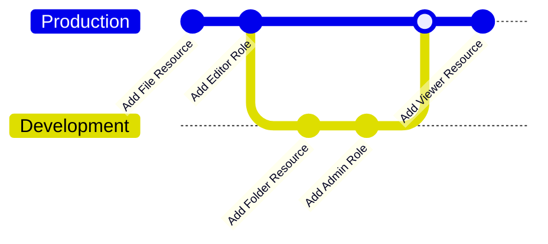
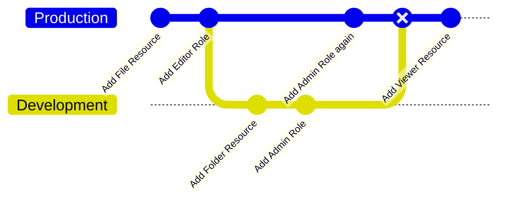

import createEnvironment from "/ui-videos/workspace-settings/creating-new-environment.mp4";

Create a Permit.io environment in the dashboard or with the Permit API, and copy or merge policy between environments to promote changes from development to production. This page is for developers and admins who manage the projects and environments of a Permit workspace. For what projects and environments are, see [Projects and environments](/manage-your-account/projects-and-env).

## Prerequisites

- A Permit.io project. See [Projects and environments](/manage-your-account/projects-and-env#projects).
- For the API: an organization-level or project-level API key. See [API key levels](/manage-your-account/workspace-settings#api-keys).
- For the API: your project ID or key. See [Get the project ID and environment ID](/api/examples/get-project-and-env).

## Create an environment in the dashboard \{#create-a-new-environment}

1. In the [Permit dashboard](https://app.permit.io), open the **Projects** screen and find your project.
2. Click **New Environment**.
3. Fill in the environment details and save.

<video controls>
  <source src={createEnvironment}/>
</video>

The new environment appears as a card under your project. The card menu has **Copy API Key**, **Rotate API Key**, **Edit Environment**, and **Delete Environment**.

## Create an environment with the API \{#creating-environment-via-api}

Send a `POST` request to `/v2/projects/<project-id>/envs` with the environment `key` and `name`. Replace `<project-id>` with your project ID or key and `<api-key>` with your organization-level or project-level API key:

```bash
curl 'https://api.permit.io/v2/projects/<project-id>/envs' \
  -H 'authorization: Bearer <api-key>' \
  -H 'Content-Type: application/json' \
  --data-raw '{"key":"new-env-name","name":"New Env Name"}'
```

:::info API key level
The Create Environment API accepts an organization-level or project-level API key. See [API key levels](/manage-your-account/workspace-settings#api-keys).
:::

The response contains the new environment object. To confirm, list the environments of the project with the [List Environments API](https://api.permit.io/v2/redoc#tag/Environments/operation/list_environments), or open the **Projects** screen in the dashboard. For all request fields, see [Create Environment](https://api.permit.io/v2/redoc#tag/Environments/operation/create_environment) in the API reference.

## Default roles for new resources \{#default-role-creation}

An environment can create a default set of roles (Admin, Editor, and Viewer) with predefined permissions every time a workspace member creates a resource in the environment, for example in the Policy Editor. Resources created through the Permit API with an API key don't get default roles.

Default role creation is **off** by default. Turn default role creation on when you create an environment with the API, or later with the toggle in the Policy Editor settings.

### Default settings of a new environment \{#new-environments-default-settings}

The environment settings that control default roles have this shape. `default_resource_actions` lists the actions of each new resource, and `default_resource_permissions` lists the permissions of each default role:

```json
{
  "default_resource_actions": ["create", "read", "update", "delete"],
  "default_resource_permissions": {
    "admin": ["create", "read", "update", "delete"],
    "editor": ["create", "read", "update"],
    "viewer": ["read"]
  },
  "enable_default_roles": false
}
```

:::note
`enable_default_roles` defaults to `false`. With `enable_default_roles` set to `false`, Permit doesn't create default roles for new resources.
:::

### Toggle default role creation in the UI \{#toggle-default-role-creation-in-the-ui}

1. Open the **[Policy Editor](https://app.permit.io/policy-editor)** in the Permit dashboard.
2. Click the settings button of the Policy Editor.
3. Use the default roles toggle:
   - **On**: Permit creates the default roles (Admin, Editor, Viewer) with their predefined permissions for each new resource in the environment.
   - **Off** (default): Permit doesn't create default roles. You create roles yourself.

### Turn on default roles with the API \{#enable-default-roles-via-api}

To turn on default role creation, set `settings.enable_default_roles` to `true` in the Create Environment request body:

```bash
curl 'https://api.permit.io/v2/projects/{project_id}/envs' \
  -H 'authorization: Bearer API_SECRET_KEY' \
  -H 'Content-Type: application/json' \
  --data-raw '{"key":"new-env-name","name":"New Env Name", "settings": {"enable_default_roles": true}}'
```

To turn off default role creation explicitly, set `settings.enable_default_roles` to `false`:

```bash
curl 'https://api.permit.io/v2/projects/{project_id}/envs' \
  -H 'authorization: Bearer API_SECRET_KEY' \
  -H 'Content-Type: application/json' \
  --data-raw '{"key":"new-env-name","name":"New Env Name", "settings": {"enable_default_roles": false}}'
```

In these samples, replace `{project_id}` with your project ID or key and `API_SECRET_KEY` with your organization-level or project-level API key.

## Copy and merge environments \{#coping--merging-environments}

You can copy an environment into a new environment, or into an existing environment (a merge). Copy and merge let you manage policy changes, such as a new resource, role, or condition set, in a controlled way. For example, to test a new resource, copy the production environment to a development environment, add the resource in development, test it, and merge development back into production.


```mermaid
%%{init: { 'gitGraph': {'mainBranchName': 'Production'}} }%%
gitGraph
    commit id: "Add File Resource"
    commit id: "Add Editor Role"
    branch Development
    commit id: "Add Folder Resource"
    commit id: "Add Admin Role"
    checkout Production
    merge Development
    commit id: "Add Viewer Resource"
```

In the diagram, the Production environment has a `File` resource and an `Editor` role. Production is copied into a Development environment, where a `Folder` resource and an `Admin` role are added. After testing, Development is merged back into Production.

This flow lets you promote policy changes between environments the same way a CI/CD pipeline promotes code. See [Policy life cycle with Permit](/how-to/SDLC/CI-CD).

Copy rules:

- Copy and merge work only between environments in the same project. Copying across projects or workspaces isn't allowed.
- To copy into a new environment, the API key or member needs write access to the project.
- To copy into an existing environment, the API key or member needs write access to the target environment.

### Copy an environment with the API \{#copy-environments-via-api}

Send a `POST` request to `/v2/projects/{project_id}/envs/{env_id}/copy`, where `{env_id}` is the source environment. Set `target_env.new` to create an environment, or `target_env.existing` to the ID or key of an existing environment to merge into.

```bash
curl --location 'https://api.permit.io/v2/projects/{project_id}/envs/{env_id}/copy' \
  -H 'authorization: Bearer API_SECRET_KEY' \
  -H 'Content-Type: application/json' \
  --data '{
  "target_env": {
    "new": {
        "key": "prod",
        "name": "production"
    }
  }
}'
```

For all request fields, see [Copy Environment](https://api.permit.io/v2/redoc#tag/Environments/operation/copy_environment) in the API reference.

### Copy a large environment in the background \{#copy-environment---background-api}

Copying a large environment can take time. The background Copy Environment API (`/copy/async`) runs the copy asynchronously, returns HTTP `202 Accepted` with a `task_id`, and lets you fetch the result later.

```bash
curl --location 'https://api.permit.io/v2/projects/default/envs/staging/copy/async' \
  -H 'authorization: Bearer API_SECRET_KEY' \
  -H 'Content-Type: application/json' \
  --data '{
  "target_env": {
    "new": {
        "key": "prod",
        "name": "production"
    }
  }
}'
```

To wait for the task and read its result, see [Background APIs](/api/background-tasks).

### Objects that copy and merge include \{#supported-objects}

Copy and merge apply only to **policy** objects, such as resources, roles, and condition sets.
**Directory** objects, such as users, tenants, and resource instances, are not copied or merged.

When you copy an environment, Permit copies the checked objects below:

- [x] Resource
- [x] Resource Actions
- [ ] Resource Action Groups
- [x] Resource Attributes
- [x] Resource Roles
- [x] Resource Relations
- [x] Roles
- [x] Role Permissions
- [x] Role Derivations
- [ ] Role Hierarchy
- [x] Condition Sets
- [x] User Sets
- [x] Resource Sets
- [x] Condition Sets Rules
- [ ] Condition Sets Inheritance
- [x] Custom Policies ([details](#custom-policies))

### Custom policies in copied environments \{#custom-policies}

When you [use GitOps](/integrations/gitops/custom_policy) with a custom Git repository, copying an environment copies **all files** in the source environment's branch into the new environment's branch, including all custom `.rego` policy files.

### Conflict strategy for merges \{#conflict-strategy}

When you merge into an existing environment, a conflict occurs if the same object, such as a resource or role, was changed in both environments.


```mermaid
%%{init: { 'gitGraph': {'mainBranchName': 'Production'}} }%%
gitGraph
    commit id: "Add File Resource"
    commit id: "Add Editor Role"
    branch Development
    commit id: "Add Folder Resource"
    commit id: "Add Admin Role"
    checkout Production
    commit id: "Add Admin Role again"
    merge Development type: REVERSE
    commit id: "Add Viewer Resource"
```

In the diagram, an `Admin` role is added to Production after Production was copied into Development. Development also has an `Admin` role, so merging Development back into Production causes a conflict on the `Admin` role.

Set `conflict_strategy` in the copy request body to choose how Permit resolves conflicts:

| `conflict_strategy` | Result |
|---|---|
| `fail` (default) | The merge fails, Permit rolls back the entire merge, and the target environment keeps its existing objects. |
| `overwrite` | Permit replaces the existing object in the target environment with the object from the source environment. |

### Exclude or include objects in a copy \{#excluding--including-objects}

Set `scope` in the copy request body to **exclude** or **include** specific objects. `scope` accepts `resources`, `roles`, `user_sets`, `resource_sets`, and `custom_policies`, each with `include` and `exclude` lists.

```bash
curl --location 'https://api.permit.io/v2/projects/{project_id}/envs/{env_id}/copy' \
  -H 'authorization: Bearer API_SECRET_KEY' \
  -H 'Content-Type: application/json' \
  --data '{
  "target_env": {
    "new": {
        "key": "prod",
        "name": "production"
    }
  },
  "scope": {
      "roles": {
          "exclude": ["*"]
      },
      "resources": {
          "include": ["folder", "file"]
      },
      "resource_sets": {
          "exclude": ["test*"]
      },
      "user_sets": {
          "exclude": ["canada_users"]
      },
      "custom_policies": {
          "include": ["*.rego"]
      }
  }
}'
```

`include` and `exclude` accept wildcards to match several objects. Wildcards follow [Unix filename pattern matching](https://docs.python.org/3/library/fnmatch.html).

## Customize the GitOps branch name \{#customize-gitops-branch-name}

When you create or copy an environment, you can set the name of the Git branch that stores the environment's policy. A custom branch name requires an [active policy repository](/integrations/gitops/github#configure-permit-to-use-your-repository) on the project.

Set `custom_branch_name` when you create the environment:

```bash
curl 'https://api.permit.io/v2/projects/{project_id}/envs' \
  -H 'authorization: Bearer {API_SECRET_KEY}' \
  -H 'Content-Type: application/json' \
  --data-raw '{"key":"new-env-name","name":"New Env Name", "custom_branch_name": "new-env-branch-name"}'
```

Your policy repository then has a branch named `new-env-branch-name` for the new environment.

You can also set `custom_branch_name` in `target_env.new` when you copy into a new environment. To move an existing environment to a different branch, update the environment with a `PATCH` request:

```bash
curl 'https://api.permit.io/v2/projects/{project_id}/envs/{env_id}' -X 'PATCH' \
  -H 'authorization: Bearer {API_SECRET_KEY}' \
  -H 'Content-Type: application/json' \
  --data-raw '{"custom_branch_name": "new-env-branch-name"}'
```

## Next steps

- [Understand projects and environments](/manage-your-account/projects-and-env)
- [Manage policy as code with GitOps](/integrations/gitops/overview)
- [Wait for background API tasks](/api/background-tasks)
- [Promote policy through CI/CD](/how-to/SDLC/CI-CD)
