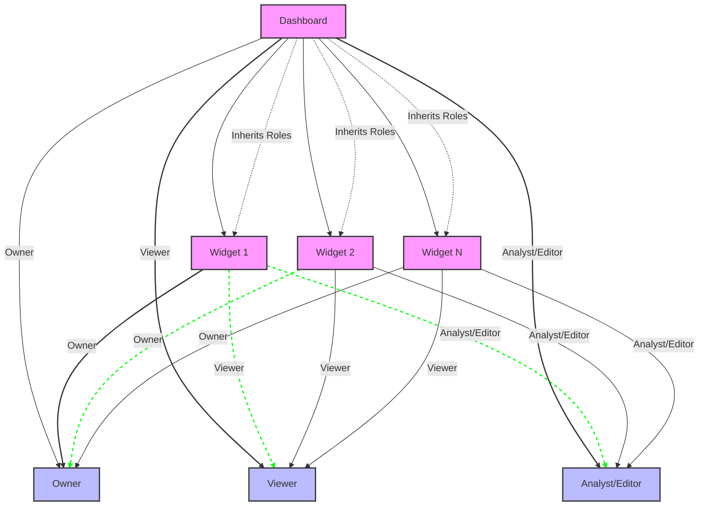

import WhatsNext from "../../src/components/whats-next/WhatsNext";
import TimelineStep from "../../src/components/timeline/TimelineStep";
import TimelineWrapper from "../../src/components/timeline/TimelineWrapper";
import Video from "../../src/components/video/Video";

Setting up Relationship-Based Access Control (ReBAC) policies may seem complex, but with Permit, it’s a simple and intuitive
process. This step-by-step guide will walk you through configuring and enforcing ReBAC policies using the Permit dashboard.

:::info Before You Begin
This guide assumes you have already set up your Permit account and have a foundational understanding of ReBAC and the basics
of how Permit operates.
:::

## Defining our ReBAC Policy

In this guide, we’ll create ReBAC permissions for a dashboarding system. Below are the key aspects of the policy we’ll configure:

### Resource Hierarchy

- There are two types of resources: `Dashboard` and `Widget`.
- A Dashboard serves as the `parent` resource for `Widget`.

### Explicit permissions

Users can be assigned specific roles for `Dashboard` and `Widget` instances:

- `Owner`
- `Viewer`
- `Analyst/Editor`

Each role will come with it's own set of permissions.

### Implicit permissions

Users who have access to a `Dashboard` automatically inherit permissions for any `Widget` associated with that Dashboard.

### Visual representation

<br />



<br />
<br />

## Step 1: Create Resources and their Roles

---

Start by navigating to the Resources section in the Permit dashboard - `Policy > Resources`. Once there, locate the `Add Resource`
button to begin creating your first resource. For this example, we’ll define two resources: `Dashboard` and `Widget`, each with
specific actions and resource roles.


<br />
<br />

<TimelineWrapper>
<TimelineStep>

### Creating the Dashboard Resource

Click on `Add Resource` and enter the following details for the new resource:

- **Name**: `Dashboard`
- **Actions**: `view`, `remove-widget`, `add-widget`, `edit`, `delete`, `create`
- **Roles on resource**: `Owner`, `Viewer`, `Analyst`

<Video
  src={"/ui-videos/walkthroughs/rebac/creating-a-dashboard-resource-rebac.mp4"}
  controls
  autoPlay={false}
/>

<br />

After filling in the information, `save` the resource. At this point, you’ve successfully created the `Dashboard` resource,
which will serve as a parent resource in your system.

</TimelineStep>
<TimelineStep>

### Creating the Widget Resource

Next, click `Add Resource` again and provide the following details:

- **Name**: `Widget`
- **Actions**: `view`, `edit`, `delete`, `create`
- **Roles on resource**: `Owner`, `Viewer`, `Editor`

<Video
  src={"/ui-videos/walkthroughs/rebac/creating-a-widget-resource-rebac.mp4"}
  controls
  autoPlay={false}
/>

<br />

`Save` this resource once all the fields are complete. Now, the `Widget` resource is configured and will function as a child
resource tied to the Dashboard.

</TimelineStep>
<TimelineStep>

### Resources Overview

With these steps completed, you now have two resources defined in your ReBAC policy:

- `Dashboard`, with its actions and roles.
- `Widget`, with its distinct set of actions and roles.


</TimelineStep>
</TimelineWrapper>

## Step 2: Define resource relations

The next step it to configure the relationships between resources within the Permit Dashboard.

---

<TimelineWrapper>
<TimelineStep>

### Open the Resource Editor

In the Resources section, locate the `Dashboard` resource. Click the `three-dot menu icon` next to it and select `Edit`.


</TimelineStep>
<TimelineStep>

### Define the Parent-Child Relationship

Navigate to the `Relations` section of the resource editor. Configure the `Dashboard resource as the parent of the Widget resource`.
This setup ensures that the Dashboard can act as a container for its associated Widget resources.


:::note
A resource cannot be its own parent. If a resource requires a self-relation, consider using an alternative relation type such as
owner or container.
:::

</TimelineStep>
<TimelineStep>

### Save the Relationship

Once the relationship is defined, save the configuration. You now have a clear hierarchical relationship where Dashboard
resources are parents to Widget resources.

:::info
Once you successfully define the relationships on the roles - it will automatically create the roles for you in the policy
editor.
:::

</TimelineStep>
</TimelineWrapper>

## Step 3: Define role derivations

In this step, we will be configuring the role derivations that will exist between the various user roles and their associated
relationships within our system

---

<TimelineWrapper>
<TimelineStep>

### Navigate to the Resource’s Role Derivation Settings

In the Permit dashboard, go to `Policy > Roles` where you should now see all `Resource Roles`.


</TimelineStep>
<TimelineStep>

### Define Role Derivation Logic

Within the Role Derivation section, establish the rules for how roles are inherited or assigned:

- For the Widget resource, set rules that derive roles from its parent Dashboard resource.
  Example configurations:

  - If a user is an `Owner` of a `Dashboard`, they automatically become an `Owner` of `all Widget instances` under that Dashboard.

    <Video
      src={"/ui-videos/walkthroughs/rebac/role-derivation-logic-rebac.mp4"}
      controls
      autoPlay={false}
    />

  - If a user is a `Viewer` of a `Dashboard`, they inherit the `Viewer` role for `all its Widget instances`.

    

</TimelineStep>
<TimelineStep>

### Save the Role Derivation Rules

Once the derivation logic is defined, save the changes to apply the configuration.


</TimelineStep>
</TimelineWrapper>

## Step 4: Configure permissions

For each role, assign the actions that the role can perform on the particular resource resource.
For this, navigate to `Policy`.

---

<TimelineWrapper>
<TimelineStep>

### For the Dashboard resource:

- **Owner**: Can `view`, `create`, `edit`, `delete`, `add-widget`, and `remove-widget`.
- **Viewer**: Can `view` only.
- **Analyst**: Can `view`, `add-widget`, and `edit`.

  

</TimelineStep>
<TimelineStep>

### For the Widget resource:

- **Owner**: Can `view`, `create`, `edit`, and `delete`.
- **Viewer**: Can only `view`.
- **Editor**: Can `view` and `edit`.

  

Once you assigned and saved your permissions, it's now time to test our policy and make sure it works.

</TimelineStep>
</TimelineWrapper>

## Step 5: Testing our Policy

In this step, we will create users,

---

<TimelineWrapper>
<TimelineStep>

### Create Users

We need access to test users to validate our policy and ensure a specific user complies with the defined rules.

Let's create two users:

1. `John Smith` - john@smith.com
2. `Anna Smith` - anna@smith.com

They will have **no** `top-level` roles. We’ll **revisit** the instance access section during the testing phase.

<Video src={"/ui-videos/walkthroughs/rebac/creating-users-rebac.mp4"} controls autoPlay={false} />

</TimelineStep>
<TimelineStep>

### Create Resource Instances and their Relationship-Tuples

In this step, we will create an instance of the `Widget` resource called `Data Consumption` on a specific instance of `Dashboard`
resource called `Data`.

Navigate to `Directory`, click on `Instances` and click `Add Resource Instance`.

1. Select the **resource type** as `Dashboard`.
2. Pick your **instance key** unique identifier.
3. Select the `tenant` you would like to work within
4. Create your relationship. Select the `type` from the dropdown list, and then fill in the `subject` and `object` instance.

:::tip OUR CONFIG
**Dashboard** `Data` is parent of **Widget** `Data Consumption`
:::

<Video
  src={"/ui-videos/walkthroughs/rebac/create-resource-instances-rebac.mp4"}
  controls
  autoPlay={false}
/>

</TimelineStep>
<TimelineStep>

### Assign Roles

Let's assign an `instance role` to `John Smith`. We want John to be the `owner` of the `data_consumption` widget.

- Navigate to `Directory` and `Add Instance Roles`.
- Scroll down, and give the user permissions per resource instance.

:::tip In our Cases
**`Widget`**:**`data_consumption`**:**`Owner`**
:::

<Video
  src={"/ui-videos/walkthroughs/rebac/assign-instance-roles-rebac.mp4"}
  controls
  autoPlay={false}
/>

</TimelineStep>
<TimelineStep>

### Test the Policy

We have now configured the whole ReBAC policy - and we have one last step left - which is testing if everything that we
have configured works.

```js
await permit.check(userId, action, { type: "member_group", key: "someKey", tenant: "someTenant" });
```

As part of the `permit.check()` function, we will be passing in a few parameters. Use the following for testing:

- `userId`: The unique ID of the user.
- `action`: The action to perform (e.g., assigning a member to a group).
- `member_group:${data}`: The resource targeted, dynamically referencing the data instance.

Now, let's use the provided snippet with out PDP to validate if the user can perform the declared action.

</TimelineStep>
</TimelineWrapper>
