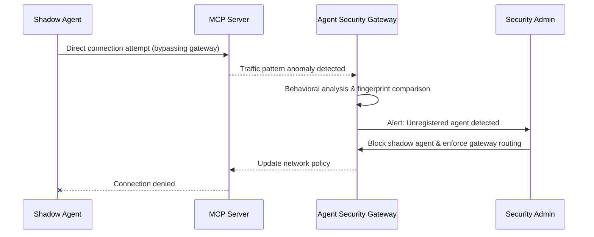
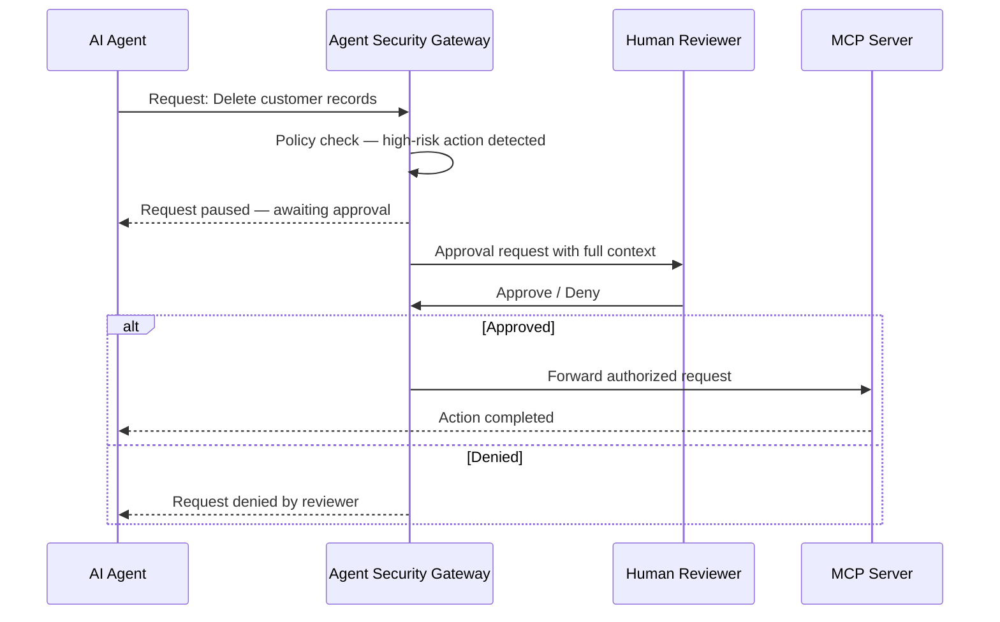

# Advanced Features

:::caution Enterprise Only
All features on this page are available exclusively for **Enterprise** customers. [Contact us](mailto:support@permit.io) or [schedule a demo](https://calendly.com/permit-io/demo) to learn more about Enterprise plans.
:::

Agent Security is evolving from a permissions gateway into a comprehensive agent governance platform. The features below represent our roadmap for giving organizations deep visibility, proactive threat detection, and fine-grained control over every AI agent interaction.

## Agent Fingerprints via Interrogation

Agent fingerprinting goes beyond OAuth tokens and API keys to verify _what_ an agent actually is — not just what it claims to be. When an agent connects, the gateway runs a lightweight behavioral interrogation: probing response patterns, timing, and capability signatures to build a unique fingerprint that confirms the agent's identity.

**Why it matters:** Credentials can be stolen or shared, but behavioral characteristics are much harder to forge. Fingerprinting lets you detect impersonation, credential reuse across different agents, and unexpected behavioral drift — all before a single tool call is authorized.

:::tip Use case
A financial services team requires that only their approved coding assistant connects to internal code repositories via MCP. Agent fingerprinting detects when a different agent attempts to connect using the same OAuth credentials, blocking the impersonator before it accesses any code.
:::

## Inject Security Snitch Skills
Security Snitch Skills are lightweight monitoring capabilities injected directly into an agent's active session. Rather than only observing traffic at the gateway boundary, these injected skills give the security layer in-session visibility — enabling real-time anomaly detection, context tracking, and policy enforcement from within the agent's own tool environment.

**Why it matters:** Gateway-level inspection can only see individual requests in isolation. Injected monitoring skills observe the full session context — tracking how an agent chains tool calls, what data it accumulates, and whether its behavior pattern matches its declared purpose.

:::tip Use case
An enterprise deploys AI agents that access both HR records and email systems. An injected snitch skill detects when an agent reads sensitive salary data and then immediately attempts to compose an external email — flagging the suspicious chain before the email is sent.
:::

## Shadow Agent Detection
Shadow agents are unregistered or unauthorized AI agents that connect to your MCP servers outside of approved channels. Shadow Agent Detection uses behavioral analysis and traffic pattern recognition to identify these rogue connections — even when they don't authenticate through the gateway.

**Why it matters:** Just as shadow IT blindsided security teams a decade ago, shadow AI agents are emerging as a critical blind spot. Teams can spin up new agent integrations in minutes, bypassing governance entirely. Detecting these agents is the first step to bringing them under policy control.

:::tip Use case
A security team notices unusual API patterns on their internal knowledge base MCP server. Shadow Agent Detection identifies that a developer's personal AI assistant is connecting directly to the server — bypassing the gateway and all access policies. The team is alerted and can enforce gateway-only routing.
:::

## Human in the Loop (HITL)
Human-in-the-Loop workflows add step-up approval gates for high-risk agent actions. When an agent requests a sensitive operation — such as deleting records, transferring funds, or accessing PII — the gateway pauses execution and routes an approval request to a designated human reviewer. Only after explicit approval does the action proceed.

**Why it matters:** Full automation is powerful, but certain decisions require human judgment. HITL gives organizations the confidence to grant agents broad capabilities while maintaining a safety net for the actions that matter most — without slowing down routine operations.

:::tip Use case
A customer support agent is authorized to issue refunds up to $100 automatically. When it attempts to process a $5,000 refund, the gateway triggers a HITL approval — routing the request to a finance manager who can review the context and approve or deny the action in real time.
:::

## Workflow Intent Descriptions
Workflow Intent Descriptions allow agents to declare their multi-step plan before execution begins. Instead of authorizing each tool call in isolation, the gateway reviews the full intended workflow — enabling holistic policy evaluation, conflict detection, and preemptive risk assessment across the entire action sequence.

**Why it matters:** Individual tool calls may each look harmless, but their combination can be dangerous. An agent reading a contacts database and then sending bulk emails is a very different risk profile than either action alone. Intent descriptions let security policies reason about the _whole plan_, not just each step.

:::tip Use case
An AI marketing agent declares its intent: "Read customer segments from the CRM, generate personalized emails, and send via the email MCP server." The gateway evaluates the full workflow against data-privacy policies, confirms the agent has permission for the complete chain, and flags if any step would violate GDPR consent requirements — all before the first tool call executes.
:::

## Time-Limited Consent

Time-Limited Consent ensures that access grants automatically expire, preventing stale permissions from accumulating over time. Instead of permanent "allow" decisions, users and admins set consent windows that enforce periodic re-authorization — reducing the blast radius of compromised credentials and ensuring ongoing access reflects current intent.

:::info Current availability
Time-limited consent is partially available today. The consent flow enforces a **90-day hard expiration** (consent is fully revoked) and a **30-day soft expiration** (user is prompted to re-confirm). Future releases will add admin-configurable durations, per-tool expiration policies, and automatic consent downgrade workflows.
:::

**Why it matters:** Permanent access grants are one of the most common sources of privilege creep. Time-limited consent brings the principle of least privilege into the time dimension — ensuring that an agent's access is always fresh, intentional, and aligned with current needs.

:::tip Use case
A contractor's AI agent is granted access to project management tools for a 2-week engagement. After the consent window expires, access is automatically revoked — no manual cleanup required. If the engagement extends, the contractor simply re-consents through the standard flow.
:::

---

Interested in early access to these features or want to shape the roadmap? Get in touch:
- Email us at [support@permit.io](mailto:support@permit.io)
- Join our [Slack community](https://io.permit.io/slack)
- Schedule a [demo](https://calendly.com/permit-io/demo)
