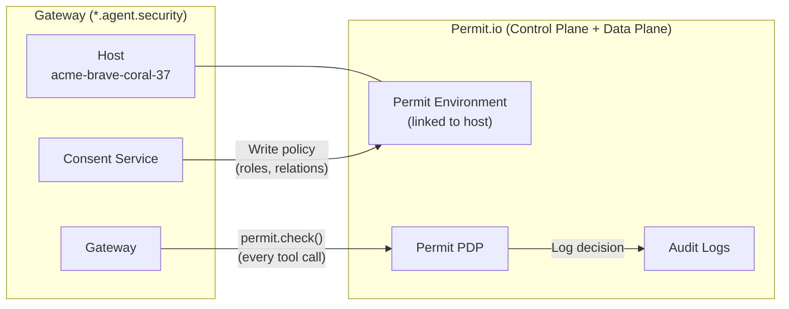
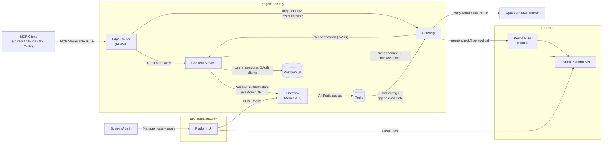
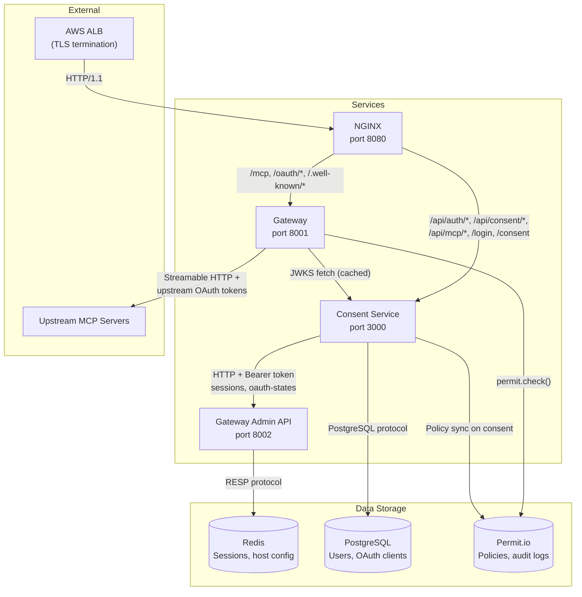
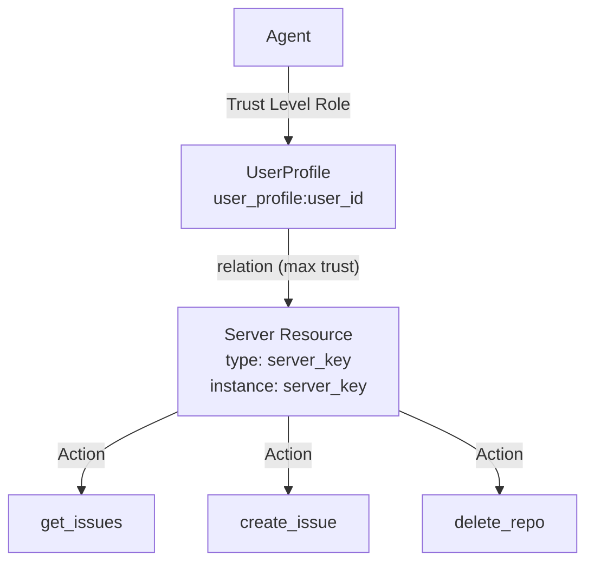
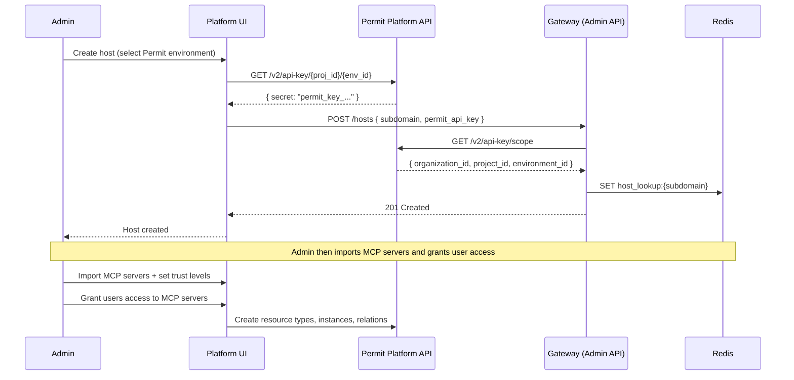
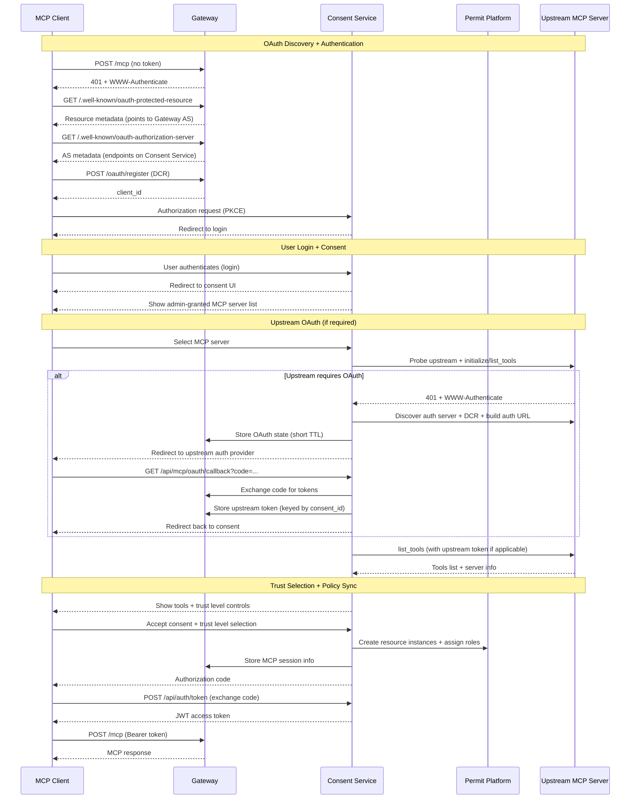
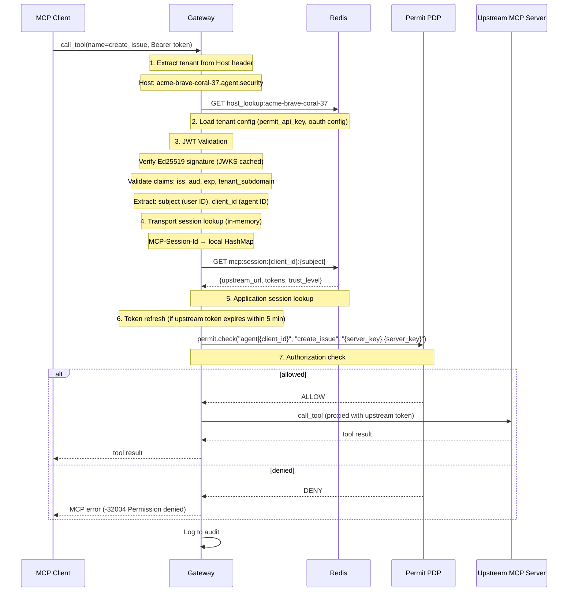
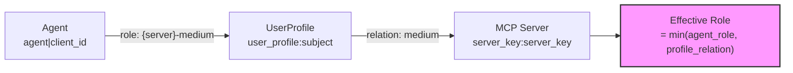

import ZoomableDiagram from '@site/src/components/ZoomableDiagram';

# Permit MCP Gateway Architecture

## Executive Summary

Permit MCP Gateway is a proxy that sits between MCP clients and upstream MCP servers. When an MCP client connects, the gateway handles authentication (via a consent service), checks every tool call against fine-grained policy (via Permit.io), and logs every decision for audit.

**The key architectural properties are:**

- **Transparent proxy** — MCP clients connect to the gateway URL instead of the upstream server URL. The upstream MCP server receives proxied requests and does not need to be modified.
- **Identity binding** — every tool call is tied to a specific human (who authenticated) and agent (the MCP client acting on their behalf), using a relationship-based access control model.
- **Real-time policy enforcement** — the gateway calls `permit.check()` on every `call_tool` request. Decisions are based on the agent's trust level, the human's trust ceiling, and the tool's risk classification.
- **Stateful sessions** — upstream OAuth tokens and consent state are stored server-side (in Redis), so users do not re-authenticate on every connection.
- **Multi-tenant isolation** — each host (gateway instance) has its own subdomain, policies, users, and sessions.

The rest of this page covers the detailed component architecture, data flows, and authorization model.

---

## Permit.io as Control Plane and Data Plane

Permit.io serves as both the **control plane** and the **default data plane** for Permit MCP Gateway.

- **Control plane**: Permit.io is where the authorization model is defined — resource types, actions, roles, relations, derived roles, and role assignments. The gateway dashboard ([app.agent.security](https://app.agent.security)) and the Consent Service write policy changes to Permit via its Platform API. Admins can also inspect and manage policies directly in the Permit dashboard ([app.permit.io](https://app.permit.io)).
- **Data plane**: The Permit PDP (Policy Decision Point) evaluates every `permit.check()` call from the gateway at runtime. In the hosted deployment, the cloud PDP handles these evaluations. In customer-controlled deployments, a local PDP can be used so that authorization decisions stay within your network.

Every gateway **host** maps 1:1 to a **Permit environment**. This binding is established when the admin creates a host and selects a Permit project and environment. All resources, users, roles, and audit logs for that host live in the linked environment.



This means the full power of Permit's policy engine is available to the gateway — including RBAC, ABAC, and ReBAC models, real-time policy updates via OPAL, and the complete audit log API.

---

## Technical Architecture

Permit MCP Gateway delivers **permissions-as-a-service** for any MCP server. It provides:

* **Fine-grained ReBAC** (relationship-based access control) powered by Permit.io (which uses OPA and OPAL under the hood)
* **Authentication and authorization** that binds user, agent, MCP server, and downstream service identities
* **Comprehensive auditing** covering every tool call, user, and agent
* **Hosted gateway deployment**, with all components using the same policy rules

Adopting the gateway requires a single configuration change — pointing your MCP client at the gateway URL instead of directly at the upstream server.

## System Architecture Overview

<ZoomableDiagram title="System Architecture Overview">



</ZoomableDiagram>

**Key components:**
- **Platform** (`app.agent.security`): Admin interface for managing hosts, MCP servers, and user access
- **Edge Router** (NGINX): Routes requests by path to the Gateway or Consent Service
- **Gateway** (`*.agent.security/mcp`): MCP proxy that enforces authorization on every tool call
- **Consent Service** (`*.agent.security`): Handles OAuth login, user consent, and upstream MCP OAuth
- **Permit.io PDP**: Policy decision point for real-time authorization checks
- **Redis**: Session and host configuration store (accessed only by the Gateway)
- **PostgreSQL**: User accounts, OAuth clients, and auth sessions

:::info Architecture constraint
The Consent Service does **not** access Redis directly. All state persistence goes through the Gateway Admin API, centralizing Redis schema and logic in the Gateway.
:::

## Data Flow

The diagram below shows where data lives and how it flows between components:

<ZoomableDiagram title="Data Flow">



</ZoomableDiagram>

| From | To | Protocol | Notes |
| --- | --- | --- | --- |
| ALB | NGINX | HTTP/1.1 | TLS terminated at ALB |
| NGINX | Gateway | HTTP/1.1 (port 8001) | Routes: `/mcp`, `/oauth/*`, `/.well-known/*` |
| NGINX | Consent Service | HTTP/1.1 (port 3000) | Routes: `/api/auth/*`, `/api/consent/*`, `/api/mcp/*`, `/login`, `/consent` |
| Consent Service | Gateway Admin API | HTTP/1.1 + Bearer (port 8002) | Sessions, OAuth states, pending tokens |
| Gateway | Redis | RESP (port 6379) | **Only** Gateway has direct Redis access |
| Consent Service | PostgreSQL | PostgreSQL (port 5432) | Users, sessions, OAuth clients |
| Gateway | Consent Service (JWKS) | HTTP (port 3000) | JWT signature verification |
| Gateway | Permit.io | HTTPS | Authorization checks (Cloud PDP) |
| Consent Service | Permit.io | HTTPS | Policy sync during consent |
| Gateway | Upstream MCP | HTTPS | Streamable HTTP with upstream OAuth tokens |

## Integration Patterns

Permit MCP Gateway is available as a hosted gateway deployment:

| Pattern                   | When to Use                      | How It Works                                                      |
| ------------------------- | -------------------------------- | ----------------------------------------------------------------- |
| **Hosted Gateway**        | Fastest rollout; SaaS workloads  | Point agents/MCP clients to `https://<host>.agent.security/mcp`       |

## Policy Model

### Trust-Level Access Control

Permit MCP Gateway classifies each tool into a trust level based on its risk:

1. **Low trust** — everything else (read-only by convention); this is the default for tools not matching medium or high patterns
2. **Medium trust** — write operations (tools containing: `create`, `write`, `update`, `set`, `modify`, `edit`, `put`, `post`, `insert`, `add`, `send`, `execute`, `run`, `invoke`, `submit`, `push`, `publish`, `deploy`, `apply`, `patch`)
3. **High trust** — destructive operations (tools containing: `delete`, `remove`, `destroy`, `drop`, `purge`, `erase`, `truncate`, `terminate`, `kill`, `revoke`)

Trust levels are hierarchical: higher levels inherit all permissions from lower levels.

### Policy Architecture

Permit MCP Gateway automatically generates [Google-Zanzibar](/modeling/google-drive)-inspired ReBAC (Relationship-based Access Control) policies based on:
- Defined roles for users and agents
- MCP server resource instances
- Agent roles derived from the user's consent choices
- A `user_profile` resource that links each user to the agents acting on their behalf, enabling relationship-based permission derivation through a 3-way chain: **Agent** --role on--> **UserProfile** --relation to--> **MCP Server**. The effective permission on a server is derived as `min(agent_role_on_profile, profile_relation_to_server)` — meaning a human's profile relation acts as a ceiling on the trust level any agent can actually exercise, regardless of what trust level was granted during consent.

Each MCP server maps to a **Permit resource type** whose key is the server key (e.g., `linear`). The server's tools become **actions** on that resource, using slugified tool names (e.g., `create_issue`). There are no separate resource instances per tool — the server itself is both the resource type and instance.

:::note Simplified diagram
The diagram below shows the logical relationship between agents and server resources. The actual Permit model uses a 3-way derived chain through a `user_profile` intermediary: **Agent** --role on--> **UserProfile** --relation to--> **MCP Server**, with effective permission = `min(agent_role, profile_relation)`. See the [Authorization: Trust Ceiling](#authorization-trust-ceiling-min-logic) section below for the full model.
:::



## Authentication & Authorization

### How it Works

**Admin setup (one-time via Platform UI):**

1. Admin signs in to the Platform UI at [app.agent.security](https://app.agent.security) and creates a host linked to a Permit environment
2. Admin imports upstream MCP servers through the Platform, which configures the Gateway and syncs policies to Permit
3. Admin grants specific users permission to connect to specific MCP servers via the Platform's Humans page

**User connection (first time):**

1. The MCP client discovers the gateway's OAuth endpoints
2. The user authenticates and signs in
3. The user selects an MCP server from the list of servers the admin has granted them access to
4. If the upstream MCP server requires OAuth, the user authorizes with the upstream provider
5. The user chooses the trust level they want to grant their agent, up to the maximum the admin configured
6. The gateway issues a JWT access token to the MCP client

**On subsequent tool calls:**

1. The gateway verifies the JWT and identifies the agent
2. The gateway checks Permit: *"Can this agent call this tool on this MCP server?"*
3. Allowed calls are proxied; denied calls return a permission denied error

**Identity format:** The gateway constructs a user key for the Permit check based on the caller type:
- **Human users**: `human|{subject}` — where `subject` is the authenticated user's identity. This format is used by the consent service and platform for policy management (e.g., granting a user access to MCP servers).
- **Agents**: `agent|{client_id}` — where `client_id` identifies the agent acting on behalf of the user. This format is used at runtime by the gateway for tool-call authorization checks.

### Sequence: Admin Setup Flow

The admin creates a host through the Platform UI by selecting a Permit project and environment. The Platform resolves the environment's API key, provisions the host configuration in the Gateway, and stores it in Redis.



### Sequence: User Consent Flow

When a user connects for the first time, the MCP client discovers OAuth endpoints, the user authenticates and consents, and if the upstream MCP server requires OAuth, that flow is handled transparently.



:::info Server allow-list
By default, users can only connect to MCP servers that the admin has pre-configured and granted them access to — the Consent Service validates that every upstream URL matches a server the user is authorized to use. However, if the admin enables **Dynamic MCPs** on the host, users can also enter arbitrary upstream MCP server URLs during the consent flow. See [Dynamic MCPs](#dynamic-mcps) below.
:::

### Sequence: Authorization Decision Flow

When a tool call arrives at the Gateway, it passes through a multi-step middleware chain before reaching the upstream MCP server.



:::note Tool visibility vs. enforcement
The gateway returns **all tools** in `list_tools` responses regardless of the agent's trust level. Authorization enforcement happens exclusively at `call_tool` time — agents may see tools they cannot invoke.
:::

### Authorization: Trust Ceiling (min logic)

The effective permission on an MCP server is determined by the **minimum** of the agent's trust level and the human's profile relation to the server. This ensures a human's profile relation acts as a ceiling on what any agent can exercise.



**How it works:**

The system uses 9 derived role rules per MCP server to implement the `min()` logic through Permit's ReBAC:

| Agent role on profile | Profile relation to server | Effective server role |
| --- | --- | --- |
| `{server}-high` | `high` | **high** |
| `{server}-high` | `medium` | **medium** (capped) |
| `{server}-high` | `low` | **low** (capped) |
| `{server}-medium` | `high` | **medium** |
| `{server}-medium` | `medium` | **medium** |
| `{server}-medium` | `low` | **low** (capped) |
| `{server}-low` | `high` | **low** |
| `{server}-low` | `medium` | **low** |
| `{server}-low` | `low` | **low** |

The derived role then determines which tools are allowed:
- **Low** trust tools: available to `low`, `medium`, and `high` roles
- **Medium** trust tools: available to `medium` and `high` roles
- **High** trust tools: available to `high` role only

## Rate Limiting & WAF

The gateway is protected by a Web Application Firewall (WAF) that is fully managed by Permit. It includes built-in rate limiting to prevent abuse. No configuration is required on your end.

### Rate Limits

Rate limits are applied per IP address. If a limit is exceeded, the gateway returns an **HTTP 429** response:

```json
{
  "error": "rate_limited",
  "message": "You have exceeded the rate limit. Please try again later."
}
```

| Endpoint | Method | Limit |
| --- | --- | --- |
| `/api/auth/sign-in` | POST | 100 req / 5 min |
| `/api/auth/sign-up` | POST | 100 req / 10 min |
| `/oauth/register` | POST | 100 req/min |
| `/mcp` | POST | 1000 req/min |
| All write operations | POST, PUT, DELETE | 1200 req/min |
| All traffic | Any | 2000 req/min |

:::note Corporate NAT
Rate limits are designed to accommodate corporate networks where many users share a single public IP. If you encounter rate limiting in a large deployment, contact [Permit support](https://permit.io/support).
:::

### Handling 429 Responses in MCP Clients

If your MCP client or agent receives an HTTP 429 response, it should:

1. **Wait and retry** — back off for a few seconds before retrying the request.
2. **Reduce concurrency** — if multiple agents share the same IP, reduce parallel requests.
3. **Check the response body** — the JSON error body confirms the rate limit was triggered (as opposed to an application-level error).

## Deployment

Permit MCP Gateway is available as a **hosted gateway** at `*.agent.security`. Each host (tenant) gets a unique subdomain with isolated policies, users, and sessions.

Point your MCP clients to `https://<host>.agent.security/mcp` and the gateway handles the rest — authentication, authorization, and audit logging are all built in.

## Key Advantages

* **Single enforcement point** for authentication, authorization, consent, and audit
* **Drop-in proxy** — no code changes to MCP clients or servers
* **Fine-grained ReBAC** — models the full user → agent → server → tool relationship chain
* **Policy-as-code** — policies managed via UI and API, powered by OPA/Rego under the hood
* **Credential isolation** — upstream OAuth tokens managed by the gateway, not exposed to MCP clients

## Agent Configuration Examples

:::note
Agent roles are automatically derived from the trust level selected during the user consent flow. The table below shows how different agents might be configured in practice.
:::

Below is an example of how different agents end up with permissions based on the consent flow:

| Agent (MCP Client) | User | MCP Server | Trust Level Granted | Example Allowed Tools | Example Denied Tools |
|---------------------|------|------------|--------------------|-----------------------|----------------------|
| Cursor | alice | `linear_mcp` | Medium | `get_issues`, `create_issue` | `delete_project` |
| Claude Desktop | alice | `github_mcp` | Low | `list_repos`, `get_file` | `create_issue`, `delete_repo` |
| VS Code Copilot | bob | `github_mcp` | High | `get_file`, `create_issue`, `delete_repo` | *(none — high includes all)* |
| Claude Code | carol | `slack_mcp` | Medium | `search_messages`, `send_message` | `remove_member` |

## Dynamic MCPs

Dynamic MCPs allow users to connect to any MCP server URL during consent, not just admin-provisioned servers. For setup instructions, see [Platform: Dynamic MCPs](/permit-mcp-gateway/platform#dynamic-mcps).

**How it works in Permit:** The Consent Service creates per-user resource types for dynamic MCP servers, keyed as `{serverKey}-{userId}` with an `mcp_server_type: "dynamic"` attribute. The host-level toggle is enforced via a `connect_dynamic_mcp` action on the `user_profile` resource.

## Glossary

| Term           | Meaning                                              |
| -------------- | ---------------------------------------------------- |
| **MCP**            | Model Context Protocol (tool/agent interoperability) |
| **Originator**     | Human delegating authority                           |
| **Agent**          | Autonomous MCP client acting on behalf of the user   |
| **Host**           | A named gateway instance with its own subdomain, policies, and sessions |
| **Trust Level**    | Risk classification (low/medium/high) that determines which tools an agent can call |
| **PDP**            | Policy Decision Point — evaluates authorization requests in real time |
| **HITL**           | Human-in-the-loop                                    |
| **ReBAC**          | Relationship-based access control                    |
| **OPAL**           | Open Policy Administration Layer                     |
| **OPA**            | Open Policy Agent                                    |
