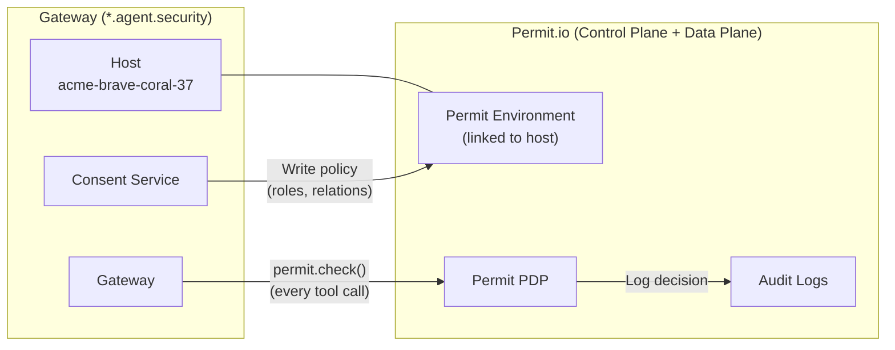
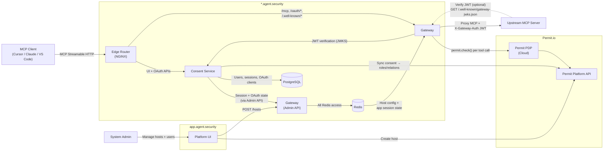
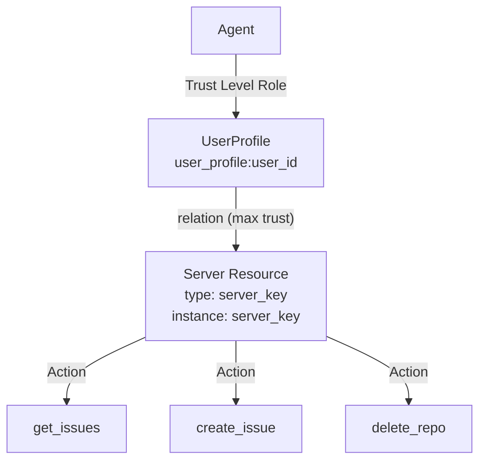
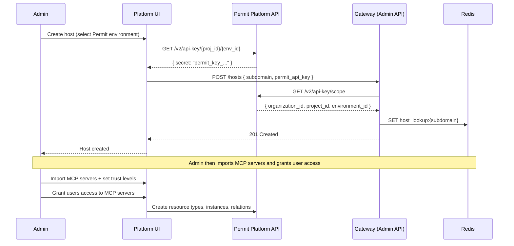
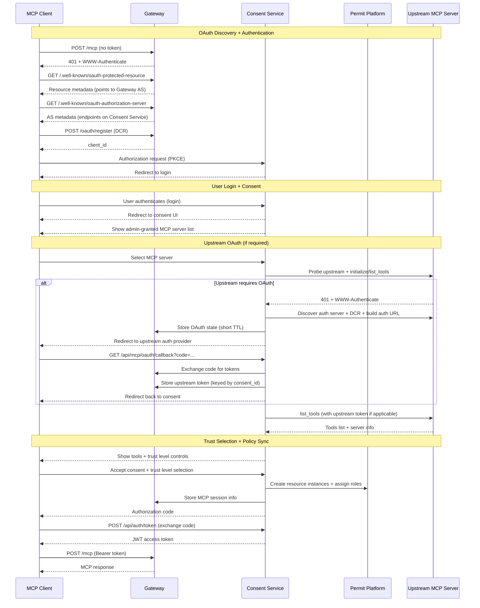
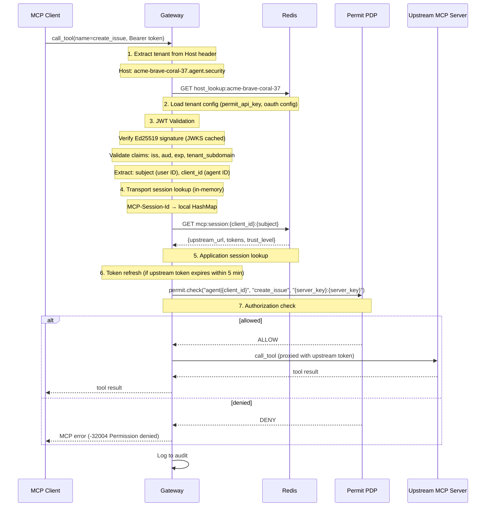
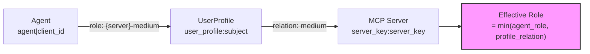
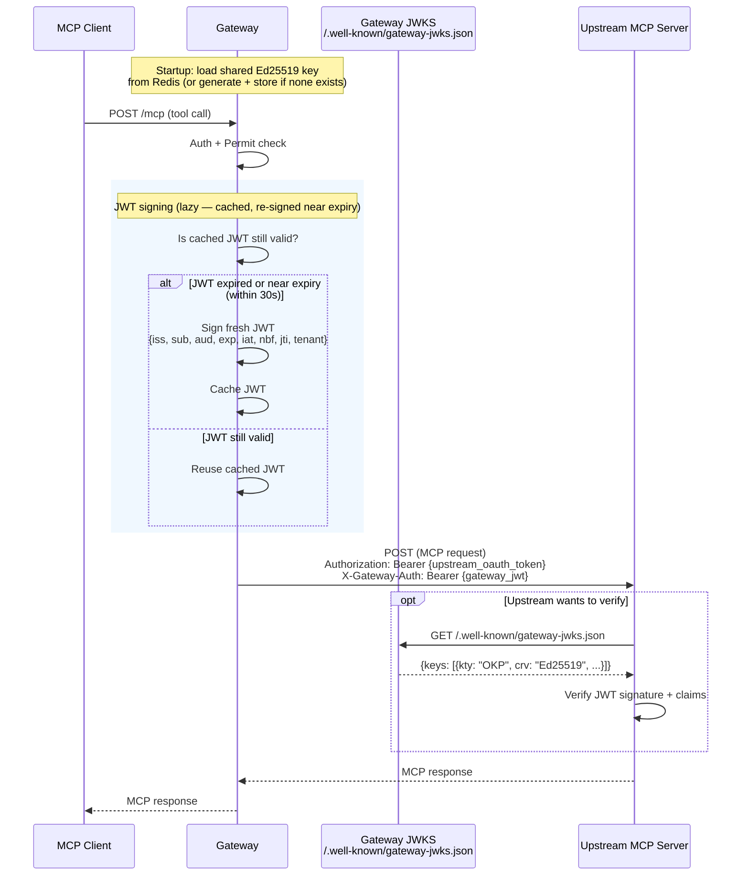

import ZoomableDiagram from '@site/src/components/ZoomableDiagram';

Learn how Permit MCP Gateway is built: which components run, where data lives, how a tool call is authorized, and how upstream Model Context Protocol (MCP) servers verify gateway traffic. This page is for platform operators, security architects, and decision makers who review the gateway before a rollout or plan a self-hosted deployment. For what the gateway does and why, start with the [Permit MCP Gateway overview](/permit-mcp-gateway/overview).

## Architecture at a glance \{#executive-summary}

Permit MCP Gateway is a proxy between MCP clients (such as Cursor, Claude Desktop, and Claude Code) and upstream MCP servers. For each connection and tool call, the gateway does three things:

1. The consent service authenticates the user and records which trust level the user grants to the agent.
2. The gateway calls `permit.check()` on each `call_tool` request, and Permit.io evaluates the call against policy.
3. Permit.io records each decision in the audit log.

The design has these properties:

| Property | How it works |
| --- | --- |
| **Transparent proxy** | MCP clients connect to the gateway URL instead of the upstream server URL. The upstream MCP server receives proxied requests and needs no code changes. |
| **Identity binding** | Each tool call is tied to a human (the user who signed in) and an agent (the MCP client acting for that user), through a relationship-based access control (ReBAC) model. |
| **Policy check on each tool call** | The decision uses the trust level the user granted the agent, the maximum trust level the admin granted the user, and the trust level of the tool. |
| **Server-side sessions** | The gateway stores upstream OAuth tokens and session state in Redis, so MCP clients never hold upstream tokens and users don't sign in again on each connection. |
| **Host isolation** | Each host (a named gateway instance) has its own subdomain, policies, users, and sessions. |

## Deployment models and where each component runs \{#deployment}

The same gateway software runs in three deployment models. The components on this page are the same in each model. What changes is who runs them and where the control plane and the policy decision point (PDP) run.

| Component | Hosted (SaaS) | Customer-controlled | Fully on-premises |
| --- | --- | --- | --- |
| Gateway and consent service | Permit runs them on `*.agent.security` | You run them in your network | You run them in your Kubernetes cluster, on your own domain |
| Admin dashboard | Permit runs it on `app.agent.security` | Contact Permit for your deployment | You run it in your Kubernetes cluster, on your own domain |
| PDP | Permit.io Cloud PDP | A PDP in your network | A PDP in your cluster, set per host in the admin dashboard |
| Control plane (policies, audit logs) | Permit.io cloud | Permit.io cloud | Your self-hosted Permit Platform |

The diagrams on this page use the hosted names (`*.agent.security`, `app.agent.security`, Cloud PDP). In a self-hosted deployment, replace them with your own domain, your PDP, and your Permit Platform. For the full comparison of the three models, see [Enterprise deployment](/permit-mcp-gateway/enterprise-deployment#deployment-models). To install the gateway in your cluster, see [On-prem installation](/permit-mcp-gateway/on-prem-installation).

## Permit.io as control plane and data plane \{#permitio-as-control-plane-and-data-plane}

Permit.io is the **control plane** and the default **data plane** for Permit MCP Gateway.

- **Control plane:** Permit.io holds the authorization model: resource types, actions, roles, relations, derived roles, and role assignments. The admin dashboard ([app.agent.security](https://app.agent.security)) and the consent service write policy changes through the Permit API. Admins can also inspect and edit the same policies in the Permit dashboard ([app.permit.io](https://app.permit.io)).
- **Data plane:** the Permit PDP evaluates each `permit.check()` call from the gateway. The hosted gateway uses the Cloud PDP. Self-hosted deployments use a PDP in your network, so authorization decisions stay inside your network.

Each gateway **host** maps to one **Permit environment**. The admin sets this link when creating the host by selecting a Permit project and environment. All resources, users, roles, and audit logs for the host live in that environment.


```mermaid
flowchart LR
  subgraph "Gateway (*.agent.security)"
    Host["Host<br/>acme-brave-coral-37"]
    GW["Gateway"]
    CS["Consent Service"]
  end

  subgraph "Permit.io (Control Plane + Data Plane)"
    Env["Permit Environment<br/>(linked to host)"]
    PDP["Permit PDP"]
    Audit["Audit Logs"]
  end

  Host --- Env
  CS -->|"Write policy<br/>(roles, relations)"| Env
  GW -->|"permit.check()<br/>(every tool call)"| PDP
  PDP -->|"Log decision"| Audit
```

Because gateway policies are standard Permit objects, they work with Permit's role-based (RBAC), attribute-based (ABAC), and relationship-based (ReBAC) access control models, with policy updates through Open Policy Administration Layer (OPAL), and with the Permit audit log API. For how hosts, tools, and trust levels map to Permit objects, see [How Permit MCP Gateway works with Permit.io](/permit-mcp-gateway/permit-integration).

## System components \{#system-architecture-overview}

<ZoomableDiagram title="System Architecture Overview">


```mermaid
flowchart LR
  Client["MCP Client<br/>(Cursor / Claude / VS Code)"]
  Admin["System Admin"]

  subgraph Tenant["*.agent.security"]
    Edge["Edge Router<br/>(NGINX)"]
    GW["Gateway"]
    GWAdmin["Gateway<br/>(Admin API)"]
    CS["Consent Service"]
    PG[(PostgreSQL)]
    REDIS[(Redis)]
  end

  subgraph Permit["Permit.io"]
    PermitPDP["Permit PDP<br/>(Cloud)"]
    PermitAPI["Permit Platform API"]
    PermitPDP --> PermitAPI
  end

  subgraph Platform["app.agent.security"]
    PlatformUI["Platform UI"]
  end

  Admin -->|"Manage hosts + users"| PlatformUI
  PlatformUI -->|"Create host"| PermitAPI
  PlatformUI -->|"POST /hosts"| GWAdmin

  Client -- "MCP Streamable HTTP" --> Edge
  Edge -- "UI + OAuth APIs" --> CS
  Edge -- "/mcp, /oauth/*,<br/>/.well-known/*" --> GW

  GWAdmin -->|"All Redis access"| REDIS
  CS -->|"Session + OAuth state<br/>(via Admin API)"| GWAdmin
  REDIS -->|"Host config +<br/>app session state"| GW

  CS -- "Users, sessions, OAuth clients" --> PG
  GW -- "JWT verification (JWKS)" --> CS
  GW -- "permit.check() per tool call" --> PermitPDP
  CS -->|"Sync consent → roles/relations"| PermitAPI

  GW -- "Proxy MCP +<br/>X-Gateway-Auth JWT" --> Upstream
  Upstream -.->|"Verify JWT (optional)<br/>GET /.well-known/gateway-jwks.json"| GW

  Upstream["Upstream MCP Server"]
```

</ZoomableDiagram>

| Component | Hosted address | What it does |
| --- | --- | --- |
| **Admin dashboard** (Platform UI) | `app.agent.security` | Admins manage hosts, MCP servers, humans, and agents. See the [admin dashboard reference](/permit-mcp-gateway/platform). |
| **Edge router** (NGINX) | `<host>.agent.security` | Routes each request by path to the gateway or the consent service. |
| **Gateway** | `<host>.agent.security/mcp` | Proxies MCP traffic and enforces authorization on each tool call. |
| **Gateway Admin API** | Internal | Stores host configuration, sessions, and OAuth state in Redis for the admin dashboard and the consent service. |
| **Consent service** | `<host>.agent.security` | OAuth 2.1 authorization server: user sign-in, consent, and upstream MCP OAuth. See [Consent service](/permit-mcp-gateway/consent-service). |
| **Permit PDP** | Cloud PDP, or your PDP when self-hosted | Evaluates each `permit.check()` call. |
| **Redis** | Internal | Host configuration, MCP sessions, upstream OAuth tokens, and the gateway JWT signing key. Only the gateway reads and writes Redis. |
| **PostgreSQL** | Internal | User accounts, OAuth clients, and authentication sessions for the consent service. |

:::info Only the gateway accesses Redis
The consent service doesn't connect to Redis. The consent service stores session and OAuth state through the Gateway Admin API, so the Redis schema lives in one component.
:::

## Where data lives and how it flows \{#data-flow}

| From | To | What moves |
| --- | --- | --- |
| MCP client | Edge router | MCP Streamable HTTP requests (`/mcp`), OAuth discovery and registration (`/.well-known/*`, `/oauth/*`), and browser traffic for sign-in and consent. |
| Edge router | Gateway | `/mcp`, `/oauth/*`, and `/.well-known/*` requests. |
| Edge router | Consent service | Sign-in, consent, and upstream OAuth callback requests (`/login`, `/consent`, `/api/auth/*`, `/api/consent/*`, `/api/mcp/*`). |
| Consent service | Gateway Admin API | Sessions, OAuth states, and pending upstream tokens, over HTTP with a bearer token. |
| Gateway Admin API | Redis | All Redis reads and writes. |
| Consent service | PostgreSQL | Users, authentication sessions, and OAuth clients. |
| Gateway | Consent service | JSON Web Key Set (JWKS) fetch to verify access tokens. The gateway caches the keys. |
| Gateway | Permit PDP | One `permit.check()` call for each tool call. |
| Consent service | Permit API | Resource instances, relations, and role assignments written when a user accepts consent. |
| Gateway | Upstream MCP server | MCP Streamable HTTP with the upstream OAuth token and a signed `X-Gateway-Auth` JWT. See [Upstream authentication](#upstream-authentication-gateway-jwt). |

In the hosted gateway, MCP traffic, including tool call parameters and upstream responses, passes through Permit's managed infrastructure. To keep that traffic inside your network, use a [customer-controlled or fully on-premises deployment](/permit-mcp-gateway/enterprise-deployment).

## Policy model

### Trust levels for tools \{#trust-level-access-control}

Each tool on an MCP server has a trust level. When an admin imports an MCP server, the admin dashboard suggests a trust level from the tool name. The admin can [override the trust level](/permit-mcp-gateway/platform#overriding-trust-levels) for any tool.

| Trust level | Suggested for tool names that contain | Typical operations |
| --- | --- | --- |
| **High** | `delete`, `remove`, `destroy`, `drop`, `purge`, `erase`, `truncate`, `terminate`, `kill`, `revoke` | Destructive |
| **Medium** | `create`, `write`, `update`, `set`, `modify`, `edit`, `put`, `post`, `insert`, `add`, `send`, `execute`, `run`, `invoke`, `submit`, `push`, `publish`, `deploy`, `apply`, `patch` | Write |
| **Low** | Any other name | Read |

The high-level words are checked first, so a tool named `delete_and_create` gets **High**. Trust levels are hierarchical: an agent with a higher trust level can call all tools at lower levels.

### How the gateway builds ReBAC policy \{#policy-architecture}

Permit MCP Gateway generates [Google Zanzibar](/modeling/google-drive)-style ReBAC policies from:

- The roles for users and agents.
- The MCP servers imported into the host.
- The trust level each user grants an agent during consent.
- A `user_profile` resource that links each user to the agents acting for that user.

Each MCP server maps to a **Permit resource type** whose key is the server key, such as `linear`. The server's tools become **actions** on that resource type, using slugified tool names such as `create_issue`. There are no separate resource instances per tool: the server is both the resource type and the single resource instance.

The agent's permission on a server comes from a three-part chain: **Agent** has a role on the **UserProfile**, and the **UserProfile** has a relation to the **MCP server**. The effective permission is `min(agent_role_on_profile, profile_relation_to_server)`. The human's relation to the server is a ceiling: an agent can't use a higher trust level than the admin granted the human, whatever trust level the user selected during consent.


```mermaid
graph TD
    A[Agent] --Trust Level Role--> UP[UserProfile<br/>user_profile:user_id]
    UP --"relation (max trust)"--> S[Server Resource<br/>type: server_key<br/>instance: server_key]
    S --Action--> F1[get_issues]
    S --Action--> F2[create_issue]
    S --Action--> F3[delete_repo]
```

For the full derivation, see [Authorization: trust ceiling](#authorization-trust-ceiling-min-logic).

## Authentication and authorization flows \{#authentication--authorization}

### How users and agents are identified \{#how-it-works}

The gateway builds a Permit user key from the caller type:

- **Human:** `human|{subject}`, where `subject` is the signed-in user's ID. The consent service and the admin dashboard use this key for policy management, such as granting a user access to an MCP server.
- **Agent:** `agent|{client_id}`, where `client_id` is the OAuth client ID of the MCP client. The gateway uses this key in the `permit.check()` call for each tool call.

The flows below run in this order:

1. **Admin setup, once per host:** the admin creates a host, imports MCP servers, and grants users access.
2. **User connection, once per MCP client and server:** the user signs in, picks a server, completes upstream OAuth if the server requires it, and grants a trust level. The gateway then issues a JWT access token to the MCP client.
3. **Each tool call:** the gateway verifies the JWT, identifies the agent, checks Permit, and proxies allowed calls.

### Sequence: admin setup flow \{#sequence-admin-setup-flow}

The admin creates a host in the admin dashboard by selecting a Permit project and environment. The admin dashboard gets the environment's API key, the gateway resolves the key's scope, and the gateway stores the host configuration in Redis.


```mermaid
sequenceDiagram
    participant A as Admin
    participant Platform as Platform UI
    participant PermitAPI as Permit Platform API
    participant GW as Gateway (Admin API)
    participant R as Redis

    A->>Platform: Create host (select Permit environment)
    Platform->>PermitAPI: GET /v2/api-key/{proj_id}/{env_id}
    PermitAPI-->>Platform: { secret: "permit_key_..." }
    Platform->>GW: POST /hosts { subdomain, permit_api_key }
    GW->>PermitAPI: GET /v2/api-key/scope
    PermitAPI-->>GW: { organization_id, project_id, environment_id }
    GW->>R: SET host_lookup:{subdomain}
    GW-->>Platform: 201 Created
    Platform-->>A: Host created

    Note over A,R: Admin then imports MCP servers and grants user access
    A->>Platform: Import MCP servers + set trust levels
    A->>Platform: Grant users access to MCP servers
    Platform->>PermitAPI: Create resource types, instances, relations
```

For the admin steps in the dashboard, see [Set up hosts for your organization](/permit-mcp-gateway/host-setup).

### Sequence: user consent flow \{#sequence-user-consent-flow}

The first time a user connects an MCP client, the client discovers the gateway's OAuth endpoints and the user signs in and grants consent. If the upstream MCP server requires OAuth, the consent service runs that OAuth flow and stores the upstream token in the gateway. The diagram shows the protocol messages. For each screen the user sees, and for session expiry and re-consent, see [Consent service](/permit-mcp-gateway/consent-service).


```mermaid
sequenceDiagram
    participant C as MCP Client
    participant GW as Gateway
    participant CS as Consent Service
    participant PermitAPI as Permit Platform
    participant Up as Upstream MCP Server

    Note over C,Up: OAuth Discovery + Authentication
    C->>GW: POST /mcp (no token)
    GW-->>C: 401 + WWW-Authenticate
    C->>GW: GET /.well-known/oauth-protected-resource
    GW-->>C: Resource metadata (points to Gateway AS)
    C->>GW: GET /.well-known/oauth-authorization-server
    GW-->>C: AS metadata (endpoints on Consent Service)
    C->>GW: POST /oauth/register (DCR)
    GW-->>C: client_id
    C->>CS: Authorization request (PKCE)
    CS-->>C: Redirect to login

    Note over C,Up: User Login + Consent
    C->>CS: User authenticates (login)
    CS-->>C: Redirect to consent UI
    CS-->>C: Show admin-granted MCP server list

    Note over C,Up: Upstream OAuth (if required)
    C->>CS: Select MCP server
    CS->>Up: Probe upstream + initialize/list_tools
    alt Upstream requires OAuth
        Up-->>CS: 401 + WWW-Authenticate
        CS->>Up: Discover auth server + DCR + build auth URL
        CS->>GW: Store OAuth state (short TTL)
        CS-->>C: Redirect to upstream auth provider
        C->>CS: GET /api/mcp/oauth/callback?code=...
        CS->>GW: Exchange code for tokens
        CS->>GW: Store upstream token (keyed by consent_id)
        CS-->>C: Redirect back to consent
    end
    CS->>Up: list_tools (with upstream token if applicable)
    Up-->>CS: Tools list + server info

    Note over C,Up: Trust Selection + Policy Sync
    CS-->>C: Show tools + trust level controls
    C->>CS: Accept consent + trust level selection
    CS->>PermitAPI: Create resource instances + assign roles
    CS->>GW: Store MCP session info
    CS-->>C: Authorization code
    C->>CS: POST /api/auth/token (exchange code)
    CS-->>C: JWT access token
    C->>GW: POST /mcp (Bearer token)
    GW-->>C: MCP response
```

:::info Server allow-list
By default, a user can connect only to MCP servers that the admin imported and granted the user access to. The consent service checks that the upstream URL matches one of those servers. If the admin turns on **Dynamic MCPs** for the host, users can also enter their own upstream MCP server URL during consent. See [Dynamic MCPs](#dynamic-mcps).
:::

### Sequence: authorization decision flow \{#sequence-authorization-decision-flow}

When a `call_tool` request reaches the gateway, the gateway runs these steps before it proxies the call to the upstream MCP server.


```mermaid
sequenceDiagram
    participant C as MCP Client
    participant GW as Gateway
    participant R as Redis
    participant PDP as Permit PDP
    participant Up as Upstream MCP Server

    C->>GW: call_tool(name=create_issue, Bearer token)

    Note over GW: 1. Extract tenant from Host header
    Note over GW: Host: acme-brave-coral-37.agent.security

    GW->>R: GET host_lookup:acme-brave-coral-37
    Note over GW,R: 2. Load tenant config (permit_api_key, oauth config)

    Note over GW: 3. JWT Validation
    Note over GW: Verify Ed25519 signature (JWKS cached)
    Note over GW: Validate claims: iss, aud, exp, tenant_subdomain
    Note over GW: Extract: subject (user ID), client_id (agent ID)

    Note over GW: 4. Transport session lookup (in-memory)
    Note over GW: MCP-Session-Id → local HashMap

    GW->>R: GET mcp:session:{client_id}:{subject}
    R-->>GW: {upstream_url, tokens, trust_level}
    Note over GW,R: 5. Application session lookup

    Note over GW: 6. Token refresh (if upstream token expires within 5 min)

    GW->>PDP: permit.check("agent|{client_id}", "create_issue", "{server_key}:{server_key}")
    Note over GW,PDP: 7. Authorization check

    alt allowed
        PDP-->>GW: ALLOW
        GW->>Up: call_tool (proxied with upstream token)
        Up-->>GW: tool result
        GW-->>C: tool result
    else denied
        PDP-->>GW: DENY
        GW-->>C: MCP error (-32004 Permission denied)
    end
    GW->>GW: Log to audit
```

A denied call returns MCP error code `-32004` (Permission denied) to the MCP client. When a host uses [Agent Interrogation](/permit-mcp-gateway/advanced-features#agent-interrogation) or a tool requires [human-in-the-loop approval](/permit-mcp-gateway/human-in-the-loop), those checks run in the same chain before the call reaches the upstream server. To investigate a decision, see [Audit logs](/permit-mcp-gateway/audit-logs).

:::note Tool lists are not filtered
The gateway returns **all upstream tools** in `list_tools` responses, whatever the agent's trust level. Enforcement happens on `call_tool`, so an agent can see a tool that it can't call.
:::

### Authorization: trust ceiling (min logic) \{#authorization-trust-ceiling-min-logic}

The effective permission on an MCP server is the **minimum** of two values: the agent's trust level and the human's relation to the server. The human's relation is a ceiling on what any of that human's agents can do.


```mermaid
flowchart LR
    Agent["Agent<br/>agent|client_id"]
    Profile["UserProfile<br/>user_profile:subject"]
    Server["MCP Server<br/>server_key:server_key"]
    Result["Effective Role<br/>= min(agent_role, profile_relation)"]

    Agent -->|"role: {server}-medium"| Profile
    Profile -->|"relation: medium"| Server
    Server --> Result

    style Result fill:#f9f,stroke:#333,stroke-width:2px
```

Permit implements `min()` with nine derived role rules for each MCP server:

| Agent role on profile | Profile relation to server | Effective server role |
| --- | --- | --- |
| `{server}-high` | `high` | **high** |
| `{server}-high` | `medium` | **medium** (capped) |
| `{server}-high` | `low` | **low** (capped) |
| `{server}-medium` | `high` | **medium** |
| `{server}-medium` | `medium` | **medium** |
| `{server}-medium` | `low` | **low** (capped) |
| `{server}-low` | `high` | **low** |
| `{server}-low` | `medium` | **low** |
| `{server}-low` | `low` | **low** |

The effective role decides which tools the agent can call:

| Tool trust level | Effective roles that can call the tool |
| --- | --- |
| **Low** | `low`, `medium`, `high` |
| **Medium** | `medium`, `high` |
| **High** | `high` |

### Example outcomes by agent \{#agent-configuration-examples}

The trust level a user selects during consent becomes the agent's role. This table shows example results for fictional users, assuming each user's maximum trust level is at least the level granted:

| Agent (MCP client) | User | MCP server | Trust level granted | Example allowed tools | Example denied tools |
|---|---|---|---|---|---|
| Cursor | alice | `linear_mcp` | Medium | `get_issues`, `create_issue` | `delete_project` |
| Claude Desktop | alice | `github_mcp` | Low | `list_repos`, `get_file` | `create_issue`, `delete_repo` |
| VS Code Copilot | bob | `github_mcp` | High | `get_file`, `create_issue`, `delete_repo` | None: High includes all tools |
| Claude Code | carol | `slack_mcp` | Medium | `search_messages`, `send_message` | `remove_member` |

To change these grants in the admin dashboard, see [Managing humans and agents](/permit-mcp-gateway/managing-humans-and-agents).

## Upstream authentication (gateway JWT) \{#upstream-authentication-gateway-jwt}

When the gateway proxies a request to an upstream MCP server, it adds a short-lived JSON Web Token (JWT), signed by the gateway, in the `X-Gateway-Auth` header. The upstream OAuth token stays in the `Authorization` header. An upstream server that verifies the `X-Gateway-Auth` JWT can reject agents that connect to the upstream URL directly and skip the gateway's authentication, authorization, and consent checks.

The gateway always sends the header, and there is nothing to turn on. Verification is up to the upstream server. An upstream server that doesn't verify the header ignores it and behaves as before.

### How the gateway signs upstream requests \{#how-it-works-1}

- The gateway signs JWTs with an Ed25519 key stored in Redis and shared by all gateway replicas, so any replica serves the same public key.
- The public key is published at `GET /.well-known/gateway-jwks.json` on the host. The endpoint needs no authentication and sends `Cache-Control: public, max-age=300` (5 minutes).
- Each JWT carries the signed-in user's ID, the upstream URL as audience, and the host subdomain.
- The gateway reuses a JWT until 30 seconds before it expires, then signs a new one. Long-lived MCP sessions always send a valid token without signing on every request.


```mermaid
sequenceDiagram
    participant Client as MCP Client
    participant GW as Gateway
    participant JWKS as Gateway JWKS<br/>/.well-known/gateway-jwks.json
    participant Up as Upstream MCP Server

    Note over GW: Startup: load shared Ed25519 key<br/>from Redis (or generate + store if none exists)

    Client->>GW: POST /mcp (tool call)
    GW->>GW: Auth + Permit check

    rect rgb(240, 248, 255)
        Note over GW: JWT signing (lazy — cached, re-signed near expiry)
        GW->>GW: Is cached JWT still valid?
        alt JWT expired or near expiry (within 30s)
            GW->>GW: Sign fresh JWT<br/>{iss, sub, aud, exp, iat, nbf, jti, tenant}
            GW->>GW: Cache JWT
        else JWT still valid
            GW->>GW: Reuse cached JWT
        end
    end

    GW->>Up: POST (MCP request)<br/>Authorization: Bearer {upstream_oauth_token}<br/>X-Gateway-Auth: Bearer {gateway_jwt}

    opt Upstream wants to verify
        Up->>JWKS: GET /.well-known/gateway-jwks.json
        JWKS-->>Up: {keys: [{kty: "OKP", crv: "Ed25519", ...}]}
        Up->>Up: Verify JWT signature + claims
    end

    Up-->>GW: MCP response
    GW-->>Client: MCP response
```

### JWT claims

| Claim | Value | Purpose |
| --- | --- | --- |
| `iss` | `agent-security-gateway` | Identifies the issuer |
| `sub` | Signed-in user ID | The user the request is made for |
| `aud` | Canonical upstream URL: host lowercased, all trailing slashes (including the root `/`) removed | Intended recipient |
| `exp` | Issue time plus the token lifetime (5 minutes by default) | Token expiry |
| `iat` | Issue time minus 30 seconds (clock-skew leeway) | When the token was issued |
| `nbf` | Issue time minus 30 seconds (clock-skew leeway) | Not valid before this time |
| `jti` | Unique UUID | Unique token ID |
| `tenant` | Host subdomain | The host the request belongs to |

### Two authentication headers on upstream requests \{#two-auth-headers-coexist}

Each upstream request carries two headers with different purposes:

| Header | Issued by | What it proves |
| --- | --- | --- |
| `Authorization: Bearer <token>` | The upstream server's OAuth provider | The user authorized this request with the upstream service |
| `X-Gateway-Auth: Bearer <jwt>` | The gateway | The request came from this gateway host |

### Verify gateway requests on the upstream MCP server \{#verifying-on-the-upstream-side}

To reject traffic that doesn't come through the gateway, verify the `X-Gateway-Auth` header on each request against the gateway's JWKS. This example uses the [`jose`](https://www.npmjs.com/package/jose) library in a Node.js request handler, where `req` and `res` are the HTTP request and response:

```js
import { createRemoteJWKSet, jwtVerify } from 'jose';

const JWKS = createRemoteJWKSet(
  new URL('https://<tenant>.agent.security/.well-known/gateway-jwks.json')
);

const auth = req.headers['x-gateway-auth'];
if (typeof auth !== 'string' || !auth.startsWith('Bearer ')) {
  return res.status(401).end();
}

const { payload } = await jwtVerify(
  auth.slice(7).trim(),
  JWKS,
  {
    issuer: 'agent-security-gateway',
    audience: 'https://your-mcp-server.example.com', // canonical: lowercase host, no trailing slash
    algorithms: ['EdDSA'],
    clockTolerance: 30,
  }
);
```

Replace these values:

| Placeholder | Replace with |
| --- | --- |
| `<tenant>` | Your host subdomain. In a self-hosted deployment, use your gateway base domain instead of `agent.security`. |
| `https://your-mcp-server.example.com` | The canonical form of your upstream URL: host lowercased and all trailing slashes removed. For example, `https://MCP.Example.com/` becomes `https://mcp.example.com`, and `https://your-server.example.com/v1/` becomes `https://your-server.example.com/v1`. |

`jwtVerify` throws an error when the signature, issuer, audience, or time claims don't match. Return HTTP 401 in that case, and for any request without the header. A request that passes verification returns the claims in `payload`, with the user ID in `payload.sub`.

The JWKS URL and a sample verification snippet for each host are in the admin dashboard under **Settings > Upstream Authentication (JWT)**.

:::warning Set a clock tolerance of at least 30 seconds
The gateway backdates `iat` and `nbf` by 30 seconds. If your verifier's clock runs ahead of the gateway's clock and the verifier has no clock tolerance, the verifier rejects valid tokens. Set a tolerance of at least 30 seconds, such as `clockTolerance: 30` in `jose`.
:::

:::note Replay protection is up to the verifier
The `jti` claim is unique per token, but `jwtVerify` doesn't check whether it has seen a `jti` before. For replay protection, store each `jti` you accept for at least the token lifetime plus 30 seconds, for example in a Redis set with that expiry, and reject a `jti` that is already stored.
:::

### Signing key rotation \{#key-rotation}

The gateway doesn't rotate its signing key automatically. After the key is 90 days old, the gateway logs a warning and reports the key's age in the `gateway_jwt_signing_key_age_seconds` metric. Each JWT has a `kid` (key ID) header. A JWT library with JWKS caching, such as `jose`, fetches the JWKS again when it sees an unknown `kid`, so a rotation needs no change on upstream verifiers.

If you run the gateway yourself, contact your Permit team for the rotation procedure for your deployment.

## Rate limiting

The hosted gateway limits requests per client IP address on authentication, OAuth client registration, and MCP endpoints. There is nothing to configure. A request over a limit gets **HTTP 429** with this JSON body:

```json
{
  "error": "rate_limited",
  "message": "You have exceeded the rate limit. Please try again later."
}
```

Permit sets the limit values and can change them, so this page doesn't list them. The limits allow for corporate networks where many users share one public IP address. If users behind one IP address get HTTP 429 responses in normal use, contact [Permit support](https://permit.io/support).

### Handle HTTP 429 responses in MCP clients \{#handling-429-responses-in-mcp-clients}

When an MCP client or agent gets an HTTP 429 response:

1. **Check the response body.** An `error` value of `rate_limited` means a gateway rate limit was hit, not an application error.
2. **Wait and retry.** Back off for a few seconds before retrying, and increase the wait on each retry.
3. **Reduce concurrency.** If several agents share one IP address, lower the number of parallel requests.

## Dynamic MCPs

Dynamic MCPs let users connect to an MCP server URL of their choice during consent, in addition to the servers the admin imported. To turn on Dynamic MCPs, see [Admin dashboard reference: Dynamic MCPs](/permit-mcp-gateway/platform#dynamic-mcps).

In Permit, the consent service creates a separate resource type for each user's dynamic MCP server. The resource type key is `{serverKey}-{userId}`, and the resource has the attribute `mcp_server_type: "dynamic"`. The host-level setting is enforced through a `connect_dynamic_mcp` action on the `user_profile` resource.

## Glossary

| Term | Meaning |
| --- | --- |
| **MCP** | Model Context Protocol, an open standard that connects AI tools to external services |
| **Human** | The user who signs in and delegates access to agents |
| **Agent** | An MCP client that acts for a user |
| **Host** | A named gateway instance with its own subdomain, policies, users, and sessions |
| **Trust level** | Risk classification (low, medium, high) that decides which tools an agent can call |
| **PDP** | Policy decision point, the Permit component that evaluates authorization requests |
| **HITL** | Human-in-the-loop approval of a tool call |
| **ReBAC** | Relationship-based access control |
| **OPAL** | Open Policy Administration Layer, which pushes policy updates to PDPs |
| **OPA** | Open Policy Agent, the policy engine inside the Permit PDP |

## Next steps

- [Enterprise deployment](/permit-mcp-gateway/enterprise-deployment): compare the hosted, customer-controlled, and fully on-premises models.
- [On-prem installation](/permit-mcp-gateway/on-prem-installation): install the gateway in your Kubernetes cluster.
- [Consent service](/permit-mcp-gateway/consent-service): the screens users see when they authorize an agent, and session expiry.
- [How Permit MCP Gateway works with Permit.io](/permit-mcp-gateway/permit-integration): the policy objects the gateway creates in Permit.
- [Audit logs](/permit-mcp-gateway/audit-logs): investigate allowed and denied tool calls.
