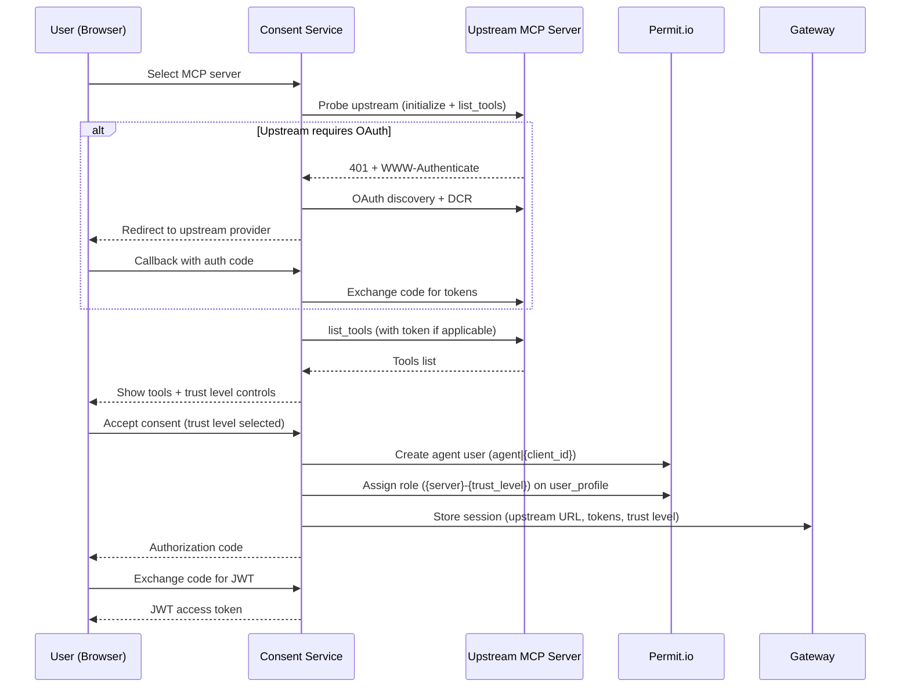

# Consent Service

The Consent Service is the user-facing component of Permit MCP Gateway where humans authenticate and grant permissions to their AI agents. It serves as the OAuth 2.1 Authorization Server hosted at each gateway subdomain (e.g., `acme-brave-coral-37.agent.security`).

When a user connects an MCP client like Cursor or Claude Desktop for the first time, the Consent Service handles the entire authorization flow — from login through trust level selection to issuing the access token that lets the agent make tool calls.

## The user journey

### 1. MCP client triggers OAuth

When the user's MCP client (Cursor, Claude Desktop, VS Code, Claude Code) connects to the gateway for the first time, it receives a `401 Unauthorized` response. The client then discovers the OAuth endpoints via `/.well-known/oauth-authorization-server` (served by the Gateway, which returns metadata pointing to the Consent Service's authorization endpoints) and opens a browser window for the user to authenticate.

### 2. Login

The user authenticates using whichever methods the admin has configured for this host — email/password, email OTP, passkeys, social providers (Google, GitHub, Microsoft), or enterprise SSO (SAML, OIDC).


### 3. Server selection

After signing in, the consent screen shows a list of MCP servers the admin has [granted the user access to](/permit-mcp-gateway/guide#4-grant-user-access-to-mcp-servers). The user selects the server they want to connect to from this pre-approved list. If the admin has enabled **Dynamic MCPs** on the host, users also have the option to enter a custom MCP server URL — see [Platform: Dynamic MCPs](/permit-mcp-gateway/platform#dynamic-mcps) for details.


:::note No servers?
If the user has not been granted access to any MCP server by the admin, they will see an empty state and won't be able to proceed. The admin must [grant access](/permit-mcp-gateway/guide#4-grant-user-access-to-mcp-servers) first.


:::

After selecting a server, the Consent Service connects to verify the server is reachable and probes it to discover its available tools.


### 4. Upstream OAuth

If the selected MCP server requires authentication (e.g., GitHub, Linear), the user is redirected to the upstream provider to sign in and authorize access. This is handled transparently by the Consent Service:

1. The Consent Service probes the upstream server and receives a `401` indicating OAuth is required
2. It discovers the upstream server's OAuth authorization server
3. It registers as a client (via Dynamic Client Registration) or uses pre-configured credentials
4. The user is redirected to the upstream provider to authorize
5. On callback, the Consent Service exchanges the authorization code for tokens
6. The upstream tokens are stored securely and used for all future tool calls proxied through the gateway


If the MCP server does not require OAuth, this step is skipped entirely.

### 5. Trust level selection

The consent screen displays all discovered tools from the selected MCP server. As the user adjusts the trust level slider, each tool dynamically shows an **Allowed** or **Denied** badge based on its required trust level — giving the user a clear picture of what each level grants. The user chooses the trust level they want to grant their agent, up to the maximum level the admin configured:

| Trust level | What the agent can do |
| ----------- | --------------------- |
| **Low** | Read-only tools (e.g., `get_issues`, `list_repos`) |
| **Medium** | Low + write tools (e.g., `create_issue`, `send_message`) |
| **High** | Low + medium + destructive tools (e.g., `delete_repo`, `remove_member`) |

The consent UI visually shows which tools are allowed and denied at each level. Trust levels above the admin-configured maximum are disabled — the user cannot select them.


### 6. Authorize

The user clicks **Authorize Agent** to grant consent. This confirms the selected MCP server and trust level for the current agent (MCP client).

### 7. Sync and redirect

After the user authorizes, several things happen:


1. **Permissions sync to Permit** — the Consent Service creates the necessary relationships in Permit.io:
   - An agent user is created (identified as `agent|{client_id}`)
   - The agent is assigned a trust-level role (e.g., `linear-medium`) on the user's profile
   - The user's existing profile-to-server relation (set by the admin) is verified as the trust ceiling
2. **Session creation** — the Consent Service sends session data (upstream URL, tokens, trust level) to the Gateway via the Admin API, which stores it in Redis
3. **Authorization code issued** — the Consent Service issues an OAuth authorization code
4. **Token exchange** — the MCP client exchanges the code for a JWT access token
5. **Redirect** — the user is redirected back to their MCP client, which can now make authorized tool calls

## What happens behind the scenes

When a user goes through the consent flow, the Consent Service orchestrates multiple systems:



### Tool discovery

When the user selects an MCP server, the Consent Service connects to the upstream server and calls `list_tools` to discover all available tools. Each tool is automatically classified into a trust level based on naming patterns — the same classification the admin saw during [MCP server import](/permit-mcp-gateway/platform#tool-auto-discovery-and-trust-level-classification). The consent screen then shows all tools with dynamic Allowed/Denied indicators that update as the user moves the trust level slider, so they can see exactly what each trust level grants before committing.

### Permit relationship creation

When the user accepts consent, the Consent Service creates the following in Permit.io:

- **Agent user**: `agent|{client_id}` — represents this specific MCP client
- **User profile**: `user_profile:{user_id}` — the human's profile (created on first sign-in if it doesn't exist)
- **Agent role on profile**: The agent is assigned a role like `linear-medium` on the user's profile, indicating it can use the Linear MCP server at medium trust
- **Profile-to-server relation**: Confirms the human's access to the MCP server (set by the admin during [access granting](/permit-mcp-gateway/guide#4-grant-user-access-to-mcp-servers))

The effective trust level for any tool call is `min(agent_role, profile_relation)` — the human's admin-granted max trust acts as a ceiling on what any agent can actually exercise. See [Architecture: Trust Ceiling](/permit-mcp-gateway/architecture#authorization-trust-ceiling-min-logic) for the full derivation.

## Session lifecycle

After the consent flow completes, the Gateway creates a session that persists across MCP client restarts. Sessions are stored in Redis and keyed by the agent's client ID and the user's subject.

### Session types

The Gateway manages two distinct session layers:

| Session type | Storage | Purpose |
| ------------ | ------- | ------- |
| **Transport session** | In-memory (Gateway) | Tracks the active MCP-over-HTTP connection. Recreated automatically on reconnect using the stored application session. |
| **Application session** | Redis | Stores the upstream MCP URL, OAuth tokens, consented trust level, and server key. Persists across client restarts. |

### Session expiry

The Gateway enforces two TTLs on application sessions:

| Expiry type | Duration | What happens |
| ----------- | -------- | ------------ |
| **Soft TTL (inactivity)** | 30 days | If no tool calls are made for 30 days, the session is removed. Each tool call resets this timer, so actively used sessions do not expire. The user must re-consent to create a new session. |
| **Hard TTL (absolute)** | 90 days | Maximum session lifetime regardless of activity. After 90 days the session is removed from Redis and the user must re-consent. |
| **Manual revocation** | Immediate | An admin can revoke access from the [Agents](/permit-mcp-gateway/managing-humans-and-agents#revoking-an-individual-agent) or [Humans](/permit-mcp-gateway/managing-humans-and-agents#revoking-a-humans-access) page, which immediately invalidates the session. |

:::info Session vs. consent permissions
These TTLs apply to the **application session** (stored in Redis). Consent permissions (role assignments in Permit.io) persist independently — they are not affected by session expiry and remain active until explicitly revoked by an admin.
:::

### Re-consent

When a session expires or is revoked, the user goes through the consent flow again on their next connection. This is also how users **change their trust level** — disconnect the MCP server in their client, reconnect, and select a different trust level during the new consent flow.

### Token refresh

If the upstream MCP server issued OAuth tokens with a refresh token, the Gateway automatically refreshes the access token before it expires (within a 5-minute window). This happens transparently — the user does not need to re-authenticate with the upstream provider.

## Pre-configured URLs

Admins can create URLs that pre-select a specific MCP server in the consent flow by appending the `upstream_mcp` query parameter:

```
https://acme-brave-coral-37.agent.security/mcp?upstream_mcp=https://mcp.linear.app/mcp
```

When a user connects with this URL:

1. The consent flow opens as usual (login is still required)
2. The server selection step has the specified MCP server **pre-selected**
3. The user proceeds directly to trust level selection

This is useful for:

- **Team onboarding** — distribute a URL that points directly to the team's primary MCP server
- **Per-server setup links** — include in onboarding docs or Slack messages
- **Reducing friction** — skip the server selection step for users who need a specific server

:::info Access still required
The `upstream_mcp` parameter only pre-selects the server — it does not bypass access control. The user must still have been [granted access](/permit-mcp-gateway/guide#4-grant-user-access-to-mcp-servers) to the specified server by an admin. If they haven't, the pre-selection is ignored and they see only the servers they have access to.
:::

Admins can set up pre-configured URLs from the [Platform](/permit-mcp-gateway/platform) — the server detail page shows the upstream URL that can be used as the `upstream_mcp` value. See the [Host Setup Guide](/permit-mcp-gateway/host-setup#pre-selected-mcp-server-urls) for more on distributing these URLs to teams.

### Path-based server selection

As an alternative to the `upstream_mcp` query parameter, you can use a **path-based URL** that routes directly to a specific static MCP server:

```
https://acme-brave-coral-37.agent.security/mcp/linear
```

Where `linear` is the server key assigned during import. When using this URL, the MCP client connects directly to the specified server — the consent flow still runs (login + trust level selection), but the server selection step is bypassed entirely.

This is useful for distributing server-specific gateway URLs where each URL is dedicated to a single MCP server.
