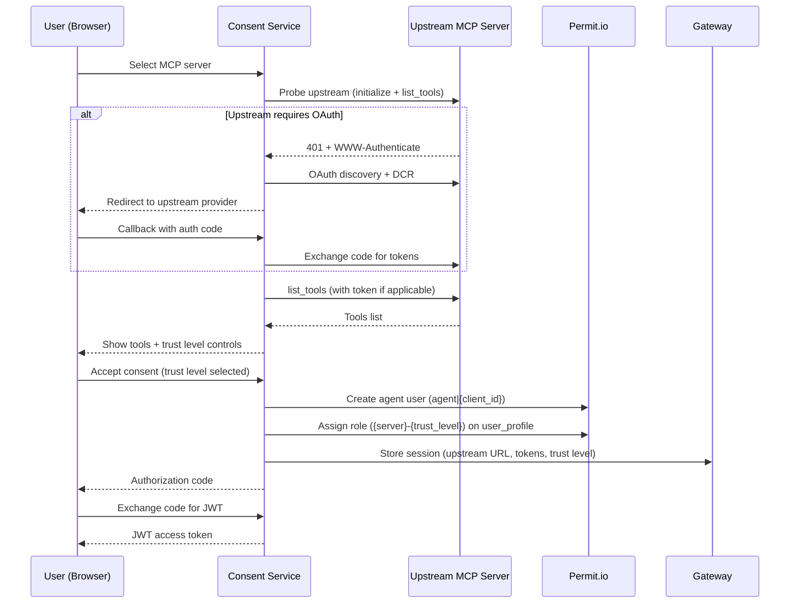

Learn what happens when a user connects an MCP client to Permit MCP Gateway: how the Consent Service signs the user in, lets the user choose an MCP server and a trust level, writes the agent's permissions to Permit, and starts a session. This page is for gateway admins and implementers who roll out the gateway, support users through consent, or debug a connection.

The Consent Service is the user-facing part of Permit MCP Gateway. It is the OAuth 2.1 authorization server for each gateway host, served at the host's subdomain, for example `acme-brave-coral-37.agent.security`. For the step-by-step setup that ends with a user's first consent, see [Complete the consent flow](/permit-mcp-gateway/guide#7-user-consent-flow).

## The consent flow step by step \{#the-user-journey}

The consent flow runs the first time a user connects an MCP client, such as Cursor, Claude Desktop, VS Code, or Claude Code, to the gateway. The flow runs again when the session ends. See [Session lifecycle](#session-lifecycle).

### 1. The MCP client starts OAuth \{#1-mcp-client-triggers-oauth}

The MCP client connects to the gateway and receives `401 Unauthorized`. The client reads the gateway's `/.well-known/oauth-authorization-server` metadata, which points to the Consent Service's authorization endpoints. The client then opens a browser window for the user.

### 2. The user signs in \{#2-login}

The user signs in with a method the admin turned on for the host: email and password, email one-time passcode (OTP), passkeys, Google, GitHub, or Microsoft OAuth, or SAML or OpenID Connect (OIDC) single sign-on (SSO). For each method and its setup, see the [Authentication methods reference](/permit-mcp-gateway/authentication-methods).


### 3. The user selects an MCP server \{#3-server-selection}

The consent screen lists the MCP servers the admin [granted the user access to](/permit-mcp-gateway/guide#4-grant-user-access-to-mcp-servers). The user selects one server. When the admin turns on **Dynamic MCPs** for the host, the user can also enter a custom MCP server URL. See [Dynamic MCPs](/permit-mcp-gateway/platform#dynamic-mcps).


:::note Empty server list
If the admin hasn't granted the user access to any MCP server, the consent screen shows an empty state and the user can't continue. The admin [grants access](/permit-mcp-gateway/guide#4-grant-user-access-to-mcp-servers) first, and the user then reconnects.


:::

After the user selects a server, the Consent Service connects to the server to check that it is reachable and to list its tools.


### 4. The user signs in to the upstream MCP server \{#4-upstream-oauth}

If the selected MCP server requires OAuth, such as GitHub or Linear, the Consent Service runs the upstream OAuth flow:

1. The Consent Service connects to the upstream MCP server and receives `401`, which means the server requires OAuth.
2. The Consent Service discovers the upstream server's OAuth authorization server.
3. The Consent Service registers as an OAuth client through Dynamic Client Registration (DCR), or uses pre-configured client credentials.
4. The browser redirects the user to the upstream provider to authorize access.
5. On the callback, the Consent Service exchanges the authorization code for upstream tokens.
6. The gateway stores the upstream tokens in the user's session and uses them for the user's tool calls to that server.


If the MCP server doesn't require OAuth, the flow skips this step.

### 5. The user selects a trust level \{#5-trust-level-selection}

The consent screen lists the server's tools and a trust level slider. Each tool shows an **Allowed** or **Denied** badge for the selected trust level, so the user sees what the agent can call before accepting.

| Trust level | Tools the agent can call |
| ----------- | --------------------- |
| **Low** | Read-only tools, for example `get_issues` or `list_repos` |
| **Medium** | Low tools and write tools, for example `create_issue` or `send_message` |
| **High** | Low, medium, and destructive tools, for example `delete_repo` or `remove_member` |

The slider shows all three levels. Levels above the max trust level the admin set for the user on this server are disabled, and the user can't select them.

For a server the user added through Dynamic MCPs, the user can also change the trust level of individual tools, up to the max trust level.


### 6. The user accepts \{#6-authorize}

The user clicks **Accept** to grant consent for the selected MCP server and trust level to this agent (MCP client). **Deny** ends the flow without granting access.

### 7. The Consent Service saves permissions and returns to the client \{#7-sync-and-redirect}


After the user accepts:

1. **Permit sync:** the Consent Service creates the agent user `agent|{client_id}` in Permit and assigns the agent a trust level role, such as `linear-medium`, on the user's profile. The request fails if the trust level is above the user's max trust level for the server.
2. **Session creation:** the Consent Service sends the session data (upstream URL, upstream tokens, trust level) to the gateway, which stores the session in Redis. The Consent Service creates the session only after the Permit sync succeeds.
3. **Authorization code:** the Consent Service issues an OAuth authorization code.
4. **Token exchange:** the MCP client exchanges the code for a JSON Web Token (JWT) access token.
5. **Redirect:** the browser returns the user to the MCP client, which can now call tools through the gateway.

**Result:** the agent appears on the **Agents** page of the gateway dashboard, and its tool calls appear on the agent's **Audit Logs** tab. See [Audit logs](/permit-mcp-gateway/audit-logs).

## What the Consent Service does behind the screens \{#what-happens-behind-the-scenes}

This sequence shows the calls between the browser, the Consent Service, the upstream MCP server, Permit, and the gateway during one consent flow:


```mermaid
sequenceDiagram
    participant User as User (Browser)
    participant CS as Consent Service
    participant Up as Upstream MCP Server
    participant Permit as Permit.io
    participant GW as Gateway

    User->>CS: Select MCP server
    CS->>Up: Probe upstream (initialize + list_tools)
    alt Upstream requires OAuth
        Up-->>CS: 401 + WWW-Authenticate
        CS->>Up: OAuth discovery + DCR
        CS-->>User: Redirect to upstream provider
        User->>CS: Callback with auth code
        CS->>Up: Exchange code for tokens
    end
    CS->>Up: list_tools (with token if applicable)
    Up-->>CS: Tools list
    CS-->>User: Show tools + trust level controls

    User->>CS: Accept consent (trust level selected)
    CS->>Permit: Create agent user (agent|{client_id})
    CS->>Permit: Assign role ({server}-{trust_level}) on user_profile
    CS->>GW: Store session (upstream URL, tokens, trust level)
    CS-->>User: Authorization code
    User->>CS: Exchange code for JWT
    CS-->>User: JWT access token
```

### Tool discovery

When the user selects an MCP server, the Consent Service calls `list_tools` on the upstream server. The consent screen assigns each tool a trust level by the keywords in the tool name, the same classification the admin sees at [MCP server import](/permit-mcp-gateway/platform#tool-auto-discovery-and-trust-level-classification). The **Allowed** and **Denied** badges update as the user moves the trust level slider.

### Permit objects the consent flow uses \{#permit-relationship-creation}

| Permit object | Created by | Purpose |
| --- | --- | --- |
| Agent user `agent\|{client_id}` | Consent Service, at consent | Represents the MCP client. |
| Agent role on the profile, for example `linear-medium` | Consent Service, at consent | The trust level the user granted the agent on this server. |
| User profile `user_profile:{user_id}` | Gateway admin dashboard, when the admin grants access | Represents the human. |
| Profile-to-server relation, for example `medium` | Gateway admin dashboard, when the admin grants access | The user's max trust level on the server. The Consent Service checks the relation exists before it accepts consent. |

The agent's effective trust level on a tool call is the lower of the agent's role and the profile-to-server relation. The admin's max trust level caps what any agent can call. For the full model, see [How Permit MCP Gateway works with Permit.io](/permit-mcp-gateway/permit-integration#the-userprofile-indirection-rebac).

## Session lifecycle

After the consent flow, the gateway keeps a session so the MCP client can reconnect without running consent again. The gateway stores the session in Redis, keyed by the agent's client ID and the user's subject.

### Session types

| Session type | Storage | Purpose |
| ------------ | ------- | ------- |
| **Transport session** | Gateway memory | Tracks the active MCP-over-HTTP connection. The gateway recreates the transport session on reconnect from the stored application session. |
| **Application session** | Redis | Stores the upstream MCP server URL, upstream OAuth tokens, consented trust level, and server key. Survives MCP client restarts. |

### Session expiry

| Event | When | What happens |
| ----------- | -------- | ------------ |
| **Inactivity** | 90 days after the last tool call | Redis removes the application session. Each tool call resets the 90-day timer. The next connection runs the consent flow again. |
| **Admin revocation** | Immediately | An admin revokes an [agent](/permit-mcp-gateway/managing-humans-and-agents#revoking-an-individual-agent) or a [human's access](/permit-mcp-gateway/managing-humans-and-agents#revoking-a-humans-access). The agent's next tool call to that server is denied. |

:::info Session expiry doesn't remove permissions
Session expiry removes the application session in Redis. The agent's role and the admin's access grants in Permit stay in place until an admin revokes them.
:::

### Re-consent

When a session expires or access is revoked, the user runs the consent flow again on the next connection.

To change the trust level of an agent, the user disconnects the MCP server in the MCP client, reconnects, and selects a different trust level in the new consent flow. An admin can also change an agent's trust level on the **Agents** page. See [Manage humans and agents](/permit-mcp-gateway/managing-humans-and-agents).

### Upstream token refresh \{#token-refresh}

If the upstream MCP server issued a refresh token, the gateway refreshes the upstream access token when it is within 5 minutes of expiry. The user doesn't sign in to the upstream provider again.

## Pre-select an MCP server in the gateway URL \{#pre-configured-urls}

Give users a gateway URL that pre-selects an MCP server in the consent flow. Add the `upstream_mcp` query parameter with the upstream server's URL:

```
https://acme-brave-coral-37.agent.security/mcp?upstream_mcp=https://mcp.linear.app/mcp
```

When a user connects with this URL:

1. The consent flow opens, and the user signs in.
2. The server selection step has the MCP server pre-selected.
3. The user continues to trust level selection.

Use a pre-selecting URL in team onboarding docs or messages when a team uses one MCP server. The MCP server detail page in the gateway dashboard shows the upstream URL to use as the `upstream_mcp` value. For distributing these URLs, see [Pre-selected MCP server URLs](/permit-mcp-gateway/host-setup#pre-selected-mcp-server-urls).

:::info Access still required
The `upstream_mcp` parameter only pre-selects the server. The user still needs an admin [access grant](/permit-mcp-gateway/guide#4-grant-user-access-to-mcp-servers) for that server. Without a grant, the consent flow ignores the parameter and lists only the servers the user can access.
:::

### Path-based server selection

A path-based URL routes to one imported MCP server by its server key:

```
https://acme-brave-coral-37.agent.security/mcp/linear
```

In this URL, `linear` is the server key assigned at import. The consent flow still signs the user in and asks for a trust level, and it skips the server selection step. Use path-based URLs when each URL serves one MCP server.

## Next steps

- [Authentication methods reference](/permit-mcp-gateway/authentication-methods): configure how users sign in.
- [Manage humans and agents](/permit-mcp-gateway/managing-humans-and-agents): grant access, set max trust levels, and revoke agents.
- [How Permit MCP Gateway works with Permit.io](/permit-mcp-gateway/permit-integration): the policy model behind trust levels.
- [Audit logs](/permit-mcp-gateway/audit-logs): review the tool calls an agent makes after consent.
