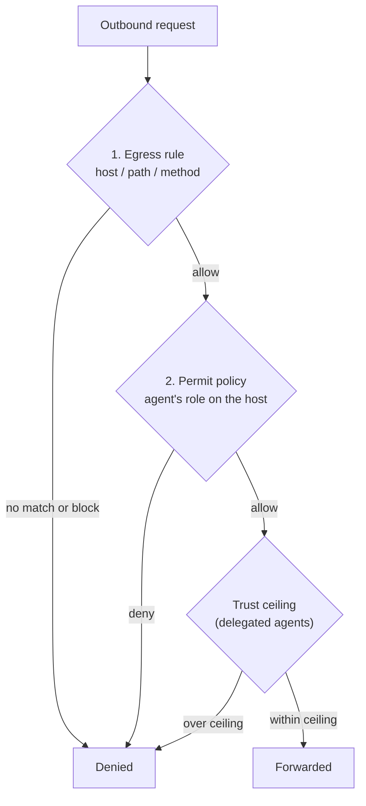

# Authorization & Trust

An allowed outbound request passes through **two independent gates**. Both must say yes. This mirrors how the gateway authorizes MCP tool calls, so the same mental model — and the same Permit policy environment — governs both planes.

## The two gates



### Gate 1 — Egress rules

The [egress rules](./egress-rules) you author are the coarse "is this host/path/method even on the menu" check. A request with no matching `allow` rule is denied before any policy evaluation. This is the operator-controlled allow-list.

### Gate 2 — Permit.io policy

For requests that an `allow` rule permits, the gateway then asks your **Permit.io** policy whether *this agent* is allowed to perform *this kind of action* on *this host*. The request's method class maps to an action (read, write, delete, and so on), and the host becomes a Permit resource. Because every gateway host maps 1:1 to a Permit environment, you manage these policies in the same place as your MCP policies — see [Permit.io Integration](/permit-mcp-gateway/permit-integration).

This split means an operator can broadly allow a host at the proxy while your central policy still decides, per agent, what that host's access actually permits.

## Human consent and trust ceilings

Agents usually act **on behalf of a human**. The proxy supports the same delegation-with-consent model the gateway uses for MCP: a person explicitly authorizes an agent to make egress calls for them, and the access an agent gets through that person is capped by a **trust ceiling**.

### Trust ceilings

An admin sets, per human and per host, the **maximum** trust level that person is allowed to delegate — `low`, `medium`, or `high`. When a human consents to an agent, the access that agent receives is the **lesser** of what the human grants and the admin-defined ceiling. A person can never delegate more than their ceiling allows.

This has an important security property: an agent that acts for **several** humans does **not** get to combine their ceilings. Each human caps their own delegation independently, so one person's grant can't be used to escalate another's.

### Human consent

To have a human delegate egress access to an agent, run the consent flow:

```bash
asg proxy authorize <agent-client-id> --host api.github.com
```

This opens a browser where the human signs in and chooses what to allow:

1. **Sign in** — the human authenticates.
2. **Review the hosts** — the agent is requesting egress to specific hosts.
3. **Choose an access level** — defaulting to least privilege, and capped at the admin's ceiling for that human and host.
4. **Approve** — a short-lived, human-bound token is issued for the agent.

Pass multiple `--host` flags to request several hosts at once. The optional `--trust low|medium|high` flag lets the human (or the operator preparing the request) propose a lower cap than the ceiling; omit it to default to least privilege.

The result is a token whose access is bound to that specific human's consent — and which the human can revoke.

### Revocation

A human can revoke an agent's delegated access at any time from their account. Revocation is enforced **immediately**: in-flight and subsequent requests using a revoked delegation are denied, not just future token issuance. This is the egress equivalent of revoking an MCP consent.

## How automated agents differ

Not every agent acts for a human. A CI job or backend service can be issued a token directly with [`asg proxy token create`](./quickstart#4-mint-an-agent-access-token). Such a token isn't bound to a human, so the per-human trust ceiling doesn't apply — its access is governed purely by the egress rules and the agent's own Permit policy. Use direct tokens for machine-to-machine automation, and the consent flow whenever a real person is accountable for what the agent does.

---

## What's next

- [**Egress Rules**](./egress-rules) — the operator allow-list that forms the first gate.
- [**Permit.io Integration**](/permit-mcp-gateway/permit-integration) — the policy model behind the second gate.
- [**Security**](./security) — the protections that wrap both gates.
