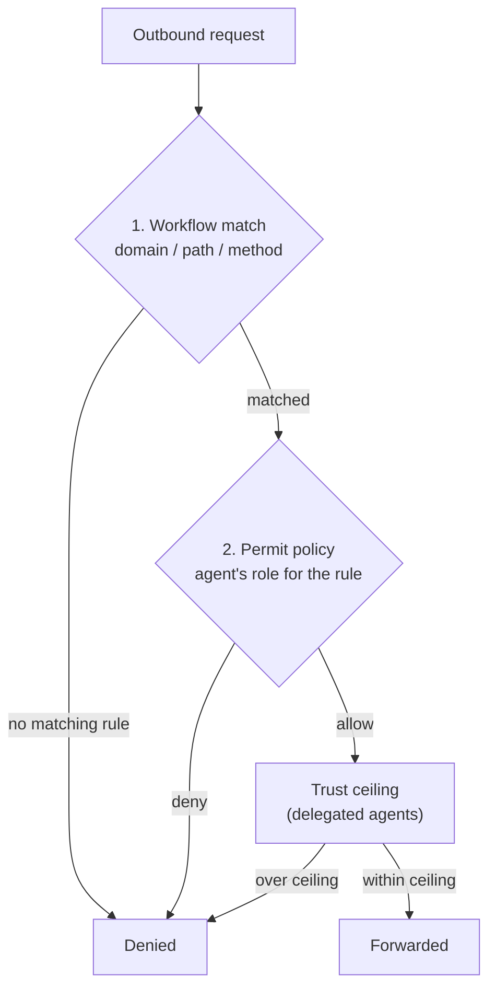

# Authorization & Trust

An allowed outbound request passes through **two independent gates**. Both must say yes. This mirrors how the gateway authorizes MCP tool calls, so the same mental model — and the same Permit policy environment — governs both planes.

## The two gates


```mermaid
flowchart TB
    Req["Outbound request"]
    Rule{"1. Workflow match<br/>domain / path / method"}
    Permit{"2. Permit policy<br/>agent's role for the rule"}
    Ceiling["Trust ceiling<br/>(delegated agents)"]
    Allow["Forwarded"]
    Deny["Denied"]

    Req --> Rule
    Rule -->|"no matching rule"| Deny
    Rule -->|"matched"| Permit
    Permit -->|"deny"| Deny
    Permit -->|"allow"| Ceiling
    Ceiling -->|"over ceiling"| Deny
    Ceiling -->|"within ceiling"| Allow
```

### Gate 1 — Workflow match

Every token is bound to one [workflow](./egress-rules). The gateway resolves that workflow, checks the request's target host against the workflow's domains, and finds the rule that governs its path and method. A request with no matching rule is denied before any policy evaluation. This is the coarse, operator-controlled "is this domain/path/method even on the menu" check.

### Gate 2 — Permit.io policy

For requests a rule matches, the gateway then asks your **Permit.io** policy whether *this agent* holds a role that authorizes *this rule's action* — each rule is a Permit action on the workflow resource. The trust level a request must meet is declared **by the rule itself** (its required trust); the method class only determines which rules a request can match, and seeds the **Auto** default when you don't set a level explicitly. Because every gateway host maps to a Permit environment, you manage these policies in the same place as your MCP policies — see [Permit.io Integration](/permit-mcp-gateway/permit-integration).

This split means an operator can define a workflow's domains and rules while your central policy still decides, per agent, which of those rules that agent may actually use.

## Human consent and trust ceilings

Agents usually act **on behalf of a human**. The proxy supports the same delegation-with-consent model the gateway uses for MCP: a person explicitly authorizes an agent to make egress calls for them, for a specific workflow, and the access an agent gets through that person is capped by a **trust ceiling**.

### Trust ceilings

An admin sets, per human and per workflow, the **maximum** trust level that person is allowed to delegate — `low`, `medium`, or `high`. This is the same **Max Trust Level** control described in [Host Setup](/permit-mcp-gateway/host-setup). When a human consents to an agent, the access that agent receives is the **lesser** of what the human grants and the admin-defined ceiling. A person can never delegate more than their ceiling allows.

This has an important security property: an agent that acts for **several** humans does **not** get to combine their ceilings. Each human caps their own delegation independently, so one person's grant can't be used to escalate another's.

### Human consent

To have a human delegate egress access to an agent, run the consent flow:

```bash
asg proxy authorize <agent-client-id> --workflow charge_customers
```

This opens a browser where the human signs in and chooses what to allow:

1. **Sign in** — the human authenticates.
2. **Review the workflow** — the screen shows the workflow's domains and rules the agent is requesting.
3. **Choose an access level** — defaulting to least privilege, and capped at the admin's ceiling for that human and workflow.
4. **Approve** — a short-lived, human-bound token is issued for the agent, bound to that workflow.

Omit `--workflow` in the browser flow to let the consent screen present a picker over the workflows that human may delegate. The optional `--trust low|medium|high` flag lets the human (or the operator preparing the request) propose a lower cap than the ceiling; omit it to default to least privilege.

The result is a token whose access is bound to that specific human's consent — and which the human can revoke.

### Revocation

A human can revoke an agent's delegated access at any time from their account. Revoking removes the agent's policy assignment, so **new** authorization decisions fail immediately. A proxy token already issued under that grant stays valid until it expires (up to its TTL) **unless** the human also chooses **deny in-flight tokens** — the panic-button option for a lost device or compromised agent, which hard-denies every token minted before the revoke for the rest of its life.

Even then, revocation is only re-evaluated on requests the gateway **inspects**. Traffic already flowing inside an open `passthrough` HTTPS tunnel is opaque and isn't re-checked — it continues until the client closes it or the idle timeout fires. Use `intercept` if you need revocation to cut off an in-progress HTTPS connection. This is the egress equivalent of revoking an MCP consent.

## How automated agents differ

Not every agent acts for a human. A CI job or backend service can be issued a token directly with [`asg proxy token create --workflow <slug>`](./quickstart#4-mint-a-workflow-bound-agent-token). Such a token isn't bound to a human, so the per-human trust ceiling doesn't apply — its access is governed purely by the workflow's rules and the agent's own Permit policy. Use direct tokens for machine-to-machine automation, and the consent flow whenever a real person is accountable for what the agent does.

---

## What's next

- [**Workflows & Rules**](./egress-rules) — the operator allow-list that forms the first gate.
- [**Permit.io Integration**](/permit-mcp-gateway/permit-integration) — the policy model behind the second gate.
- [**Security**](./security) — the protections that wrap both gates.
