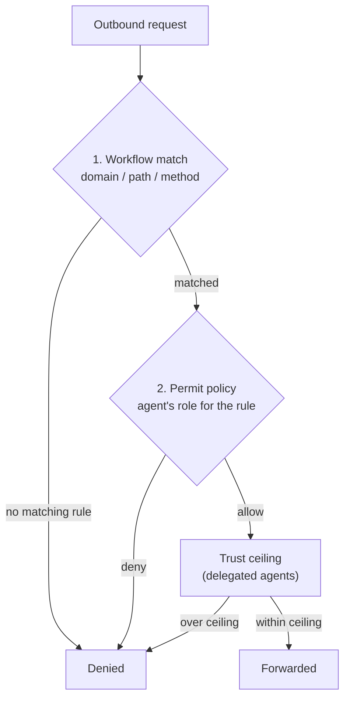

This page is for operators and security teams who design egress access for AI agents. It explains how the HTTP Egress Proxy decides whether an agent's outbound request is allowed, how a person delegates access to an agent, and how revocation works.

An outbound request passes through two independent gates, and both must allow it. The same model governs MCP tool calls in the Permit MCP Gateway, and both use the same Permit policy environment.

## The two authorization gates \{#the-two-gates}


```mermaid
flowchart TB
    Req["Outbound request"]
    Rule{"1. Workflow match<br/>domain / path / method"}
    Permit{"2. Permit policy<br/>agent's role for the rule"}
    Ceiling["Trust ceiling<br/>(delegated agents)"]
    Allow["Forwarded"]
    Deny["Denied"]

    Req --> Rule
    Rule -->|"no matching rule"| Deny
    Rule -->|"matched"| Permit
    Permit -->|"deny"| Deny
    Permit -->|"allow"| Ceiling
    Ceiling -->|"over ceiling"| Deny
    Ceiling -->|"within ceiling"| Allow
```

For an agent a person delegated access to, the proxy also applies that person's trust ceiling after the Permit policy check.

### Gate 1: Workflow match \{#gate-1--workflow-match}

Every proxy access token is bound to one [API workflow](/permit-mcp-gateway/http-egress-proxy/egress-rules). The gateway resolves the token's workflow, checks the request's target host against the workflow's domains, and finds the rules that match the request's path and method. The proxy denies a request that matches no rule, before any policy evaluation.

The workflow match is the operator-controlled allow-list: it decides which domains, paths, and methods an agent can request at all.

### Gate 2: Permit.io policy \{#gate-2--permitio-policy}

For a request that matches a rule, the gateway asks your Permit.io policy whether the agent holds a role that authorizes the rule. Each rule is a Permit action on the workflow resource.

The rule declares the trust level a request must meet (its required trust). The method class decides only which rules a request can match. When you set required trust to **Auto**, the method class also sets the default level.

Each gateway host maps to a Permit environment, so you manage egress policies in the same place as your MCP policies. See [Permit.io integration](/permit-mcp-gateway/permit-integration).

With two gates, an operator defines a workflow's domains and rules, and your central Permit policy decides which of those rules each agent may use.

## Human consent and trust ceilings

An agent often acts on behalf of a person. The HTTP Egress Proxy uses the same delegation model as the gateway uses for MCP: a person explicitly authorizes an agent to make egress calls for them for one workflow, and a trust ceiling caps the access the agent gets through that person.

### Trust ceilings

An admin sets, per person and per workflow, the maximum trust level that person may delegate: `low`, `medium`, or `high`. This is the **Max Trust Level** setting described in [Host setup](/permit-mcp-gateway/host-setup).

When a person consents to an agent, the agent receives the lower of two levels: the level the person grants and the admin's ceiling. A person cannot delegate more than their ceiling allows.

An agent that acts for several people does not combine their ceilings. Each person's ceiling caps only that person's delegation, so one person's grant cannot raise the access another person delegated.

### Human consent

To let a person delegate egress access to an agent, run the consent flow with the agent's client ID and the workflow slug:

```bash
asg proxy authorize <agent-client-id> --workflow charge_customers
```

`asg proxy authorize` opens a browser where the person completes these steps:

1. **Sign in.** The person authenticates.
2. **Review the workflow.** The consent screen shows the workflow's domains and rules that the agent requests.
3. **Choose an access level.** The screen defaults to the lowest level and caps the choice at the admin's ceiling for that person and workflow.
4. **Approve.** The gateway issues a short-lived token for the agent, bound to the person and the workflow.

When the person approves, `asg proxy authorize` returns the token. Pass `--out <file>` to write the token to a file. If the person denies access or the flow times out, the command exits with code `1`.

Options:

| Option | Description |
| --- | --- |
| `--workflow <slug>` | The workflow to delegate. Omit it to let the consent screen show a picker of the workflows the person may delegate. |
| `--trust low\|medium\|high` | Proposes a cap below the person's ceiling. Omit it to default to the lowest level. |
| `--subdomain <host>` | The host subdomain, if you have not set a default. |
| `--out <file>` | Writes the token to a file with restrictive permissions. |

The resulting token's access depends on that person's consent, and the person can revoke it.

### Revocation

A person can revoke an agent's delegated access from their account at any time. Revocation removes the agent's policy assignment, so new authorization decisions for that agent fail.

A proxy token issued before the revocation stays valid until it expires, unless the person also selects **deny in-flight tokens**. That option denies every token minted before the revocation for the rest of the token's lifetime. Use it for a lost device or a compromised agent.

The proxy checks revocation only on requests it inspects. Traffic inside an open `passthrough` HTTPS tunnel is not re-checked, and continues until the client closes the tunnel or the idle timeout ends it. If revocation must stop an in-progress HTTPS connection, use `intercept` mode for that domain.

## How automated agents differ

Some agents, such as a CI job or a backend service, do not act for a person. Issue such an agent a token directly with [`asg proxy token create --workflow <slug>`](/permit-mcp-gateway/http-egress-proxy/quickstart#4-mint-a-workflow-bound-agent-token).

A directly issued token is not bound to a person, so no trust ceiling applies. The workflow's rules and the agent's own Permit policy govern its access.

Use direct tokens for machine-to-machine automation. Use the consent flow when a person is accountable for what the agent does.

## Next steps \{#whats-next}

- [Workflows and rules](/permit-mcp-gateway/http-egress-proxy/egress-rules): the operator allow-list that forms the first gate.
- [Permit.io integration](/permit-mcp-gateway/permit-integration): the policy model behind the second gate.
- [Security](/permit-mcp-gateway/http-egress-proxy/security): the protections around both gates.
