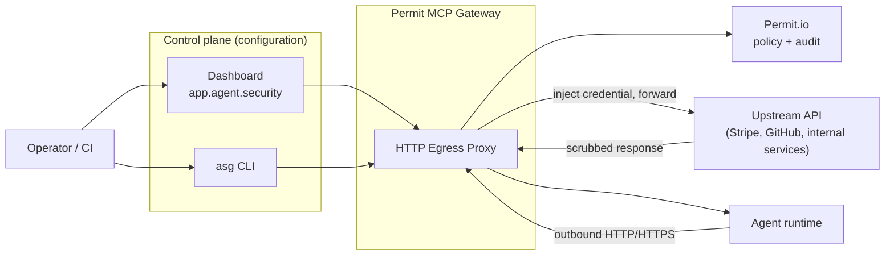

# HTTP Egress Proxy

**Identity-aware control over every API call your agents make — not just their MCP tools.**

The Permit MCP Gateway governs an agent's **MCP tool calls**. The **HTTP Egress Proxy** extends that same governance to an agent's **arbitrary outbound HTTP and HTTPS traffic** — the REST APIs, webhooks, and third-party services it calls directly, outside of MCP.

When an agent's runtime is pointed at the proxy, every outbound request is authenticated, matched against your egress rules, authorized, optionally routed for human approval, and audited — before it ever reaches the upstream API. Credentials for those upstream APIs are stored in the gateway and injected server-side, so your agents never hold the secrets they use.

:::note Availability
The HTTP Egress Proxy is a newer capability and is enabled per environment. If you don't see the **Proxy** section in your [dashboard](https://app.agent.security), [contact us](mailto:support@permit.io) to have it turned on for your account.
:::

---

## Why an egress proxy

MCP governs the tools you import into the gateway. But a modern agent does far more than call MCP tools — it calls Stripe, GitHub, internal microservices, and any HTTP API a developer hands it. Without a control point on that traffic:

- **Secrets live in the agent.** API keys get baked into prompts, env files, and agent memory, where they can leak or be exfiltrated by prompt injection.
- **There's no allow-list.** A compromised or confused agent can call any host on the internet, including internal metadata endpoints (SSRF).
- **There's no record.** You can't answer "which agent called which API, on whose behalf, and was it allowed?"

The HTTP Egress Proxy puts the same deny-by-default, identity-aware control plane you already use for MCP in front of all of that traffic.

## What it enforces

| Capability | What it gives you |
| --- | --- |
| **Deny by default** | No outbound request is allowed until an egress rule explicitly permits its host, path, and method. |
| **Egress rules** | Ordered allow / block / require-approval rules matched by host, path, HTTP method, and (optionally) which agent is calling. |
| **Server-side credentials** | Upstream API keys, tokens, and OAuth connections are stored encrypted in the gateway and injected into requests on the way out. The agent never sees them. |
| **Human consent & trust ceilings** | Just like MCP, a human can delegate egress access to an agent within an admin-defined trust ceiling — and revoke it at any time. |
| **Human-in-the-loop** | High-risk requests can pause for a human approval before they're forwarded. |
| **SSRF protection** | Requests to internal, loopback, link-local, and cloud-metadata addresses are blocked before any DNS lookup or connection. |
| **Response scrubbing** | Injected secrets are stripped out of upstream responses before they reach the agent. |
| **Rate limiting** | Per-agent request budgets — by host and by domain — shed floods and contain runaway agents. |
| **Full audit trail** | Every decision — who, what host, which agent, allow or deny — is logged. |

---

## Two planes: configure once, govern continuously

The feature has a **control plane** (configuration you set up, as an operator) and a **data plane** (live traffic your agents generate). They are separate surfaces with separate credentials.

- **Control plane** — you enable the proxy for a host, define egress rules, store credentials, and mint agent tokens. You do this in the [dashboard](https://app.agent.security) or with the [`asg` CLI](./cli). It writes policy; it never carries live agent traffic.
- **Data plane** — your agent's runtime is configured with standard `HTTP_PROXY` / `HTTPS_PROXY` environment variables pointing at the gateway, plus a short-lived access token. From then on, the agent's normal HTTP libraries route through the proxy automatically. See [Connecting Agents](./connecting-agents).

---

## How a request is governed

Every outbound request runs through the same ordered set of checks. Cheap, fail-closed checks run first, and **a denied request is never even resolved to an IP or connected** — no traffic leaks to a host you didn't allow.

1. **Authenticate** — the request must carry a valid, short-lived proxy access token issued for your host.
2. **SSRF guard** — internal, loopback, link-local, and cloud-metadata targets are rejected immediately.
3. **Proxy enabled?** — the host must have the proxy turned on.
4. **Rule match** — the request's host, path, and method are matched against your ordered egress rules. No match means deny.
5. **Rate limit** — per-agent, per-host budgets are checked.
6. **Authorize** — `allow` rules are checked against your Permit policy; `require_approval` rules pause for a human; `block` rules are denied outright.
7. **Trust ceiling** — for human-delegated agents, the effective access is capped at the trust level that human granted.
8. **Forward** — the matched credential is injected, the request is sent, and the response is scrubbed of any injected secret before returning to the agent.

For the detail behind each gate, see [Authorization & Trust](./authorization) and [Security](./security).

---

## Start here

1. [**Quick Start**](./quickstart) — enable the proxy, add a rule, store a credential, and route an agent through it.
2. [**The `asg` CLI**](./cli) — install and use the command-line tool that drives the whole control plane.
3. [**Egress Rules**](./egress-rules) — the rule model: hosts, paths, methods, actions, ordering, and agent scoping.
4. [**Credentials & Connections**](./credentials) — store upstream secrets and connect OAuth providers.
5. [**Authorization & Trust**](./authorization) — how rules, Permit policy, and human consent compose.
6. [**Connecting Agents**](./connecting-agents) — wire your agent runtime, Docker, or Kubernetes to the proxy.
7. [**Security**](./security) — SSRF protection, credential isolation, response scrubbing, TLS modes, and rate limits.
