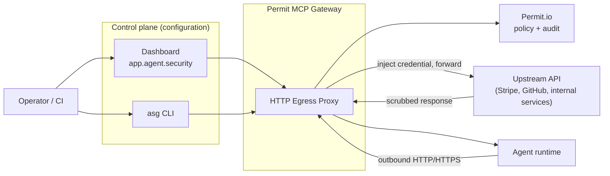

This page is for platform and security teams deciding whether to route AI agent traffic through the HTTP Egress Proxy. It explains what the proxy enforces, how you configure it, and the order in which it checks each request.

The Permit MCP Gateway governs an agent's Model Context Protocol (MCP) tool calls. The HTTP Egress Proxy applies the same governance to the agent's other outbound HTTP and HTTPS traffic: the REST APIs, webhooks, and third-party services the agent calls directly.

When an agent's runtime sends traffic through the proxy, the proxy authenticates each outbound request, matches it against the API workflow bound to the agent's token, authorizes it, and logs the decision before the request reaches the upstream API. The gateway stores the upstream API credentials and injects them into requests, so the agent never holds those secrets.

:::note Availability
The HTTP Egress Proxy must be enabled for your account. If the **CLIs / APIs** section does not appear in your [Permit MCP Gateway dashboard](https://app.agent.security), [email Permit support](mailto:support@permit.io) to turn it on.
:::

## Why route agent traffic through an egress proxy \{#why-an-egress-proxy}

The gateway governs the MCP tools you import into it. Agents also call APIs such as Stripe, GitHub, and internal services directly. Without a control point on that traffic, three problems appear:

- **Secrets live in the agent.** API keys end up in prompts, environment files, and agent memory, where a prompt injection attack can exfiltrate them.
- **There is no allow-list.** A compromised or confused agent can call any host, including internal metadata endpoints. This is server-side request forgery (SSRF).
- **There is no record.** You cannot answer which agent called which API, on whose behalf, and whether the call was allowed.

The HTTP Egress Proxy puts a deny-by-default, identity-aware check in front of that traffic. You define what an agent may reach as an **API workflow**, a named set of allowed domains and rules, and you bind each agent token to one workflow.

## What the HTTP Egress Proxy enforces \{#what-it-enforces}

| Capability | What the proxy does |
| --- | --- |
| **Deny by default** | Denies every outbound request until a workflow rule permits its destination. HTTPS in the default `passthrough` mode is matched by domain. Plain HTTP and HTTPS in `intercept` mode are also matched by path and method. |
| **API workflows** | Groups the domains an agent may reach and the rules for each domain. Each rule matches by path and HTTP method and carries a required trust level. Every agent token is bound to one workflow. See [Workflows and rules](/permit-mcp-gateway/http-egress-proxy/egress-rules). |
| **Server-side credentials** | Stores upstream API keys, tokens, and OAuth connections in the gateway and injects them into outbound requests. The agent never receives them. Credentials are encrypted at rest only when the gateway runs with the KMS vault enabled. See [Credentials and connections](/permit-mcp-gateway/http-egress-proxy/credentials). |
| **Human consent and trust ceilings** | Lets a person delegate egress access to an agent, capped at a trust ceiling an admin sets, and revoke that access. See [Authorization and trust](/permit-mcp-gateway/http-egress-proxy/authorization). |
| **Human-in-the-loop approval** | Pauses a request for human approval when the intent guardian returns a step-up verdict. Requires agent identity and the intent guardian enabled on the host. Applies to plain HTTP and to HTTPS in `intercept` mode. See [Human-in-the-loop on egress](/permit-mcp-gateway/http-egress-proxy/egress-rules#human-in-the-loop-on-egress). |
| **Agent identity and drift protection** | Opt-in. Each agent session declares its task intent. A sharp change in declared intent blocks the session until the person who authorized the agent re-approves it in the browser. See [Agent identity and drift protection](/permit-mcp-gateway/http-egress-proxy/security#agent-identity-and-drift-protection). |
| **SSRF protection** | Rejects internal IP literals and cluster-internal hostnames before any DNS lookup. Rejects a hostname that resolves to a private, loopback, link-local, or metadata address before any connection. |
| **Response scrubbing** | Removes injected secrets from upstream responses before they reach the agent. On by default per credential, best-effort. |
| **Rate limiting** | Meters each agent's requests per destination host and per registrable domain, and rejects the excess with `429`. |
| **Audit trail** | Logs each proxy decision (agent, target host and path, matched rule, and allow or deny outcome) on a best-effort path. See [Audit trail](/permit-mcp-gateway/http-egress-proxy/security#audit-trail). |

## Control plane and data plane \{#two-planes-configure-once-govern-continuously}

The HTTP Egress Proxy has two separate surfaces with separate credentials:

- The **control plane** is the configuration an operator sets up.
- The **data plane** is the live traffic agents send through the proxy.

```mermaid
flowchart LR
    Operator["Operator / CI"]
    Agent["Agent runtime"]

    subgraph Control["Control plane (configuration)"]
        UI["Dashboard<br/>app.agent.security"]
        CLI["asg CLI"]
    end

    subgraph Gateway["Permit MCP Gateway"]
        GW["HTTP Egress Proxy"]
    end

    Permit["Permit.io<br/>policy + audit"]
    Upstream["Upstream API<br/>(Stripe, GitHub, internal services)"]

    Operator --> UI
    Operator --> CLI
    UI --> GW
    CLI --> GW
    GW --> Permit

    Agent -->|"outbound HTTP/HTTPS"| GW
    GW -->|"inject credential, forward"| Upstream
    Upstream -->|"scrubbed response"| GW
    GW --> Agent
```

- **Control plane.** You enable the proxy for a host, define workflows, store credentials, and mint agent tokens. You use the [dashboard](https://app.agent.security) or the [`asg` CLI](/permit-mcp-gateway/http-egress-proxy/cli). You create and edit workflows in the dashboard. The control plane writes configuration and policy. It does not carry agent traffic.
- **Data plane.** The agent's runtime sets the standard `HTTP_PROXY` and `HTTPS_PROXY` environment variables to the gateway and presents a short-lived proxy access token. The agent's HTTP libraries then send requests through the proxy. See [Connecting agents](/permit-mcp-gateway/http-egress-proxy/connecting-agents).

## How the proxy checks each request \{#how-a-request-is-governed}

The proxy runs the same ordered checks on every outbound request. Fail-closed checks that need no network access run first. The proxy does not resolve or connect to a destination until a workflow rule authorizes the request, so a denied request never reaches the destination host.

1. **Authenticate.** The request must carry a valid, short-lived proxy access token bound to one of your workflows.
2. **SSRF guard.** The proxy rejects internal, loopback, link-local, and cloud metadata targets.
3. **Proxy enabled.** The host must have proxy mode turned on.
4. **Workflow match.** The proxy matches the request's host, path, and method against the token's workflow. No matching rule means deny. HTTPS in the default `passthrough` mode matches only a rule with method class `all` and no path, because the path and method inside the tunnel are not visible. Path and method matching apply to plain HTTP and to HTTPS in `intercept` mode.
5. **Rate limit.** The proxy checks the agent's per-host and per-domain request budgets.
6. **Authorize.** The proxy checks the matched rule against your Permit policy. The agent must hold a role that covers the rule's required trust.
7. **Trust ceiling.** For an agent a human delegated access to, the proxy caps access at the trust level that human may grant for the workflow.
8. **Forward.** The proxy injects the matched credential, sends the request, and scrubs the injected secret from the response. Injection and scrubbing apply to plain HTTP and to HTTPS in `intercept` mode. The proxy forwards a `passthrough` tunnel without inspecting it.

On a host with [agent identity](/permit-mcp-gateway/http-egress-proxy/security#agent-identity-and-drift-protection) enabled, the agent must also register a session before the proxy forwards governed traffic. For details on each check, see [Authorization and trust](/permit-mcp-gateway/http-egress-proxy/authorization) and [Security](/permit-mcp-gateway/http-egress-proxy/security).

## Where to go next \{#start-here}

1. [Quick start](/permit-mcp-gateway/http-egress-proxy/quickstart): enable the proxy, create a workflow, store a credential, and route an agent through the proxy.
2. [The `asg` CLI](/permit-mcp-gateway/http-egress-proxy/cli): install and configure the command-line tool for the control plane and for launching agents.
3. [Workflows and rules](/permit-mcp-gateway/http-egress-proxy/egress-rules): domains, paths, methods, and trust levels.
4. [Credentials and connections](/permit-mcp-gateway/http-egress-proxy/credentials): store upstream secrets and connect OAuth providers.
5. [Authorization and trust](/permit-mcp-gateway/http-egress-proxy/authorization): how rules, Permit policy, and human consent combine.
6. [Connecting agents](/permit-mcp-gateway/http-egress-proxy/connecting-agents): configure a shell, Docker, or Kubernetes to use the proxy.
7. [Security](/permit-mcp-gateway/http-egress-proxy/security): SSRF protection, credential isolation, response scrubbing, TLS modes, agent identity, rate limits, and audit.
