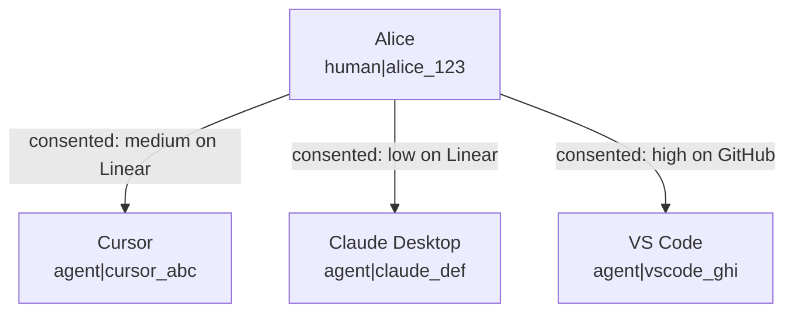
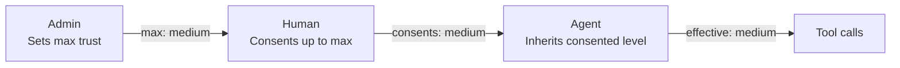
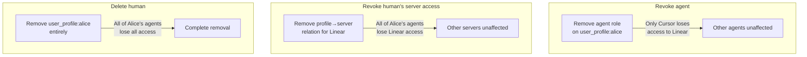

This page is for admins of Permit MCP Gateway. It explains how the gateway identifies **humans** (the people who sign in) and **agents** (the MCP clients that act for them), how trust passes from admin to human to agent, and how you grant, change, and revoke access for both in the [admin dashboard](https://app.agent.security).

To create a host and import MCP servers first, see [Set up hosts for your organization](/permit-mcp-gateway/host-setup).

## Core concepts

### What is a human?

A **human** is a person who signs in through the [consent flow](/permit-mcp-gateway/consent-service). Permit identifies a human as `human|{subject}`, where `{subject}` is the user ID from the authentication system.

A human doesn't call tools. A human **delegates** authority to an agent by completing the consent flow. During consent, the human:

- Signs in and proves their identity.
- Chooses an MCP server from the servers an admin granted.
- Selects the trust level to grant the agent.

An admin can **pre-authorize** a human before the human signs in. When you add a user by email and grant MCP server access, the user can complete consent on first connection.

### What is an agent?

An **agent** is an MCP client, such as Cursor, Claude Desktop, Claude Code, VS Code Copilot, or any other client that speaks the Model Context Protocol (MCP). Permit identifies an agent as `agent|{client_id}`, where `{client_id}` is the OAuth client ID the MCP client receives when it registers with the gateway before the consent flow.

The gateway creates agents when a human completes consent. You can't create an agent manually. An agent appears on the **Agents** page after the user consents.

### One human, many agents

When one person connects several MCP clients, each client is a **separate agent identity** with its own permissions:



Each agent gets its permissions separately, through a role on the human's user profile. As a result:

- Alice can grant Cursor Medium trust on Linear and grant Claude Desktop only Low trust on the same server.
- Revoking Cursor's access doesn't affect Claude Desktop.
- The audit log records each agent's tool calls separately.

## How trust flows

Trust passes through three parties. The **admin** sets a ceiling, the **human** selects a level within that ceiling, and the **agent** receives the result.



### The trust calculation

An agent's effective trust level on an MCP server is the lower of the admin's max trust level and the level the human consented to:

```
effective_trust = min(admin_max_trust, human_consented_trust)
```

| Admin sets max | Human consents | Agent gets |
| --- | --- | --- |
| High | High | **High** |
| High | Medium | **Medium** (human chose less) |
| Medium | High | **Medium** (admin cap applies) |
| Medium | Medium | **Medium** |
| Low | Medium | **Low** (admin cap applies) |
| Low | Low | **Low** |

The gateway enforces the ceiling in three places: the Permit policy (derived roles), the consent screen (levels above the max can't be selected), and the consent API (a server-side `403` rejection). See [Max trust level: three layers of enforcement](/permit-mcp-gateway/permit-integration#max-trust-level-three-layers-of-enforcement).

### What each trust level allows

| Trust level | Tool types | Examples |
| --- | --- | --- |
| **Low** | Read-only operations | `get_issues`, `list_repos`, `search_files` |
| **Medium** | Low + write operations | `create_issue`, `update_record`, `send_message` |
| **High** | Low + medium + destructive operations | `delete_repo`, `remove_member`, `destroy_environment` |

## Managing humans

### Viewing the Humans page

The [**Humans**](https://app.agent.security/humans) page lists every user who has been granted access or has signed in to the gateway. Each entry shows the user's name, email, granted MCP servers, and connected agents.

### Granting access to an MCP server

A user can't complete the consent flow for an MCP server until an admin grants access to that server.

1. Go to the **Humans** page.
2. Select a user, or add a user by email to pre-authorize the user.
3. Click **Grant Access**.
4. Choose the MCP server and set a **max trust level**.


The max trust level is the highest level the user can grant an agent during consent. If you set it to Medium, the consent screen doesn't let the user select High.

To confirm the grant, have the user connect an MCP client. The granted server appears in the consent screen's server list.

### Updating max trust level

To change a user's max trust level for an MCP server, edit it on the user's detail page. The change applies to the next tool call:

- **Lowering** the max trust level caps every existing agent of that user on the next tool call. The user doesn't need to consent again, because the `min()` calculation applies the new ceiling.
- **Raising** the max trust level doesn't upgrade existing agents. The user must consent again to select the higher level.

### Revoking a human's access

Revoking a human's access to an MCP server removes the profile-to-server relation in Permit. The effect cascades to the human's agents:

- **Every agent** acting for that human is denied on its next tool call to that server.
- The agents' roles on the user profile remain, but without the profile-to-server relation the derived role calculation returns no role, so every `permit.check()` for that server returns deny.
- The human's access to **other** MCP servers doesn't change.

To restore access, grant access again. The user must then complete the consent flow again.

### Viewing connected agents

The human detail page lists every agent that connected for that user. For each agent, you see:

- The agent name and type, such as Cursor or Claude Desktop.
- The MCP servers the agent can access.
- The trust level granted for each server.
- Recent activity and tool call history.

Use this list to see all the access a human has delegated.

## Managing agents

### Viewing the Agents page

The [**Agents**](https://app.agent.security/agents) page lists every MCP client that connected through the gateway. An agent appears after a user completes the consent flow.


### Understanding agent metadata

Each agent entry shows:

| Field | Contents |
| --- | --- |
| **Agent identifier** | The MCP client name, such as Cursor or Claude Desktop, taken from the OAuth client registration. |
| **Associated human** | The user who authorized the agent. |
| **MCP server access** | The servers the agent can reach, and the trust level for each. |
| **Activity log** | Recent tool calls, each marked allowed or denied. |

:::info One agent identity can hold roles on several user profiles
An agent's role is assigned on a specific human's user profile, such as `user_profile:alice`. If the same agent identity is authorized by two humans, it holds a role on each profile, such as `user_profile:alice` and `user_profile:bob`. The agent detail page groups permissions by human, so you can see which user authorized which access.
:::

### Modifying agent trust levels

To change an agent's trust level for an MCP server:

1. Go to the **Agents** page and select the agent.
2. Find the MCP server in the agent's access list.
3. Change the trust level.

The agent's next tool call is evaluated against the new trust level. The human's max trust level still caps the agent, because the `min()` calculation still applies.

### Revoking an individual agent

To revoke one agent's access to an MCP server:

1. Go to the **Agents** page and select the agent.
2. Find the MCP server and click **Revoke Access**.

Only that agent loses access to the server. The human's other agents and the human's access grant don't change. The agent's next tool call to the server is denied. The user restores the agent's access by completing the consent flow again.

## Revocation levels compared \{#revocation-three-levels}

| Action | What it does | Scope | How to restore |
| --- | --- | --- | --- |
| **Revoke an agent's server access** | Removes the agent's role on the user profile for that server | Only that agent loses access to that server | User re-consents for that agent |
| **Revoke a human's server access** | Removes the profile-to-server relation | **All** agents acting for that human lose access to that server | Admin grants access again, then the user re-consents |
| **Delete a human** | Removes the user and the user's profile from Permit | **All** of that human's agents lose access to **all** servers | Admin re-creates the user and grants all access again |



## Common scenarios

### Start your team with read-only access \{#i-want-to-give-my-team-read-only-access-initially}

When you grant MCP server access, set the max trust level to **Low** for every user. Users can consent only at Low, so their agents can call only read-only tools. Raise individual users to Medium or High when they need it.

### Revoke all agents of a user who left \{#an-employee-left--how-do-i-revoke-all-their-agents}

**Delete the human** on the **Humans** page. Deleting the human removes the user profile from Permit, which removes the derived permissions of every agent that acted for that user, on every MCP server.

### Allow Cursor but not Claude Desktop on a server \{#i-want-to-allow-cursor-but-not-claude-desktop-for-a-specific-server}

After both MCP clients complete consent, go to the **Agents** page and revoke Claude Desktop's access to the server. Cursor keeps its access, because each agent's access is managed separately.

An agent identity exists only after the user completes consent with that MCP client, so you can't revoke a client's access before the client connects.

### Give a user a higher trust level \{#a-user-needs-higher-trust-than-i-originally-set}

1. On the **Humans** page, raise the user's max trust level for the server.
2. Ask the user to disconnect and reconnect the MCP client. The consent flow runs again and lets the user select the higher level.

The agent keeps its current trust level until the user consents again.

### Review everything an agent did \{#i-want-to-see-everything-an-agent-has-done}

On the **Agents** page, select the agent and open its activity log. Each entry shows the tool, the MCP server, whether the call was allowed or denied, and the time. For the raw `permit.check()` parameters, see [Reading audit logs in Permit](/permit-mcp-gateway/permit-integration#reading-audit-logs).

## Next steps

- [Consent Service](/permit-mcp-gateway/consent-service): what users see when they grant trust to an agent.
- [Permit integration](/permit-mcp-gateway/permit-integration): the roles and relations behind the trust calculation.
- [Audit logs](/permit-mcp-gateway/audit-logs): investigate allowed and denied tool calls.
- [Human-in-the-loop approvals](/permit-mcp-gateway/human-in-the-loop): require admin approval for sensitive tools.
