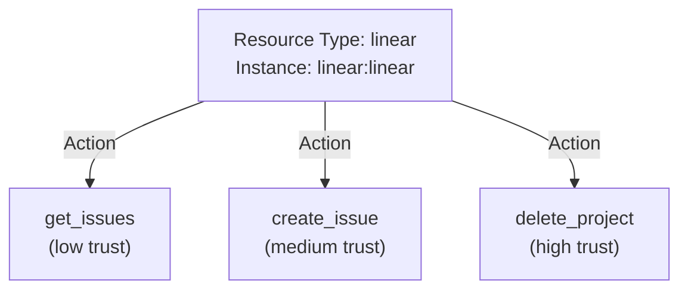
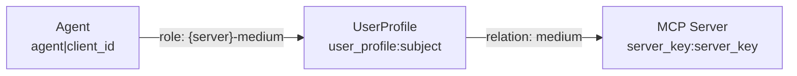
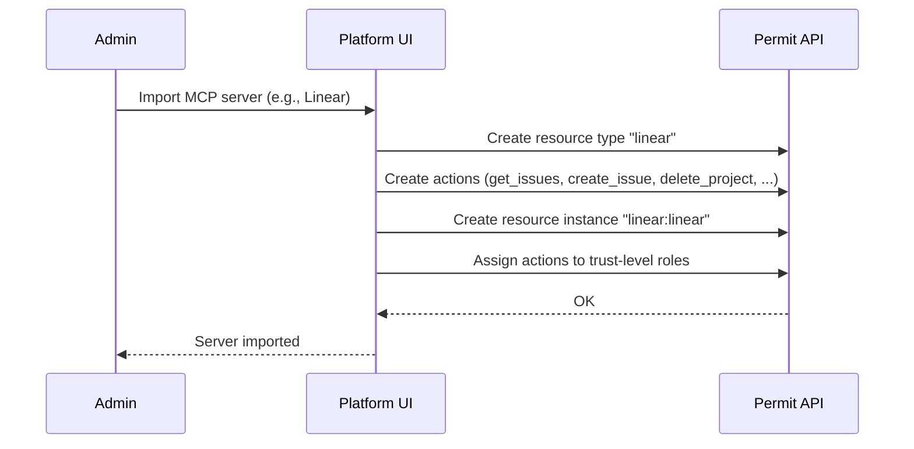
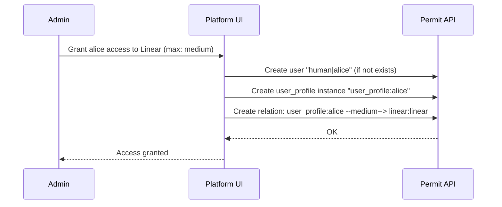
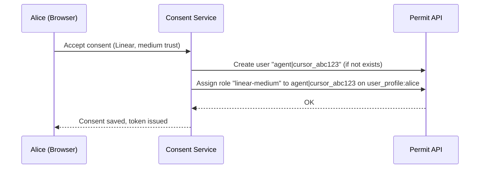
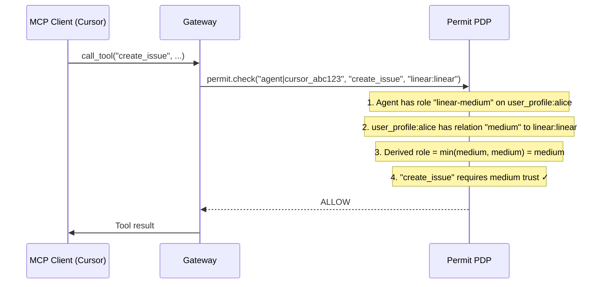

# How Permit MCP Gateway Works with Permit.io

Permit MCP Gateway uses [Permit.io](https://www.permit.io) as its **control plane** and **default data plane**. Permit is not a peripheral integration — it is the core of how permissions are modeled, enforced, and audited. Every authorization decision for every tool call is evaluated by Permit.

This page explains **why** Permit is central, **how** the policy model maps to Permit primitives, **what** happens during each sync step, and **where** to find everything in the Permit dashboard.

## The Relationship Between Permit and the Gateway

Permit.io and Permit MCP Gateway form a single system with two dashboards:

| | Permit.io | Permit MCP Gateway |
| --- | --- | --- |
| **Role** | Control plane and policy engine | Enforcement layer and MCP proxy |
| **Dashboard** | [app.permit.io](https://app.permit.io) | [app.agent.security](https://app.agent.security) |
| **What it manages** | Authorization model, policy evaluation (PDP), audit logs, resource schemas, role assignments | Hosts, MCP server imports, user consent, authentication, session management |
| **What it stores** | Policies, users, roles, relations, derived roles, audit log entries | Host configurations, sessions, upstream OAuth tokens |

**Every gateway host maps to a Permit environment.** When an admin creates a host and selects a Permit project and environment, that environment becomes the host's authorization boundary. All resources, users, roles, and audit logs for that host live in the linked Permit environment.

Because the gateway builds on standard Permit primitives, you get the full power of Permit's policy engine through this connection:

- **RBAC, ABAC, and ReBAC** policy models
- **Real-time policy updates** via OPAL — changes take effect on the next tool call with no restart
- **Complete audit trail** — every `permit.check()` call is logged
- **Policy-as-code** — policies manageable via the Permit UI, API, or Terraform provider
- **Local PDP option** — for customer-controlled deployments, the PDP can run in your environment so authorization decisions stay within your network

## Why Permit.io?

Permit MCP Gateway needs a policy engine that can:

- **Evaluate fine-grained, relationship-based access control (ReBAC)** — decisions depend on who the user is, which agent is acting, and which MCP server and tool are involved
- **Apply changes instantly** — when an admin adjusts a trust level or revokes access, the change takes effect on the next tool call with no restart or redeployment
- **Provide a full audit trail** — every `permit.check()` call is logged, giving complete visibility into what was allowed or denied and why

Permit.io provides all three. Permit MCP Gateway builds its authorization model using Permit's resource types, actions, roles, relations, and derived roles — and the Permit PDP (Policy Decision Point) evaluates every tool call in real time.

## The Policy Model

Permit MCP Gateway maps its concepts directly to Permit primitives. Understanding this mapping is the key to understanding how authorization works.

### Resources and Actions

Each imported MCP server becomes a **resource type** in Permit. The server's tools become **actions** on that resource type.

| Gateway concept | Permit primitive | Example |
| --- | --- | --- |
| MCP server | Resource type | `linear` |
| MCP server instance | Resource instance | `linear:linear` (type and instance share the same key) |
| Tool | Action | `create_issue`, `get_issues`, `delete_project` |



### Users

Permit tracks two types of users, distinguished by key prefix:

| Caller type | Permit user key | Used by |
| --- | --- | --- |
| Human | `human\|{subject}` | Consent Service and Platform — for policy management (granting access, setting trust levels) |
| Agent | `agent\|{client_id}` | Gateway — for runtime tool-call authorization |

### Roles and Trust Levels

Trust levels map to **roles** in Permit. Each MCP server gets its own set of scoped roles:

| Trust level | Permit role | Permissions |
| --- | --- | --- |
| Low | `{server}-low` | Read-only tools |
| Medium | `{server}-medium` | Read + write tools |
| High | `{server}-high` | Read + write + destructive tools |

Roles are hierarchical — `high` inherits `medium`, which inherits `low`.

### The UserProfile Indirection (ReBAC)

This is the most important part of the model. Agents do **not** get direct access to MCP servers. Instead, authorization flows through a **`user_profile`** resource that represents the human:



**Why this indirection?** It implements a trust ceiling. The human's profile relation to the server (set by the admin) caps what any agent can do, regardless of what the user granted during consent.

The effective permission is: **min(agent's role on profile, profile's relation to server)**

| Agent role on profile | Profile relation to server | Effective permission |
| --- | --- | --- |
| `{server}-high` | `high` | **high** |
| `{server}-high` | `medium` | **medium** (capped by admin) |
| `{server}-high` | `low` | **low** (capped by admin) |
| `{server}-medium` | `high` | **medium** |
| `{server}-medium` | `medium` | **medium** |
| `{server}-medium` | `low` | **low** (capped by admin) |
| `{server}-low` | `high` | **low** |
| `{server}-low` | `medium` | **low** |
| `{server}-low` | `low` | **low** |

This is implemented using **9 derived role rules per MCP server** in Permit's ReBAC engine. The rules break down as follows:

**HIGH role (2 derivation rules):**
- `user_profile#owner` + `high` relation → `{server}#high`
- `user_profile#{server}-high` + `high` relation → `{server}#high`

**MEDIUM role (3 derivation rules):**
- `user_profile#owner` + `medium` relation → `{server}#medium`
- `user_profile#{server}-medium` + `medium` relation → `{server}#medium`
- `user_profile#{server}-high` + `medium` relation → `{server}#medium` *(min logic — high capped to medium)*

**LOW role (4 derivation rules):**
- `user_profile#owner` + `low` relation → `{server}#low`
- `user_profile#{server}-low` + `low` relation → `{server}#low`
- `user_profile#{server}-medium` + `low` relation → `{server}#low` *(min logic)*
- `user_profile#{server}-high` + `low` relation → `{server}#low` *(min logic)*

The `owner` role rules allow the human user (who owns the profile) to also have derived permissions on the server — this is used for admin-side permission discovery.

:::note Permit Dashboard display
Derived roles are configured via `PATCH` on the MCP server roles, but Permit's UI displays the derivation rules on the **source resource roles** (`user_profile`), not on the target MCP server roles. This is correct behavior — if the MCP server roles' DERIVATIONS column appears empty in the UI, check the `user_profile` roles instead.
:::

### Max Trust Level: Three Layers of Enforcement

The admin-configured max trust level is enforced at three layers to prevent bypass:

1. **Permit policy** — the profile-to-server relation in Permit acts as the ceiling in the `min()` calculation
2. **Consent UI** — the trust level slider always shows all three levels for context, but levels beyond the max are **visually muted** and cannot be selected. The slider gradient fades out past the max level, and if a user somehow drags past the max, the value clamps back. A tooltip on disabled levels indicates they are restricted.
3. **Consent API** — `POST /api/consent/accept` validates the requested trust level server-side. It fetches all relationship tuples for the user's profile to the server, determines the highest allowed trust level, and **rejects with 403** if the requested trust level exceeds the max. For example: `Trust level "medium" exceeds your maximum allowed level "low" for server "deepwiki"`. This prevents bypassing the frontend cap via direct API calls.

## The Sync Flow

Each step in the admin and user workflow creates specific artifacts in Permit. Here's exactly what happens:

### Step 1: Admin Imports an MCP Server

The Platform creates in Permit:
- A **resource type** with the server's key (e.g., `linear`)
- **Actions** on that resource type for each discovered tool (e.g., `create_issue`, `get_issues`)
- **Role assignments** linking each action to the appropriate trust level



### Step 2: Admin Grants Human Access

The Platform creates a **relation** from the human's user profile to the MCP server, with the max trust level as the relation type:



This relation becomes the ceiling in the `min()` logic — alice's agents can never exceed medium trust on Linear, regardless of what she selects during consent.

### Step 3: Human Consents

When the user accepts consent and selects a trust level, the Consent Service assigns the **agent's role on the user profile**:



Note: The Consent Service does **not** create MCP server resources or profile-to-server relations — those are managed by the Platform in steps 1 and 2. The human must already have a profile-to-server relation before consent is allowed.

### Step 4: Agent Calls a Tool

The Gateway calls `permit.check()` with the agent's key, the tool name as the action, and the server as the resource:



If alice's admin had set max trust to `low`, the check would fail:

```
min(medium, low) = low → "create_issue" requires medium → DENY
```

## Separation of Responsibilities

Each component owns specific Permit operations:

| Component | What it does in Permit |
| --- | --- |
| **Platform** | Creates resource types, actions, and instances for MCP servers. Creates user profiles and profile-to-server relations (max trust). |
| **Consent Service** | Creates agent users. Assigns agent roles on user profiles (consented trust level). Validates that the human already has access before allowing consent. |
| **Gateway** | Calls `permit.check()` at runtime. Does not modify Permit policy — read-only. |

## Using the Permit Dashboard

Since Permit MCP Gateway builds on standard Permit primitives, you can inspect and debug everything from the [Permit dashboard](https://app.permit.io).

### Finding Your Environment

Each Permit MCP Gateway [host](/permit-mcp-gateway/guide#2-create-a-host) is linked to a specific Permit project and environment. To find it:

1. Log in to [app.permit.io](https://app.permit.io)
2. Select the project and environment that matches your host's configuration
3. The environment name typically matches the host name you set in the Permit MCP Gateway dashboard

### Viewing the Schema

In the Permit dashboard under your environment:

- **Resources** — each MCP server appears as a resource type (e.g., `linear`, `github`). Click a resource to see its actions (tools) and roles
- **Resource Instances** — each server has a corresponding instance (e.g., `linear:linear`)
- **Users** — you'll see both `human|{subject}` and `agent|{client_id}` entries
- **Role Assignments** — shows which agents have which roles on which user profiles

### Reading Audit Logs

Every `permit.check()` call is logged by Permit. Use the **Audit Log** in the Permit dashboard to:

- **Debug authorization failures** — search for a specific agent or user to see exactly which checks passed or failed, and which policy rules were evaluated
- **Verify the sync flow** — confirm that importing a server created the expected resource type and actions, or that consent created the expected role assignment
- **Monitor tool-call patterns** — identify which tools are most used, which agents are most active, and whether any unexpected denials are occurring

:::tip
The Permit audit log shows the raw `permit.check()` parameters — user key, action, and resource — making it easy to correlate with the [Permit MCP Gateway audit logs](/permit-mcp-gateway/guide#9-audit-logs) visible in [app.agent.security](https://app.agent.security).
:::

## Server Metadata and Allow-List

### Upstream URL Storage

Each preconfigured MCP server stores its upstream URL as an attribute on the Permit resource instance:

```text
resource_instance.attributes.upstream_url = "https://mcp.linear.app/mcp"
```

This is used by the **Consent Service** (to resolve a server key to its upstream URL), the **Platform** (to display the URL in server details), and for **allow-list enforcement**.

### Allow-List Enforcement

All consent API routes validate that the upstream URL belongs to a preconfigured server the human has access to:

| Route | Validation |
| --- | --- |
| `POST /api/mcp/connect` | Upstream URL must match an allowed server |
| `POST /api/mcp/oauth/start` | Upstream URL must match an allowed server |
| `POST /api/mcp/preprovisioned-clients` | Upstream URL must match an allowed server |
| `POST /api/consent/accept` | Human must have a profile→server relation |

By default, ad-hoc upstream URLs are not accepted — MCP servers must be preconfigured in the Platform with an `upstream_url`, and users must have a `user_profile` → server relation before consent is allowed. When **Dynamic MCPs** is enabled on the host, users can also enter custom URLs — see [Platform: Dynamic MCPs](/permit-mcp-gateway/platform#dynamic-mcps).

## Tenant Model

All resource instances are created in the **`default` Permit tenant**. This simplifies the authorization model by:

- Avoiding multi-tenant complexity in Permit — multi-tenancy is handled at the Gateway level via subdomains, not in Permit
- Ensuring consistent resource instance lookups across the system
- Allowing the same MCP server resource to be shared across tenants if needed

The `default` tenant is automatically created in Permit environments and requires no additional setup.

## Default Policy: Deny by Default

A fresh Permit MCP Gateway environment starts with **zero permissions**. No user or agent can call any tool until the full setup sequence is completed:

1. **Admin imports an MCP server** → creates resource type, actions, and instance in Permit
2. **Admin grants a human access** → creates the profile-to-server relation (sets the max trust ceiling)
3. **Human consents** → creates the agent's role on the user profile (within the ceiling)
4. **Agent calls a tool** → `permit.check()` evaluates the derived role and tool trust requirements

No step can be skipped. If an admin imports a server but never grants anyone access, no user can consent. If a user has access but hasn't consented, no agent has a role. Every `permit.check()` for an unconfigured combination returns **DENY**.

## Customizing Policies

### Overriding Auto-Classified Trust Levels

When an MCP server is imported, tools are auto-classified by naming heuristics (e.g., `delete_*` → high trust, `create_*` → medium trust). Admins can override these classifications in the Platform UI:

- Navigate to the MCP server detail page
- Each tool shows its current trust level
- Click a tool's trust level to change it
- Changes update the action-to-role mapping in Permit and take effect immediately on the next tool call

### What Changes Take Effect Immediately vs. Require Re-Consent

| Change | Effect | Re-consent needed? |
| --- | --- | --- |
| Override a tool's trust level | Immediate — next `permit.check()` uses new mapping | No |
| Lower a human's max trust level | Immediate — existing agents are capped by the new ceiling on next call | No |
| Raise a human's max trust level | Immediate — but agents keep their current role until user re-consents at a higher level | User must re-consent to get higher access |
| Revoke a human's access entirely | Immediate — all agents lose derived permissions | N/A |
| Revoke a specific agent | Immediate — agent's role is removed from profile | User must re-consent to restore |

## Key Takeaways

- **Permit is the policy engine** — all authorization decisions flow through `permit.check()`
- **Changes are instant** — update a trust level or revoke access in Permit, and the next tool call reflects it
- **The `user_profile` indirection** is the core pattern — it enables the `min()` ceiling logic that separates admin control from user consent
- **Three components, clear boundaries** — Platform writes policy, Consent Service writes agent roles, Gateway reads policy
- **Full auditability** — every decision is logged in both Permit MCP Gateway and Permit.io
