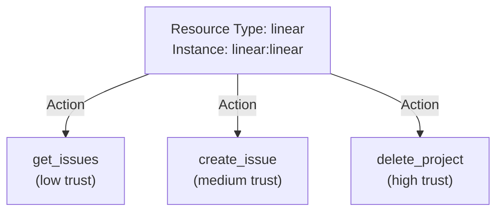
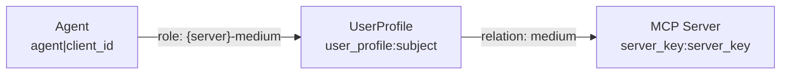
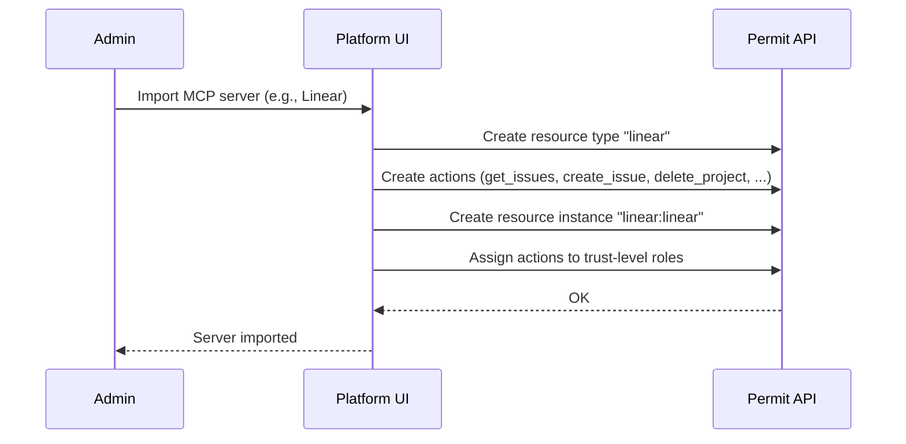
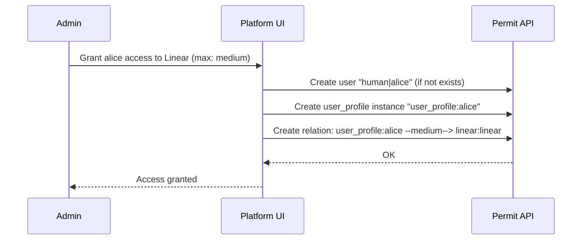
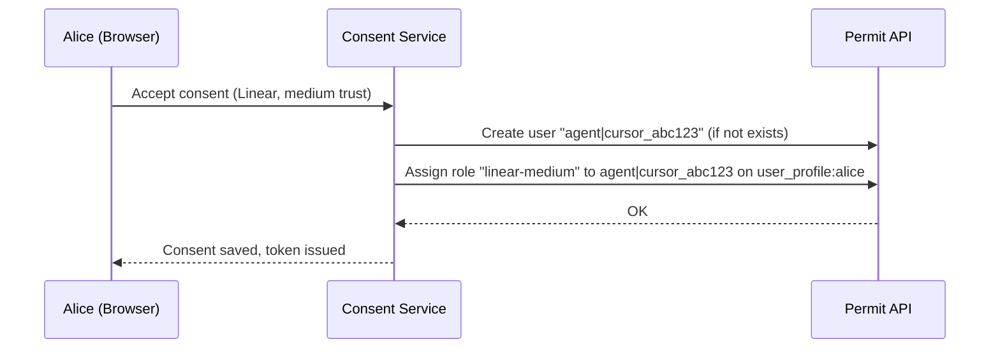
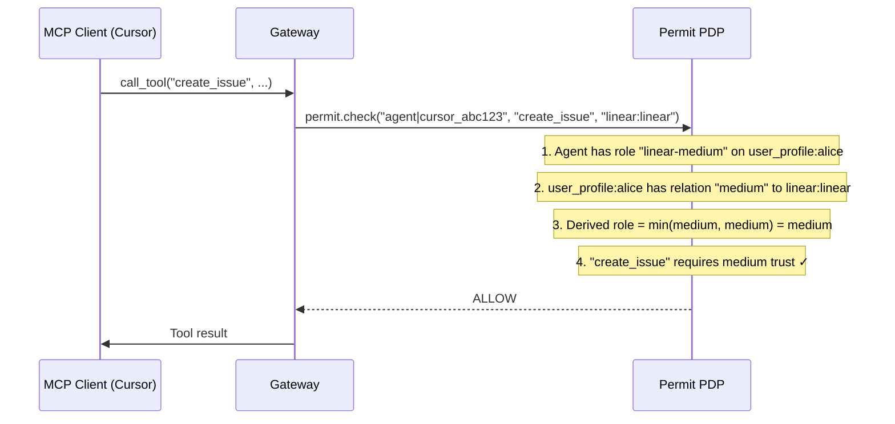

Learn how Permit MCP Gateway stores its authorization model in Permit.io: how MCP servers, tools, and trust levels map to Permit resources, actions, and roles, what each setup step writes to Permit, and how to inspect and debug the result in the Permit dashboard. This page is for gateway admins and developers who debug tool-call decisions or change the policy in Permit.

Permit MCP Gateway checks every tool call with `permit.check()`. Permit holds the policy, evaluates each check in a policy decision point (PDP), and records each decision in the audit log.

## How the gateway and Permit divide the work \{#the-relationship-between-permit-and-the-gateway}

| | Permit.io | Permit MCP Gateway |
| --- | --- | --- |
| **Role** | Control plane: stores the policy and evaluates checks | Enforcement point and MCP proxy |
| **Dashboard** | [app.permit.io](https://app.permit.io) | [app.agent.security](https://app.agent.security) |
| **Manages** | Authorization model, policy evaluation, audit logs | Hosts, MCP server imports, user consent, authentication, sessions |
| **Stores** | Resource types, actions, roles, users, relationships, derived roles, audit log entries | Host configuration, sessions, upstream OAuth tokens |

**Each gateway host maps to one Permit environment.** When an admin creates a host, the admin selects a Permit project and environment, and an environment can belong to only one host. All resources, users, roles, and audit logs for the host live in that environment.

By default, the gateway sends checks to the Permit Cloud PDP. For deployments where a PDP runs in your own network, see [Local PDP for authorization](/permit-mcp-gateway/enterprise-deployment#low-latency-authorization).

The gateway uses standard Permit objects, so the usual Permit tools work on the gateway's policy:

- Policy changes in Permit apply to the next `permit.check()` call, with no gateway restart.
- The Permit **Audit Log** records every check. See [Audit logs](/permit-mcp-gateway/audit-logs).
- You can read and change the policy in the Permit dashboard or through the [Permit API](https://api.permit.io/v2/redoc).

## Why the gateway uses relationship-based access control \{#why-permitio}

A tool-call decision depends on four things: the human, the agent acting for the human, the MCP server, and the tool. Relationship-based access control (ReBAC) in Permit models the link between the agent, the human, and the server, so one check can combine the trust level the human granted with the limit the admin set. When an admin changes a trust level or revokes access, the next check uses the change.

## The policy model

The gateway maps its concepts to Permit objects. This mapping explains every decision in the audit log.

### Resources and actions

Each imported MCP server becomes a **resource type** in Permit. Each of the server's tools becomes an **action** on that resource type.

| Gateway concept | Permit object | Example |
| --- | --- | --- |
| MCP server | Resource type | `linear` |
| MCP server instance | Resource instance | `linear:linear` (type and instance share the same key) |
| Tool | Action | `create_issue`, `get_issues`, `delete_project` |


```mermaid
graph TD
    Server["Resource Type: linear<br/>Instance: linear:linear"]
    Server --"Action"--> T1["get_issues<br/>(low trust)"]
    Server --"Action"--> T2["create_issue<br/>(medium trust)"]
    Server --"Action"--> T3["delete_project<br/>(high trust)"]
```

### Users

Permit stores humans and agents as users with different key prefixes:

| Caller type | Permit user key | Used by |
| --- | --- | --- |
| Human | `human\|{subject}` | Consent Service and gateway admin dashboard, to manage policy (grant access, set trust levels) |
| Agent | `agent\|{client_id}` | Gateway, to authorize tool calls at runtime |

### Roles and trust levels

Trust levels are Permit roles. Each MCP server has two sets of roles:

| Trust level | Role on the MCP server resource | Role on `user_profile`, assigned to agents | Tools the role grants |
| --- | --- | --- | --- |
| Low | `low` | `{server}-low` | Read-only tools |
| Medium | `medium` | `{server}-medium` | Read and write tools |
| High | `high` | `{server}-high` | Read, write, and destructive tools |

The roles on the MCP server resource hold the permissions: each tool's action is granted to the role of the tool's trust level. The roles are hierarchical: `high` extends `medium`, and `medium` extends `low`. Agents don't get these roles directly. Permit derives them from the agent's role on the human's profile, as the next section explains.

### The UserProfile indirection (ReBAC) \{#the-userprofile-indirection-rebac}

Agents don't get direct access to MCP servers. Authorization goes through a **`user_profile`** resource that represents the human:


```mermaid
flowchart LR
    Agent["Agent<br/>agent|client_id"]
    Profile["UserProfile<br/>user_profile:subject"]
    Server["MCP Server<br/>server_key:server_key"]

    Agent -->|"role: {server}-medium"| Profile
    Profile -->|"relation: medium"| Server
```

The `user_profile` indirection sets a trust ceiling. The profile's relation to the server, set by the admin, caps what any of the human's agents can do, whatever the human grants during consent.

The effective permission is the lower of the two: **min(agent's role on profile, profile's relation to server)**.

| Agent role on profile | Profile relation to server | Effective permission |
| --- | --- | --- |
| `{server}-high` | `high` | **high** |
| `{server}-high` | `medium` | **medium** (capped by admin) |
| `{server}-high` | `low` | **low** (capped by admin) |
| `{server}-medium` | `high` | **medium** |
| `{server}-medium` | `medium` | **medium** |
| `{server}-medium` | `low` | **low** (capped by admin) |
| `{server}-low` | `high` | **low** |
| `{server}-low` | `medium` | **low** |
| `{server}-low` | `low` | **low** |

The gateway creates **12 derived role rules per MCP server** in Permit to implement this calculation. There is one rule for every pair in the table above, plus one `owner` rule per trust level:

| Derived role on the server | Rules (role on `user_profile` + relation to server) |
| --- | --- |
| `{server}#high` (2 rules) | `owner` + `high`; `{server}-high` + `high` |
| `{server}#medium` (4 rules) | `owner` + `medium`; `{server}-medium` + `medium`; `{server}-medium` + `high`; `{server}-high` + `medium` (high capped to medium) |
| `{server}#low` (6 rules) | `owner` + `low`; `{server}-low` + `low`; `{server}-low` + `medium`; `{server}-low` + `high`; `{server}-medium` + `low` (medium capped to low); `{server}-high` + `low` (high capped to low) |

An agent that consented to a level below the admin's ceiling keeps the lower level: `{server}-low` with a `high` relation derives `{server}#low`, not `{server}#high`.

The `owner` rules give the human who owns the profile derived permissions on the server. The gateway admin dashboard uses them to discover a human's permissions. Each trust level needs only one `owner` rule, because `high` extends `medium` and `medium` extends `low`.

:::note Where the Permit dashboard shows derivation rules
The gateway writes the derivation rules on the MCP server roles, for example `linear#high`. The Permit dashboard shows the rules on the source roles on `user_profile` instead. If the **DERIVATIONS** column of an MCP server role looks empty, check the `user_profile` roles.
:::

### Max trust level: three layers of enforcement \{#max-trust-level-three-layers-of-enforcement}

The gateway enforces the admin's max trust level in three places, so a user can't bypass it:

1. **Permit policy:** the profile-to-server relation is the ceiling in the `min()` calculation.
2. **Consent screen:** the trust level slider shows all three levels, and the levels above the max are muted and can't be selected. If a user drags past the max, the slider returns to the max. A tooltip on a disabled level says the level is restricted.
3. **Consent API:** the Consent Service checks the requested trust level on the server when the user accepts consent (`POST /api/consent/accept`). The Consent Service reads the profile's relationship to the server, finds the max trust level, and rejects a higher request with `403`, for example: `Trust level "medium" exceeds your maximum allowed level "low" for server "deepwiki".` The server-side check blocks direct API calls that skip the consent screen.

## What each setup step writes to Permit \{#the-sync-flow}

Each step of the admin and user setup creates specific objects in Permit.

### 1. Admin imports an MCP server \{#step-1-admin-imports-an-mcp-server}

The gateway admin dashboard creates in Permit:

- A **resource type** with the server's key, for example `linear`.
- An **action** on the resource type for each discovered tool, for example `create_issue` and `get_issues`.
- A **resource instance**, for example `linear:linear`.
- The trust level roles `low`, `medium`, and `high` on the resource type, with **permissions** that grant each action to the role that matches the tool's trust level.


```mermaid
sequenceDiagram
    participant Admin
    participant Platform as Platform UI
    participant Permit as Permit API

    Admin->>Platform: Import MCP server (e.g., Linear)
    Platform->>Permit: Create resource type "linear"
    Platform->>Permit: Create actions (get_issues, create_issue, delete_project, ...)
    Platform->>Permit: Create resource instance "linear:linear"
    Platform->>Permit: Assign actions to trust-level roles
    Permit-->>Platform: OK
    Platform-->>Admin: Server imported
```

In this diagram and the next one, **Platform UI** is the gateway admin dashboard.

### 2. Admin grants a human access \{#step-2-admin-grants-human-access}

The gateway admin dashboard creates a **relationship** from the human's user profile to the MCP server. The relation name is the max trust level:


```mermaid
sequenceDiagram
    participant Admin
    participant Platform as Platform UI
    participant Permit as Permit API

    Admin->>Platform: Grant alice access to Linear (max: medium)
    Platform->>Permit: Create user "human|alice" (if not exists)
    Platform->>Permit: Create user_profile instance "user_profile:alice"
    Platform->>Permit: Create relation: user_profile:alice --medium--> linear:linear
    Permit-->>Platform: OK
    Platform-->>Admin: Access granted
```

The relationship is the ceiling in the `min()` calculation. Alice's agents can't exceed medium trust on Linear, whatever trust level Alice selects during consent.

### 3. Human consents \{#step-3-human-consents}

When the user accepts consent with a trust level, the Consent Service assigns the **agent's role on the user profile**:


```mermaid
sequenceDiagram
    participant User as Alice (Browser)
    participant CS as Consent Service
    participant Permit as Permit API

    User->>CS: Accept consent (Linear, medium trust)
    CS->>Permit: Create user "agent|cursor_abc123" (if not exists)
    CS->>Permit: Assign role "linear-medium" to agent|cursor_abc123 on user_profile:alice
    Permit-->>CS: OK
    CS-->>User: Consent saved, token issued
```

The Consent Service doesn't create MCP server resources or profile-to-server relationships. The gateway admin dashboard creates them in steps 1 and 2. The human needs a profile-to-server relationship before the Consent Service accepts consent. For the full consent flow, see [How the consent flow works](/permit-mcp-gateway/consent-service).

### 4. Agent calls a tool \{#step-4-agent-calls-a-tool}

The gateway calls `permit.check()` with the agent's key as the user, the tool name as the action, and the server as the resource:


```mermaid
sequenceDiagram
    participant Agent as MCP Client (Cursor)
    participant GW as Gateway
    participant PDP as Permit PDP

    Agent->>GW: call_tool("create_issue", ...)
    GW->>PDP: permit.check("agent|cursor_abc123", "create_issue", "linear:linear")

    Note over PDP: 1. Agent has role "linear-medium" on user_profile:alice
    Note over PDP: 2. user_profile:alice has relation "medium" to linear:linear
    Note over PDP: 3. Derived role = min(medium, medium) = medium
    Note over PDP: 4. "create_issue" requires medium trust ✓

    PDP-->>GW: ALLOW
    GW->>Agent: Tool result
```

If the admin had set Alice's max trust level to `low`, the check denies the call:

```
min(medium, low) = low → "create_issue" requires medium → DENY
```

## Which component writes what \{#separation-of-responsibilities}

| Component | Permit operations |
| --- | --- |
| **Gateway admin dashboard** | Creates resource types, actions, instances, and trust level roles for MCP servers. Creates user profiles and profile-to-server relationships (max trust level). |
| **Consent Service** | Creates agent users. Assigns agent roles on user profiles (consented trust level). Checks that the human has access before it accepts consent. |
| **Gateway** | Calls `permit.check()` at runtime. Doesn't change the policy in Permit. |

## Inspect the policy in the Permit dashboard \{#using-the-permit-dashboard}

The gateway uses standard Permit objects, so you can inspect and debug them in the [Permit dashboard](https://app.permit.io).

### Find the linked environment \{#finding-your-environment}

1. In the [Permit MCP Gateway dashboard](https://app.agent.security), open the host and note its Permit project and environment. See [Create a host](/permit-mcp-gateway/guide#2-create-a-host).
2. Sign in to [app.permit.io](https://app.permit.io).
3. Select the same project and environment.

### View the schema \{#viewing-the-schema}

In the linked environment of the Permit dashboard:

| Permit screen | What you find |
| --- | --- |
| **Resources** | A resource type for each MCP server, for example `linear` or `github`. Open a resource to see its actions (tools) and roles. |
| **Resource instances** | An instance for each server, for example `linear:linear`. |
| **Users** | Humans (`human\|{subject}`) and agents (`agent\|{client_id}`). |
| **Role assignments** | The agents' roles on user profiles. |

**Expected result:** after an admin imports Linear and a user consents at medium trust, **Resources** lists `linear` with its tools as actions, and **Role assignments** shows the agent with `linear-medium` on the user's profile.

### Reading audit logs

Permit logs every `permit.check()` call. Use the **Audit Log** screen in the Permit dashboard to:

- **Debug denied calls:** filter by the agent's user key to see which checks were denied and why.
- **Check setup steps:** after an import or a consent, confirm that the next tool call is evaluated against the expected resource and role.
- **Review tool-call patterns:** see which tools and agents appear most, and whether unexpected denials occur.

:::tip Match Permit entries to gateway activity
The Permit audit log shows the raw `permit.check()` parameters: user key, action, and resource. Search for the same agent key, for example `agent|cursor_abc123`, on the agent's **Audit Logs** tab in [app.agent.security](https://app.agent.security). See [Audit logs](/permit-mcp-gateway/audit-logs).
:::

## Server metadata and allow-list \{#server-metadata-and-allow-list}

### Upstream URL storage

Each imported MCP server stores its upstream URL as an attribute on the Permit resource instance:

```text
resource_instance.attributes.upstream_url = "https://mcp.linear.app/mcp"
```

The Consent Service reads `upstream_url` to resolve a server key to its upstream URL. The gateway admin dashboard reads it to show the URL on the server detail page. The allow-list check reads it too.

### Allow-list enforcement

When a user connects to an MCP server during consent, the Consent Service checks that the upstream URL belongs to an imported server the human has access to. When the user accepts consent, the Consent Service checks that the human has a `user_profile` to server relationship.

By default, the Consent Service rejects upstream URLs that don't match an imported server. When **Dynamic MCPs** is on for the host, users can also enter their own URLs. See [Dynamic MCPs](/permit-mcp-gateway/platform#dynamic-mcps).

## Tenant model

The gateway creates all resource instances in the **`default` Permit tenant**. Multi-tenancy is handled by gateway hosts, one subdomain and one Permit environment each, not by Permit tenants.

Permit environments include the `default` tenant, so the tenant needs no setup.

## Deny by default \{#default-policy-deny-by-default}

A new Permit MCP Gateway environment has no permissions. No agent can call a tool until all four steps are done:

1. **Admin imports an MCP server:** creates the resource type, actions, roles, and instance in Permit.
2. **Admin grants a human access:** creates the profile-to-server relationship (the max trust level).
3. **Human consents:** creates the agent's role on the user profile.
4. **Agent calls a tool:** `permit.check()` evaluates the derived role against the tool's trust level.

Each step depends on the one before. If an admin imports a server and grants no one access, no user can consent. If a user has access and hasn't consented, no agent has a role. Every `permit.check()` for an incomplete combination returns **DENY**.

## Customize the policy \{#customizing-policies}

### Override a tool's trust level \{#overriding-auto-classified-trust-levels}

At import, the gateway classifies each tool by keywords in its name, for example `delete_*` as high and `create_*` as medium. To change a tool's trust level:

1. In the gateway admin dashboard, open the MCP server's detail page.
2. Find the tool in the tool list.
3. Select a different trust level for the tool.

The gateway admin dashboard moves the tool's action to the permissions of the new trust level role in Permit. The next tool call uses the new trust level. For the keyword list, see [Tool auto-discovery and trust level classification](/permit-mcp-gateway/platform#tool-auto-discovery-and-trust-level-classification).

### When changes apply \{#what-changes-take-effect-immediately-vs-require-re-consent}

| Change | Effect | Re-consent needed? |
| --- | --- | --- |
| Change a tool's trust level | The next `permit.check()` uses the new trust level. | No |
| Lower a human's max trust level | The new ceiling caps existing agents on their next call. | No |
| Raise a human's max trust level | Agents keep their consented role, so the effective level doesn't rise. | Yes, the user consents again at a higher level, or an admin changes the agent's trust level on the **Agents** page. |
| Revoke a human's access | All of the human's agents lose derived permissions on that server. | Not applicable |
| Revoke an agent | The agent's role on the profile is removed. | Yes, to restore access |

For the procedures, see [Manage humans and agents](/permit-mcp-gateway/managing-humans-and-agents).

## Next steps

- [How the consent flow works](/permit-mcp-gateway/consent-service): how a human grants an agent a trust level.
- [Audit logs](/permit-mcp-gateway/audit-logs): investigate allowed and denied tool calls.
- [Manage humans and agents](/permit-mcp-gateway/managing-humans-and-agents): grant access, set max trust levels, and revoke agents.
- [Architecture](/permit-mcp-gateway/architecture): the gateway's components and request flows.
